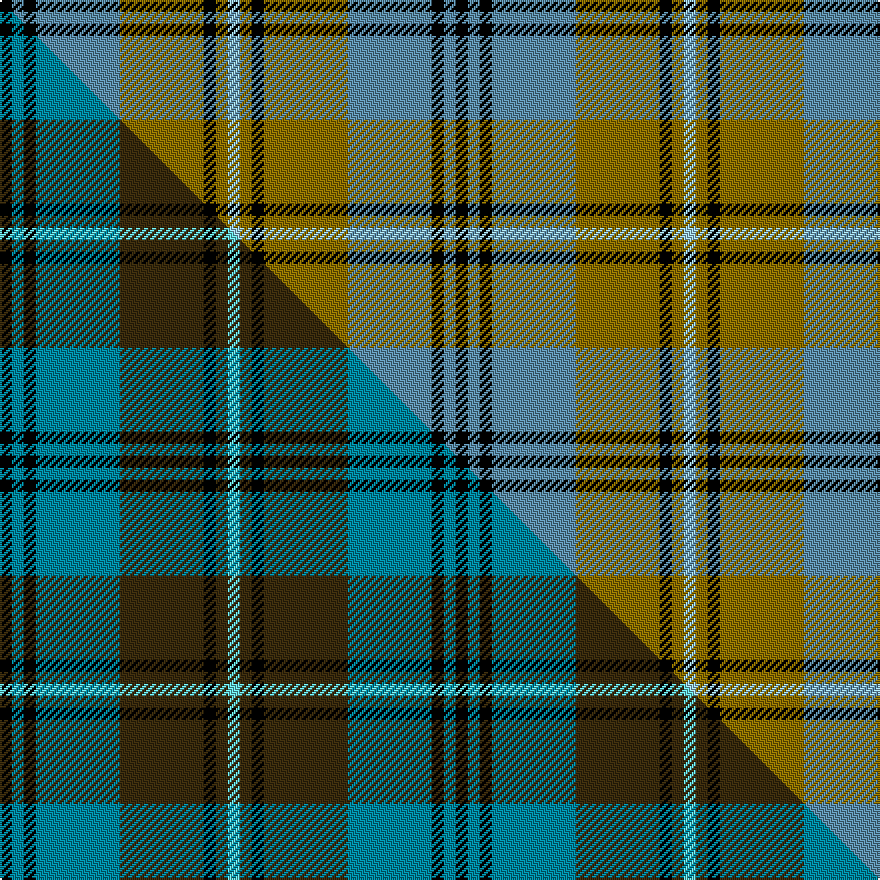

This is one **variant** — a specific cloth: this exact thread count and colourway, with its own
provenance below. It is one weaving of the [sett](/setts/k1t1k1t7y7k1y1lb1/) (the scale-free proportion — the
same cloth at any scale or shade), whose colour order is pattern [KBKBGKGW](/stripes/kbkbgkgw/).

Part of the [Auld Lang Syne](/tartans/a/au/auld-lang-syne-6/) tartan — the named design grouping this sett with its other cloths.

Sourced from register-of-tartans.  It is a [8 stripe tartan](/stripes/stripes8/).

Original link [https://www.tartanregister.gov.uk/tartanDetails.aspx?ref=5313](https://www.tartanregister.gov.uk/tartanDetails.aspx?ref=5313)

Dataset <small>— provenance for this record, inherited from the source manifest</small>

<dl class="dataset-prov">
<dt>source</dt><dd><a href="/sources/register-of-tartans/">Scottish Register of Tartans</a></dd>
<dt>data captured from</dt><dd><a href="https://github.com/thetartan/tartan-database/blob/master/data/register-of-tartans/data.csv">https://github.com/thetartan/tartan-database/blob/master/data/register-of-tartans/data.csv</a></dd>
<dt>data date</dt><dd>2017-01-06 <small>(dataset default)</small></dd>
<dt>licence</dt><dd><a href="https://www.tartanregister.gov.uk/copyright">Crown copyright</a></dd>
</dl>

Capture chain <small>— the hands this data passed through, oldest first; each capture carries its own licence</small>

<ol class="capture-chain">
<li><a href="https://www.tartanregister.gov.uk/">Scottish Register of Tartans</a> · <a href="https://www.tartanregister.gov.uk/copyright">Crown copyright</a> <small>the living register — still published by National Records of Scotland</small></li>
<li><a href="https://github.com/thetartan/tartan-database">thetartan/tartan-database</a> <small>2016-2017</small> · <a href="https://creativecommons.org/licenses/by-nc-nd/4.0/">CC BY-NC-ND 4.0</a> <small>Levko Kravets's frozen compilation — the capture we vendored, and where its CC licence text came from</small></li>
<li>this dictionary <small>captured 2026-06-10 · commit 5bf86c7566</small> <small>each re-capture is a git commit to data/sources</small></li>
</ol>

## Register references

External register numbers recorded for this tartan.

- Scottish Register of Tartans: [5313](https://www.tartanregister.gov.uk/tartanDetails.aspx?ref=5313)
- Scottish Tartans Authority (ITI): 3580

## Thread count
K/6 T6 K6 T42 Y42 K6 Y6 LB/6

One full sett is **228 threads**.

## Palette
<table><thead><tr><th>Colour</th><th>Shade</th><th>OKLCh</th></tr></thead><tbody><tr><td>T</td><td><code style="background-color:#5C8CA8;">#5C8CA8</code> <small style="color:#888">#5C8CA8</small></td><td><small style="color:#888">oklch(61.7% 0.067 235.0)</small></td></tr><tr><td>K</td><td><code style="background-color:#000000;">#000000</code> <small style="color:#888">#000000</small></td><td><small style="color:#888">oklch(0.0% 0.000 0.0)</small></td></tr><tr><td>LB</td><td><code style="background-color:#98C8E8;">#98C8E8</code> <small style="color:#888">#98C8E8</small></td><td><small style="color:#888">oklch(81.0% 0.068 237.9)</small></td></tr><tr><td>Y</td><td><code style="background-color:#8B6E00;">#8B6E00</code> <small style="color:#888">#8B6E00</small></td><td><small style="color:#888">oklch(55.1% 0.113 90.4)</small></td></tr></tbody></table>

# Sample pattern

## Compared to the master

This cloth is one sett of its design; the master sett (the exemplar the design is anchored on) is below for comparison.

Its **ΔTartan distance** from the master is **0.18** — the same measure the nearest-tartans table ranks by (0 is identical; a re-scale of the same cloth is near 0, a recolour or a different proportion further).

<figure class="master-compare" style="margin:0">

this sett
master sett ★

<figcaption style="color:#888;font-size:smaller">One weave of this sett against the <a href="/setts/k1t1k1t7dy7k1dy1lt1/">master sett ★</a>, split on the diagonal: a shared proportion runs seamlessly across it with only the shades shifting; a different proportion breaks on it.</figcaption>
</figure>

## Nearest tartan variants

The nearest existing variants by ΔTartan distance, with this cloth at the top so the swatches line up against it.

ΔTartan

Threads

Variant

Sett

—

228

<a href="/variants/s8/k1t1k1t7y7k1y1lb1~x6~t2503227-lb3203246/">Auld Lang Syne (Philip King Tailoring)</a>

<a href="/ttd/edit/#slug=k1t1k1t7dy7k1dy1lt1~x6&amp;base=k1t1k1t7y7k1y1lb1~x6~t2503227-lb3203246" title="compare in the TTD">0.18</a>

228

<a href="/variants/s8/k1t1k1t7dy7k1dy1lt1~x6/">Auld Lang Syne</a>

<a href="/ttd/edit/#slug=o19k2w4k2n5k2n5~x2~o2500000-n1900000&amp;base=k1t1k1t7y7k1y1lb1~x6~t2503227-lb3203246" title="compare in the TTD">2.40</a>

108

<a href="/variants/s7/o19k2w4k2n5k2n5~x2~o2500000-n1900000/">Kyle Tartan</a>

<a href="/ttd/edit/#slug=n32k3n3k3o5k8oi21k4~x2~n1900000-oi2500000&amp;base=k1t1k1t7y7k1y1lb1~x6~t2503227-lb3203246" title="compare in the TTD">2.52</a>

244

<a href="/variants/s8/n32k3n3k3o5k8oi21k4~x2~n1900000-oi2500000/">Speyside Grey (Fashion)</a>

<a href="/ttd/edit/#slug=n32k3n3k3t5k8o21k4~x2~n1900000-o2500000&amp;base=k1t1k1t7y7k1y1lb1~x6~t2503227-lb3203246" title="compare in the TTD">2.53</a>

244

<a href="/variants/s8/n32k3n3k3t5k8o21k4~x2~n1900000-o2500000/">Speyside Blue (Fashion)</a>

<a href="/ttd/edit/#slug=y19k2w2k2dt5k2dt5~x4~y2400000-dt1700000&amp;base=k1t1k1t7y7k1y1lb1~x6~t2503227-lb3203246" title="compare in the TTD">2.60</a>

200

<a href="/variants/s7/y19k2w2k2n5k2n5~x4~y2400000-n1700000/">Kyle</a>

<a href="/ttd/edit/#slug=k2lb2k2lb15g15k2g2w2~x4&amp;base=k1t1k1t7y7k1y1lb1~x6~t2503227-lb3203246" title="compare in the TTD">2.74</a>

320

<a href="/variants/s8/k2lb2k2lb15g15k2g2w2~x4/">Ben Lomond (Fashion)</a>

<a href="/ttd/edit/#slug=r3db12r4g18r6k2~x2&amp;base=k1t1k1t7y7k1y1lb1~x6~t2503227-lb3203246" title="compare in the TTD">2.76</a>

170

<a href="/variants/s6/r3db12r4g18r6k2~x2/">Eyre (Personal)</a>

<a href="/ttd/edit/#slug=b22g4k4g14lb3g4lb3g4k3~x2&amp;base=k1t1k1t7y7k1y1lb1~x6~t2503227-lb3203246" title="compare in the TTD">2.81</a>

194

<a href="/variants/s9/b22g4k4g14lb3g4lb3g4k3~x2/">Graden (Personal)</a>

<a href="/ttd/edit/#slug=k4g24db6dp3k6dp12g3dp4~x2&amp;base=k1t1k1t7y7k1y1lb1~x6~t2503227-lb3203246" title="compare in the TTD">2.85</a>

232

<a href="/variants/s8/k4g24db6dp3k6dp12g3dp4~x2/">Gary/Garry (Name)</a>

<a href="/ttd/edit/#slug=k1t1k1t7g8k1g1ly1~x4&amp;base=k1t1k1t7y7k1y1lb1~x6~t2503227-lb3203246" title="compare in the TTD">2.88</a>

160

<a href="/variants/s8/k1t1k1t7g8k1g1ly1~x4/">Banff Centennial (Commemorative)</a>

## Neighbour map

Every grey dot is one of 13656 variants placed by the first two principal components of the ΔTartan feature space (42% of its variance). Red is this tartan; blue dots are its nearest — click one to open its page. The map is a flat projection of a many-dimensional space — [how to read it](/posts/neighbourhood-maps/).

<svg viewBox="0 0 640 380" role="img" style="max-width:100%;height:auto;border:1px solid #e0e0e0;border-radius:4px;display:block" xmlns="http://www.w3.org/2000/svg"><image href="/nn/cloud.v1.png" width="640" height="380"/><a href="/variants/s8/k1t1k1t7dy7k1dy1lt1~x6/"><circle cx="199.1" cy="189.2" r="4" fill="#3465a4"><title>Auld Lang Syne</title></circle></a><a href="/variants/s7/o19k2w4k2n5k2n5~x2~o2500000-n1900000/"><circle cx="218.6" cy="174.5" r="4" fill="#3465a4"><title>Kyle Tartan</title></circle></a><a href="/variants/s8/n32k3n3k3o5k8oi21k4~x2~n1900000-oi2500000/"><circle cx="216.0" cy="167.9" r="4" fill="#3465a4"><title>Speyside Grey (Fashion)</title></circle></a><a href="/variants/s8/n32k3n3k3t5k8o21k4~x2~n1900000-o2500000/"><circle cx="215.4" cy="169.1" r="4" fill="#3465a4"><title>Speyside Blue (Fashion)</title></circle></a><a href="/variants/s7/y19k2w2k2n5k2n5~x4~y2400000-n1700000/"><circle cx="253.0" cy="173.2" r="4" fill="#3465a4"><title>Kyle</title></circle></a><a href="/variants/s8/k2lb2k2lb15g15k2g2w2~x4/"><circle cx="179.3" cy="180.2" r="4" fill="#3465a4"><title>Ben Lomond (Fashion)</title></circle></a><a href="/variants/s6/r3db12r4g18r6k2~x2/"><circle cx="182.3" cy="207.2" r="4" fill="#3465a4"><title>Eyre (Personal)</title></circle></a><a href="/variants/s9/b22g4k4g14lb3g4lb3g4k3~x2/"><circle cx="189.4" cy="193.5" r="4" fill="#3465a4"><title>Graden (Personal)</title></circle></a><a href="/variants/s8/k4g24db6dp3k6dp12g3dp4~x2/"><circle cx="188.8" cy="193.8" r="4" fill="#3465a4"><title>Gary/Garry (Name)</title></circle></a><a href="/variants/s8/k1t1k1t7g8k1g1ly1~x4/"><circle cx="215.6" cy="189.6" r="4" fill="#3465a4"><title>Banff Centennial (Commemorative)</title></circle></a><circle cx="200.8" cy="189.2" r="5" fill="#c00000"/><text x="320" y="376" text-anchor="middle" font-size="11" fill="#999">ground</text><text x="11" y="190" text-anchor="middle" font-size="11" fill="#999" transform="rotate(-90 11 190)">complexity</text></svg>

ID: /variants/s8/k1t1k1t7y7k1y1lb1~x6~t2503227-lb3203246/
