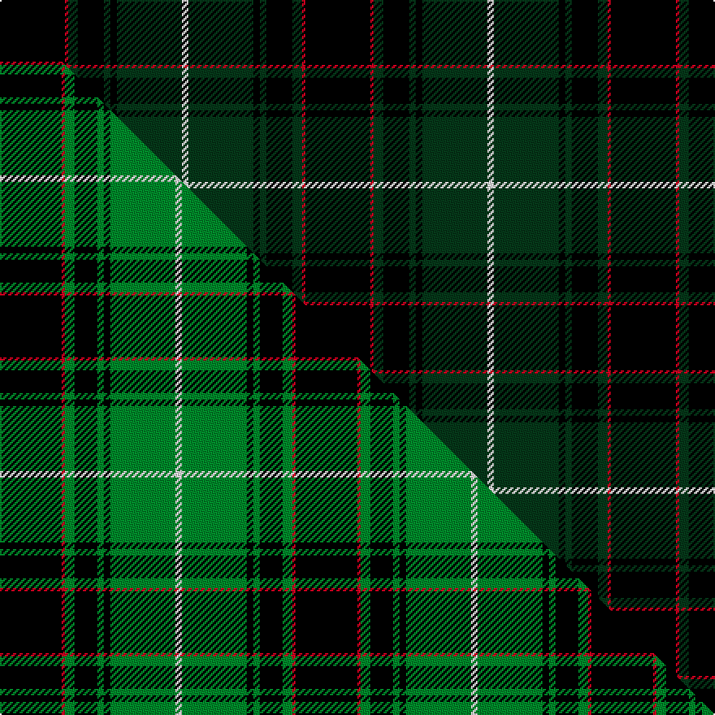

This is one **variant** — a specific cloth: this exact thread count and colourway, with its own
provenance below. It is one weaving of the [sett](/tartans/s/sc/scottish-chieftain/) (the scale-free proportion — the
same cloth at any scale or shade), whose colour order is pattern [KRGKGKGW](/stripes/krgkgkgw/).

Part of the [Scottish Chieftain](/tartans/s/sc/scottish-chieftain/) tartan — the named design grouping this sett with its other cloths.

Sourced from tartans-authority.  It is a [8 stripe tartan](/stripes/stripes8/).

Original link <code>http://www.tartansauthority.com/tartan-ferret/display/3978/</code> — retired · [Internet Archive copy](https://web.archive.org/web/*/http://www.tartansauthority.com/tartan-ferret/display/3978/*)

Dataset <small>— provenance for this record, inherited from the source manifest</small>

<dl class="dataset-prov">
<dt>source</dt><dd><a href="/sources/tartans-authority/">Scottish Tartans Authority</a></dd>
<dt>data captured from</dt><dd><a href="https://github.com/thetartan/tartan-database/blob/master/data/tartans-authority/data.csv">https://github.com/thetartan/tartan-database/blob/master/data/tartans-authority/data.csv</a></dd>
<dt>data date</dt><dd>pre 2002 <small>(this record)</small></dd>
<dt>licence</dt><dd><a href="https://creativecommons.org/licenses/by-nc-nd/4.0/">CC BY-NC-ND 4.0</a></dd>
</dl>

Capture chain <small>— the hands this data passed through, oldest first; each capture carries its own licence</small>

<ol class="capture-chain">
<li><a href="https://www.tartansauthority.com/">Scottish Tartans Authority</a> <small>the heritage body’s archive — its tartan-ferret record browser is retired; dead record links are shown unlinked, with an Internet Archive copy (ITI numbers are not SRT references)</small></li>
<li><a href="https://github.com/thetartan/tartan-database">thetartan/tartan-database</a> <small>2016-2017</small> · <a href="https://creativecommons.org/licenses/by-nc-nd/4.0/">CC BY-NC-ND 4.0</a> <small>Levko Kravets's frozen compilation — the capture we vendored, and where its CC licence text came from</small></li>
<li>this dictionary <small>captured 2026-06-10 · commit 5bf86c7566</small> <small>each re-capture is a git commit to data/sources</small></li>
</ol>

## Register references

External register numbers recorded for this tartan.

- Scottish Tartans Authority (ITI): 3978

## Thread count
K/40 R2 DG6 K16 DG4 K4 DG40 W/4

One full sett is **188 threads**.

## Palette
<table><thead><tr><th>Colour</th><th>Shade</th><th>OKLCh</th></tr></thead><tbody><tr><td>DG</td><td><code style="background-color:#053819;">#053819</code> <small style="color:#888">#053819</small></td><td><small style="color:#888">oklch(30.0% 0.075 151.3)</small></td></tr><tr><td>K</td><td><code style="background-color:#000000;">#000000</code> <small style="color:#888">#000000</small></td><td><small style="color:#888">oklch(0.0% 0.000 0.0)</small></td></tr><tr><td>W</td><td><code style="background-color:#F7F7F7;">#F7F7F7</code> <small style="color:#888">#F7F7F7</small></td><td><small style="color:#888">oklch(97.6% 0.000 89.9)</small></td></tr><tr><td>R</td><td><code style="background-color:#D60020;">#D60020</code> <small style="color:#888">#D60020</small></td><td><small style="color:#888">oklch(55.2% 0.224 25.5)</small></td></tr></tbody></table>

# Sample pattern

## Compared to the master

This cloth is one sett of its design; the master sett (the exemplar the design is anchored on) is below for comparison.

Its **ΔTartan distance** from the master is **0.24** — the same measure the nearest-tartans table ranks by (0 is identical; a re-scale of the same cloth is near 0, a recolour or a different proportion further).

<figure class="master-compare" style="margin:0">

this sett
master sett ★

<figcaption style="color:#888;font-size:smaller">One weave of this sett against the <a href="/setts/k19r1g3k7g2k2g20w2/">master sett ★</a>, split on the diagonal: a shared proportion runs seamlessly across it with only the shades shifting; a different proportion breaks on it.</figcaption>
</figure>

## Nearest tartan variants

The nearest existing variants by ΔTartan distance, with this cloth at the top so the swatches line up against it.

ΔTartan

Threads

Variant

Sett

—

188

<a href="/variants/s8/k20r1dg3k8dg2k2dg20w2~x2/">Scottish Chieftain (Universal)</a>

<a href="/ttd/edit/#slug=k19r1g3k7g2k2g20w2~x2&amp;base=k20r1dg3k8dg2k2dg20w2~x2" title="compare in the TTD">0.24</a>

182

<a href="/variants/s8/k19r1g3k7g2k2g20w2~x2/">Scottish Chieftain</a>

<a href="/ttd/edit/#slug=dg4k4dg23k11r2k2r2k20w4~x2&amp;base=k20r1dg3k8dg2k2dg20w2~x2" title="compare in the TTD">1.93</a>

272

<a href="/variants/s9/dg4k4dg23k11r2k2r2k20w4~x2/">New Golf Club</a>

<a href="/ttd/edit/#slug=k6db1k6g4k10g20r2~x2&amp;base=k20r1dg3k8dg2k2dg20w2~x2" title="compare in the TTD">2.00</a>

180

<a href="/variants/s7/k6db1k6g4k10g20r2~x2/">MacKinross</a>

<a href="/ttd/edit/#slug=k10db4k34dt2k2dt30w3~x2~db1106275-dt1401240&amp;base=k20r1dg3k8dg2k2dg20w2~x2" title="compare in the TTD">2.03</a>

314

<a href="/variants/s7/k10db4k34dt2k2dt30w3~x2~db1106275-dt1401240/">Patriot, The (Fashion)</a>

<a href="/ttd/edit/#slug=k22g11k2g4k2g6k58lb6~x2&amp;base=k20r1dg3k8dg2k2dg20w2~x2" title="compare in the TTD">2.09</a>

388

<a href="/variants/s8/k22g11k2g4k2g6k58lb6~x2/">Stewart of Bute Hunting Clan/Family Tartan</a>

<a href="/ttd/edit/#slug=k8g28k8dg17k88dg17k8g28k8r6~g1903114-dg1405139&amp;base=k20r1dg3k8dg2k2dg20w2~x2" title="compare in the TTD">2.10</a>

418

<a href="/variants/s10/k8g28k8dg17k88dg17k8g28k8r6~g1903114-dg1405139/">Childers (Gurkha Rifles)</a>

<a href="/ttd/edit/#slug=dg3k6w2k6dg2k2dg16k2~x2&amp;base=k20r1dg3k8dg2k2dg20w2~x2" title="compare in the TTD">2.13</a>

146

<a href="/variants/s8/dg3k6w2k6dg2k2dg16k2~x2/">MacLean of Duart Hunting</a>

<a href="/ttd/edit/#slug=dr2k13db4k13dg6k17dg23w1~x2&amp;base=k20r1dg3k8dg2k2dg20w2~x2" title="compare in the TTD">2.19</a>

310

<a href="/variants/s8/dr2k13db4k13dg6k17dg23w1~x2/">Meiklejohn (Personal)</a>

<a href="/ttd/edit/#slug=k7g6y3k12dr19k12g62k62g12dr7&amp;base=k20r1dg3k8dg2k2dg20w2~x2" title="compare in the TTD">2.23</a>

390

<a href="/variants/s10/k7g6y3k12dr19k12g62k62g12dr7/">Danareth</a>

<a href="/ttd/edit/#slug=k7g6ly3k12dr19k12g62k62g12dr7&amp;base=k20r1dg3k8dg2k2dg20w2~x2" title="compare in the TTD">2.24</a>

390

<a href="/variants/s10/k7g6ly3k12dr19k12g62k62g12dr7/">Danareth (Corporate)</a>

## Neighbour map

Every grey dot is one of 13657 variants placed by the first two principal components of the ΔTartan feature space (42% of its variance). Red is this tartan; blue dots are its nearest — click one to open its page. The map is a flat projection of a many-dimensional space — [how to read it](/posts/neighbourhood-maps/).

<svg viewBox="0 0 640 380" role="img" style="max-width:100%;height:auto;border:1px solid #e0e0e0;border-radius:4px;display:block" xmlns="http://www.w3.org/2000/svg"><image href="/nn/cloud.v1.png" width="640" height="380"/><a href="/variants/s8/k19r1g3k7g2k2g20w2~x2/"><circle cx="259.1" cy="134.3" r="4" fill="#3465a4"><title>Scottish Chieftain</title></circle></a><a href="/variants/s9/dg4k4dg23k11r2k2r2k20w4~x2/"><circle cx="244.4" cy="156.4" r="4" fill="#3465a4"><title>New Golf Club</title></circle></a><a href="/variants/s7/k6db1k6g4k10g20r2~x2/"><circle cx="249.4" cy="157.1" r="4" fill="#3465a4"><title>MacKinross</title></circle></a><a href="/variants/s7/k10db4k34dt2k2dt30w3~x2~db1106275-dt1401240/"><circle cx="309.5" cy="153.5" r="4" fill="#3465a4"><title>Patriot, The (Fashion)</title></circle></a><a href="/variants/s8/k22g11k2g4k2g6k58lb6~x2/"><circle cx="276.6" cy="130.0" r="4" fill="#3465a4"><title>Stewart of Bute Hunting Clan/Family Tartan</title></circle></a><a href="/variants/s10/k8g28k8dg17k88dg17k8g28k8r6~g1903114-dg1405139/"><circle cx="276.7" cy="137.7" r="4" fill="#3465a4"><title>Childers (Gurkha Rifles)</title></circle></a><a href="/variants/s8/dg3k6w2k6dg2k2dg16k2~x2/"><circle cx="289.8" cy="198.8" r="4" fill="#3465a4"><title>MacLean of Duart Hunting</title></circle></a><a href="/variants/s8/dr2k13db4k13dg6k17dg23w1~x2/"><circle cx="306.6" cy="159.2" r="4" fill="#3465a4"><title>Meiklejohn (Personal)</title></circle></a><a href="/variants/s10/k7g6y3k12dr19k12g62k62g12dr7/"><circle cx="235.1" cy="129.2" r="4" fill="#3465a4"><title>Danareth</title></circle></a><a href="/variants/s10/k7g6ly3k12dr19k12g62k62g12dr7/"><circle cx="233.3" cy="128.6" r="4" fill="#3465a4"><title>Danareth (Corporate)</title></circle></a><circle cx="304.8" cy="142.1" r="5" fill="#c00000"/><text x="320" y="376" text-anchor="middle" font-size="11" fill="#999">ground</text><text x="11" y="190" text-anchor="middle" font-size="11" fill="#999" transform="rotate(-90 11 190)">complexity</text></svg>

ID: /variants/s8/k20r1dg3k8dg2k2dg20w2~x2/
