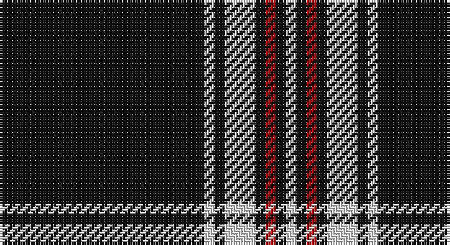

This page is one **sett** — a single exact thread-count. It belongs to the [tartan](/setts/k20w1k1w3k1r1k1w1/)
(the same proportion at any scale), whose colour order is pattern [KWKWKRKW](/stripes/kwkwkrkw/).

Sourced from tartans-authority.  It is a [8 stripe tartan](/stripes/stripes8/).

Original link http://www.tartansauthority.com/tartan-ferret/display/7931/

## Register references

External register numbers recorded for this tartan.

- Scottish Register of Tartans: [7931](https://www.tartanregister.gov.uk/tartanDetails?ref=7931)
- Scottish Tartans Authority (ITI): 7931

## Thread count
K/80 LN4 K4 LN12 K4 R4 K4 LN/4

One full sett is **148 threads**.

## Palette

Palette: <strong>Tartan Register</strong>
<table><thead><tr><th>Colour</th><th>Threads</th><th>Shade</th><th>Base</th><th>OKLCh</th></tr></thead><tbody><tr><td>K/</td><td style="text-align:right;font-variant-numeric:tabular-nums">80</td><td><code style="background-color:#101010;">#101010</code> <small style="color:#888">#101010</small></td><td>K <code style="background-color:#000000;">#000000</code></td><td><small style="color:#888">oklch(17.3% 0.000 89.9)</small></td></tr><tr><td>LN</td><td style="text-align:right;font-variant-numeric:tabular-nums">4</td><td><code style="background-color:#E0E0E0;">#E0E0E0</code> <small style="color:#888">#E0E0E0</small></td><td>W <code style="background-color:#F7F7F7;">#F7F7F7</code></td><td><small style="color:#888">oklch(90.7% 0.000 89.9)</small></td></tr><tr><td>K</td><td style="text-align:right;font-variant-numeric:tabular-nums">4</td><td><code style="background-color:#101010;">#101010</code> <small style="color:#888">#101010</small></td><td>K <code style="background-color:#000000;">#000000</code></td><td><small style="color:#888">oklch(17.3% 0.000 89.9)</small></td></tr><tr><td>LN</td><td style="text-align:right;font-variant-numeric:tabular-nums">12</td><td><code style="background-color:#E0E0E0;">#E0E0E0</code> <small style="color:#888">#E0E0E0</small></td><td>W <code style="background-color:#F7F7F7;">#F7F7F7</code></td><td><small style="color:#888">oklch(90.7% 0.000 89.9)</small></td></tr><tr><td>K</td><td style="text-align:right;font-variant-numeric:tabular-nums">4</td><td><code style="background-color:#101010;">#101010</code> <small style="color:#888">#101010</small></td><td>K <code style="background-color:#000000;">#000000</code></td><td><small style="color:#888">oklch(17.3% 0.000 89.9)</small></td></tr><tr><td>R</td><td style="text-align:right;font-variant-numeric:tabular-nums">4</td><td><code style="background-color:#C80000;">#C80000</code> <small style="color:#888">#C80000</small></td><td>R <code style="background-color:#CC0000;">#CC0000</code></td><td><small style="color:#888">oklch(52.3% 0.215 29.2)</small></td></tr><tr><td>K</td><td style="text-align:right;font-variant-numeric:tabular-nums">4</td><td><code style="background-color:#101010;">#101010</code> <small style="color:#888">#101010</small></td><td>K <code style="background-color:#000000;">#000000</code></td><td><small style="color:#888">oklch(17.3% 0.000 89.9)</small></td></tr><tr><td>LN/</td><td style="text-align:right;font-variant-numeric:tabular-nums">4</td><td><code style="background-color:#E0E0E0;">#E0E0E0</code> <small style="color:#888">#E0E0E0</small></td><td>W <code style="background-color:#F7F7F7;">#F7F7F7</code></td><td><small style="color:#888">oklch(90.7% 0.000 89.9)</small></td></tr></tbody></table>

# Sample pattern

## Nearest tartans

The nearest existing variants by ΔTartan distance, with this tartan at the top so the swatches line up against it.

ΔTartan

Tartan

Sett

—

<a href="/ttd/edit/#slug=k20w1k1w3k1r1k1w1~x4">Volkswagen Black Trim (Fashion)</a> <a class="nn-out" href="/variants/s8/k20w1k1w3k1r1k1w1~x4/" title="open its dictionary page">↗</a>

0.98

<a href="/ttd/edit/#slug=k21r1k1ly1k1r1k3w3~x6&amp;base=k20w1k1w3k1r1k1w1~x4">Black Country (District)</a> <a class="nn-out" href="/variants/s8/k21r1k1ly1k1r1k3w3~x6/" title="open its dictionary page">↗</a>

1.16

<a href="/ttd/edit/#slug=k38lo1w7lo1k4lo2k3lo2~x2&amp;base=k20w1k1w3k1r1k1w1~x4">Erck, Georges van (Personal),</a> <a class="nn-out" href="/variants/s8/k38lo1w7lo1k4lo2k3lo2~x2/" title="open its dictionary page">↗</a>

1.19

<a href="/ttd/edit/#slug=k50w3k3r4w3r3w5r3k3~x2&amp;base=k20w1k1w3k1r1k1w1~x4">Tweedside Variation (silk sample)</a> <a class="nn-out" href="/variants/s9/k50w3k3r4w3r3w5r3k3~x2/" title="open its dictionary page">↗</a>

1.23

<a href="/ttd/edit/#slug=k27w2k2w2k2w2k2w2k4r5~x4&amp;base=k20w1k1w3k1r1k1w1~x4">Reiver Check</a> <a class="nn-out" href="/variants/s10/k27w2k2w2k2w2k2w2k4r5~x4/" title="open its dictionary page">↗</a>

1.34

<a href="/ttd/edit/#slug=k10lr2w5lr4k50b2~x2&amp;base=k20w1k1w3k1r1k1w1~x4">London Fog Black</a> <a class="nn-out" href="/variants/s6/k10lr2w5lr4k50b2~x2/" title="open its dictionary page">↗</a>

1.37

<a href="/ttd/edit/#slug=k75lb6k5lb18k2lb2k3~x2&amp;base=k20w1k1w3k1r1k1w1~x4">Bargain Booze</a> <a class="nn-out" href="/variants/s7/k75lb6k5lb18k2lb2k3~x2/" title="open its dictionary page">↗</a>

1.39

<a href="/ttd/edit/#slug=k2w1k2r6k6r3k28w2~x2&amp;base=k20w1k1w3k1r1k1w1~x4">Brockton</a> <a class="nn-out" href="/variants/s8/k2w1k2r6k6r3k28w2~x2/" title="open its dictionary page">↗</a>

1.43

<a href="/ttd/edit/#slug=k50w4k10r2k2w2r2k14r11k2r4w2~x2&amp;base=k20w1k1w3k1r1k1w1~x4">Knights Templar Dress (Corporate)</a> <a class="nn-out" href="/variants/s12/k50w4k10r2k2w2r2k14r11k2r4w2~x2/" title="open its dictionary page">↗</a>

1.44

<a href="/ttd/edit/#slug=k31w1k2w2dt3k2t4w2~x4&amp;base=k20w1k1w3k1r1k1w1~x4">Capco</a> <a class="nn-out" href="/variants/s8/k31w1k2w2dt3k2t4w2~x4/" title="open its dictionary page">↗</a>

1.44

<a href="/ttd/edit/#slug=r2k1r2k14w1k1w1~x8&amp;base=k20w1k1w3k1r1k1w1~x4">White Stripes Hunting</a> <a class="nn-out" href="/variants/s7/r2k1r2k14w1k1w1~x8/" title="open its dictionary page">↗</a>

## Neighbour map

Every grey dot is one of 14360 variants placed by the first two principal components of the ΔTartan feature space (44% of its variance). Red is this tartan; blue dots are its nearest — click one to open its page.

<svg viewBox="0 0 640 380" role="img" style="max-width:100%;height:auto;border:1px solid #e0e0e0;border-radius:4px;display:block" xmlns="http://www.w3.org/2000/svg"><image href="/nn/cloud.v1.png" width="640" height="380"/><a href="/variants/s8/k21r1k1ly1k1r1k3w3~x6/"><circle cx="527.5" cy="134.0" r="4" fill="#3465a4"><title>Black Country (District)</title></circle></a><a href="/variants/s8/k38lo1w7lo1k4lo2k3lo2~x2/"><circle cx="529.6" cy="120.4" r="4" fill="#3465a4"><title>Erck, Georges van (Personal),</title></circle></a><a href="/variants/s9/k50w3k3r4w3r3w5r3k3~x2/"><circle cx="457.8" cy="134.8" r="4" fill="#3465a4"><title>Tweedside Variation (silk sample)</title></circle></a><a href="/variants/s10/k27w2k2w2k2w2k2w2k4r5~x4/"><circle cx="452.0" cy="151.3" r="4" fill="#3465a4"><title>Reiver Check</title></circle></a><a href="/variants/s6/k10lr2w5lr4k50b2~x2/"><circle cx="538.4" cy="152.9" r="4" fill="#3465a4"><title>London Fog Black</title></circle></a><a href="/variants/s7/k75lb6k5lb18k2lb2k3~x2/"><circle cx="547.2" cy="148.4" r="4" fill="#3465a4"><title>Bargain Booze</title></circle></a><a href="/variants/s8/k2w1k2r6k6r3k28w2~x2/"><circle cx="520.9" cy="156.5" r="4" fill="#3465a4"><title>Brockton</title></circle></a><a href="/variants/s12/k50w4k10r2k2w2r2k14r11k2r4w2~x2/"><circle cx="486.4" cy="124.8" r="4" fill="#3465a4"><title>Knights Templar Dress (Corporate)</title></circle></a><a href="/variants/s8/k31w1k2w2dt3k2t4w2~x4/"><circle cx="483.1" cy="117.3" r="4" fill="#3465a4"><title>Capco</title></circle></a><a href="/variants/s7/r2k1r2k14w1k1w1~x8/"><circle cx="455.3" cy="167.9" r="4" fill="#3465a4"><title>White Stripes Hunting</title></circle></a><circle cx="525.2" cy="142.3" r="5" fill="#c00000"/></svg>

ID: /variants/s8/k20w1k1w3k1r1k1w1~x4/
