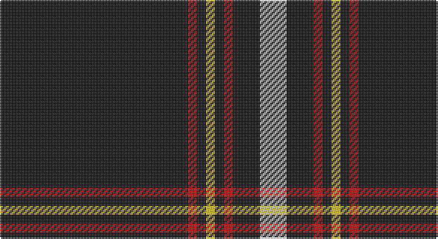

This page is one **sett** — a single exact thread-count. It belongs to the [tartan](/setts/k21r1k1ly1k1r1k3w3/)
(the same proportion at any scale), whose colour order is pattern [KRKYKRKW](/stripes/krkykrkw/).

Sourced from tartans-authority.  It is a [8 stripe tartan](/stripes/stripes8/).

Original link http://www.tartansauthority.com/tartan-ferret/display/7844/

2 attestations — the source records this cloth was collapsed from (oldest owns this page)

<ul>
<li>Dec. 2008 — Black Country (District) (tartans-authority, <a href="http://www.tartansauthority.com/tartan-ferret/display/7844/">record</a>)</li>
<li>undated — Black Country (register-of-tartans, <a href="https://www.tartanregister.gov.uk/tartanDetails.aspx?ref=5796">record</a>)</li>
</ul>

## Register references

External register numbers recorded for this tartan.

- Scottish Register of Tartans: [5796](https://www.tartanregister.gov.uk/tartanDetails.aspx?ref=5796)
- Scottish Tartans Authority (ITI): 7844
- Scottish Tartans World Register: 3278

## Thread count
K/126 R6 K6 Y6 K6 R6 K18 LN/18

One full sett is **240 threads**.

## Palette

Palette: <strong>Tartan Register</strong>
<table><thead><tr><th>Colour</th><th>Threads</th><th>Shade</th><th>Base</th><th>OKLCh</th></tr></thead><tbody><tr><td>K/</td><td style="text-align:right;font-variant-numeric:tabular-nums">126</td><td><code style="background-color:#101010;">#101010</code> <small style="color:#888">#101010</small></td><td>K <code style="background-color:#000000;">#000000</code></td><td><small style="color:#888">oklch(17.3% 0.000 89.9)</small></td></tr><tr><td>R</td><td style="text-align:right;font-variant-numeric:tabular-nums">6</td><td><code style="background-color:#C80000;">#C80000</code> <small style="color:#888">#C80000</small></td><td>R <code style="background-color:#CC0000;">#CC0000</code></td><td><small style="color:#888">oklch(52.3% 0.215 29.2)</small></td></tr><tr><td>K</td><td style="text-align:right;font-variant-numeric:tabular-nums">6</td><td><code style="background-color:#101010;">#101010</code> <small style="color:#888">#101010</small></td><td>K <code style="background-color:#000000;">#000000</code></td><td><small style="color:#888">oklch(17.3% 0.000 89.9)</small></td></tr><tr><td>Y</td><td style="text-align:right;font-variant-numeric:tabular-nums">6</td><td><code style="background-color:#E8C000;">#E8C000</code> <small style="color:#888">#E8C000</small></td><td>Y <code style="background-color:#F2BF00;">#F2BF00</code></td><td><small style="color:#888">oklch(81.9% 0.168 93.7)</small></td></tr><tr><td>K</td><td style="text-align:right;font-variant-numeric:tabular-nums">6</td><td><code style="background-color:#101010;">#101010</code> <small style="color:#888">#101010</small></td><td>K <code style="background-color:#000000;">#000000</code></td><td><small style="color:#888">oklch(17.3% 0.000 89.9)</small></td></tr><tr><td>R</td><td style="text-align:right;font-variant-numeric:tabular-nums">6</td><td><code style="background-color:#C80000;">#C80000</code> <small style="color:#888">#C80000</small></td><td>R <code style="background-color:#CC0000;">#CC0000</code></td><td><small style="color:#888">oklch(52.3% 0.215 29.2)</small></td></tr><tr><td>K</td><td style="text-align:right;font-variant-numeric:tabular-nums">18</td><td><code style="background-color:#101010;">#101010</code> <small style="color:#888">#101010</small></td><td>K <code style="background-color:#000000;">#000000</code></td><td><small style="color:#888">oklch(17.3% 0.000 89.9)</small></td></tr><tr><td>LN/</td><td style="text-align:right;font-variant-numeric:tabular-nums">18</td><td><code style="background-color:#E0E0E0;">#E0E0E0</code> <small style="color:#888">#E0E0E0</small></td><td>W <code style="background-color:#F7F7F7;">#F7F7F7</code></td><td><small style="color:#888">oklch(90.7% 0.000 89.9)</small></td></tr></tbody></table>

# Sample pattern

## Nearest tartans

The nearest existing variants by ΔTartan distance, with this tartan at the top so the swatches line up against it.

ΔTartan

Tartan

Sett

—

<a href="/ttd/edit/#slug=k21r1k1ly1k1r1k3w3~x6">Black Country (District)</a> <a class="nn-out" href="/variants/s8/k21r1k1ly1k1r1k3w3~x6/" title="open its dictionary page">↗</a>

0.85

<a href="/ttd/edit/#slug=k62r3k3lo3k3r3k9lr5~x2&amp;base=k21r1k1ly1k1r1k3w3~x6">Auld Bernensis</a> <a class="nn-out" href="/variants/s8/k62r3k3lo3k3r3k9lr5~x2/" title="open its dictionary page">↗</a>

0.87

<a href="/ttd/edit/#slug=k10lr2w5lr4k50b2~x2&amp;base=k21r1k1ly1k1r1k3w3~x6">London Fog Black</a> <a class="nn-out" href="/variants/s6/k10lr2w5lr4k50b2~x2/" title="open its dictionary page">↗</a>

0.98

<a href="/ttd/edit/#slug=k20w1k1w3k1r1k1w1~x4&amp;base=k21r1k1ly1k1r1k3w3~x6">Volkswagen Black Trim (Fashion)</a> <a class="nn-out" href="/variants/s8/k20w1k1w3k1r1k1w1~x4/" title="open its dictionary page">↗</a>

1.16

<a href="/ttd/edit/#slug=k60r3k15r3lb2r5b3r2~x2&amp;base=k21r1k1ly1k1r1k3w3~x6">Whitaker (2014)</a> <a class="nn-out" href="/variants/s8/k60r3k15r3lb2r5b3r2~x2/" title="open its dictionary page">↗</a>

1.31

<a href="/ttd/edit/#slug=k31w1k2w2dt3k2t4w2~x4&amp;base=k21r1k1ly1k1r1k3w3~x6">Capco</a> <a class="nn-out" href="/variants/s8/k31w1k2w2dt3k2t4w2~x4/" title="open its dictionary page">↗</a>

1.34

<a href="/ttd/edit/#slug=k83w6k3w9r2w5k2lo2~x2&amp;base=k21r1k1ly1k1r1k3w3~x6">Crane of Cluny Mourning</a> <a class="nn-out" href="/variants/s8/k83w6k3w9r2w5k2lo2~x2/" title="open its dictionary page">↗</a>

1.40

<a href="/ttd/edit/#slug=k70r5k3lb4dp4lb4k3r12&amp;base=k21r1k1ly1k1r1k3w3~x6">State University of New York College at Buffalo</a> <a class="nn-out" href="/variants/s8/k70r5k3lb4dp4lb4k3r12/" title="open its dictionary page">↗</a>

1.42

<a href="/ttd/edit/#slug=k80r6g3r12k2w2~x2&amp;base=k21r1k1ly1k1r1k3w3~x6">Dellen</a> <a class="nn-out" href="/variants/s6/k80r6g3r12k2w2~x2/" title="open its dictionary page">↗</a>

1.43

<a href="/ttd/edit/#slug=k2w1k2r6k6r3k28w2~x2&amp;base=k21r1k1ly1k1r1k3w3~x6">Brockton</a> <a class="nn-out" href="/variants/s8/k2w1k2r6k6r3k28w2~x2/" title="open its dictionary page">↗</a>

1.46

<a href="/ttd/edit/#slug=k62r3k3lo3k3r3k9o5~x2&amp;base=k21r1k1ly1k1r1k3w3~x6">Auld Bernensis</a> <a class="nn-out" href="/variants/s8/k62r3k3lo3k3r3k9o5~x2/" title="open its dictionary page">↗</a>

## Neighbour map

Every grey dot is one of 14360 variants placed by the first two principal components of the ΔTartan feature space (44% of its variance). Red is this tartan; blue dots are its nearest — click one to open its page.

<svg viewBox="0 0 640 380" role="img" style="max-width:100%;height:auto;border:1px solid #e0e0e0;border-radius:4px;display:block" xmlns="http://www.w3.org/2000/svg"><image href="/nn/cloud.v1.png" width="640" height="380"/><a href="/variants/s8/k62r3k3lo3k3r3k9lr5~x2/"><circle cx="577.6" cy="142.0" r="4" fill="#3465a4"><title>Auld Bernensis</title></circle></a><a href="/variants/s6/k10lr2w5lr4k50b2~x2/"><circle cx="538.4" cy="152.9" r="4" fill="#3465a4"><title>London Fog Black</title></circle></a><a href="/variants/s8/k20w1k1w3k1r1k1w1~x4/"><circle cx="525.2" cy="142.3" r="4" fill="#3465a4"><title>Volkswagen Black Trim (Fashion)</title></circle></a><a href="/variants/s8/k60r3k15r3lb2r5b3r2~x2/"><circle cx="567.0" cy="133.7" r="4" fill="#3465a4"><title>Whitaker (2014)</title></circle></a><a href="/variants/s8/k31w1k2w2dt3k2t4w2~x4/"><circle cx="483.1" cy="117.3" r="4" fill="#3465a4"><title>Capco</title></circle></a><a href="/variants/s8/k83w6k3w9r2w5k2lo2~x2/"><circle cx="526.6" cy="91.5" r="4" fill="#3465a4"><title>Crane of Cluny Mourning</title></circle></a><a href="/variants/s8/k70r5k3lb4dp4lb4k3r12/"><circle cx="462.9" cy="120.6" r="4" fill="#3465a4"><title>State University of New York College at Buffalo</title></circle></a><a href="/variants/s6/k80r6g3r12k2w2~x2/"><circle cx="556.5" cy="131.4" r="4" fill="#3465a4"><title>Dellen</title></circle></a><a href="/variants/s8/k2w1k2r6k6r3k28w2~x2/"><circle cx="520.9" cy="156.5" r="4" fill="#3465a4"><title>Brockton</title></circle></a><a href="/variants/s8/k62r3k3lo3k3r3k9o5~x2/"><circle cx="598.1" cy="152.5" r="4" fill="#3465a4"><title>Auld Bernensis</title></circle></a><circle cx="527.5" cy="134.0" r="5" fill="#c00000"/></svg>

ID: /variants/s8/k21r1k1ly1k1r1k3w3~x6/
