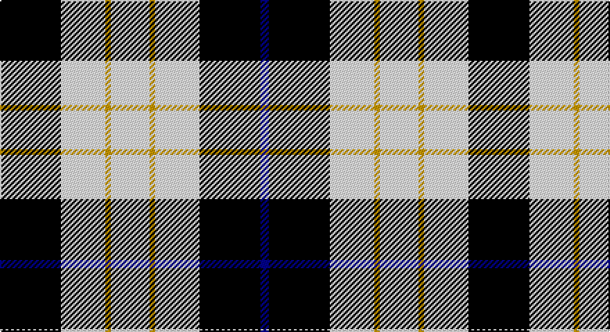

This page is one **sett** — a single exact thread-count. It belongs to the [tartan](/setts/k22w16ly2w14ly2w16k22db3/)
(the same proportion at any scale), whose colour order is pattern [BKWYWYWK](/stripes/bkwywywk/).

Sourced from register-of-tartans.  It is a [8 stripe tartan](/stripes/stripes8/).

Original link https://www.tartanregister.gov.uk/tartanDetails.aspx?ref=1948

## Register references

External register numbers recorded for this tartan.

- Scottish Register of Tartans: [1948](https://www.tartanregister.gov.uk/tartanDetails.aspx?ref=1948)
- Scottish Tartans Authority (ITI): 5336

## Thread count
K/44 W32 DY4 W28 DY4 W32 K44 DB/6

One full sett is **338 threads**.

## Palette

Palette: <strong>Tartan Register</strong>
<table><thead><tr><th>Colour</th><th>Threads</th><th>Shade</th><th>Base</th><th>OKLCh</th></tr></thead><tbody><tr><td>K/</td><td style="text-align:right;font-variant-numeric:tabular-nums">44</td><td><code style="background-color:#000000;">#000000</code> <small style="color:#888">#000000</small></td><td>K <code style="background-color:#000000;">#000000</code></td><td><small style="color:#888">oklch(0.0% 0.000 0.0)</small></td></tr><tr><td>W</td><td style="text-align:right;font-variant-numeric:tabular-nums">32</td><td><code style="background-color:#F8F8F8;">#F8F8F8</code> <small style="color:#888">#F8F8F8</small></td><td>W <code style="background-color:#F7F7F7;">#F7F7F7</code></td><td><small style="color:#888">oklch(97.9% 0.000 89.9)</small></td></tr><tr><td>DY</td><td style="text-align:right;font-variant-numeric:tabular-nums">4</td><td><code style="background-color:#C89800;">#C89800</code> <small style="color:#888">#C89800</small></td><td>Y <code style="background-color:#F2BF00;">#F2BF00</code></td><td><small style="color:#888">oklch(70.6% 0.144 85.9)</small></td></tr><tr><td>W</td><td style="text-align:right;font-variant-numeric:tabular-nums">28</td><td><code style="background-color:#F8F8F8;">#F8F8F8</code> <small style="color:#888">#F8F8F8</small></td><td>W <code style="background-color:#F7F7F7;">#F7F7F7</code></td><td><small style="color:#888">oklch(97.9% 0.000 89.9)</small></td></tr><tr><td>DY</td><td style="text-align:right;font-variant-numeric:tabular-nums">4</td><td><code style="background-color:#C89800;">#C89800</code> <small style="color:#888">#C89800</small></td><td>Y <code style="background-color:#F2BF00;">#F2BF00</code></td><td><small style="color:#888">oklch(70.6% 0.144 85.9)</small></td></tr><tr><td>W</td><td style="text-align:right;font-variant-numeric:tabular-nums">32</td><td><code style="background-color:#F8F8F8;">#F8F8F8</code> <small style="color:#888">#F8F8F8</small></td><td>W <code style="background-color:#F7F7F7;">#F7F7F7</code></td><td><small style="color:#888">oklch(97.9% 0.000 89.9)</small></td></tr><tr><td>K</td><td style="text-align:right;font-variant-numeric:tabular-nums">44</td><td><code style="background-color:#000000;">#000000</code> <small style="color:#888">#000000</small></td><td>K <code style="background-color:#000000;">#000000</code></td><td><small style="color:#888">oklch(0.0% 0.000 0.0)</small></td></tr><tr><td>DB/</td><td style="text-align:right;font-variant-numeric:tabular-nums">6</td><td><code style="background-color:#00008C;">#00008C</code> <small style="color:#888">#00008C</small></td><td>B <code style="background-color:#2A418A;">#2A418A</code></td><td><small style="color:#888">oklch(28.9% 0.200 264.1)</small></td></tr></tbody></table>

# Sample pattern

## Nearest tartans

The nearest existing variants by ΔTartan distance, with this tartan at the top so the swatches line up against it.

ΔTartan

Tartan

Sett

—

<a href="/ttd/edit/#slug=k22w16ly2w14ly2w16k22db3~x2">Kennison</a> <a class="nn-out" href="/variants/s8/k22w16ly2w14ly2w16k22db3~x2/" title="open its dictionary page">↗</a>

0.63

<a href="/ttd/edit/#slug=k22w16g2w14g2w16k22r3~x2&amp;base=k22w16ly2w14ly2w16k22db3~x2">Kierson</a> <a class="nn-out" href="/variants/s8/k22w16g2w14g2w16k22r3~x2/" title="open its dictionary page">↗</a>

0.93

<a href="/ttd/edit/#slug=k6m2k12y3k6lb16y3lb16k2~x2&amp;base=k22w16ly2w14ly2w16k22db3~x2">MacMillan</a> <a class="nn-out" href="/variants/s9/k6m2k12y3k6lb16y3lb16k2~x2/" title="open its dictionary page">↗</a>

1.02

<a href="/ttd/edit/#slug=w5r3w26k21w3k8ly3~x2&amp;base=k22w16ly2w14ly2w16k22db3~x2">MacPherson Dress, Blue (Dance)</a> <a class="nn-out" href="/variants/s7/w5r3w26k21w3k8ly3~x2/" title="open its dictionary page">↗</a>

1.10

<a href="/ttd/edit/#slug=k23ly3k23w36r4~x2&amp;base=k22w16ly2w14ly2w16k22db3~x2">Macleod, Winnifred Mary, Dress</a> <a class="nn-out" href="/variants/s5/k23ly3k23w36r4~x2/" title="open its dictionary page">↗</a>

1.13

<a href="/ttd/edit/#slug=dy7k7dy4k26w12k3w14m2k6&amp;base=k22w16ly2w14ly2w16k22db3~x2">Aquascutum (Kinloch Anderson)</a> <a class="nn-out" href="/variants/s9/dy7k7dy4k26w12k3w14m2k6/" title="open its dictionary page">↗</a>

1.26

<a href="/variants/s12/w6m4w32k32w5k12ly4~x2/">MacPherson Dress Clan Tartan</a>

1.35

<a href="/ttd/edit/#slug=g6db11w8k4w8k4w8k27w4~x2&amp;base=k22w16ly2w14ly2w16k22db3~x2">Breton District Tartan</a> <a class="nn-out" href="/variants/s9/g6db11w8k4w8k4w8k27w4~x2/" title="open its dictionary page">↗</a>

1.36

<a href="/ttd/edit/#slug=r12k3w14dt10k2dt24r2~x2&amp;base=k22w16ly2w14ly2w16k22db3~x2">Yusra Personal Tartan</a> <a class="nn-out" href="/variants/s7/r12k3w14dt10k2dt24r2~x2/" title="open its dictionary page">↗</a>

1.37

<a href="/ttd/edit/#slug=ly9k32g6w20ly3w9k5~x2&amp;base=k22w16ly2w14ly2w16k22db3~x2">Black and White Golf</a> <a class="nn-out" href="/variants/s7/ly9k32g6w20ly3w9k5~x2/" title="open its dictionary page">↗</a>

1.38

<a href="/ttd/edit/#slug=db1ly6db8r1db8g6ly1~x4&amp;base=k22w16ly2w14ly2w16k22db3~x2">Hill of Banchory Primary (School)</a> <a class="nn-out" href="/variants/s7/db1ly6db8r1db8g6ly1~x4/" title="open its dictionary page">↗</a>

## Neighbour map

Every grey dot is one of 14360 variants placed by the first two principal components of the ΔTartan feature space (44% of its variance). Red is this tartan; blue dots are its nearest — click one to open its page.

<svg viewBox="0 0 640 380" role="img" style="max-width:100%;height:auto;border:1px solid #e0e0e0;border-radius:4px;display:block" xmlns="http://www.w3.org/2000/svg"><image href="/nn/cloud.v1.png" width="640" height="380"/><a href="/variants/s8/k22w16g2w14g2w16k22r3~x2/"><circle cx="209.3" cy="183.7" r="4" fill="#3465a4"><title>Kierson</title></circle></a><a href="/variants/s9/k6m2k12y3k6lb16y3lb16k2~x2/"><circle cx="207.8" cy="187.8" r="4" fill="#3465a4"><title>MacMillan</title></circle></a><a href="/variants/s7/w5r3w26k21w3k8ly3~x2/"><circle cx="227.7" cy="178.7" r="4" fill="#3465a4"><title>MacPherson Dress, Blue (Dance)</title></circle></a><a href="/variants/s5/k23ly3k23w36r4~x2/"><circle cx="247.0" cy="200.0" r="4" fill="#3465a4"><title>Macleod, Winnifred Mary, Dress</title></circle></a><a href="/variants/s9/dy7k7dy4k26w12k3w14m2k6/"><circle cx="232.2" cy="171.8" r="4" fill="#3465a4"><title>Aquascutum (Kinloch Anderson)</title></circle></a><a href="/variants/s12/w6m4w32k32w5k12ly4~x2/"><circle cx="211.5" cy="163.0" r="4" fill="#3465a4"><title>MacPherson Dress Clan Tartan</title></circle></a><a href="/variants/s9/g6db11w8k4w8k4w8k27w4~x2/"><circle cx="158.4" cy="192.3" r="4" fill="#3465a4"><title>Breton District Tartan</title></circle></a><a href="/variants/s7/r12k3w14dt10k2dt24r2~x2/"><circle cx="227.4" cy="183.8" r="4" fill="#3465a4"><title>Yusra Personal Tartan</title></circle></a><a href="/variants/s7/ly9k32g6w20ly3w9k5~x2/"><circle cx="177.1" cy="174.5" r="4" fill="#3465a4"><title>Black and White Golf</title></circle></a><a href="/variants/s7/db1ly6db8r1db8g6ly1~x4/"><circle cx="233.7" cy="213.4" r="4" fill="#3465a4"><title>Hill of Banchory Primary (School)</title></circle></a><circle cx="208.5" cy="187.0" r="5" fill="#c00000"/></svg>

ID: /variants/s8/k22w16ly2w14ly2w16k22db3~x2/
