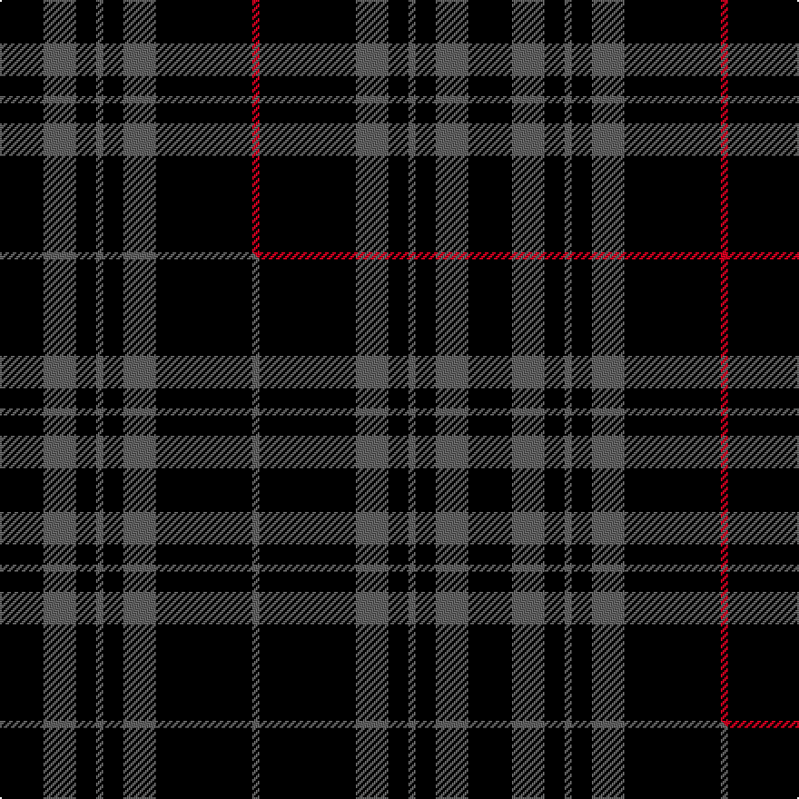

This page is one **sett** — a single exact thread-count. It belongs to the [tartan](/setts/k24n18k11n4k11n18k53r4/)
(the same proportion at any scale), whose colour order is pattern [KBKBKBKR](/stripes/kbkbkbkr/).

Part of the [Spirit of Glyndwr](/tartans/spirit-of-glyndwr/) tartan — the named design grouping this sett with its other cloths.

Sourced from tartans-authority.  It is a [8 stripe tartan](/stripes/stripes8/).

Original link http://www.tartansauthority.com/tartan-ferret/display/8352/

## Provenance

Earliest known date: 20th May 2010 Ysbryd yr coch Glyndwr, a modern day plaid, designed and woven in Wales to commemorate Owain Glyn Dwr, crowned Welsh Prince 1406. Colours represent the slates and dark waters of Mid and North Wales, Glyndwrs homeland, with the added Scarlet Red yarn representing the predominant colour in his standard (flag). Woven by the Cambrian Woollen Mill, Mid Wales exclusively for Wales Tartan Centres, Swansea.

2 attestations — the source records this cloth was collapsed from (oldest owns this page)

<ul>
<li>20th May 2010 — Spirit of Glyndwr Red (Fashion) (tartans-authority, <a href="http://www.tartansauthority.com/tartan-ferret/display/8352/">record</a>)  <em>A modern day plaid, designed and woven in Wales to comemorate Owain Glyn Dwr, crowned Welsh Prince 1406. Colours represent the slates and dark waters of Mid and North Wales, Glyndwr?s homeland, with the added Scarlet Red yarn representing the predominant colour in his standard (flag). Woven by the Cambrian Woollen Mill, Mid Wales exclusivley for Wales Tartan Centres, Swansea.</em></li>
<li>undated — Spirit of Glyndwr Red Welsh Fashion Tartan (house-of-tartan, <a href="http://www.house-of-tartan.scotland.net/house/TartanViewjs.asp?colr=Def&tnam=8352">record</a>) </li>
</ul>

## Register references

External register numbers recorded for this tartan.

- Scottish Register of Tartans: [8352](https://www.tartanregister.gov.uk/tartanDetails?ref=8352)
- Scottish Tartans Authority (ITI): 8352

## Thread count
K/24 N18 K11 N4 K11 N18 K53 R/4

One full sett is **258 threads**.

## Palette
<table><thead><tr><th>Colour</th><th>Shade</th><th>OKLCh</th></tr></thead><tbody><tr><td>K</td><td><code style="background-color:#000000;">#000000</code> <small style="color:#888">#000000</small></td><td><small style="color:#888">oklch(0.0% 0.000 0.0)</small></td></tr><tr><td>N</td><td><code style="background-color:#636363;">#636363</code> <small style="color:#888">#636363</small></td><td><small style="color:#888">oklch(50.0% 0.000 89.9)</small></td></tr><tr><td>R</td><td><code style="background-color:#D60020;">#D60020</code> <small style="color:#888">#D60020</small></td><td><small style="color:#888">oklch(55.2% 0.224 25.5)</small></td></tr></tbody></table>

# Sample pattern

## Compared to the master

This cloth is one sett of its design; the master sett (the exemplar the design is anchored on) is below for comparison.

Its **ΔTartan distance** from the master is **0.95** — the same measure the nearest-tartans table ranks by (0 is identical; a re-scale of the same cloth is near 0, a recolour or a different proportion further).

<figure class="master-compare" style="margin:0">

this sett
master sett ★

<figcaption style="color:#888;font-size:smaller">One weave of this sett against the <a href="/setts/k24n18k11n4k11n18k53n4/">master sett ★</a>, split on the diagonal: a shared proportion runs seamlessly across it with only the shades shifting; a different proportion breaks on it.</figcaption>
</figure>

## Nearest tartan variants

The nearest existing variants by ΔTartan distance, with this cloth at the top so the swatches line up against it.

ΔTartan

Threads

Variant

Sett

—

258

<a href="/variants/s8/k24n18k11n4k11n18k53r4/">Spirit of Glyndwr Red (Fashion)</a>

<a href="/ttd/edit/#slug=k24n18k11n4k11n18k53ly4&amp;base=k24n18k11n4k11n18k53r4" title="compare in the TTD">0.30</a>

258

<a href="/variants/s8/k24n18k11n4k11n18k53ly4/">Spirit of Glyndwr Gold (Fashion)</a>

<a href="/ttd/edit/#slug=k1g1k8n1k1n2k1n1~x8&amp;base=k24n18k11n4k11n18k53r4" title="compare in the TTD">0.94</a>

240

<a href="/variants/s8/k1g1k8n1k1n2k1n1~x8/">Nightstalker (Corporate)</a>

<a href="/ttd/edit/#slug=k1g1k8n1k1n2k1n1~x8~n1900000&amp;base=k24n18k11n4k11n18k53r4" title="compare in the TTD">0.94</a>

240

<a href="/variants/s8/k1g1k8n1k1n2k1n1~x8~n1900000/">Nightstalker</a>

<a href="/ttd/edit/#slug=k24n18k11n4k11n18k53n4&amp;base=k24n18k11n4k11n18k53r4" title="compare in the TTD">1.05</a>

258

<a href="/variants/s8/k24n18k11n4k11n18k53n4/">Spirit of Glyndwr Grey (Fashion)</a>

<a href="/ttd/edit/#slug=n13k3n3k3n3k35r3~x2&amp;base=k24n18k11n4k11n18k53r4" title="compare in the TTD">1.49</a>

220

<a href="/variants/s7/n13k3n3k3n3k35r3~x2/">Holden Black (Corporate)</a>

<a href="/ttd/edit/#slug=n1k21n5k3n5k9r1~x4&amp;base=k24n18k11n4k11n18k53r4" title="compare in the TTD">1.58</a>

352

<a href="/variants/s7/n1k21n5k3n5k9r1~x4/">Sunderland of Scotland (Fashion)</a>

<a href="/ttd/edit/#slug=k39n3k3n3k14n28r3~x2&amp;base=k24n18k11n4k11n18k53r4" title="compare in the TTD">1.73</a>

288

<a href="/variants/s7/k39n3k3n3k14n28r3~x2/">Moffat (1984)</a>

<a href="/ttd/edit/#slug=k16n1k1n1k8n16k1n2~x2&amp;base=k24n18k11n4k11n18k53r4" title="compare in the TTD">1.91</a>

148

<a href="/variants/s8/k16n1k1n1k8n16k1n2~x2/">Douglas VS</a>

<a href="/ttd/edit/#slug=k9n1k2n1k4n9k1n2~x4&amp;base=k24n18k11n4k11n18k53r4" title="compare in the TTD">1.93</a>

188

<a href="/variants/s8/k9n1k2n1k4n9k1n2~x4/">Douglas, Grey Clan/Family Tartan</a>

<a href="/ttd/edit/#slug=k10n1k2n1k4n10k1n2~x4&amp;base=k24n18k11n4k11n18k53r4" title="compare in the TTD">1.94</a>

200

<a href="/variants/s8/k10n1k2n1k4n10k1n2~x4/">Douglas, Grey (Vestiarium Scoticum)</a>

## Neighbour map

Every grey dot is one of 13620 variants placed by the first two principal components of the ΔTartan feature space (42% of its variance). Red is this tartan; blue dots are its nearest — click one to open its page.

<svg viewBox="0 0 640 380" role="img" style="max-width:100%;height:auto;border:1px solid #e0e0e0;border-radius:4px;display:block" xmlns="http://www.w3.org/2000/svg"><image href="/nn/cloud.v1.png" width="640" height="380"/><a href="/variants/s8/k24n18k11n4k11n18k53ly4/"><circle cx="373.1" cy="179.5" r="4" fill="#3465a4"><title>Spirit of Glyndwr Gold (Fashion)</title></circle></a><a href="/variants/s8/k1g1k8n1k1n2k1n1~x8/"><circle cx="367.8" cy="174.1" r="4" fill="#3465a4"><title>Nightstalker (Corporate)</title></circle></a><a href="/variants/s8/k1g1k8n1k1n2k1n1~x8~n1900000/"><circle cx="371.9" cy="175.3" r="4" fill="#3465a4"><title>Nightstalker</title></circle></a><a href="/variants/s8/k24n18k11n4k11n18k53n4/"><circle cx="402.7" cy="195.1" r="4" fill="#3465a4"><title>Spirit of Glyndwr Grey (Fashion)</title></circle></a><a href="/variants/s7/n13k3n3k3n3k35r3~x2/"><circle cx="365.8" cy="157.2" r="4" fill="#3465a4"><title>Holden Black (Corporate)</title></circle></a><a href="/variants/s7/n1k21n5k3n5k9r1~x4/"><circle cx="432.8" cy="151.3" r="4" fill="#3465a4"><title>Sunderland of Scotland (Fashion)</title></circle></a><a href="/variants/s7/k39n3k3n3k14n28r3~x2/"><circle cx="335.7" cy="168.3" r="4" fill="#3465a4"><title>Moffat (1984)</title></circle></a><a href="/variants/s8/k16n1k1n1k8n16k1n2~x2/"><circle cx="357.7" cy="169.4" r="4" fill="#3465a4"><title>Douglas VS</title></circle></a><a href="/variants/s8/k9n1k2n1k4n9k1n2~x4/"><circle cx="322.8" cy="205.8" r="4" fill="#3465a4"><title>Douglas, Grey Clan/Family Tartan</title></circle></a><a href="/variants/s8/k10n1k2n1k4n10k1n2~x4/"><circle cx="327.9" cy="198.1" r="4" fill="#3465a4"><title>Douglas, Grey (Vestiarium Scoticum)</title></circle></a><circle cx="372.4" cy="176.1" r="5" fill="#c00000"/><text x="320" y="376" text-anchor="middle" font-size="11" fill="#999">ground</text><text x="11" y="190" text-anchor="middle" font-size="11" fill="#999" transform="rotate(-90 11 190)">complexity</text></svg>

ID: /variants/s8/k24n18k11n4k11n18k53r4/
