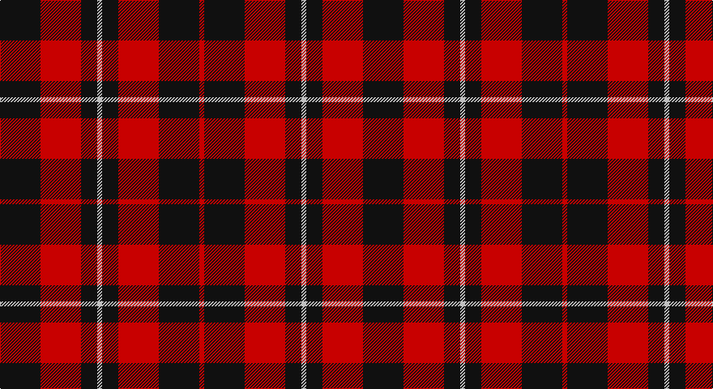

This page is one **sett** — a single exact thread-count. It belongs to the [tartan](/setts/k25r25k10lb3k10r25k25r3/)
(the same proportion at any scale), whose colour order is pattern [KRKWKRKR](/stripes/krkwkrkr/).

Part of the [Bodog.com](/tartans/bodog-com/) tartan — the named design grouping this sett with its other cloths.

Sourced from house-of-tartan.  It is a [8 stripe tartan](/stripes/stripes8/).

Original link http://www.house-of-tartan.scotland.net/house/TartanViewjs.asp?colr=Def&tnam=6889

## Provenance

Earliest known date: 2006 Corporate brand name and colours, red, black and silver grey used to support brand identification. Company owner and executive is Scottish. First tartan to be name after a web site and first ever tartan for Costa Rica.

## Also known as

This cloth is also recorded under:

- bodog.com

## Thread count
K/50 R50 K20 N6 K20 R50 K50 R/6

One full sett is **448 threads**.

## Palette

Palette: <strong>Tartan Register</strong>
<table><thead><tr><th>Colour</th><th>Threads</th><th>Shade</th><th>Base</th><th>OKLCh</th></tr></thead><tbody><tr><td>K/</td><td style="text-align:right;font-variant-numeric:tabular-nums">50</td><td><code style="background-color:#101010;">#101010</code> <small style="color:#888">#101010</small></td><td>K <code style="background-color:#000000;">#000000</code></td><td><small style="color:#888">oklch(17.3% 0.000 89.9)</small></td></tr><tr><td>R</td><td style="text-align:right;font-variant-numeric:tabular-nums">50</td><td><code style="background-color:#C80000;">#C80000</code> <small style="color:#888">#C80000</small></td><td>R <code style="background-color:#CC0000;">#CC0000</code></td><td><small style="color:#888">oklch(52.3% 0.215 29.2)</small></td></tr><tr><td>K</td><td style="text-align:right;font-variant-numeric:tabular-nums">20</td><td><code style="background-color:#101010;">#101010</code> <small style="color:#888">#101010</small></td><td>K <code style="background-color:#000000;">#000000</code></td><td><small style="color:#888">oklch(17.3% 0.000 89.9)</small></td></tr><tr><td>N</td><td style="text-align:right;font-variant-numeric:tabular-nums">6</td><td><code style="background-color:#C0C0C0;">#C0C0C0</code> <small style="color:#888">#C0C0C0</small></td><td>W <code style="background-color:#F7F7F7;">#F7F7F7</code></td><td><small style="color:#888">oklch(80.8% 0.000 89.9)</small></td></tr><tr><td>K</td><td style="text-align:right;font-variant-numeric:tabular-nums">20</td><td><code style="background-color:#101010;">#101010</code> <small style="color:#888">#101010</small></td><td>K <code style="background-color:#000000;">#000000</code></td><td><small style="color:#888">oklch(17.3% 0.000 89.9)</small></td></tr><tr><td>R</td><td style="text-align:right;font-variant-numeric:tabular-nums">50</td><td><code style="background-color:#C80000;">#C80000</code> <small style="color:#888">#C80000</small></td><td>R <code style="background-color:#CC0000;">#CC0000</code></td><td><small style="color:#888">oklch(52.3% 0.215 29.2)</small></td></tr><tr><td>K</td><td style="text-align:right;font-variant-numeric:tabular-nums">50</td><td><code style="background-color:#101010;">#101010</code> <small style="color:#888">#101010</small></td><td>K <code style="background-color:#000000;">#000000</code></td><td><small style="color:#888">oklch(17.3% 0.000 89.9)</small></td></tr><tr><td>R/</td><td style="text-align:right;font-variant-numeric:tabular-nums">6</td><td><code style="background-color:#C80000;">#C80000</code> <small style="color:#888">#C80000</small></td><td>R <code style="background-color:#CC0000;">#CC0000</code></td><td><small style="color:#888">oklch(52.3% 0.215 29.2)</small></td></tr></tbody></table>

# Sample pattern

## Compared to the master

This cloth is one sett of its design; the master sett (the exemplar the design is anchored on) is below for comparison.

<figure style="margin:0"><figcaption style="color:#888;font-size:smaller">this sett</figcaption></figure>
<figure style="margin:0"><figcaption style="color:#888;font-size:smaller"><a href="/setts/r3k25r25k10lb3/">master sett →</a></figcaption></figure>

## Nearest tartans

The nearest existing variants by ΔTartan distance, with this tartan at the top so the swatches line up against it.

ΔTartan

Tartan

Sett

—

<a href="/ttd/edit/#slug=k25r25k10lb3k10r25k25r3~x2">bodog.com Corporate Tartan</a> <a class="nn-out" href="/variants/s8/k25r25k10lb3k10r25k25r3~x2/" title="open its dictionary page">↗</a>

0.87

<a href="/variants/s8/r26k18r7k4ly4~x2/">Haig &amp; Haig Whisky</a>

0.98

<a href="/ttd/edit/#slug=r4k8r4k8r12k1ly1~x2&amp;base=k25r25k10lb3k10r25k25r3~x2">MacKeane (Clan?)</a> <a class="nn-out" href="/variants/s7/r4k8r4k8r12k1ly1~x2/" title="open its dictionary page">↗</a>

1.04

<a href="/ttd/edit/#slug=r4k8r4k8r12k1ly2~x4&amp;base=k25r25k10lb3k10r25k25r3~x2">MacDonald of Ardnamurchan (Clan?)</a> <a class="nn-out" href="/variants/s7/r4k8r4k8r12k1ly2~x4/" title="open its dictionary page">↗</a>

1.07

<a href="/ttd/edit/#slug=k2r6k2r6k12ly1~x4&amp;base=k25r25k10lb3k10r25k25r3~x2">MacQueen</a> <a class="nn-out" href="/variants/s6/k2r6k2r6k12ly1~x4/" title="open its dictionary page">↗</a>

1.15

<a href="/ttd/edit/#slug=k8r1k8r11ly1r1~x4&amp;base=k25r25k10lb3k10r25k25r3~x2">Swanstrom (Personal)</a> <a class="nn-out" href="/variants/s6/k8r1k8r11ly1r1~x4/" title="open its dictionary page">↗</a>

1.18

<a href="/ttd/edit/#slug=r3k25r25k10lb3~x2&amp;base=k25r25k10lb3k10r25k25r3~x2">Bodog.com</a> <a class="nn-out" href="/variants/s5/r3k25r25k10lb3~x2/" title="open its dictionary page">↗</a>

1.19

<a href="/ttd/edit/#slug=r16k2r2k2r13k12r2k12r13k13r2ly2~x2&amp;base=k25r25k10lb3k10r25k25r3~x2">German National (US) (Fashion)</a> <a class="nn-out" href="/variants/s12/r16k2r2k2r13k12r2k12r13k13r2ly2~x2/" title="open its dictionary page">↗</a>

1.25

<a href="/ttd/edit/#slug=k3r15k11ly2k4r3~x2&amp;base=k25r25k10lb3k10r25k25r3~x2">Brodie (Clan)</a> <a class="nn-out" href="/variants/s6/k3r15k11ly2k4r3~x2/" title="open its dictionary page">↗</a>

1.31

<a href="/ttd/edit/#slug=r4k8r4k8r12k1ly2~x2&amp;base=k25r25k10lb3k10r25k25r3~x2">MacIain</a> <a class="nn-out" href="/variants/s7/r4k8r4k8r12k1ly2~x2/" title="open its dictionary page">↗</a>

1.33

<a href="/ttd/edit/#slug=r19k3r19k32g3k8~x2&amp;base=k25r25k10lb3k10r25k25r3~x2">Tartan TV</a> <a class="nn-out" href="/variants/s6/r19k3r19k32g3k8~x2/" title="open its dictionary page">↗</a>

## Neighbour map

Every grey dot is one of 14360 variants placed by the first two principal components of the ΔTartan feature space (44% of its variance). Red is this tartan; blue dots are its nearest — click one to open its page.

<svg viewBox="0 0 640 380" role="img" style="max-width:100%;height:auto;border:1px solid #e0e0e0;border-radius:4px;display:block" xmlns="http://www.w3.org/2000/svg"><image href="/nn/cloud.v1.png" width="640" height="380"/><a href="/variants/s8/r26k18r7k4ly4~x2/"><circle cx="283.1" cy="228.6" r="4" fill="#3465a4"><title>Haig &amp; Haig Whisky</title></circle></a><a href="/variants/s7/r4k8r4k8r12k1ly1~x2/"><circle cx="326.8" cy="214.9" r="4" fill="#3465a4"><title>MacKeane (Clan?)</title></circle></a><a href="/variants/s7/r4k8r4k8r12k1ly2~x4/"><circle cx="305.0" cy="216.4" r="4" fill="#3465a4"><title>MacDonald of Ardnamurchan (Clan?)</title></circle></a><a href="/variants/s6/k2r6k2r6k12ly1~x4/"><circle cx="341.5" cy="217.7" r="4" fill="#3465a4"><title>MacQueen</title></circle></a><a href="/variants/s6/k8r1k8r11ly1r1~x4/"><circle cx="335.5" cy="215.7" r="4" fill="#3465a4"><title>Swanstrom (Personal)</title></circle></a><a href="/variants/s5/r3k25r25k10lb3~x2/"><circle cx="316.6" cy="238.4" r="4" fill="#3465a4"><title>Bodog.com</title></circle></a><a href="/variants/s12/r16k2r2k2r13k12r2k12r13k13r2ly2~x2/"><circle cx="308.5" cy="202.3" r="4" fill="#3465a4"><title>German National (US) (Fashion)</title></circle></a><a href="/variants/s6/k3r15k11ly2k4r3~x2/"><circle cx="287.0" cy="228.9" r="4" fill="#3465a4"><title>Brodie (Clan)</title></circle></a><a href="/variants/s7/r4k8r4k8r12k1ly2~x2/"><circle cx="287.0" cy="211.1" r="4" fill="#3465a4"><title>MacIain</title></circle></a><a href="/variants/s6/r19k3r19k32g3k8~x2/"><circle cx="310.7" cy="224.4" r="4" fill="#3465a4"><title>Tartan TV</title></circle></a><circle cx="313.7" cy="237.2" r="5" fill="#c00000"/></svg>

ID: /variants/s8/k25r25k10lb3k10r25k25r3~x2/
