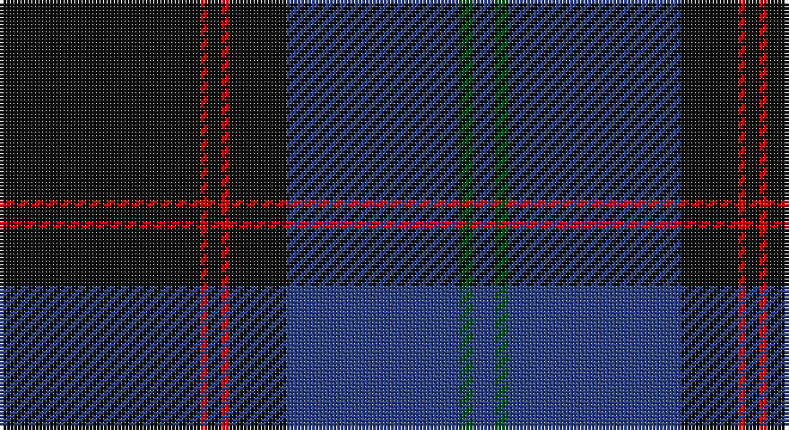

This page is one **sett** — a single exact thread-count. It belongs to the [tartan](/setts/k28r1k2r1k8db24dg2db3/)
(the same proportion at any scale), whose colour order is pattern [BGBKRKRK](/stripes/bgbkrkrk/).

Part of the [Home](/tartans/home/) tartan — the named design grouping this sett with its other cloths.

Sourced from register-of-tartans.  It is a [8 stripe tartan](/stripes/stripes8/).

Original link https://www.tartanregister.gov.uk/tartanDetails.aspx?ref=1758

## Also known as

This cloth is also recorded under:

- Home or Hume

4 attestations — the source records this cloth was collapsed from (oldest owns this page)

<ul>
<li>01/01/1842 — Home or Hume (Vestiarium Scoticum) (register-of-tartans, <a href="https://www.tartanregister.gov.uk/tartanDetails.aspx?ref=1758">record</a>)</li>
<li>undated — Home (weddslist, <a href="http://www.weddslist.com/cgi-bin/tartans/pg.pl?source=rb">record</a>)</li>
<li>undated — Home (weddslist, <a href="http://www.weddslist.com/cgi-bin/tartans/pg.pl?source=tinsel">record</a>)</li>
<li>undated — Home (weddslist, <a href="http://www.weddslist.com/cgi-bin/tartans/pg.pl?source=x">record</a>)</li>
</ul>

## Register references

External register numbers recorded for this tartan.

- Scottish Register of Tartans: [1758](https://www.tartanregister.gov.uk/tartanDetails.aspx?ref=1758)
- Scottish Tartans World Register: 127

## Thread count
K/56 R2 K4 R2 K16 B48 G4 B/6

One full sett is **214 threads**.

## Palette

Palette: <strong>Tartan Register</strong>
<table><thead><tr><th>Colour</th><th>Threads</th><th>Shade</th><th>Base</th><th>OKLCh</th></tr></thead><tbody><tr><td>K/</td><td style="text-align:right;font-variant-numeric:tabular-nums">56</td><td><code style="background-color:#101010;">#101010</code> <small style="color:#888">#101010</small></td><td>K <code style="background-color:#000000;">#000000</code></td><td><small style="color:#888">oklch(17.3% 0.000 89.9)</small></td></tr><tr><td>R</td><td style="text-align:right;font-variant-numeric:tabular-nums">2</td><td><code style="background-color:#DC0000;">#DC0000</code> <small style="color:#888">#DC0000</small></td><td>R <code style="background-color:#CC0000;">#CC0000</code></td><td><small style="color:#888">oklch(56.2% 0.230 29.2)</small></td></tr><tr><td>K</td><td style="text-align:right;font-variant-numeric:tabular-nums">4</td><td><code style="background-color:#101010;">#101010</code> <small style="color:#888">#101010</small></td><td>K <code style="background-color:#000000;">#000000</code></td><td><small style="color:#888">oklch(17.3% 0.000 89.9)</small></td></tr><tr><td>R</td><td style="text-align:right;font-variant-numeric:tabular-nums">2</td><td><code style="background-color:#DC0000;">#DC0000</code> <small style="color:#888">#DC0000</small></td><td>R <code style="background-color:#CC0000;">#CC0000</code></td><td><small style="color:#888">oklch(56.2% 0.230 29.2)</small></td></tr><tr><td>K</td><td style="text-align:right;font-variant-numeric:tabular-nums">16</td><td><code style="background-color:#101010;">#101010</code> <small style="color:#888">#101010</small></td><td>K <code style="background-color:#000000;">#000000</code></td><td><small style="color:#888">oklch(17.3% 0.000 89.9)</small></td></tr><tr><td>B</td><td style="text-align:right;font-variant-numeric:tabular-nums">48</td><td><code style="background-color:#2C4084;">#2C4084</code> <small style="color:#888">#2C4084</small></td><td>B <code style="background-color:#2A418A;">#2A418A</code></td><td><small style="color:#888">oklch(39.4% 0.117 268.3)</small></td></tr><tr><td>G</td><td style="text-align:right;font-variant-numeric:tabular-nums">4</td><td><code style="background-color:#005020;">#005020</code> <small style="color:#888">#005020</small></td><td>G <code style="background-color:#006100;">#006100</code></td><td><small style="color:#888">oklch(37.7% 0.105 149.6)</small></td></tr><tr><td>B/</td><td style="text-align:right;font-variant-numeric:tabular-nums">6</td><td><code style="background-color:#2C4084;">#2C4084</code> <small style="color:#888">#2C4084</small></td><td>B <code style="background-color:#2A418A;">#2A418A</code></td><td><small style="color:#888">oklch(39.4% 0.117 268.3)</small></td></tr></tbody></table>

# Sample pattern

## Compared to the master

This cloth is one sett of its design; the master sett (the exemplar the design is anchored on) is below for comparison.

<figure style="margin:0"><figcaption style="color:#888;font-size:smaller">this sett</figcaption></figure>
<figure style="margin:0"><figcaption style="color:#888;font-size:smaller"><a href="/setts/g3b36k9r3k3r3k36r3k3r3k9b36g3b2/">master sett →</a></figcaption></figure>

## Nearest tartans

The nearest existing variants by ΔTartan distance, with this tartan at the top so the swatches line up against it.

ΔTartan

Tartan

Sett

—

<a href="/ttd/edit/#slug=k28r1k2r1k8db24dg2db3~x2">Home or Hume (Vestiarium Scoticum)</a> <a class="nn-out" href="/variants/s8/k28r1k2r1k8db24dg2db3~x2/" title="open its dictionary page">↗</a>

1.19

<a href="/variants/s9/db5r3db21ki5db5ki40k2ki2w1~x2/">MacNeill</a>

1.19

<a href="/ttd/edit/#slug=k8ly1k1db28k12dg2k1t2~x2&amp;base=k28r1k2r1k8db24dg2db3~x2">Hope-Weir/Weir</a> <a class="nn-out" href="/variants/s8/k8ly1k1db28k12dg2k1t2~x2/" title="open its dictionary page">↗</a>

1.23

<a href="/ttd/edit/#slug=k10db4k34dt2k2dt30w3~x2&amp;base=k28r1k2r1k8db24dg2db3~x2">Patriot, The (Fashion)</a> <a class="nn-out" href="/variants/s7/k10db4k34dt2k2dt30w3~x2/" title="open its dictionary page">↗</a>

1.26

<a href="/ttd/edit/#slug=y1db36do28db3y3ly1~x2&amp;base=k28r1k2r1k8db24dg2db3~x2">Potts (Personal)</a> <a class="nn-out" href="/variants/s6/y1db36do28db3y3ly1~x2/" title="open its dictionary page">↗</a>

1.26

<a href="/ttd/edit/#slug=dt23k2dt2k2dt2k28r2k4n2~x2&amp;base=k28r1k2r1k8db24dg2db3~x2">Trotter (Personal)</a> <a class="nn-out" href="/variants/s9/dt23k2dt2k2dt2k28r2k4n2~x2/" title="open its dictionary page">↗</a>

1.32

<a href="/ttd/edit/#slug=k8m26k22dt110w4k5w4&amp;base=k28r1k2r1k8db24dg2db3~x2">Edinburgh, The University of</a> <a class="nn-out" href="/variants/s7/k8m26k22dt110w4k5w4/" title="open its dictionary page">↗</a>

1.33

<a href="/ttd/edit/#slug=r4dt4k2dt31k10ly3dt5k11dt6k3~x2&amp;base=k28r1k2r1k8db24dg2db3~x2">MacArthur Fox Green (Personal)</a> <a class="nn-out" href="/variants/s10/r4dt4k2dt31k10ly3dt5k11dt6k3~x2/" title="open its dictionary page">↗</a>

1.34

<a href="/ttd/edit/#slug=do8k2o2do2k13do2k2ly1do14k26ly2~x2&amp;base=k28r1k2r1k8db24dg2db3~x2">Pride of Scotland, Dark (Fashion)</a> <a class="nn-out" href="/variants/s11/do8k2o2do2k13do2k2ly1do14k26ly2~x2/" title="open its dictionary page">↗</a>

1.35

<a href="/ttd/edit/#slug=k42n2k2n17db8lo4~x2&amp;base=k28r1k2r1k8db24dg2db3~x2">Connecticut State Police Pipe Band</a> <a class="nn-out" href="/variants/s6/k42n2k2n17db8lo4~x2/" title="open its dictionary page">↗</a>

1.35

<a href="/ttd/edit/#slug=dt48k32r1k8r3w3~x2&amp;base=k28r1k2r1k8db24dg2db3~x2">Koot Wedding (Personal)</a> <a class="nn-out" href="/variants/s6/dt48k32r1k8r3w3~x2/" title="open its dictionary page">↗</a>

## Neighbour map

Every grey dot is one of 14360 variants placed by the first two principal components of the ΔTartan feature space (44% of its variance). Red is this tartan; blue dots are its nearest — click one to open its page.

<svg viewBox="0 0 640 380" role="img" style="max-width:100%;height:auto;border:1px solid #e0e0e0;border-radius:4px;display:block" xmlns="http://www.w3.org/2000/svg"><image href="/nn/cloud.v1.png" width="640" height="380"/><a href="/variants/s9/db5r3db21ki5db5ki40k2ki2w1~x2/"><circle cx="410.8" cy="131.1" r="4" fill="#3465a4"><title>MacNeill</title></circle></a><a href="/variants/s8/k8ly1k1db28k12dg2k1t2~x2/"><circle cx="370.5" cy="150.1" r="4" fill="#3465a4"><title>Hope-Weir/Weir</title></circle></a><a href="/variants/s7/k10db4k34dt2k2dt30w3~x2/"><circle cx="388.5" cy="211.4" r="4" fill="#3465a4"><title>Patriot, The (Fashion)</title></circle></a><a href="/variants/s6/y1db36do28db3y3ly1~x2/"><circle cx="452.8" cy="187.0" r="4" fill="#3465a4"><title>Potts (Personal)</title></circle></a><a href="/variants/s9/dt23k2dt2k2dt2k28r2k4n2~x2/"><circle cx="404.6" cy="199.5" r="4" fill="#3465a4"><title>Trotter (Personal)</title></circle></a><a href="/variants/s7/k8m26k22dt110w4k5w4/"><circle cx="427.0" cy="160.0" r="4" fill="#3465a4"><title>Edinburgh, The University of</title></circle></a><a href="/variants/s10/r4dt4k2dt31k10ly3dt5k11dt6k3~x2/"><circle cx="375.6" cy="190.5" r="4" fill="#3465a4"><title>MacArthur Fox Green (Personal)</title></circle></a><a href="/variants/s11/do8k2o2do2k13do2k2ly1do14k26ly2~x2/"><circle cx="429.4" cy="175.9" r="4" fill="#3465a4"><title>Pride of Scotland, Dark (Fashion)</title></circle></a><a href="/variants/s6/k42n2k2n17db8lo4~x2/"><circle cx="387.9" cy="187.7" r="4" fill="#3465a4"><title>Connecticut State Police Pipe Band</title></circle></a><a href="/variants/s6/dt48k32r1k8r3w3~x2/"><circle cx="404.3" cy="166.6" r="4" fill="#3465a4"><title>Koot Wedding (Personal)</title></circle></a><circle cx="424.2" cy="178.3" r="5" fill="#c00000"/></svg>

ID: /variants/s8/k28r1k2r1k8db24dg2db3~x2/
