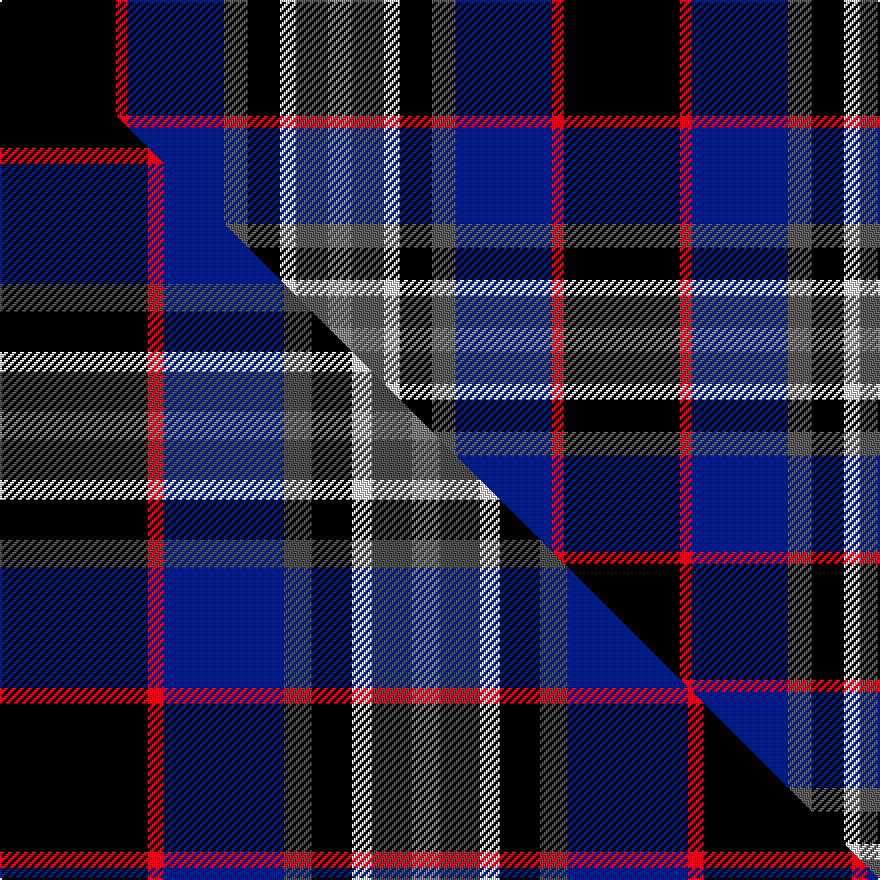

This is one **variant** — a specific cloth: this exact thread count and colourway, with its own
provenance below. It is one weaving of the [sett](/tartans/y/ya/yates/) (the scale-free proportion — the
same cloth at any scale or shade), whose colour order is pattern [KRBBKWBR](/stripes/krbbkwbr/).

Part of the [Yates](/tartans/y/ya/yates/) tartan — the named design grouping this sett with its other cloths.

Sourced from tartans-authority.  It is a [8 stripe tartan](/stripes/stripes8/).

Original link <code>http://www.tartansauthority.com/tartan-ferret/display/7091/</code> — retired · [Internet Archive copy](https://web.archive.org/web/*/http://www.tartansauthority.com/tartan-ferret/display/7091/*)

Dataset <small>— provenance for this record, inherited from the source manifest</small>

<dl class="dataset-prov">
<dt>source</dt><dd><a href="/sources/tartans-authority/">Scottish Tartans Authority</a></dd>
<dt>data captured from</dt><dd><a href="https://github.com/thetartan/tartan-database/blob/master/data/tartans-authority/data.csv">https://github.com/thetartan/tartan-database/blob/master/data/tartans-authority/data.csv</a></dd>
<dt>data date</dt><dd>December 2006 <small>(this record)</small></dd>
<dt>licence</dt><dd><a href="https://creativecommons.org/licenses/by-nc-nd/4.0/">CC BY-NC-ND 4.0</a></dd>
</dl>

Capture chain <small>— the hands this data passed through, oldest first; each capture carries its own licence</small>

<ol class="capture-chain">
<li><a href="https://www.tartansauthority.com/">Scottish Tartans Authority</a> <small>the heritage body’s archive — its tartan-ferret record browser is retired; dead record links are shown unlinked, with an Internet Archive copy (ITI numbers are not SRT references)</small></li>
<li><a href="https://github.com/thetartan/tartan-database">thetartan/tartan-database</a> <small>2016-2017</small> · <a href="https://creativecommons.org/licenses/by-nc-nd/4.0/">CC BY-NC-ND 4.0</a> <small>Levko Kravets's frozen compilation — the capture we vendored, and where its CC licence text came from</small></li>
<li>this dictionary <small>captured 2026-06-10 · commit 5bf86c7566</small> <small>each re-capture is a git commit to data/sources</small></li>
</ol>

## Register references

External register numbers recorded for this tartan.

- Scottish Tartans Authority (ITI): 7091

## Thread count
K/58 R6 DB48 N12 K16 W8 N16 O/12

One full sett is **282 threads**.

## Palette
<table><thead><tr><th>Colour</th><th>Shade</th><th>OKLCh</th></tr></thead><tbody><tr><td>DB</td><td><code style="background-color:#082077;">#082077</code> <small style="color:#888">#082077</small></td><td><small style="color:#888">oklch(30.0% 0.149 265.1)</small></td></tr><tr><td>K</td><td><code style="background-color:#000000;">#000000</code> <small style="color:#888">#000000</small></td><td><small style="color:#888">oklch(0.0% 0.000 0.0)</small></td></tr><tr><td>W</td><td><code style="background-color:#F7F7F7;">#F7F7F7</code> <small style="color:#888">#F7F7F7</small></td><td><small style="color:#888">oklch(97.6% 0.000 89.9)</small></td></tr><tr><td>N</td><td><code style="background-color:#5C5C5C;">#5C5C5C</code> <small style="color:#888">#5C5C5C</small></td><td><small style="color:#888">oklch(47.5% 0.000 89.9)</small></td></tr><tr><td>O</td><td><code style="background-color:#888888;">#888888</code> <small style="color:#888">#888888</small></td><td><small style="color:#888">oklch(62.7% 0.000 89.9)</small></td></tr><tr><td>R</td><td><code style="background-color:#D60020;">#D60020</code> <small style="color:#888">#D60020</small></td><td><small style="color:#888">oklch(55.2% 0.224 25.5)</small></td></tr></tbody></table>

# Sample pattern

## Compared to the master

This cloth is one sett of its design; the master sett (the exemplar the design is anchored on) is below for comparison.

Its **ΔTartan distance** from the master is **0.12** — the same measure the nearest-tartans table ranks by (0 is identical; a re-scale of the same cloth is near 0, a recolour or a different proportion further).

<figure class="master-compare" style="margin:0">

this sett
master sett ★

<figcaption style="color:#888;font-size:smaller">One weave of this sett against the <a href="/setts/k37r4db30n7k10w5n10y7/">master sett ★</a>, split on the diagonal: a shared proportion runs seamlessly across it with only the shades shifting; a different proportion breaks on it.</figcaption>
</figure>

## Nearest tartan variants

The nearest existing variants by ΔTartan distance, with this cloth at the top so the swatches line up against it.

ΔTartan

Threads

Variant

Sett

—

282

<a href="/variants/s8/k29r3db24n6k8w4n8o6~x2~n1900000-o2500000/">Yates (Personal)</a>

<a href="/ttd/edit/#slug=k29r3db24n6k8w4n8o6~x2~db1404245-n1900000-o2500000&amp;base=k29r3db24n6k8w4n8o6~x2~n1900000-o2500000" title="compare in the TTD">0.05</a>

282

<a href="/variants/s8/k29r3db24n6k8w4n8o6~x2~db1404245-n1900000-o2500000/">Yates Personal Tartan</a>

<a href="/ttd/edit/#slug=k37r4db30dt7k10w5dt10y7~x2~dt1700000-y2400000&amp;base=k29r3db24n6k8w4n8o6~x2~n1900000-o2500000" title="compare in the TTD">0.12</a>

352

<a href="/variants/s8/k37r4db30n7k10w5n10y7~x2~n1700000-y2400000/">Yates</a>

<a href="/ttd/edit/#slug=ly4k28r2db22t8dy3~x2&amp;base=k29r3db24n6k8w4n8o6~x2~n1900000-o2500000" title="compare in the TTD">1.95</a>

254

<a href="/variants/s6/ly4k28r2db22t8dy3~x2/">Loch Long One Design (Corporate)</a>

<a href="/ttd/edit/#slug=lb6db17dp4db2k11g3lo4~x2&amp;base=k29r3db24n6k8w4n8o6~x2~n1900000-o2500000" title="compare in the TTD">2.03</a>

168

<a href="/variants/s7/lb6db17dp4db2k11g3lo4~x2/">East Lothian</a>

<a href="/ttd/edit/#slug=dp2g4k8lo1k1db4lb1db1lb2~x8&amp;base=k29r3db24n6k8w4n8o6~x2~n1900000-o2500000" title="compare in the TTD">2.05</a>

352

<a href="/variants/s9/dp2g4k8lo1k1db4lb1db1lb2~x8/">Scottish Cultural Society (Corporate</a>

<a href="/ttd/edit/#slug=o4k7o2db25k19w2g13k2y3~x2&amp;base=k29r3db24n6k8w4n8o6~x2~n1900000-o2500000" title="compare in the TTD">2.09</a>

294

<a href="/variants/s9/o4k7o2db25k19w2g13k2y3~x2/">Leung (Personal)</a>

<a href="/ttd/edit/#slug=k1dg8w1k8w1db8r1~x4&amp;base=k29r3db24n6k8w4n8o6~x2~n1900000-o2500000" title="compare in the TTD">2.10</a>

216

<a href="/variants/s7/k1dg8w1k8w1db8r1~x4/">Caie (2013)</a>

<a href="/ttd/edit/#slug=w10k52db52dg24y10dg5r5&amp;base=k29r3db24n6k8w4n8o6~x2~n1900000-o2500000" title="compare in the TTD">2.15</a>

301

<a href="/variants/s7/w10k52db52dg24y10dg5r5/">Harvey of Cornwall (Personal)</a>

<a href="/ttd/edit/#slug=w3db3r2db14k3g12k14db16y2~x2&amp;base=k29r3db24n6k8w4n8o6~x2~n1900000-o2500000" title="compare in the TTD">2.24</a>

266

<a href="/variants/s9/w3db3r2db14k3g12k14db16y2~x2/">Royal Navy Submarine Service</a>

<a href="/ttd/edit/#slug=r2lb5k4y1k4db16k3g2~x4&amp;base=k29r3db24n6k8w4n8o6~x2~n1900000-o2500000" title="compare in the TTD">2.24</a>

280

<a href="/variants/s8/r2lb5k4y1k4db16k3g2~x4/">Arundel County (Dalgleish)</a>

## Neighbour map

Every grey dot is one of 13657 variants placed by the first two principal components of the ΔTartan feature space (42% of its variance). Red is this tartan; blue dots are its nearest — click one to open its page. The map is a flat projection of a many-dimensional space — [how to read it](/posts/neighbourhood-maps/).

<svg viewBox="0 0 640 380" role="img" style="max-width:100%;height:auto;border:1px solid #e0e0e0;border-radius:4px;display:block" xmlns="http://www.w3.org/2000/svg"><image href="/nn/cloud.v1.png" width="640" height="380"/><a href="/variants/s8/k29r3db24n6k8w4n8o6~x2~db1404245-n1900000-o2500000/"><circle cx="128.5" cy="153.3" r="4" fill="#3465a4"><title>Yates Personal Tartan</title></circle></a><a href="/variants/s8/k37r4db30n7k10w5n10y7~x2~n1700000-y2400000/"><circle cx="133.8" cy="153.1" r="4" fill="#3465a4"><title>Yates</title></circle></a><a href="/variants/s6/ly4k28r2db22t8dy3~x2/"><circle cx="160.2" cy="146.6" r="4" fill="#3465a4"><title>Loch Long One Design (Corporate)</title></circle></a><a href="/variants/s7/lb6db17dp4db2k11g3lo4~x2/"><circle cx="104.7" cy="173.1" r="4" fill="#3465a4"><title>East Lothian</title></circle></a><a href="/variants/s9/dp2g4k8lo1k1db4lb1db1lb2~x8/"><circle cx="81.2" cy="157.4" r="4" fill="#3465a4"><title>Scottish Cultural Society (Corporate</title></circle></a><a href="/variants/s9/o4k7o2db25k19w2g13k2y3~x2/"><circle cx="117.4" cy="133.4" r="4" fill="#3465a4"><title>Leung (Personal)</title></circle></a><a href="/variants/s7/k1dg8w1k8w1db8r1~x4/"><circle cx="115.9" cy="181.9" r="4" fill="#3465a4"><title>Caie (2013)</title></circle></a><a href="/variants/s7/w10k52db52dg24y10dg5r5/"><circle cx="109.3" cy="161.6" r="4" fill="#3465a4"><title>Harvey of Cornwall (Personal)</title></circle></a><a href="/variants/s9/w3db3r2db14k3g12k14db16y2~x2/"><circle cx="146.0" cy="166.1" r="4" fill="#3465a4"><title>Royal Navy Submarine Service</title></circle></a><a href="/variants/s8/r2lb5k4y1k4db16k3g2~x4/"><circle cx="159.7" cy="124.4" r="4" fill="#3465a4"><title>Arundel County (Dalgleish)</title></circle></a><circle cx="127.9" cy="152.3" r="5" fill="#c00000"/><text x="320" y="376" text-anchor="middle" font-size="11" fill="#999">ground</text><text x="11" y="190" text-anchor="middle" font-size="11" fill="#999" transform="rotate(-90 11 190)">complexity</text></svg>

ID: /variants/s8/k29r3db24n6k8w4n8o6~x2~n1900000-o2500000/
