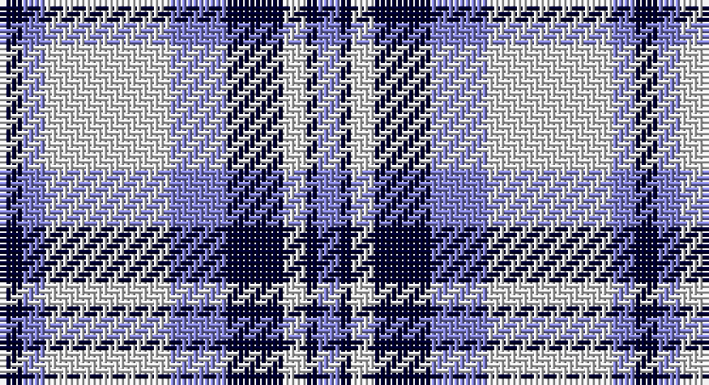

This page is one **sett** — a single exact thread-count. It belongs to the [tartan](/setts/k2b2w11b5k5w2k1b2/)
(the same proportion at any scale), whose colour order is pattern [BKWKBWBK](/stripes/bkwkbwbk/).

Part of the [Conquergood](/tartans/conquergood/) tartan — the named design grouping this sett with its other cloths.

Sourced from weddslist.  It is a [8 stripe tartan](/stripes/stripes8/).

Original link http://www.weddslist.com/cgi-bin/tartans/pg.pl?source=sts

## Thread count
DB/4 B4 LN22 B10 DB10 LN4 DB2 B/4

One full sett is **112 threads**.

## Palette

Palette: <strong>Tartan Dictionary</strong> <small style="color:#888">(1 of 3 colours)</small>
<table><thead><tr><th>Colour</th><th>Threads</th><th>Shade</th><th>Base</th><th>OKLCh</th></tr></thead><tbody><tr><td>DB/</td><td style="text-align:right;font-variant-numeric:tabular-nums">4</td><td><code style="background-color:#000030;">#000030</code> <small style="color:#888">#000030</small></td><td>K <code style="background-color:#000000;">#000000</code></td><td><small style="color:#888">oklch(14.0% 0.097 264.1)</small></td></tr><tr><td>B</td><td style="text-align:right;font-variant-numeric:tabular-nums">4</td><td><code style="background-color:#8080D0;">#8080D0</code> <small style="color:#888">#8080D0</small></td><td>B <code style="background-color:#2A418A;">#2A418A</code></td><td><small style="color:#888">oklch(63.4% 0.119 282.5)</small></td></tr><tr><td>LN</td><td style="text-align:right;font-variant-numeric:tabular-nums">22</td><td><code style="background-color:#E0E0E0;">#E0E0E0</code> <small style="color:#888">#E0E0E0</small></td><td>W <code style="background-color:#F7F7F7;">#F7F7F7</code></td><td><small style="color:#888">oklch(90.7% 0.000 89.9)</small></td></tr><tr><td>B</td><td style="text-align:right;font-variant-numeric:tabular-nums">10</td><td><code style="background-color:#8080D0;">#8080D0</code> <small style="color:#888">#8080D0</small></td><td>B <code style="background-color:#2A418A;">#2A418A</code></td><td><small style="color:#888">oklch(63.4% 0.119 282.5)</small></td></tr><tr><td>DB</td><td style="text-align:right;font-variant-numeric:tabular-nums">10</td><td><code style="background-color:#000030;">#000030</code> <small style="color:#888">#000030</small></td><td>K <code style="background-color:#000000;">#000000</code></td><td><small style="color:#888">oklch(14.0% 0.097 264.1)</small></td></tr><tr><td>LN</td><td style="text-align:right;font-variant-numeric:tabular-nums">4</td><td><code style="background-color:#E0E0E0;">#E0E0E0</code> <small style="color:#888">#E0E0E0</small></td><td>W <code style="background-color:#F7F7F7;">#F7F7F7</code></td><td><small style="color:#888">oklch(90.7% 0.000 89.9)</small></td></tr><tr><td>DB</td><td style="text-align:right;font-variant-numeric:tabular-nums">2</td><td><code style="background-color:#000030;">#000030</code> <small style="color:#888">#000030</small></td><td>K <code style="background-color:#000000;">#000000</code></td><td><small style="color:#888">oklch(14.0% 0.097 264.1)</small></td></tr><tr><td>B/</td><td style="text-align:right;font-variant-numeric:tabular-nums">4</td><td><code style="background-color:#8080D0;">#8080D0</code> <small style="color:#888">#8080D0</small></td><td>B <code style="background-color:#2A418A;">#2A418A</code></td><td><small style="color:#888">oklch(63.4% 0.119 282.5)</small></td></tr></tbody></table>

# Sample pattern

## Compared to the master

This cloth is one sett of its design; the master sett (the exemplar the design is anchored on) is below for comparison.

<figure style="margin:0"><figcaption style="color:#888;font-size:smaller">this sett</figcaption></figure>
<figure style="margin:0"><figcaption style="color:#888;font-size:smaller"><a href="/setts/k4t2w11t5o5w2k1t2/">master sett →</a></figcaption></figure>

## Nearest tartans

The nearest existing variants by ΔTartan distance, with this tartan at the top so the swatches line up against it.

ΔTartan

Tartan

Sett

—

<a href="/ttd/edit/#slug=k2b2w11b5k5w2k1b2~x2">Conquergood</a> <a class="nn-out" href="/variants/s8/k2b2w11b5k5w2k1b2~x2/" title="open its dictionary page">↗</a>

1.15

<a href="/ttd/edit/#slug=b27w2b14k14lg4k4lg4k4lg27&amp;base=k2b2w11b5k5w2k1b2~x2">(1) Abercrombie</a> <a class="nn-out" href="/variants/s9/b27w2b14k14lg4k4lg4k4lg27/" title="open its dictionary page">↗</a>

1.23

<a href="/ttd/edit/#slug=db2w2db8dr8w10db2w1db1~x2&amp;base=k2b2w11b5k5w2k1b2~x2">Laval (Tartan de..), dress</a> <a class="nn-out" href="/variants/s8/db2w2db8dr8w10db2w1db1~x2/" title="open its dictionary page">↗</a>

1.23

<a href="/ttd/edit/#slug=dt14w2dt3w2dr10w32dr10dt10w2dt3~x2&amp;base=k2b2w11b5k5w2k1b2~x2">Fraser Arisaid #2</a> <a class="nn-out" href="/variants/s10/dt14w2dt3w2dr10w32dr10dt10w2dt3~x2/" title="open its dictionary page">↗</a>

1.33

<a href="/ttd/edit/#slug=w5k3w26db21w3db8ly3~x2&amp;base=k2b2w11b5k5w2k1b2~x2">MacPherson Dress Blue (Dance)</a> <a class="nn-out" href="/variants/s7/w5k3w26db21w3db8ly3~x2/" title="open its dictionary page">↗</a>

1.33

<a href="/ttd/edit/#slug=db2t2db15t1w10t15db2t2~x2&amp;base=k2b2w11b5k5w2k1b2~x2">Bannockbane Light Blue</a> <a class="nn-out" href="/variants/s8/db2t2db15t1w10t15db2t2~x2/" title="open its dictionary page">↗</a>

1.36

<a href="/ttd/edit/#slug=w5db32g12db2w30k4~x2&amp;base=k2b2w11b5k5w2k1b2~x2">Bonnie Royal</a> <a class="nn-out" href="/variants/s6/w5db32g12db2w30k4~x2/" title="open its dictionary page">↗</a>

1.37

<a href="/ttd/edit/#slug=db8t3db28w32dt3w4~x2&amp;base=k2b2w11b5k5w2k1b2~x2">Ailsa, Royal Blue (Dance)</a> <a class="nn-out" href="/variants/s6/db8t3db28w32dt3w4~x2/" title="open its dictionary page">↗</a>

1.37

<a href="/ttd/edit/#slug=k2lb16w2db16w15k2w2~x2&amp;base=k2b2w11b5k5w2k1b2~x2">Strathclyde 1975 (District)</a> <a class="nn-out" href="/variants/s7/k2lb16w2db16w15k2w2~x2/" title="open its dictionary page">↗</a>

1.39

<a href="/ttd/edit/#slug=w16db3w2db3w2db3r5db6w2~x4&amp;base=k2b2w11b5k5w2k1b2~x2">Jeux Canada Games '87 (Corporate)</a> <a class="nn-out" href="/variants/s9/w16db3w2db3w2db3r5db6w2~x4/" title="open its dictionary page">↗</a>

1.40

<a href="/ttd/edit/#slug=t57k5t9m29k18w9m9w5&amp;base=k2b2w11b5k5w2k1b2~x2">Yale College, Wrexham</a> <a class="nn-out" href="/variants/s8/t57k5t9m29k18w9m9w5/" title="open its dictionary page">↗</a>

## Neighbour map

Every grey dot is one of 14360 variants placed by the first two principal components of the ΔTartan feature space (44% of its variance). Red is this tartan; blue dots are its nearest — click one to open its page.

<svg viewBox="0 0 640 380" role="img" style="max-width:100%;height:auto;border:1px solid #e0e0e0;border-radius:4px;display:block" xmlns="http://www.w3.org/2000/svg"><image href="/nn/cloud.v1.png" width="640" height="380"/><a href="/variants/s9/b27w2b14k14lg4k4lg4k4lg27/"><circle cx="184.0" cy="160.4" r="4" fill="#3465a4"><title>(1) Abercrombie</title></circle></a><a href="/variants/s8/db2w2db8dr8w10db2w1db1~x2/"><circle cx="186.2" cy="190.9" r="4" fill="#3465a4"><title>Laval (Tartan de..), dress</title></circle></a><a href="/variants/s10/dt14w2dt3w2dr10w32dr10dt10w2dt3~x2/"><circle cx="225.5" cy="143.3" r="4" fill="#3465a4"><title>Fraser Arisaid #2</title></circle></a><a href="/variants/s7/w5k3w26db21w3db8ly3~x2/"><circle cx="234.0" cy="178.1" r="4" fill="#3465a4"><title>MacPherson Dress Blue (Dance)</title></circle></a><a href="/variants/s8/db2t2db15t1w10t15db2t2~x2/"><circle cx="233.9" cy="179.3" r="4" fill="#3465a4"><title>Bannockbane Light Blue</title></circle></a><a href="/variants/s6/w5db32g12db2w30k4~x2/"><circle cx="197.1" cy="162.8" r="4" fill="#3465a4"><title>Bonnie Royal</title></circle></a><a href="/variants/s6/db8t3db28w32dt3w4~x2/"><circle cx="242.4" cy="176.5" r="4" fill="#3465a4"><title>Ailsa, Royal Blue (Dance)</title></circle></a><a href="/variants/s7/k2lb16w2db16w15k2w2~x2/"><circle cx="127.8" cy="177.2" r="4" fill="#3465a4"><title>Strathclyde 1975 (District)</title></circle></a><a href="/variants/s9/w16db3w2db3w2db3r5db6w2~x4/"><circle cx="255.4" cy="181.8" r="4" fill="#3465a4"><title>Jeux Canada Games '87 (Corporate)</title></circle></a><a href="/variants/s8/t57k5t9m29k18w9m9w5/"><circle cx="223.1" cy="167.6" r="4" fill="#3465a4"><title>Yale College, Wrexham</title></circle></a><circle cx="200.7" cy="183.8" r="5" fill="#c00000"/></svg>

ID: /variants/s8/k2b2w11b5k5w2k1b2~x2/
