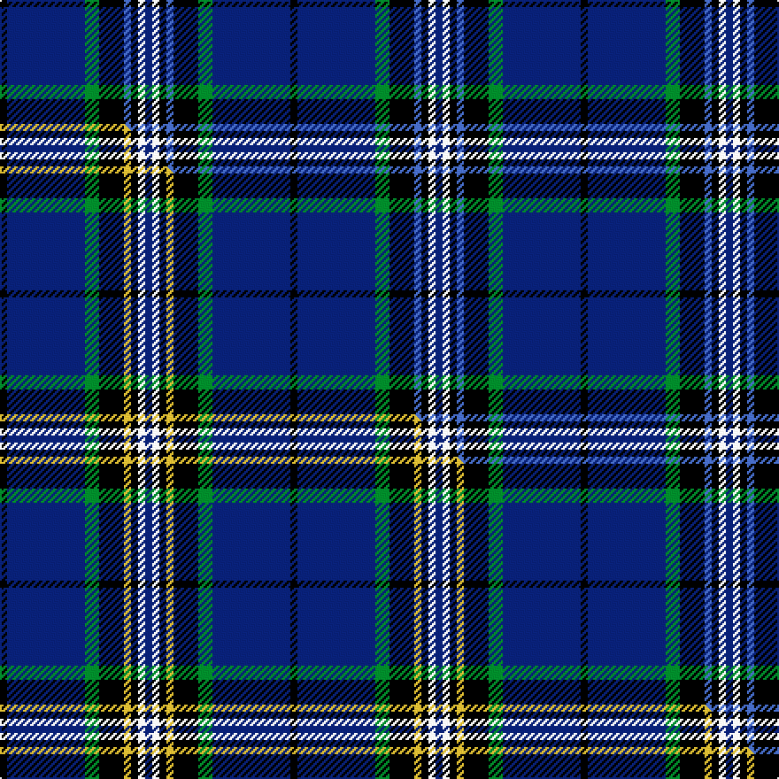

This is one **variant** — a specific cloth: this exact thread count and colourway, with its own
provenance below. It is one weaving of the [sett](/tartans/g/gl/glasgow-university-of/) (the scale-free proportion — the
same cloth at any scale or shade), whose colour order is pattern [BWKBKGBK](/stripes/bwkbkgbk/).

Part of the [Glasgow, University of](/tartans/g/gl/glasgow-university-of/) tartan — the named design grouping this sett with its other cloths.

Sourced from weddslist.  It is a [8 stripe tartan](/stripes/stripes8/).

Original link [http://www.weddslist.com/cgi-bin/tartans/pg.pl?source=sts](http://www.weddslist.com/cgi-bin/tartans/pg.pl?source=sts)

Dataset <small>— provenance for this record, inherited from the source manifest</small>

<dl class="dataset-prov">
<dt>source</dt><dd><a href="/sources/weddslist/">Weddslist</a></dd>
<dt>data captured from</dt><dd><a href="https://github.com/thetartan/tartan-database/blob/master/data/weddslist/data.csv">https://github.com/thetartan/tartan-database/blob/master/data/weddslist/data.csv</a></dd>
<dt>data date</dt><dd>2016-11-17 <small>(dataset default)</small></dd>
<dt>licence</dt><dd><a href="https://creativecommons.org/licenses/by-nc-nd/4.0/">CC BY-NC-ND 4.0</a></dd>
</dl>

Capture chain <small>— the hands this data passed through, oldest first; each capture carries its own licence</small>

<ol class="capture-chain">
<li><a href="https://www.weddslist.com/tartans/">Weddslist</a> <small>the living privately compiled reference</small></li>
<li><a href="https://github.com/thetartan/tartan-database">thetartan/tartan-database</a> <small>2016-2017</small> · <a href="https://creativecommons.org/licenses/by-nc-nd/4.0/">CC BY-NC-ND 4.0</a> <small>Levko Kravets's frozen compilation — the capture we vendored, and where its CC licence text came from</small></li>
<li>this dictionary <small>captured 2026-06-10 · commit 5bf86c7566</small> <small>each re-capture is a git commit to data/sources</small></li>
</ol>

## Thread count
K/4 DB44 G8 K14 B4 K4 W4 DB/4

One full sett is **164 threads**.

## Palette
<table><thead><tr><th>Colour</th><th>Shade</th><th>OKLCh</th></tr></thead><tbody><tr><td>DB</td><td><code style="background-color:#082077;">#082077</code> <small style="color:#888">#082077</small></td><td><small style="color:#888">oklch(30.0% 0.149 265.1)</small></td></tr><tr><td>G</td><td><code style="background-color:#008B2A;">#008B2A</code> <small style="color:#888">#008B2A</small></td><td><small style="color:#888">oklch(55.4% 0.170 145.9)</small></td></tr><tr><td>K</td><td><code style="background-color:#000000;">#000000</code> <small style="color:#888">#000000</small></td><td><small style="color:#888">oklch(0.0% 0.000 0.0)</small></td></tr><tr><td>B</td><td><code style="background-color:#466CC8;">#466CC8</code> <small style="color:#888">#466CC8</small></td><td><small style="color:#888">oklch(55.1% 0.149 265.0)</small></td></tr><tr><td>W</td><td><code style="background-color:#F7F7F7;">#F7F7F7</code> <small style="color:#888">#F7F7F7</small></td><td><small style="color:#888">oklch(97.6% 0.000 89.9)</small></td></tr></tbody></table>

# Sample pattern

[Sample sheet (PDF)](swatch.pdf) — the woven sample, thread count and palette on one printable A4, rendered on demand (the same sheet the TTD print page downloads).

## Compared to the master

This cloth is one sett of its design; the master sett (the exemplar the design is anchored on) is below for comparison.

Its **ΔTartan distance** from the master is **0.30** — the same measure the nearest-tartans table ranks by (0 is identical; a re-scale of the same cloth is near 0, a recolour or a different proportion further).

<figure class="master-compare" style="margin:0">

this sett
master sett ★

<figcaption style="color:#888;font-size:smaller">One weave of this sett against the <a href="/setts/k2db22g4k7ly2k2w2db2/">master sett ★</a>, split on the diagonal: a shared proportion runs seamlessly across it with only the shades shifting; a different proportion breaks on it.</figcaption>
</figure>

## Nearest tartan variants

The nearest existing variants by ΔTartan distance, with this cloth at the top so the swatches line up against it.

ΔTartan

Threads

Variant

Sett

—

164

<a href="/variants/s8/k2db22g4k7b2k2w2db2~x2/">Glasgow, University of</a>

<a href="/ttd/edit/#slug=k2db22g4k7ly2k2w2db2~x2&amp;base=k2db22g4k7b2k2w2db2~x2" title="compare in the TTD">0.30</a>

164

<a href="/variants/s8/k2db22g4k7ly2k2w2db2~x2/">Glasgow, University of</a>

<a href="/ttd/edit/#slug=db10k1g2k2lb3k2g2k1db10w1~x8&amp;base=k2db22g4k7b2k2w2db2~x2" title="compare in the TTD">2.05</a>

456

<a href="/variants/s10/db10k1g2k2lb3k2g2k1db10w1~x8/">Isle of Harris</a>

<a href="/ttd/edit/#slug=lb3k19db24r2db2y2db2~x2&amp;base=k2db22g4k7b2k2w2db2~x2" title="compare in the TTD">2.07</a>

206

<a href="/variants/s7/lb3k19db24r2db2y2db2~x2/">Mensa</a>

<a href="/ttd/edit/#slug=k3db30k8w8k2r3~x2&amp;base=k2db22g4k7b2k2w2db2~x2" title="compare in the TTD">2.10</a>

204

<a href="/variants/s6/k3db30k8w8k2r3~x2/">Hydro-Electric</a>

<a href="/ttd/edit/#slug=db8w2k8g12r2db3r2db24r2~x2&amp;base=k2db22g4k7b2k2w2db2~x2" title="compare in the TTD">2.11</a>

232

<a href="/variants/s9/db8w2k8g12r2db3r2db24r2~x2/">Burt #2 (Name)</a>

<a href="/ttd/edit/#slug=dg3k3db2k16db2k2db24lb2~x2&amp;base=k2db22g4k7b2k2w2db2~x2" title="compare in the TTD">2.31</a>

206

<a href="/variants/s8/dg3k3db2k16db2k2db24lb2~x2/">Auckland (Fashion)</a>

<a href="/ttd/edit/#slug=k4db36k4db4k34b3k3w4~x2&amp;base=k2db22g4k7b2k2w2db2~x2" title="compare in the TTD">2.32</a>

352

<a href="/variants/s8/k4db36k4db4k34b3k3w4~x2/">Slanj Dress (Corporate)</a>

<a href="/ttd/edit/#slug=r4g2r2k5db22w2~x4&amp;base=k2db22g4k7b2k2w2db2~x2" title="compare in the TTD">2.52</a>

272

<a href="/variants/s6/r4g2r2k5db22w2~x4/">Reese (Personal)</a>

<a href="/ttd/edit/#slug=db30dbi2k9w3db6w4k3dbi6~x2~db2719264-dbi3912267&amp;base=k2db22g4k7b2k2w2db2~x2" title="compare in the TTD">2.57</a>

180

<a href="/variants/s8/db30dbi2k9w3db6w4k3dbi6~x2~db2719264-dbi3912267/">Auto Docs</a>

<a href="/ttd/edit/#slug=db6dp3db56k24g6r6g6&amp;base=k2db22g4k7b2k2w2db2~x2" title="compare in the TTD">2.61</a>

202

<a href="/variants/s7/db6dp3db56k24g6r6g6/">Wcwm 9275-1395</a>

## Neighbour map

Every grey dot is one of 13662 variants placed by the first two principal components of the ΔTartan feature space (42% of its variance). Red is this tartan; blue dots are its nearest — click one to open its page. The map is a flat projection of a many-dimensional space — [how to read it](/posts/neighbourhood-maps/).

<svg viewBox="0 0 640 380" role="img" style="max-width:100%;height:auto;border:1px solid #e0e0e0;border-radius:4px;display:block" xmlns="http://www.w3.org/2000/svg"><image href="/nn/cloud.v1.png" width="640" height="380"/><a href="/variants/s8/k2db22g4k7ly2k2w2db2~x2/"><circle cx="249.0" cy="136.1" r="4" fill="#3465a4"><title>Glasgow, University of</title></circle></a><a href="/variants/s10/db10k1g2k2lb3k2g2k1db10w1~x8/"><circle cx="243.7" cy="146.1" r="4" fill="#3465a4"><title>Isle of Harris</title></circle></a><a href="/variants/s7/lb3k19db24r2db2y2db2~x2/"><circle cx="262.4" cy="146.9" r="4" fill="#3465a4"><title>Mensa</title></circle></a><a href="/variants/s6/k3db30k8w8k2r3~x2/"><circle cx="259.6" cy="148.4" r="4" fill="#3465a4"><title>Hydro-Electric</title></circle></a><a href="/variants/s9/db8w2k8g12r2db3r2db24r2~x2/"><circle cx="239.1" cy="145.2" r="4" fill="#3465a4"><title>Burt #2 (Name)</title></circle></a><a href="/variants/s8/dg3k3db2k16db2k2db24lb2~x2/"><circle cx="306.1" cy="160.7" r="4" fill="#3465a4"><title>Auckland (Fashion)</title></circle></a><a href="/variants/s8/k4db36k4db4k34b3k3w4~x2/"><circle cx="275.7" cy="152.4" r="4" fill="#3465a4"><title>Slanj Dress (Corporate)</title></circle></a><a href="/variants/s6/r4g2r2k5db22w2~x4/"><circle cx="273.2" cy="144.7" r="4" fill="#3465a4"><title>Reese (Personal)</title></circle></a><a href="/variants/s8/db30dbi2k9w3db6w4k3dbi6~x2~db2719264-dbi3912267/"><circle cx="278.3" cy="147.4" r="4" fill="#3465a4"><title>Auto Docs</title></circle></a><a href="/variants/s7/db6dp3db56k24g6r6g6/"><circle cx="306.3" cy="131.4" r="4" fill="#3465a4"><title>Wcwm 9275-1395</title></circle></a><circle cx="257.8" cy="139.0" r="5" fill="#c00000"/><text x="320" y="376" text-anchor="middle" font-size="11" fill="#999">ground</text><text x="11" y="190" text-anchor="middle" font-size="11" fill="#999" transform="rotate(-90 11 190)">complexity</text></svg>

ID: /variants/s8/k2db22g4k7b2k2w2db2~x2/
