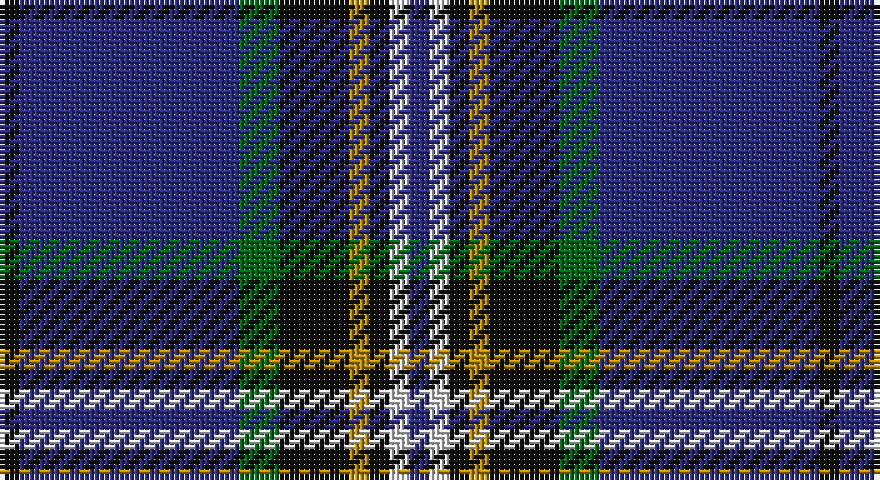

This page is one **sett** — a single exact thread-count. It belongs to the [tartan](/setts/k2db22g4k7lo2k2w2db2/)
(the same proportion at any scale), whose colour order is pattern [BWKYKGBK](/stripes/bwkykgbk/).

Part of the [Glasgow, University of](/tartans/glasgow-university-of/) tartan — the named design grouping this sett with its other cloths.

Sourced from register-of-tartans.  It is a [8 stripe tartan](/stripes/stripes8/).

Original link https://www.tartanregister.gov.uk/tartanDetails.aspx?ref=1360

2 attestations — the source records this cloth was collapsed from (oldest owns this page)

<ul>
<li>01/01/1998 — Glasgow, University of (register-of-tartans, <a href="https://www.tartanregister.gov.uk/tartanDetails.aspx?ref=1360">record</a>)</li>
<li>Nov. 1999 — Glasgow, University of (Corporate) (tartans-authority, <a href="http://www.tartansauthority.com/tartan-ferret/display/2680/">record</a>)</li>
</ul>

## Register references

External register numbers recorded for this tartan.

- Scottish Register of Tartans: [1360](https://www.tartanregister.gov.uk/tartanDetails.aspx?ref=1360)
- Scottish Tartans Authority (ITI): 2680
- Scottish Tartans World Register: 2680

## Thread count
K/4 DB44 G8 K14 DY4 K4 LN4 DB/4

One full sett is **164 threads**.

## Palette

Palette: <strong>Tartan Register</strong>
<table><thead><tr><th>Colour</th><th>Threads</th><th>Shade</th><th>Base</th><th>OKLCh</th></tr></thead><tbody><tr><td>K/</td><td style="text-align:right;font-variant-numeric:tabular-nums">4</td><td><code style="background-color:#101010;">#101010</code> <small style="color:#888">#101010</small></td><td>K <code style="background-color:#000000;">#000000</code></td><td><small style="color:#888">oklch(17.3% 0.000 89.9)</small></td></tr><tr><td>DB</td><td style="text-align:right;font-variant-numeric:tabular-nums">44</td><td><code style="background-color:#2C2C80;">#2C2C80</code> <small style="color:#888">#2C2C80</small></td><td>B <code style="background-color:#2A418A;">#2A418A</code></td><td><small style="color:#888">oklch(35.0% 0.138 276.6)</small></td></tr><tr><td>G</td><td style="text-align:right;font-variant-numeric:tabular-nums">8</td><td><code style="background-color:#006818;">#006818</code> <small style="color:#888">#006818</small></td><td>G <code style="background-color:#006100;">#006100</code></td><td><small style="color:#888">oklch(45.0% 0.142 145.0)</small></td></tr><tr><td>K</td><td style="text-align:right;font-variant-numeric:tabular-nums">14</td><td><code style="background-color:#101010;">#101010</code> <small style="color:#888">#101010</small></td><td>K <code style="background-color:#000000;">#000000</code></td><td><small style="color:#888">oklch(17.3% 0.000 89.9)</small></td></tr><tr><td>DY</td><td style="text-align:right;font-variant-numeric:tabular-nums">4</td><td><code style="background-color:#BC8C00;">#BC8C00</code> <small style="color:#888">#BC8C00</small></td><td>Y <code style="background-color:#F2BF00;">#F2BF00</code></td><td><small style="color:#888">oklch(66.8% 0.137 84.1)</small></td></tr><tr><td>K</td><td style="text-align:right;font-variant-numeric:tabular-nums">4</td><td><code style="background-color:#101010;">#101010</code> <small style="color:#888">#101010</small></td><td>K <code style="background-color:#000000;">#000000</code></td><td><small style="color:#888">oklch(17.3% 0.000 89.9)</small></td></tr><tr><td>LN</td><td style="text-align:right;font-variant-numeric:tabular-nums">4</td><td><code style="background-color:#E0E0E0;">#E0E0E0</code> <small style="color:#888">#E0E0E0</small></td><td>W <code style="background-color:#F7F7F7;">#F7F7F7</code></td><td><small style="color:#888">oklch(90.7% 0.000 89.9)</small></td></tr><tr><td>DB/</td><td style="text-align:right;font-variant-numeric:tabular-nums">4</td><td><code style="background-color:#2C2C80;">#2C2C80</code> <small style="color:#888">#2C2C80</small></td><td>B <code style="background-color:#2A418A;">#2A418A</code></td><td><small style="color:#888">oklch(35.0% 0.138 276.6)</small></td></tr></tbody></table>

# Sample pattern

## Nearest tartans

The nearest existing variants by ΔTartan distance, with this tartan at the top so the swatches line up against it.

ΔTartan

Tartan

Sett

—

<a href="/ttd/edit/#slug=k2db22g4k7lo2k2w2db2~x2">Glasgow, University of</a> <a class="nn-out" href="/variants/s8/k2db22g4k7lo2k2w2db2~x2/" title="open its dictionary page">↗</a>

0.77

<a href="/ttd/edit/#slug=db8w2k8g12r2db3r2db24r2~x2&amp;base=k2db22g4k7lo2k2w2db2~x2">Burt #2 (Name)</a> <a class="nn-out" href="/variants/s9/db8w2k8g12r2db3r2db24r2~x2/" title="open its dictionary page">↗</a>

0.80

<a href="/ttd/edit/#slug=db6ly3k2ly5dbi30g2k4g2dbi6db4~x2&amp;base=k2db22g4k7lo2k2w2db2~x2">St. Andrews University (Corporate)</a> <a class="nn-out" href="/variants/s10/db6ly3k2ly5dbi30g2k4g2dbi6db4~x2/" title="open its dictionary page">↗</a>

0.95

<a href="/ttd/edit/#slug=db10k1g2k2t3k2g2k1db10w1~x8&amp;base=k2db22g4k7lo2k2w2db2~x2">Isle of Harris</a> <a class="nn-out" href="/variants/s10/db10k1g2k2t3k2g2k1db10w1~x8/" title="open its dictionary page">↗</a>

1.03

<a href="/ttd/edit/#slug=k2db22g4k7y2k2w2db2~x2&amp;base=k2db22g4k7lo2k2w2db2~x2">Glasgow, University of</a> <a class="nn-out" href="/variants/s8/k2db22g4k7y2k2w2db2~x2/" title="open its dictionary page">↗</a>

1.04

<a href="/ttd/edit/#slug=r4g2r2k5dt22w2~x4&amp;base=k2db22g4k7lo2k2w2db2~x2">Reese (Personal)</a> <a class="nn-out" href="/variants/s6/r4g2r2k5dt22w2~x4/" title="open its dictionary page">↗</a>

1.12

<a href="/ttd/edit/#slug=db20dy1db1dy1dg8k1w3~x2&amp;base=k2db22g4k7lo2k2w2db2~x2">Chestico</a> <a class="nn-out" href="/variants/s7/db20dy1db1dy1dg8k1w3~x2/" title="open its dictionary page">↗</a>

1.14

<a href="/variants/s14/k2db22g4k7lo2k2w2db2~x2/">Glasgow, University of Corporate Tartan</a>

1.17

<a href="/ttd/edit/#slug=db42k6lo2k3lo2g10r7k2~x2&amp;base=k2db22g4k7lo2k2w2db2~x2">MacBeth (Fashion)</a> <a class="nn-out" href="/variants/s8/db42k6lo2k3lo2g10r7k2~x2/" title="open its dictionary page">↗</a>

1.17

<a href="/ttd/edit/#slug=r12lo6k88db45k6db6ly6&amp;base=k2db22g4k7lo2k2w2db2~x2">City of Rome Pipe Band (Corporate)</a> <a class="nn-out" href="/variants/s7/r12lo6k88db45k6db6ly6/" title="open its dictionary page">↗</a>

1.19

<a href="/ttd/edit/#slug=w2r3dbi12db3dbi3db28r3db3ly2~x2&amp;base=k2db22g4k7lo2k2w2db2~x2">Royal Scottish Corporation</a> <a class="nn-out" href="/variants/s9/w2r3dbi12db3dbi3db28r3db3ly2~x2/" title="open its dictionary page">↗</a>

## Neighbour map

Every grey dot is one of 14360 variants placed by the first two principal components of the ΔTartan feature space (44% of its variance). Red is this tartan; blue dots are its nearest — click one to open its page.

<svg viewBox="0 0 640 380" role="img" style="max-width:100%;height:auto;border:1px solid #e0e0e0;border-radius:4px;display:block" xmlns="http://www.w3.org/2000/svg"><image href="/nn/cloud.v1.png" width="640" height="380"/><a href="/variants/s9/db8w2k8g12r2db3r2db24r2~x2/"><circle cx="287.6" cy="172.4" r="4" fill="#3465a4"><title>Burt #2 (Name)</title></circle></a><a href="/variants/s10/db6ly3k2ly5dbi30g2k4g2dbi6db4~x2/"><circle cx="300.6" cy="140.4" r="4" fill="#3465a4"><title>St. Andrews University (Corporate)</title></circle></a><a href="/variants/s10/db10k1g2k2t3k2g2k1db10w1~x8/"><circle cx="285.4" cy="172.8" r="4" fill="#3465a4"><title>Isle of Harris</title></circle></a><a href="/variants/s8/k2db22g4k7y2k2w2db2~x2/"><circle cx="275.8" cy="155.3" r="4" fill="#3465a4"><title>Glasgow, University of</title></circle></a><a href="/variants/s6/r4g2r2k5dt22w2~x4/"><circle cx="321.8" cy="177.6" r="4" fill="#3465a4"><title>Reese (Personal)</title></circle></a><a href="/variants/s7/db20dy1db1dy1dg8k1w3~x2/"><circle cx="352.6" cy="145.2" r="4" fill="#3465a4"><title>Chestico</title></circle></a><a href="/variants/s14/k2db22g4k7lo2k2w2db2~x2/"><circle cx="287.6" cy="145.4" r="4" fill="#3465a4"><title>Glasgow, University of Corporate Tartan</title></circle></a><a href="/variants/s8/db42k6lo2k3lo2g10r7k2~x2/"><circle cx="342.9" cy="140.2" r="4" fill="#3465a4"><title>MacBeth (Fashion)</title></circle></a><a href="/variants/s7/r12lo6k88db45k6db6ly6/"><circle cx="336.3" cy="167.9" r="4" fill="#3465a4"><title>City of Rome Pipe Band (Corporate)</title></circle></a><a href="/variants/s9/w2r3dbi12db3dbi3db28r3db3ly2~x2/"><circle cx="341.2" cy="156.7" r="4" fill="#3465a4"><title>Royal Scottish Corporation</title></circle></a><circle cx="302.8" cy="167.0" r="5" fill="#c00000"/></svg>

ID: /variants/s8/k2db22g4k7lo2k2w2db2~x2/
