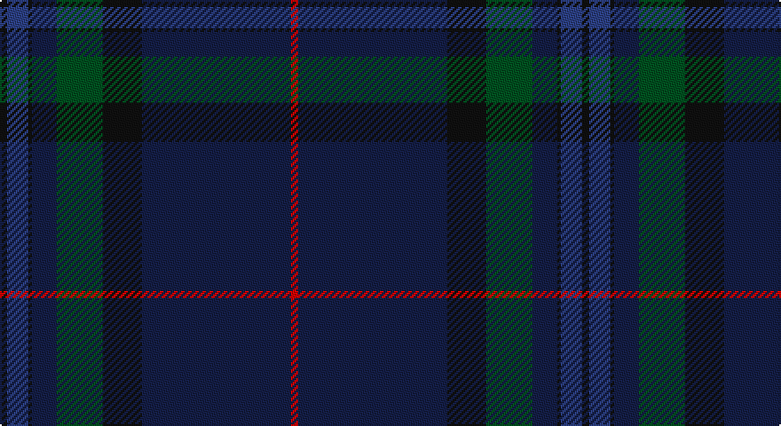

This page is one **sett** — a single exact thread-count. It belongs to the [tartan](/setts/k2dbi6k1db7dg13k11db42r2/)
(the same proportion at any scale), whose colour order is pattern [KBKBGKBR](/stripes/kbkbgkbr/).

Sourced from register-of-tartans.  It is a [8 stripe tartan](/stripes/stripes8/).

Original link https://www.tartanregister.gov.uk/tartanDetails.aspx?ref=5103

## Register references

External register numbers recorded for this tartan.

- Scottish Register of Tartans: [5103](https://www.tartanregister.gov.uk/tartanDetails.aspx?ref=5103)
- Scottish Tartans World Register: 3060

## Thread count
K/4 B12 K2 DB14 G26 K22 DB84 R/4

One full sett is **328 threads**.

## Palette

Palette: <strong>Tartan Register</strong>
<table><thead><tr><th>Colour</th><th>Threads</th><th>Shade</th><th>Base</th><th>OKLCh</th></tr></thead><tbody><tr><td>K/</td><td style="text-align:right;font-variant-numeric:tabular-nums">4</td><td><code style="background-color:#101010;">#101010</code> <small style="color:#888">#101010</small></td><td>K <code style="background-color:#000000;">#000000</code></td><td><small style="color:#888">oklch(17.3% 0.000 89.9)</small></td></tr><tr><td>B</td><td style="text-align:right;font-variant-numeric:tabular-nums">12</td><td><code style="background-color:#2C4084;">#2C4084</code> <small style="color:#888">#2C4084</small></td><td>B <code style="background-color:#2A418A;">#2A418A</code></td><td><small style="color:#888">oklch(39.4% 0.117 268.3)</small></td></tr><tr><td>K</td><td style="text-align:right;font-variant-numeric:tabular-nums">2</td><td><code style="background-color:#101010;">#101010</code> <small style="color:#888">#101010</small></td><td>K <code style="background-color:#000000;">#000000</code></td><td><small style="color:#888">oklch(17.3% 0.000 89.9)</small></td></tr><tr><td>DB</td><td style="text-align:right;font-variant-numeric:tabular-nums">14</td><td><code style="background-color:#141E46;">#141E46</code> <small style="color:#888">#141E46</small></td><td>B <code style="background-color:#2A418A;">#2A418A</code></td><td><small style="color:#888">oklch(25.2% 0.076 269.7)</small></td></tr><tr><td>G</td><td style="text-align:right;font-variant-numeric:tabular-nums">26</td><td><code style="background-color:#005020;">#005020</code> <small style="color:#888">#005020</small></td><td>G <code style="background-color:#006100;">#006100</code></td><td><small style="color:#888">oklch(37.7% 0.105 149.6)</small></td></tr><tr><td>K</td><td style="text-align:right;font-variant-numeric:tabular-nums">22</td><td><code style="background-color:#101010;">#101010</code> <small style="color:#888">#101010</small></td><td>K <code style="background-color:#000000;">#000000</code></td><td><small style="color:#888">oklch(17.3% 0.000 89.9)</small></td></tr><tr><td>DB</td><td style="text-align:right;font-variant-numeric:tabular-nums">84</td><td><code style="background-color:#141E46;">#141E46</code> <small style="color:#888">#141E46</small></td><td>B <code style="background-color:#2A418A;">#2A418A</code></td><td><small style="color:#888">oklch(25.2% 0.076 269.7)</small></td></tr><tr><td>R/</td><td style="text-align:right;font-variant-numeric:tabular-nums">4</td><td><code style="background-color:#DC0000;">#DC0000</code> <small style="color:#888">#DC0000</small></td><td>R <code style="background-color:#CC0000;">#CC0000</code></td><td><small style="color:#888">oklch(56.2% 0.230 29.2)</small></td></tr></tbody></table>

# Sample pattern

## Nearest tartans

The nearest existing variants by ΔTartan distance, with this tartan at the top so the swatches line up against it.

ΔTartan

Tartan

Sett

—

<a href="/ttd/edit/#slug=k2dbi6k1db7dg13k11db42r2~x2">Scottish Heritage</a> <a class="nn-out" href="/variants/s8/k2dbi6k1db7dg13k11db42r2~x2/" title="open its dictionary page">↗</a>

0.98

<a href="/variants/s10/dt2k3dt33ki11k3dt3dp15dt4o1dt2~x2/">Scottish Thistle</a>

1.11

<a href="/ttd/edit/#slug=k4y1dp5y1k20db37y4db4~x2&amp;base=k2dbi6k1db7dg13k11db42r2~x2">Finnie (Personal)</a> <a class="nn-out" href="/variants/s8/k4y1dp5y1k20db37y4db4~x2/" title="open its dictionary page">↗</a>

1.18

<a href="/variants/s8/k9dg5w1dg15ki2dg1ki44r1~x2/">Ata?, H.M. &amp; I.C. (Personal)</a>

1.45

<a href="/ttd/edit/#slug=dt19k4dt4db1dt1db1dt1dg5dp3k1dp4~x6&amp;base=k2dbi6k1db7dg13k11db42r2~x2">Spirit of Scotland</a> <a class="nn-out" href="/variants/s11/dt19k4dt4db1dt1db1dt1dg5dp3k1dp4~x6/" title="open its dictionary page">↗</a>

1.46

<a href="/ttd/edit/#slug=dt3k53dt4k4dt4k4dt24db10dt1r1&amp;base=k2dbi6k1db7dg13k11db42r2~x2">Comme Ça Il Principe</a> <a class="nn-out" href="/variants/s10/dt3k53dt4k4dt4k4dt24db10dt1r1/" title="open its dictionary page">↗</a>

1.55

<a href="/ttd/edit/#slug=db50dg26k9dg4w2r2dg10~x2&amp;base=k2dbi6k1db7dg13k11db42r2~x2">Java St Andrew Society hunting</a> <a class="nn-out" href="/variants/s7/db50dg26k9dg4w2r2dg10~x2/" title="open its dictionary page">↗</a>

1.61

<a href="/ttd/edit/#slug=k3t1k32db6k4db16k3r2~x2&amp;base=k2dbi6k1db7dg13k11db42r2~x2">Little of Morton Rigg Red (Personal)</a> <a class="nn-out" href="/variants/s8/k3t1k32db6k4db16k3r2~x2/" title="open its dictionary page">↗</a>

1.65

<a href="/ttd/edit/#slug=k1y3db3do28db36y1~x2&amp;base=k2dbi6k1db7dg13k11db42r2~x2">Potts (Personal)</a> <a class="nn-out" href="/variants/s6/k1y3db3do28db36y1~x2/" title="open its dictionary page">↗</a>

1.66

<a href="/ttd/edit/#slug=dg36k52lo2k8dg8dy8lo2dy6dg36r1~x2&amp;base=k2dbi6k1db7dg13k11db42r2~x2">Grenauld</a> <a class="nn-out" href="/variants/s10/dg36k52lo2k8dg8dy8lo2dy6dg36r1~x2/" title="open its dictionary page">↗</a>

1.72

<a href="/variants/s5/dt62o4dy10dyi3dg21~x2/">McGovern (2016)</a>

## Neighbour map

Every grey dot is one of 14360 variants placed by the first two principal components of the ΔTartan feature space (44% of its variance). Red is this tartan; blue dots are its nearest — click one to open its page.

<svg viewBox="0 0 640 380" role="img" style="max-width:100%;height:auto;border:1px solid #e0e0e0;border-radius:4px;display:block" xmlns="http://www.w3.org/2000/svg"><image href="/nn/cloud.v1.png" width="640" height="380"/><a href="/variants/s10/dt2k3dt33ki11k3dt3dp15dt4o1dt2~x2/"><circle cx="458.5" cy="186.2" r="4" fill="#3465a4"><title>Scottish Thistle</title></circle></a><a href="/variants/s8/k4y1dp5y1k20db37y4db4~x2/"><circle cx="466.6" cy="197.6" r="4" fill="#3465a4"><title>Finnie (Personal)</title></circle></a><a href="/variants/s8/k9dg5w1dg15ki2dg1ki44r1~x2/"><circle cx="488.7" cy="169.7" r="4" fill="#3465a4"><title>Ata?, H.M. &amp; I.C. (Personal)</title></circle></a><a href="/variants/s11/dt19k4dt4db1dt1db1dt1dg5dp3k1dp4~x6/"><circle cx="419.0" cy="192.1" r="4" fill="#3465a4"><title>Spirit of Scotland</title></circle></a><a href="/variants/s10/dt3k53dt4k4dt4k4dt24db10dt1r1/"><circle cx="526.6" cy="181.4" r="4" fill="#3465a4"><title>Comme Ça Il Principe</title></circle></a><a href="/variants/s7/db50dg26k9dg4w2r2dg10~x2/"><circle cx="381.7" cy="196.4" r="4" fill="#3465a4"><title>Java St Andrew Society hunting</title></circle></a><a href="/variants/s8/k3t1k32db6k4db16k3r2~x2/"><circle cx="539.4" cy="215.6" r="4" fill="#3465a4"><title>Little of Morton Rigg Red (Personal)</title></circle></a><a href="/variants/s6/k1y3db3do28db36y1~x2/"><circle cx="472.5" cy="197.6" r="4" fill="#3465a4"><title>Potts (Personal)</title></circle></a><a href="/variants/s10/dg36k52lo2k8dg8dy8lo2dy6dg36r1~x2/"><circle cx="432.4" cy="170.4" r="4" fill="#3465a4"><title>Grenauld</title></circle></a><a href="/variants/s5/dt62o4dy10dyi3dg21~x2/"><circle cx="472.0" cy="233.4" r="4" fill="#3465a4"><title>McGovern (2016)</title></circle></a><circle cx="461.6" cy="178.8" r="5" fill="#c00000"/></svg>

ID: /variants/s8/k2dbi6k1db7dg13k11db42r2~x2/
