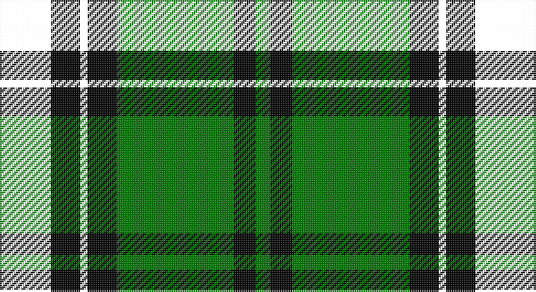

This page is one **sett** — a single exact thread-count. It belongs to the [tartan](/setts/k2k5ki4k1ki4g16ki3g2/)
(the same proportion at any scale), whose colour order is pattern [GKGKKKKK](/stripes/gkgkkkkk/).

Part of the [Arundel County](/tartans/arundel-county/) tartan — the named design grouping this sett with its other cloths.

Sourced from tartans-authority.  It is a [8 stripe tartan](/stripes/stripes8/).

Original link http://www.tartansauthority.com/tartan-ferret/display/4149/

## Register references

External register numbers recorded for this tartan.

- Scottish Tartans Authority (ITI): 4149

## Thread count
R/8 A20 K16 Y4 K16 G64 K12 Ga/8

One full sett is **280 threads**.

## Palette

Palette: <strong>Tartan Register</strong>
<table><thead><tr><th>Colour</th><th>Threads</th><th>Shade</th><th>Base</th><th>OKLCh</th></tr></thead><tbody><tr><td>/</td><td style="text-align:right;font-variant-numeric:tabular-nums">8</td><td><code style="background-color:;"></code> <small style="color:#888"></small></td><td> <code style="background-color:;"></code></td><td><small style="color:#888"></small></td></tr><tr><td></td><td style="text-align:right;font-variant-numeric:tabular-nums">20</td><td><code style="background-color:;"></code> <small style="color:#888"></small></td><td> <code style="background-color:;"></code></td><td><small style="color:#888"></small></td></tr><tr><td>K</td><td style="text-align:right;font-variant-numeric:tabular-nums">16</td><td><code style="background-color:#000000;">#000000</code> <small style="color:#888">#000000</small></td><td>K <code style="background-color:#000000;">#000000</code></td><td><small style="color:#888">oklch(0.0% 0.000 0.0)</small></td></tr><tr><td></td><td style="text-align:right;font-variant-numeric:tabular-nums">4</td><td><code style="background-color:;"></code> <small style="color:#888"></small></td><td> <code style="background-color:;"></code></td><td><small style="color:#888"></small></td></tr><tr><td>K</td><td style="text-align:right;font-variant-numeric:tabular-nums">16</td><td><code style="background-color:#000000;">#000000</code> <small style="color:#888">#000000</small></td><td>K <code style="background-color:#000000;">#000000</code></td><td><small style="color:#888">oklch(0.0% 0.000 0.0)</small></td></tr><tr><td>G</td><td style="text-align:right;font-variant-numeric:tabular-nums">64</td><td><code style="background-color:#007800;">#007800</code> <small style="color:#888">#007800</small></td><td>G <code style="background-color:#006100;">#006100</code></td><td><small style="color:#888">oklch(49.6% 0.169 142.5)</small></td></tr><tr><td>K</td><td style="text-align:right;font-variant-numeric:tabular-nums">12</td><td><code style="background-color:#000000;">#000000</code> <small style="color:#888">#000000</small></td><td>K <code style="background-color:#000000;">#000000</code></td><td><small style="color:#888">oklch(0.0% 0.000 0.0)</small></td></tr><tr><td>Ga/</td><td style="text-align:right;font-variant-numeric:tabular-nums">8</td><td><code style="background-color:#007800;">#007800</code> <small style="color:#888">#007800</small></td><td>G <code style="background-color:#006100;">#006100</code></td><td><small style="color:#888">oklch(49.6% 0.169 142.5)</small></td></tr></tbody></table>

# Sample pattern

## Compared to the master

This cloth is one sett of its design; the master sett (the exemplar the design is anchored on) is below for comparison.

<figure style="margin:0"><figcaption style="color:#888;font-size:smaller">this sett</figcaption></figure>
<figure style="margin:0"><figcaption style="color:#888;font-size:smaller"><a href="/setts/r2t5k4lo1k4db16k3g2/">master sett →</a></figcaption></figure>

## Nearest tartans

The nearest existing variants by ΔTartan distance, with this tartan at the top so the swatches line up against it.

ΔTartan

Tartan

Sett

—

<a href="/ttd/edit/#slug=k2k5ki4k1ki4g16ki3g2~x4">Arundel County (District)</a> <a class="nn-out" href="/variants/s8/k2k5ki4k1ki4g16ki3g2~x4/" title="open its dictionary page">↗</a>

1.27

<a href="/ttd/edit/#slug=w5k26ly2dg24db8k4r3~x2&amp;base=k2k5ki4k1ki4g16ki3g2~x4">Cornish Htg (District)</a> <a class="nn-out" href="/variants/s7/w5k26ly2dg24db8k4r3~x2/" title="open its dictionary page">↗</a>

1.31

<a href="/variants/s7/w5k26ly2dg24ki7k3r3~x2/">Cornish, hunting</a>

1.37

<a href="/ttd/edit/#slug=g32r3dy12b3ly3b3k24k24lb2k4~x2&amp;base=k2k5ki4k1ki4g16ki3g2~x4">Webster</a> <a class="nn-out" href="/variants/s10/g32r3dy12b3ly3b3k24k24lb2k4~x2/" title="open its dictionary page">↗</a>

1.43

<a href="/ttd/edit/#slug=k12r1g14w1g14k14r1db8k2~x2&amp;base=k2k5ki4k1ki4g16ki3g2~x4">Abercrombie</a> <a class="nn-out" href="/variants/s9/k12r1g14w1g14k14r1db8k2~x2/" title="open its dictionary page">↗</a>

1.45

<a href="/ttd/edit/#slug=k14r2k2r2k2g18r2g18lb1db12t1r8~x2&amp;base=k2k5ki4k1ki4g16ki3g2~x4">Princess Diana</a> <a class="nn-out" href="/variants/s12/k14r2k2r2k2g18r2g18lb1db12t1r8~x2/" title="open its dictionary page">↗</a>

1.48

<a href="/ttd/edit/#slug=k26ly2dg24db8k4r3k4db8dg24ly2k26w5~x2&amp;base=k2k5ki4k1ki4g16ki3g2~x4">Cornish Hunting</a> <a class="nn-out" href="/variants/s12/k26ly2dg24db8k4r3k4db8dg24ly2k26w5~x2/" title="open its dictionary page">↗</a>

1.50

<a href="/ttd/edit/#slug=dg6g3dg24k2dg4k16o5dg2w4dg2g21dg2k2ly3~x2&amp;base=k2k5ki4k1ki4g16ki3g2~x4">Celtic F.C.</a> <a class="nn-out" href="/variants/s14/dg6g3dg24k2dg4k16o5dg2w4dg2g21dg2k2ly3~x2/" title="open its dictionary page">↗</a>

1.54

<a href="/ttd/edit/#slug=r3w2dy10dg37k12db21w2~x2&amp;base=k2k5ki4k1ki4g16ki3g2~x4">Jones, The</a> <a class="nn-out" href="/variants/s7/r3w2dy10dg37k12db21w2~x2/" title="open its dictionary page">↗</a>

1.56

<a href="/ttd/edit/#slug=r3k11dg29k28g19ly2b1~x2&amp;base=k2k5ki4k1ki4g16ki3g2~x4">PMMC</a> <a class="nn-out" href="/variants/s7/r3k11dg29k28g19ly2b1~x2/" title="open its dictionary page">↗</a>

1.57

<a href="/ttd/edit/#slug=k6g20t2r5t2k20ly3db20g26r3db5~x2&amp;base=k2k5ki4k1ki4g16ki3g2~x4">Stephenson</a> <a class="nn-out" href="/variants/s11/k6g20t2r5t2k20ly3db20g26r3db5~x2/" title="open its dictionary page">↗</a>

## Neighbour map

Every grey dot is one of 14360 variants placed by the first two principal components of the ΔTartan feature space (44% of its variance). Red is this tartan; blue dots are its nearest — click one to open its page.

<svg viewBox="0 0 640 380" role="img" style="max-width:100%;height:auto;border:1px solid #e0e0e0;border-radius:4px;display:block" xmlns="http://www.w3.org/2000/svg"><image href="/nn/cloud.v1.png" width="640" height="380"/><a href="/variants/s7/w5k26ly2dg24db8k4r3~x2/"><circle cx="165.7" cy="156.6" r="4" fill="#3465a4"><title>Cornish Htg (District)</title></circle></a><a href="/variants/s7/w5k26ly2dg24ki7k3r3~x2/"><circle cx="175.7" cy="156.8" r="4" fill="#3465a4"><title>Cornish, hunting</title></circle></a><a href="/variants/s10/g32r3dy12b3ly3b3k24k24lb2k4~x2/"><circle cx="176.7" cy="113.9" r="4" fill="#3465a4"><title>Webster</title></circle></a><a href="/variants/s9/k12r1g14w1g14k14r1db8k2~x2/"><circle cx="187.8" cy="172.2" r="4" fill="#3465a4"><title>Abercrombie</title></circle></a><a href="/variants/s12/k14r2k2r2k2g18r2g18lb1db12t1r8~x2/"><circle cx="175.8" cy="118.3" r="4" fill="#3465a4"><title>Princess Diana</title></circle></a><a href="/variants/s12/k26ly2dg24db8k4r3k4db8dg24ly2k26w5~x2/"><circle cx="178.2" cy="145.6" r="4" fill="#3465a4"><title>Cornish Hunting</title></circle></a><a href="/variants/s14/dg6g3dg24k2dg4k16o5dg2w4dg2g21dg2k2ly3~x2/"><circle cx="154.9" cy="122.4" r="4" fill="#3465a4"><title>Celtic F.C.</title></circle></a><a href="/variants/s7/r3w2dy10dg37k12db21w2~x2/"><circle cx="199.2" cy="154.6" r="4" fill="#3465a4"><title>Jones, The</title></circle></a><a href="/variants/s7/r3k11dg29k28g19ly2b1~x2/"><circle cx="212.5" cy="142.4" r="4" fill="#3465a4"><title>PMMC</title></circle></a><a href="/variants/s11/k6g20t2r5t2k20ly3db20g26r3db5~x2/"><circle cx="139.9" cy="138.1" r="4" fill="#3465a4"><title>Stephenson</title></circle></a><circle cx="181.8" cy="148.7" r="5" fill="#c00000"/></svg>

ID: /variants/s8/k2k5ki4k1ki4g16ki3g2~x4/
