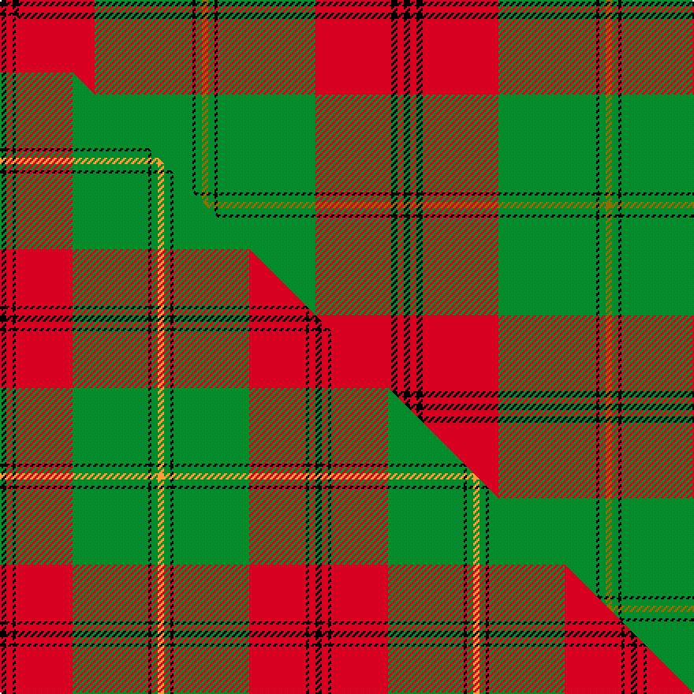

This page is one **sett** — a single exact thread-count. It belongs to the [tartan](/setts/k2r2k2r24g31k1g2y2/)
(the same proportion at any scale), whose colour order is pattern [GGKGRKRK](/stripes/ggkgrkrk/).

Part of the [Gleneil](/tartans/gleneil/) tartan — the named design grouping this sett with its other cloths.

Sourced from weddslist.  It is a [8 stripe tartan](/stripes/stripes8/).

Original link http://www.weddslist.com/cgi-bin/tartans/pg.pl?source=sts

Dataset <small>— provenance for this record, inherited from the source manifest</small>

<dl class="dataset-prov">
<dt>source</dt><dd><a href="/sources/weddslist/">Weddslist</a></dd>
<dt>data captured from</dt><dd><a href="https://github.com/thetartan/tartan-database/blob/master/data/weddslist/data.csv">https://github.com/thetartan/tartan-database/blob/master/data/weddslist/data.csv</a></dd>
<dt>data date</dt><dd>2016-11-17 <small>(dataset default)</small></dd>
<dt>licence</dt><dd><a href="https://creativecommons.org/licenses/by-nc-nd/4.0/">CC BY-NC-ND 4.0</a></dd>
</dl>

Capture chain <small>— the hands this data passed through, oldest first; each capture carries its own licence</small>

<ol class="capture-chain">
<li><a href="https://www.weddslist.com/tartans/">Weddslist</a> <small>the living privately compiled reference</small></li>
<li><a href="https://github.com/thetartan/tartan-database">thetartan/tartan-database</a> <small>2016-2017</small> · <a href="https://creativecommons.org/licenses/by-nc-nd/4.0/">CC BY-NC-ND 4.0</a> <small>Levko Kravets's frozen compilation — the capture we vendored, and where its CC licence text came from</small></li>
<li>this dictionary <small>captured 2026-06-10 · commit 5bf86c7566</small> <small>each re-capture is a git commit to data/sources</small></li>
</ol>

## Thread count
K/4 R4 K4 R48 G62 K2 G4 Y/4

One full sett is **256 threads**.

## Palette
<table><thead><tr><th>Colour</th><th>Shade</th><th>OKLCh</th></tr></thead><tbody><tr><td>G</td><td><code style="background-color:#008B2A;">#008B2A</code> <small style="color:#888">#008B2A</small></td><td><small style="color:#888">oklch(55.4% 0.170 145.9)</small></td></tr><tr><td>K</td><td><code style="background-color:#000000;">#000000</code> <small style="color:#888">#000000</small></td><td><small style="color:#888">oklch(0.0% 0.000 0.0)</small></td></tr><tr><td>R</td><td><code style="background-color:#D60020;">#D60020</code> <small style="color:#888">#D60020</small></td><td><small style="color:#888">oklch(55.2% 0.224 25.5)</small></td></tr><tr><td>Y</td><td><code style="background-color:#8B6E00;">#8B6E00</code> <small style="color:#888">#8B6E00</small></td><td><small style="color:#888">oklch(55.1% 0.113 90.4)</small></td></tr></tbody></table>

# Sample pattern

## Compared to the master

This cloth is one sett of its design; the master sett (the exemplar the design is anchored on) is below for comparison.

Its **ΔTartan distance** from the master is **0.59** — the same measure the nearest-tartans table ranks by (0 is identical; a re-scale of the same cloth is near 0, a recolour or a different proportion further).

<figure class="master-compare" style="margin:0">

this sett
master sett ★

<figcaption style="color:#888;font-size:smaller">One weave of this sett against the <a href="/setts/k2r2k1r18g24k1g2lo2/">master sett ★</a>, split on the diagonal: a shared proportion runs seamlessly across it with only the shades shifting; a different proportion breaks on it.</figcaption>
</figure>

## Nearest tartan variants

The nearest existing variants by ΔTartan distance, with this cloth at the top so the swatches line up against it.

ΔTartan

Threads

Variant

Sett

—

256

<a href="/variants/s8/k2r2k2r24g31k1g2y2~x2/">Gleneil</a>

<a href="/ttd/edit/#slug=k2r2k1r18g24k1g2lo2~x2&amp;base=k2r2k2r24g31k1g2y2~x2" title="compare in the TTD">0.59</a>

200

<a href="/variants/s8/k2r2k1r18g24k1g2lo2~x2/">Gleneil (Spoof)</a>

<a href="/ttd/edit/#slug=r16k3r16g44k3g8k3y20k4~x2&amp;base=k2r2k2r24g31k1g2y2~x2" title="compare in the TTD">0.97</a>

428

<a href="/variants/s9/r16k3r16g44k3g8k3y20k4~x2/">MacMillan, Society of Glasgow</a>

<a href="/ttd/edit/#slug=r16k3r16g44k3g8k3ly20k4~x2&amp;base=k2r2k2r24g31k1g2y2~x2" title="compare in the TTD">0.97</a>

428

<a href="/variants/s9/r16k3r16g44k3g8k3ly20k4~x2/">MacMillan Society of Glasgow</a>

<a href="/ttd/edit/#slug=w5g1w1g33y3r24g3r4~x2&amp;base=k2r2k2r24g31k1g2y2~x2" title="compare in the TTD">2.26</a>

278

<a href="/variants/s8/w5g1w1g33y3r24g3r4~x2/">Sutherland de Albergaria Dress (Personal)</a>

<a href="/ttd/edit/#slug=r25k7r3g13y1k2~x4&amp;base=k2r2k2r24g31k1g2y2~x2" title="compare in the TTD">2.40</a>

300

<a href="/variants/s6/r25k7r3g13y1k2~x4/">MacPhail</a>

<a href="/ttd/edit/#slug=g36k2g2k2g3k12lb10r20~x2&amp;base=k2r2k2r24g31k1g2y2~x2" title="compare in the TTD">2.45</a>

236

<a href="/variants/s8/g36k2g2k2g3k12lb10r20~x2/">Georgia, State of</a>

<a href="/ttd/edit/#slug=y4r4k2r10g30y2g3r2~x2&amp;base=k2r2k2r24g31k1g2y2~x2" title="compare in the TTD">2.50</a>

216

<a href="/variants/s8/y4r4k2r10g30y2g3r2~x2/">Beard</a>

<a href="/ttd/edit/#slug=k1g6k1g6r16db1~x2&amp;base=k2r2k2r24g31k1g2y2~x2" title="compare in the TTD">2.52</a>

120

<a href="/variants/s6/k1g6k1g6r16db1~x2/">Denny, hunting</a>

<a href="/ttd/edit/#slug=g18w3y1r2y1r3y1r10~x4&amp;base=k2r2k2r24g31k1g2y2~x2" title="compare in the TTD">2.61</a>

200

<a href="/variants/s8/g18w3y1r2y1r3y1r10~x4/">Brisbane (Artefact)</a>

<a href="/ttd/edit/#slug=r34db4r1db4g2k3g1k3g22~x2&amp;base=k2r2k2r24g31k1g2y2~x2" title="compare in the TTD">2.64</a>

184

<a href="/variants/s9/r34db4r1db4g2k3g1k3g22~x2/">Queen of Scots</a>

## Neighbour map

Every grey dot is one of 13620 variants placed by the first two principal components of the ΔTartan feature space (42% of its variance). Red is this tartan; blue dots are its nearest — click one to open its page.

<svg viewBox="0 0 640 380" role="img" style="max-width:100%;height:auto;border:1px solid #e0e0e0;border-radius:4px;display:block" xmlns="http://www.w3.org/2000/svg"><image href="/nn/cloud.v1.png" width="640" height="380"/><a href="/variants/s8/k2r2k1r18g24k1g2lo2~x2/"><circle cx="298.6" cy="118.1" r="4" fill="#3465a4"><title>Gleneil (Spoof)</title></circle></a><a href="/variants/s9/r16k3r16g44k3g8k3y20k4~x2/"><circle cx="219.1" cy="158.1" r="4" fill="#3465a4"><title>MacMillan, Society of Glasgow</title></circle></a><a href="/variants/s9/r16k3r16g44k3g8k3ly20k4~x2/"><circle cx="200.3" cy="152.2" r="4" fill="#3465a4"><title>MacMillan Society of Glasgow</title></circle></a><a href="/variants/s8/w5g1w1g33y3r24g3r4~x2/"><circle cx="346.0" cy="134.1" r="4" fill="#3465a4"><title>Sutherland de Albergaria Dress (Personal)</title></circle></a><a href="/variants/s6/r25k7r3g13y1k2~x4/"><circle cx="291.8" cy="134.9" r="4" fill="#3465a4"><title>MacPhail</title></circle></a><a href="/variants/s8/g36k2g2k2g3k12lb10r20~x2/"><circle cx="216.5" cy="143.3" r="4" fill="#3465a4"><title>Georgia, State of</title></circle></a><a href="/variants/s8/y4r4k2r10g30y2g3r2~x2/"><circle cx="346.4" cy="152.3" r="4" fill="#3465a4"><title>Beard</title></circle></a><a href="/variants/s6/k1g6k1g6r16db1~x2/"><circle cx="299.3" cy="160.2" r="4" fill="#3465a4"><title>Denny, hunting</title></circle></a><a href="/variants/s8/g18w3y1r2y1r3y1r10~x4/"><circle cx="308.2" cy="162.3" r="4" fill="#3465a4"><title>Brisbane (Artefact)</title></circle></a><a href="/variants/s9/r34db4r1db4g2k3g1k3g22~x2/"><circle cx="283.5" cy="96.8" r="4" fill="#3465a4"><title>Queen of Scots</title></circle></a><circle cx="315.1" cy="107.3" r="5" fill="#c00000"/><text x="320" y="376" text-anchor="middle" font-size="11" fill="#999">ground</text><text x="11" y="190" text-anchor="middle" font-size="11" fill="#999" transform="rotate(-90 11 190)">complexity</text></svg>

ID: /variants/s8/k2r2k2r24g31k1g2y2~x2/
