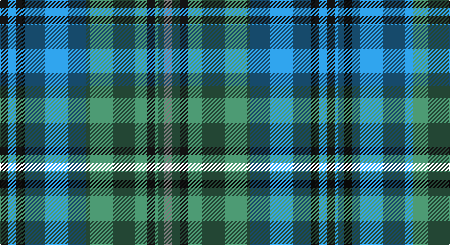

This page is one **sett** — a single exact thread-count. It belongs to the [tartan](/setts/k2t2k2t15g15k2g2w2/)
(the same proportion at any scale), whose colour order is pattern [KBKBGKGW](/stripes/kbkbgkgw/).

Part of the [Ben Lomond](/tartans/ben-lomond/) tartan — the named design grouping this sett with its other cloths.

Sourced from tartans-authority.  It is a [8 stripe tartan](/stripes/stripes8/).

Original link http://www.tartansauthority.com/tartan-ferret/display/6500/

## Register references

External register numbers recorded for this tartan.

- Scottish Tartans Authority (ITI): 6500

## Thread count
K/8 B8 K8 B60 G60 K8 G8 LN/8

One full sett is **320 threads**.

## Palette

Palette: <strong>Tartan Register</strong>
<table><thead><tr><th>Colour</th><th>Threads</th><th>Shade</th><th>Base</th><th>OKLCh</th></tr></thead><tbody><tr><td>K/</td><td style="text-align:right;font-variant-numeric:tabular-nums">8</td><td><code style="background-color:#101010;">#101010</code> <small style="color:#888">#101010</small></td><td>K <code style="background-color:#000000;">#000000</code></td><td><small style="color:#888">oklch(17.3% 0.000 89.9)</small></td></tr><tr><td>B</td><td style="text-align:right;font-variant-numeric:tabular-nums">8</td><td><code style="background-color:#2888C4;">#2888C4</code> <small style="color:#888">#2888C4</small></td><td>B <code style="background-color:#2A418A;">#2A418A</code></td><td><small style="color:#888">oklch(60.1% 0.125 241.5)</small></td></tr><tr><td>K</td><td style="text-align:right;font-variant-numeric:tabular-nums">8</td><td><code style="background-color:#101010;">#101010</code> <small style="color:#888">#101010</small></td><td>K <code style="background-color:#000000;">#000000</code></td><td><small style="color:#888">oklch(17.3% 0.000 89.9)</small></td></tr><tr><td>B</td><td style="text-align:right;font-variant-numeric:tabular-nums">60</td><td><code style="background-color:#2888C4;">#2888C4</code> <small style="color:#888">#2888C4</small></td><td>B <code style="background-color:#2A418A;">#2A418A</code></td><td><small style="color:#888">oklch(60.1% 0.125 241.5)</small></td></tr><tr><td>G</td><td style="text-align:right;font-variant-numeric:tabular-nums">60</td><td><code style="background-color:#408060;">#408060</code> <small style="color:#888">#408060</small></td><td>G <code style="background-color:#006100;">#006100</code></td><td><small style="color:#888">oklch(54.8% 0.084 160.1)</small></td></tr><tr><td>K</td><td style="text-align:right;font-variant-numeric:tabular-nums">8</td><td><code style="background-color:#101010;">#101010</code> <small style="color:#888">#101010</small></td><td>K <code style="background-color:#000000;">#000000</code></td><td><small style="color:#888">oklch(17.3% 0.000 89.9)</small></td></tr><tr><td>G</td><td style="text-align:right;font-variant-numeric:tabular-nums">8</td><td><code style="background-color:#408060;">#408060</code> <small style="color:#888">#408060</small></td><td>G <code style="background-color:#006100;">#006100</code></td><td><small style="color:#888">oklch(54.8% 0.084 160.1)</small></td></tr><tr><td>LN/</td><td style="text-align:right;font-variant-numeric:tabular-nums">8</td><td><code style="background-color:#E0E0E0;">#E0E0E0</code> <small style="color:#888">#E0E0E0</small></td><td>W <code style="background-color:#F7F7F7;">#F7F7F7</code></td><td><small style="color:#888">oklch(90.7% 0.000 89.9)</small></td></tr></tbody></table>

# Sample pattern

## Nearest tartans

The nearest existing variants by ΔTartan distance, with this tartan at the top so the swatches line up against it.

ΔTartan

Tartan

Sett

—

<a href="/ttd/edit/#slug=k2t2k2t15g15k2g2w2~x4">Ben Lomond (Fashion)</a> <a class="nn-out" href="/variants/s8/k2t2k2t15g15k2g2w2~x4/" title="open its dictionary page">↗</a>

1.14

<a href="/ttd/edit/#slug=b12lo1b2lo1b3k5g10lo1g2~x4&amp;base=k2t2k2t15g15k2g2w2~x4">Marie Curie Fields Of Hope</a> <a class="nn-out" href="/variants/s9/b12lo1b2lo1b3k5g10lo1g2~x4/" title="open its dictionary page">↗</a>

1.20

<a href="/ttd/edit/#slug=r3g1k1g12b12k1b1k1~x4&amp;base=k2t2k2t15g15k2g2w2~x4">Peter of Lee (Personal)</a> <a class="nn-out" href="/variants/s8/r3g1k1g12b12k1b1k1~x4/" title="open its dictionary page">↗</a>

1.21

<a href="/ttd/edit/#slug=r3b25k16b3g25b3~x2&amp;base=k2t2k2t15g15k2g2w2~x4">Flower of Scotland</a> <a class="nn-out" href="/variants/s6/r3b25k16b3g25b3~x2/" title="open its dictionary page">↗</a>

1.27

<a href="/ttd/edit/#slug=k1t1k1t7y7k1y1lb1~x6&amp;base=k2t2k2t15g15k2g2w2~x4">Auld Lang Syne (Philip King Tailoring)</a> <a class="nn-out" href="/variants/s8/k1t1k1t7y7k1y1lb1~x6/" title="open its dictionary page">↗</a>

1.28

<a href="/ttd/edit/#slug=g5mi3g32k16b32m3b5~x2&amp;base=k2t2k2t15g15k2g2w2~x4">MacThomas</a> <a class="nn-out" href="/variants/s7/g5mi3g32k16b32m3b5~x2/" title="open its dictionary page">↗</a>

1.29

<a href="/ttd/edit/#slug=b29db8g21r3g8b11w3db3w3g8~x2&amp;base=k2t2k2t15g15k2g2w2~x4">Morneau, Richard (Personal)</a> <a class="nn-out" href="/variants/s10/b29db8g21r3g8b11w3db3w3g8~x2/" title="open its dictionary page">↗</a>

1.30

<a href="/ttd/edit/#slug=db22g4k4g14lb3g4lb3g4k3~x2&amp;base=k2t2k2t15g15k2g2w2~x4">Graden (Personal)</a> <a class="nn-out" href="/variants/s9/db22g4k4g14lb3g4lb3g4k3~x2/" title="open its dictionary page">↗</a>

1.35

<a href="/ttd/edit/#slug=r1o1m1o7dg7m1dg1m1~x6&amp;base=k2t2k2t15g15k2g2w2~x4">Beck-McSorley</a> <a class="nn-out" href="/variants/s8/r1o1m1o7dg7m1dg1m1~x6/" title="open its dictionary page">↗</a>

1.37

<a href="/ttd/edit/#slug=g11r4g4r7g41db11t4db41r4db8&amp;base=k2t2k2t15g15k2g2w2~x4">Stewart of Appin 2</a> <a class="nn-out" href="/variants/s10/g11r4g4r7g41db11t4db41r4db8/" title="open its dictionary page">↗</a>

1.38

<a href="/ttd/edit/#slug=db22g3db3g3db3g9o28g3o6~x2&amp;base=k2t2k2t15g15k2g2w2~x4">Manx Centenary District Tartan</a> <a class="nn-out" href="/variants/s9/db22g3db3g3db3g9o28g3o6~x2/" title="open its dictionary page">↗</a>

## Neighbour map

Every grey dot is one of 14360 variants placed by the first two principal components of the ΔTartan feature space (44% of its variance). Red is this tartan; blue dots are its nearest — click one to open its page.

<svg viewBox="0 0 640 380" role="img" style="max-width:100%;height:auto;border:1px solid #e0e0e0;border-radius:4px;display:block" xmlns="http://www.w3.org/2000/svg"><image href="/nn/cloud.v1.png" width="640" height="380"/><a href="/variants/s9/b12lo1b2lo1b3k5g10lo1g2~x4/"><circle cx="254.1" cy="193.5" r="4" fill="#3465a4"><title>Marie Curie Fields Of Hope</title></circle></a><a href="/variants/s8/r3g1k1g12b12k1b1k1~x4/"><circle cx="282.2" cy="193.1" r="4" fill="#3465a4"><title>Peter of Lee (Personal)</title></circle></a><a href="/variants/s6/r3b25k16b3g25b3~x2/"><circle cx="210.3" cy="231.2" r="4" fill="#3465a4"><title>Flower of Scotland</title></circle></a><a href="/variants/s8/k1t1k1t7y7k1y1lb1~x6/"><circle cx="234.0" cy="203.4" r="4" fill="#3465a4"><title>Auld Lang Syne (Philip King Tailoring)</title></circle></a><a href="/variants/s7/g5mi3g32k16b32m3b5~x2/"><circle cx="212.0" cy="199.5" r="4" fill="#3465a4"><title>MacThomas</title></circle></a><a href="/variants/s10/b29db8g21r3g8b11w3db3w3g8~x2/"><circle cx="195.0" cy="184.1" r="4" fill="#3465a4"><title>Morneau, Richard (Personal)</title></circle></a><a href="/variants/s9/db22g4k4g14lb3g4lb3g4k3~x2/"><circle cx="217.0" cy="209.9" r="4" fill="#3465a4"><title>Graden (Personal)</title></circle></a><a href="/variants/s8/r1o1m1o7dg7m1dg1m1~x6/"><circle cx="235.4" cy="204.3" r="4" fill="#3465a4"><title>Beck-McSorley</title></circle></a><a href="/variants/s10/g11r4g4r7g41db11t4db41r4db8/"><circle cx="277.7" cy="192.1" r="4" fill="#3465a4"><title>Stewart of Appin 2</title></circle></a><a href="/variants/s9/db22g3db3g3db3g9o28g3o6~x2/"><circle cx="278.6" cy="215.9" r="4" fill="#3465a4"><title>Manx Centenary District Tartan</title></circle></a><circle cx="232.9" cy="204.6" r="5" fill="#c00000"/></svg>

ID: /variants/s8/k2t2k2t15g15k2g2w2~x4/
