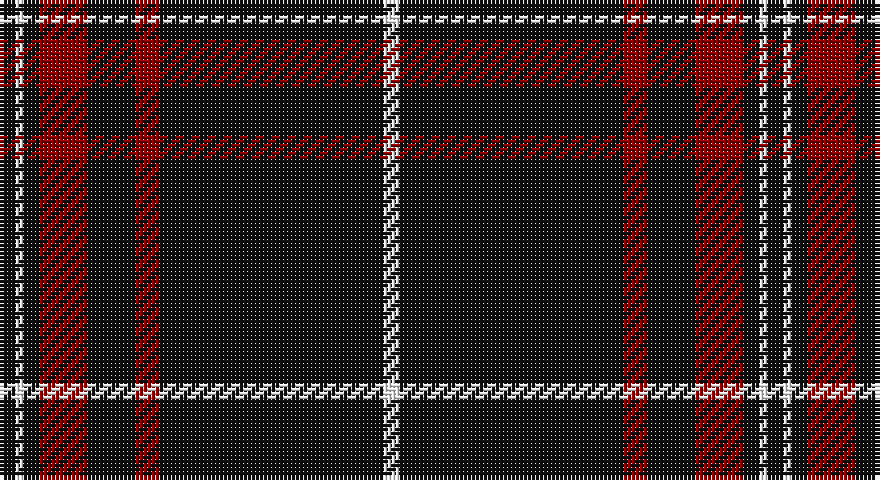

This page is one **sett** — a single exact thread-count. It belongs to the [tartan](/setts/k2w1k2r6k6r3k28w2/)
(the same proportion at any scale), whose colour order is pattern [KWKRKRKW](/stripes/kwkrkrkw/).

Sourced from register-of-tartans.  It is a [8 stripe tartan](/stripes/stripes8/).

Original link https://www.tartanregister.gov.uk/tartanDetails.aspx?ref=366

2 attestations — the source records this cloth was collapsed from (oldest owns this page)

<ul>
<li>01/10/2004 — Brockton (register-of-tartans, <a href="https://www.tartanregister.gov.uk/tartanDetails.aspx?ref=366">record</a>)</li>
<li>2004, October — Brockton (Corporate) (tartans-authority, <a href="http://www.tartansauthority.com/tartan-ferret/display/6444/">record</a>)</li>
</ul>

## Register references

External register numbers recorded for this tartan.

- Scottish Register of Tartans: [366](https://www.tartanregister.gov.uk/tartanDetails.aspx?ref=366)
- Scottish Tartans Authority (ITI): 6444

## Thread count
K/4 W2 K4 DR12 K12 DR6 K56 W/4

One full sett is **192 threads**.

## Palette

Palette: <strong>Tartan Register</strong>
<table><thead><tr><th>Colour</th><th>Threads</th><th>Shade</th><th>Base</th><th>OKLCh</th></tr></thead><tbody><tr><td>K/</td><td style="text-align:right;font-variant-numeric:tabular-nums">4</td><td><code style="background-color:#101010;">#101010</code> <small style="color:#888">#101010</small></td><td>K <code style="background-color:#000000;">#000000</code></td><td><small style="color:#888">oklch(17.3% 0.000 89.9)</small></td></tr><tr><td>W</td><td style="text-align:right;font-variant-numeric:tabular-nums">2</td><td><code style="background-color:#FFFFFF;">#FFFFFF</code> <small style="color:#888">#FFFFFF</small></td><td>W <code style="background-color:#F7F7F7;">#F7F7F7</code></td><td><small style="color:#888">oklch(100.0% 0.000 89.9)</small></td></tr><tr><td>K</td><td style="text-align:right;font-variant-numeric:tabular-nums">4</td><td><code style="background-color:#101010;">#101010</code> <small style="color:#888">#101010</small></td><td>K <code style="background-color:#000000;">#000000</code></td><td><small style="color:#888">oklch(17.3% 0.000 89.9)</small></td></tr><tr><td>DR</td><td style="text-align:right;font-variant-numeric:tabular-nums">12</td><td><code style="background-color:#880000;">#880000</code> <small style="color:#888">#880000</small></td><td>R <code style="background-color:#CC0000;">#CC0000</code></td><td><small style="color:#888">oklch(39.4% 0.162 29.2)</small></td></tr><tr><td>K</td><td style="text-align:right;font-variant-numeric:tabular-nums">12</td><td><code style="background-color:#101010;">#101010</code> <small style="color:#888">#101010</small></td><td>K <code style="background-color:#000000;">#000000</code></td><td><small style="color:#888">oklch(17.3% 0.000 89.9)</small></td></tr><tr><td>DR</td><td style="text-align:right;font-variant-numeric:tabular-nums">6</td><td><code style="background-color:#880000;">#880000</code> <small style="color:#888">#880000</small></td><td>R <code style="background-color:#CC0000;">#CC0000</code></td><td><small style="color:#888">oklch(39.4% 0.162 29.2)</small></td></tr><tr><td>K</td><td style="text-align:right;font-variant-numeric:tabular-nums">56</td><td><code style="background-color:#101010;">#101010</code> <small style="color:#888">#101010</small></td><td>K <code style="background-color:#000000;">#000000</code></td><td><small style="color:#888">oklch(17.3% 0.000 89.9)</small></td></tr><tr><td>W/</td><td style="text-align:right;font-variant-numeric:tabular-nums">4</td><td><code style="background-color:#FFFFFF;">#FFFFFF</code> <small style="color:#888">#FFFFFF</small></td><td>W <code style="background-color:#F7F7F7;">#F7F7F7</code></td><td><small style="color:#888">oklch(100.0% 0.000 89.9)</small></td></tr></tbody></table>

# Sample pattern

## Nearest tartans

The nearest existing variants by ΔTartan distance, with this tartan at the top so the swatches line up against it.

ΔTartan

Tartan

Sett

—

<a href="/ttd/edit/#slug=k2w1k2r6k6r3k28w2~x2">Brockton</a> <a class="nn-out" href="/variants/s8/k2w1k2r6k6r3k28w2~x2/" title="open its dictionary page">↗</a>

0.56

<a href="/ttd/edit/#slug=k59r3k6r3k8r15k2ly3~x2&amp;base=k2w1k2r6k6r3k28w2~x2">Royal Army PTC Assoc. (Military)</a> <a class="nn-out" href="/variants/s8/k59r3k6r3k8r15k2ly3~x2/" title="open its dictionary page">↗</a>

1.11

<a href="/ttd/edit/#slug=k50w4k10r2k2w2r2k14r11k2r4w2~x2&amp;base=k2w1k2r6k6r3k28w2~x2">Knights Templar Dress (Corporate)</a> <a class="nn-out" href="/variants/s12/k50w4k10r2k2w2r2k14r11k2r4w2~x2/" title="open its dictionary page">↗</a>

1.13

<a href="/ttd/edit/#slug=r7k3r3k22r3k3r3k37ly2k4~x2&amp;base=k2w1k2r6k6r3k28w2~x2">Maier (Personal)</a> <a class="nn-out" href="/variants/s10/r7k3r3k22r3k3r3k37ly2k4~x2/" title="open its dictionary page">↗</a>

1.18

<a href="/ttd/edit/#slug=r1k9o5k3o5k21o1~x4&amp;base=k2w1k2r6k6r3k28w2~x2">Sunderland of Scotland (Fashion)</a> <a class="nn-out" href="/variants/s7/r1k9o5k3o5k21o1~x4/" title="open its dictionary page">↗</a>

1.20

<a href="/ttd/edit/#slug=k10y5k2y5k10w1k26w1y4w1k5w1~x2&amp;base=k2w1k2r6k6r3k28w2~x2">Clergy #3</a> <a class="nn-out" href="/variants/s12/k10y5k2y5k10w1k26w1y4w1k5w1~x2/" title="open its dictionary page">↗</a>

1.25

<a href="/ttd/edit/#slug=k48r4k2r4k6r2k3r9~x2&amp;base=k2w1k2r6k6r3k28w2~x2">Menzies Hunting</a> <a class="nn-out" href="/variants/s8/k48r4k2r4k6r2k3r9~x2/" title="open its dictionary page">↗</a>

1.26

<a href="/ttd/edit/#slug=r4k16w4k16r4k42r20k83r2&amp;base=k2w1k2r6k6r3k28w2~x2">Brand Ambassador</a> <a class="nn-out" href="/variants/s9/r4k16w4k16r4k42r20k83r2/" title="open its dictionary page">↗</a>

1.28

<a href="/ttd/edit/#slug=k60r3k15r3lb2r5b3r2~x2&amp;base=k2w1k2r6k6r3k28w2~x2">Whitaker (2014)</a> <a class="nn-out" href="/variants/s8/k60r3k15r3lb2r5b3r2~x2/" title="open its dictionary page">↗</a>

1.28

<a href="/ttd/edit/#slug=k4r11k32ly1k4~x2&amp;base=k2w1k2r6k6r3k28w2~x2">Harvie</a> <a class="nn-out" href="/variants/s5/k4r11k32ly1k4~x2/" title="open its dictionary page">↗</a>

1.29

<a href="/ttd/edit/#slug=k38lo1w7lo1k4lo2k3lo2~x2&amp;base=k2w1k2r6k6r3k28w2~x2">Erck, Georges van (Personal),</a> <a class="nn-out" href="/variants/s8/k38lo1w7lo1k4lo2k3lo2~x2/" title="open its dictionary page">↗</a>

## Neighbour map

Every grey dot is one of 14360 variants placed by the first two principal components of the ΔTartan feature space (44% of its variance). Red is this tartan; blue dots are its nearest — click one to open its page.

<svg viewBox="0 0 640 380" role="img" style="max-width:100%;height:auto;border:1px solid #e0e0e0;border-radius:4px;display:block" xmlns="http://www.w3.org/2000/svg"><image href="/nn/cloud.v1.png" width="640" height="380"/><a href="/variants/s8/k59r3k6r3k8r15k2ly3~x2/"><circle cx="538.9" cy="149.5" r="4" fill="#3465a4"><title>Royal Army PTC Assoc. (Military)</title></circle></a><a href="/variants/s12/k50w4k10r2k2w2r2k14r11k2r4w2~x2/"><circle cx="486.4" cy="124.8" r="4" fill="#3465a4"><title>Knights Templar Dress (Corporate)</title></circle></a><a href="/variants/s10/r7k3r3k22r3k3r3k37ly2k4~x2/"><circle cx="541.7" cy="172.7" r="4" fill="#3465a4"><title>Maier (Personal)</title></circle></a><a href="/variants/s7/r1k9o5k3o5k21o1~x4/"><circle cx="479.2" cy="194.8" r="4" fill="#3465a4"><title>Sunderland of Scotland (Fashion)</title></circle></a><a href="/variants/s12/k10y5k2y5k10w1k26w1y4w1k5w1~x2/"><circle cx="478.2" cy="150.8" r="4" fill="#3465a4"><title>Clergy #3</title></circle></a><a href="/variants/s8/k48r4k2r4k6r2k3r9~x2/"><circle cx="566.0" cy="175.5" r="4" fill="#3465a4"><title>Menzies Hunting</title></circle></a><a href="/variants/s9/r4k16w4k16r4k42r20k83r2/"><circle cx="573.0" cy="146.4" r="4" fill="#3465a4"><title>Brand Ambassador</title></circle></a><a href="/variants/s8/k60r3k15r3lb2r5b3r2~x2/"><circle cx="567.0" cy="133.7" r="4" fill="#3465a4"><title>Whitaker (2014)</title></circle></a><a href="/variants/s5/k4r11k32ly1k4~x2/"><circle cx="538.5" cy="185.6" r="4" fill="#3465a4"><title>Harvie</title></circle></a><a href="/variants/s8/k38lo1w7lo1k4lo2k3lo2~x2/"><circle cx="529.6" cy="120.4" r="4" fill="#3465a4"><title>Erck, Georges van (Personal),</title></circle></a><circle cx="520.9" cy="156.5" r="5" fill="#c00000"/></svg>

ID: /variants/s8/k2w1k2r6k6r3k28w2~x2/
