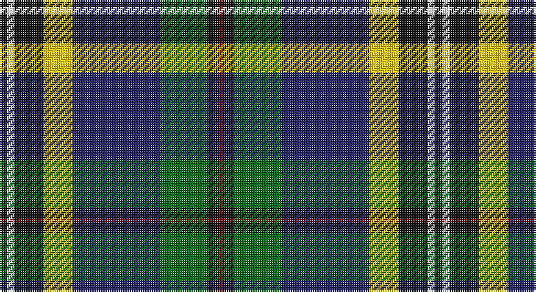

This page is one **sett** — a single exact thread-count. It belongs to the [tartan](/setts/k2w2k8ly8db24g13k3r1/)
(the same proportion at any scale), whose colour order is pattern [KWKYBGKR](/stripes/kwkybgkr/).

Sourced from tartans-authority.  It is a [8 stripe tartan](/stripes/stripes8/).

Original link http://www.tartansauthority.com/tartan-ferret/display/11053/

## Register references

External register numbers recorded for this tartan.

- Scottish Register of Tartans: [11053](https://www.tartanregister.gov.uk/tartanDetails?ref=11053)
- Scottish Tartans Authority (ITI): 11053

## Thread count
K/4 W4 K16 Y16 DB48 G26 K6 DR/2

One full sett is **238 threads**.

## Palette

Palette: <strong>Tartan Register</strong>
<table><thead><tr><th>Colour</th><th>Threads</th><th>Shade</th><th>Base</th><th>OKLCh</th></tr></thead><tbody><tr><td>K/</td><td style="text-align:right;font-variant-numeric:tabular-nums">4</td><td><code style="background-color:#101010;">#101010</code> <small style="color:#888">#101010</small></td><td>K <code style="background-color:#000000;">#000000</code></td><td><small style="color:#888">oklch(17.3% 0.000 89.9)</small></td></tr><tr><td>W</td><td style="text-align:right;font-variant-numeric:tabular-nums">4</td><td><code style="background-color:#FCFCFC;">#FCFCFC</code> <small style="color:#888">#FCFCFC</small></td><td>W <code style="background-color:#F7F7F7;">#F7F7F7</code></td><td><small style="color:#888">oklch(99.1% 0.000 89.9)</small></td></tr><tr><td>K</td><td style="text-align:right;font-variant-numeric:tabular-nums">16</td><td><code style="background-color:#101010;">#101010</code> <small style="color:#888">#101010</small></td><td>K <code style="background-color:#000000;">#000000</code></td><td><small style="color:#888">oklch(17.3% 0.000 89.9)</small></td></tr><tr><td>Y</td><td style="text-align:right;font-variant-numeric:tabular-nums">16</td><td><code style="background-color:#FCCC00;">#FCCC00</code> <small style="color:#888">#FCCC00</small></td><td>Y <code style="background-color:#F2BF00;">#F2BF00</code></td><td><small style="color:#888">oklch(86.2% 0.176 91.5)</small></td></tr><tr><td>DB</td><td style="text-align:right;font-variant-numeric:tabular-nums">48</td><td><code style="background-color:#202060;">#202060</code> <small style="color:#888">#202060</small></td><td>B <code style="background-color:#2A418A;">#2A418A</code></td><td><small style="color:#888">oklch(28.9% 0.111 276.9)</small></td></tr><tr><td>G</td><td style="text-align:right;font-variant-numeric:tabular-nums">26</td><td><code style="background-color:#006818;">#006818</code> <small style="color:#888">#006818</small></td><td>G <code style="background-color:#006100;">#006100</code></td><td><small style="color:#888">oklch(45.0% 0.142 145.0)</small></td></tr><tr><td>K</td><td style="text-align:right;font-variant-numeric:tabular-nums">6</td><td><code style="background-color:#101010;">#101010</code> <small style="color:#888">#101010</small></td><td>K <code style="background-color:#000000;">#000000</code></td><td><small style="color:#888">oklch(17.3% 0.000 89.9)</small></td></tr><tr><td>DR/</td><td style="text-align:right;font-variant-numeric:tabular-nums">2</td><td><code style="background-color:#880000;">#880000</code> <small style="color:#888">#880000</small></td><td>R <code style="background-color:#CC0000;">#CC0000</code></td><td><small style="color:#888">oklch(39.4% 0.162 29.2)</small></td></tr></tbody></table>

# Sample pattern

## Nearest tartans

The nearest existing variants by ΔTartan distance, with this tartan at the top so the swatches line up against it.

ΔTartan

Tartan

Sett

—

<a href="/ttd/edit/#slug=k2w2k8ly8db24g13k3r1~x2">Froben, Christian (Personal)</a> <a class="nn-out" href="/variants/s8/k2w2k8ly8db24g13k3r1~x2/" title="open its dictionary page">↗</a>

0.72

<a href="/ttd/edit/#slug=lo3k2o15k10dt23r2dt1w2~x2&amp;base=k2w2k8ly8db24g13k3r1~x2">Vienna Highlander (Fashion)</a> <a class="nn-out" href="/variants/s8/lo3k2o15k10dt23r2dt1w2~x2/" title="open its dictionary page">↗</a>

0.74

<a href="/ttd/edit/#slug=lg2dg9k16r2t30lg3dg6w1~x2&amp;base=k2w2k8ly8db24g13k3r1~x2">Climb, The</a> <a class="nn-out" href="/variants/s8/lg2dg9k16r2t30lg3dg6w1~x2/" title="open its dictionary page">↗</a>

0.79

<a href="/ttd/edit/#slug=k2w2k8lo8db24dg13k3m1~x2&amp;base=k2w2k8ly8db24g13k3r1~x2">Froben, Christian (Personal)</a> <a class="nn-out" href="/variants/s8/k2w2k8lo8db24dg13k3m1~x2/" title="open its dictionary page">↗</a>

0.83

<a href="/ttd/edit/#slug=g3p4g23k10r2k10t18k1w3~x2&amp;base=k2w2k8ly8db24g13k3r1~x2">Birch</a> <a class="nn-out" href="/variants/s9/g3p4g23k10r2k10t18k1w3~x2/" title="open its dictionary page">↗</a>

0.85

<a href="/ttd/edit/#slug=k6w3k2db30r9k4g20ly3~x2&amp;base=k2w2k8ly8db24g13k3r1~x2">Minnesota (District)</a> <a class="nn-out" href="/variants/s8/k6w3k2db30r9k4g20ly3~x2/" title="open its dictionary page">↗</a>

0.87

<a href="/ttd/edit/#slug=dbi5w3r12g37k12db21w2~x2&amp;base=k2w2k8ly8db24g13k3r1~x2">Bergen Scottish</a> <a class="nn-out" href="/variants/s7/dbi5w3r12g37k12db21w2~x2/" title="open its dictionary page">↗</a>

0.93

<a href="/ttd/edit/#slug=g3dp4g23k10r2k10t18k1w3~x2&amp;base=k2w2k8ly8db24g13k3r1~x2">Birch Family Tartan</a> <a class="nn-out" href="/variants/s9/g3dp4g23k10r2k10t18k1w3~x2/" title="open its dictionary page">↗</a>

1.01

<a href="/ttd/edit/#slug=w4k1g19ly1k19db13r2db4r2~x2&amp;base=k2w2k8ly8db24g13k3r1~x2">Whitson</a> <a class="nn-out" href="/variants/s9/w4k1g19ly1k19db13r2db4r2~x2/" title="open its dictionary page">↗</a>

1.07

<a href="/ttd/edit/#slug=g30dp4r6w6db6dp3k14w14db50g50w2&amp;base=k2w2k8ly8db24g13k3r1~x2">Brehat (Personal)</a> <a class="nn-out" href="/variants/s11/g30dp4r6w6db6dp3k14w14db50g50w2/" title="open its dictionary page">↗</a>

1.07

<a href="/ttd/edit/#slug=w1k6b9r12k12g32k6ly1~x2&amp;base=k2w2k8ly8db24g13k3r1~x2">McGeachie (Personal)</a> <a class="nn-out" href="/variants/s8/w1k6b9r12k12g32k6ly1~x2/" title="open its dictionary page">↗</a>

## Neighbour map

Every grey dot is one of 14360 variants placed by the first two principal components of the ΔTartan feature space (44% of its variance). Red is this tartan; blue dots are its nearest — click one to open its page.

<svg viewBox="0 0 640 380" role="img" style="max-width:100%;height:auto;border:1px solid #e0e0e0;border-radius:4px;display:block" xmlns="http://www.w3.org/2000/svg"><image href="/nn/cloud.v1.png" width="640" height="380"/><a href="/variants/s8/lo3k2o15k10dt23r2dt1w2~x2/"><circle cx="201.4" cy="119.9" r="4" fill="#3465a4"><title>Vienna Highlander (Fashion)</title></circle></a><a href="/variants/s8/lg2dg9k16r2t30lg3dg6w1~x2/"><circle cx="206.1" cy="101.1" r="4" fill="#3465a4"><title>Climb, The</title></circle></a><a href="/variants/s8/k2w2k8lo8db24dg13k3m1~x2/"><circle cx="187.6" cy="131.2" r="4" fill="#3465a4"><title>Froben, Christian (Personal)</title></circle></a><a href="/variants/s9/g3p4g23k10r2k10t18k1w3~x2/"><circle cx="135.2" cy="118.6" r="4" fill="#3465a4"><title>Birch</title></circle></a><a href="/variants/s8/k6w3k2db30r9k4g20ly3~x2/"><circle cx="154.3" cy="133.7" r="4" fill="#3465a4"><title>Minnesota (District)</title></circle></a><a href="/variants/s7/dbi5w3r12g37k12db21w2~x2/"><circle cx="169.7" cy="146.9" r="4" fill="#3465a4"><title>Bergen Scottish</title></circle></a><a href="/variants/s9/g3dp4g23k10r2k10t18k1w3~x2/"><circle cx="160.6" cy="129.1" r="4" fill="#3465a4"><title>Birch Family Tartan</title></circle></a><a href="/variants/s9/w4k1g19ly1k19db13r2db4r2~x2/"><circle cx="120.4" cy="118.5" r="4" fill="#3465a4"><title>Whitson</title></circle></a><a href="/variants/s11/g30dp4r6w6db6dp3k14w14db50g50w2/"><circle cx="192.7" cy="99.9" r="4" fill="#3465a4"><title>Brehat (Personal)</title></circle></a><a href="/variants/s8/w1k6b9r12k12g32k6ly1~x2/"><circle cx="211.7" cy="120.3" r="4" fill="#3465a4"><title>McGeachie (Personal)</title></circle></a><circle cx="167.1" cy="119.1" r="5" fill="#c00000"/></svg>

ID: /variants/s8/k2w2k8ly8db24g13k3r1~x2/
