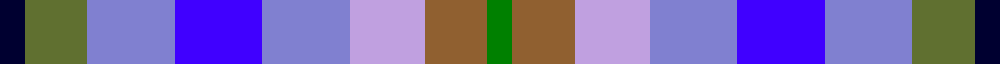
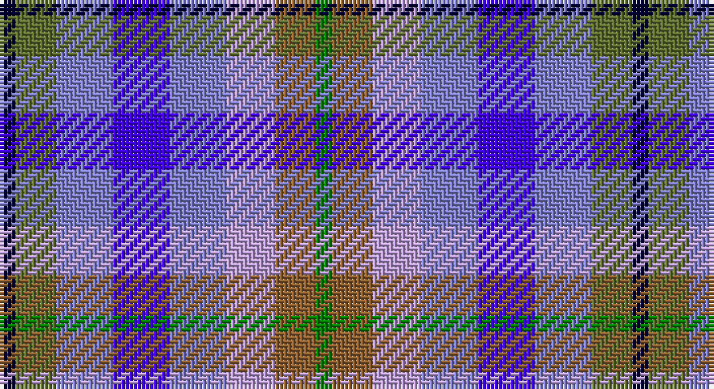

This page is one **sett** — a single exact thread-count. It belongs to the [tartan](/setts/k2y5b7bi7b7lp6o5g2/)
(the same proportion at any scale), whose colour order is pattern [GRWBBBGK](/stripes/grwbbbgk/).

Part of the [Stewarton](/tartans/stewarton/) tartan — the named design grouping this sett with its other cloths.

Sourced from weddslist.  It is a [8 stripe tartan](/stripes/stripes8/).

Original link http://www.weddslist.com/cgi-bin/tartans/pg.pl?source=sts

## Thread count
DB/4 G10 Ba14 B14 Ba14 LP12 LT10 Ga/4

One full sett is **156 threads**.

## Palette

Palette: <strong>custom</strong>
<table><thead><tr><th>Colour</th><th>Threads</th><th>Shade</th><th>Base</th><th>OKLCh</th></tr></thead><tbody><tr><td>DB/</td><td style="text-align:right;font-variant-numeric:tabular-nums">4</td><td><code style="background-color:#000030;">#000030</code> <small style="color:#888">#000030</small></td><td>K <code style="background-color:#000000;">#000000</code></td><td><small style="color:#888">oklch(14.0% 0.097 264.1)</small></td></tr><tr><td>G</td><td style="text-align:right;font-variant-numeric:tabular-nums">10</td><td><code style="background-color:#607030;">#607030</code> <small style="color:#888">#607030</small></td><td>G <code style="background-color:#006100;">#006100</code></td><td><small style="color:#888">oklch(51.7% 0.091 121.3)</small></td></tr><tr><td>Ba</td><td style="text-align:right;font-variant-numeric:tabular-nums">14</td><td><code style="background-color:#8080D0;">#8080D0</code> <small style="color:#888">#8080D0</small></td><td>B <code style="background-color:#2A418A;">#2A418A</code></td><td><small style="color:#888">oklch(63.4% 0.119 282.5)</small></td></tr><tr><td>B</td><td style="text-align:right;font-variant-numeric:tabular-nums">14</td><td><code style="background-color:#4000FF;">#4000FF</code> <small style="color:#888">#4000FF</small></td><td>B <code style="background-color:#2A418A;">#2A418A</code></td><td><small style="color:#888">oklch(47.4% 0.301 273.9)</small></td></tr><tr><td>Ba</td><td style="text-align:right;font-variant-numeric:tabular-nums">14</td><td><code style="background-color:#8080D0;">#8080D0</code> <small style="color:#888">#8080D0</small></td><td>B <code style="background-color:#2A418A;">#2A418A</code></td><td><small style="color:#888">oklch(63.4% 0.119 282.5)</small></td></tr><tr><td>LP</td><td style="text-align:right;font-variant-numeric:tabular-nums">12</td><td><code style="background-color:#C0A0E0;">#C0A0E0</code> <small style="color:#888">#C0A0E0</small></td><td>W <code style="background-color:#F7F7F7;">#F7F7F7</code></td><td><small style="color:#888">oklch(75.7% 0.096 307.0)</small></td></tr><tr><td>LT</td><td style="text-align:right;font-variant-numeric:tabular-nums">10</td><td><code style="background-color:#906030;">#906030</code> <small style="color:#888">#906030</small></td><td>R <code style="background-color:#CC0000;">#CC0000</code></td><td><small style="color:#888">oklch(53.1% 0.089 63.7)</small></td></tr><tr><td>Ga/</td><td style="text-align:right;font-variant-numeric:tabular-nums">4</td><td><code style="background-color:#008000;">#008000</code> <small style="color:#888">#008000</small></td><td>G <code style="background-color:#006100;">#006100</code></td><td><small style="color:#888">oklch(52.0% 0.177 142.5)</small></td></tr></tbody></table>

# Sample pattern

## Compared to the master

This cloth is one sett of its design; the master sett (the exemplar the design is anchored on) is below for comparison.

<figure style="margin:0"><figcaption style="color:#888;font-size:smaller">this sett</figcaption></figure>
<figure style="margin:0"><figcaption style="color:#888;font-size:smaller"><a href="/setts/o3lr3oi3db3oi3g3k1g3oi3db3oi3lr3o3k1/">master sett →</a></figcaption></figure>

## Nearest tartans

The nearest existing variants by ΔTartan distance, with this tartan at the top so the swatches line up against it.

ΔTartan

Tartan

Sett

—

<a href="/ttd/edit/#slug=k2y5b7bi7b7lp6o5g2~x2">Stewarton</a> <a class="nn-out" href="/variants/s8/k2y5b7bi7b7lp6o5g2~x2/" title="open its dictionary page">↗</a>

1.81

<a href="/ttd/edit/#slug=g3p7b11db3o8w2db3b3~x2&amp;base=k2y5b7bi7b7lp6o5g2~x2">Scotia</a> <a class="nn-out" href="/variants/s8/g3p7b11db3o8w2db3b3~x2/" title="open its dictionary page">↗</a>

1.83

<a href="/ttd/edit/#slug=o2k1n4lb4w1lb4t4k1t4lb2t4ly1~x4&amp;base=k2y5b7bi7b7lp6o5g2~x2">Union Club of British Columbia</a> <a class="nn-out" href="/variants/s12/o2k1n4lb4w1lb4t4k1t4lb2t4ly1~x4/" title="open its dictionary page">↗</a>

1.89

<a href="/ttd/edit/#slug=g3dp7t11db3dy8w2db3t3~x2&amp;base=k2y5b7bi7b7lp6o5g2~x2">Scotia Trade Tartan</a> <a class="nn-out" href="/variants/s8/g3dp7t11db3dy8w2db3t3~x2/" title="open its dictionary page">↗</a>

1.94

<a href="/ttd/edit/#slug=b2db3k1db3o3g4r1~x8&amp;base=k2y5b7bi7b7lp6o5g2~x2">New York City</a> <a class="nn-out" href="/variants/s7/b2db3k1db3o3g4r1~x8/" title="open its dictionary page">↗</a>

1.96

<a href="/ttd/edit/#slug=b6k4b10w2db10g4db6g9r2g4ly2~x4&amp;base=k2y5b7bi7b7lp6o5g2~x2">O'Sullivan</a> <a class="nn-out" href="/variants/s11/b6k4b10w2db10g4db6g9r2g4ly2~x4/" title="open its dictionary page">↗</a>

1.99

<a href="/ttd/edit/#slug=db4t8k2t5lb2t5dg8dr7dg2dr7dg3~x2&amp;base=k2y5b7bi7b7lp6o5g2~x2">DunBroch</a> <a class="nn-out" href="/variants/s11/db4t8k2t5lb2t5dg8dr7dg2dr7dg3~x2/" title="open its dictionary page">↗</a>

2.03

<a href="/ttd/edit/#slug=k1o3lr3oi3db3oi3g3k1~x4&amp;base=k2y5b7bi7b7lp6o5g2~x2">Stewarton (Fashion)</a> <a class="nn-out" href="/variants/s8/k1o3lr3oi3db3oi3g3k1~x4/" title="open its dictionary page">↗</a>

2.07

<a href="/ttd/edit/#slug=k4n4lo1n4r4db4w1~x8&amp;base=k2y5b7bi7b7lp6o5g2~x2">Blackdown Hills Corporate Tartan</a> <a class="nn-out" href="/variants/s7/k4n4lo1n4r4db4w1~x8/" title="open its dictionary page">↗</a>

2.13

<a href="/ttd/edit/#slug=o5db4ly1db4k4dy4w1~x4&amp;base=k2y5b7bi7b7lp6o5g2~x2">Devon Companion</a> <a class="nn-out" href="/variants/s7/o5db4ly1db4k4dy4w1~x4/" title="open its dictionary page">↗</a>

2.18

<a href="/ttd/edit/#slug=db3ly3y15b8w8db6y15b6ly3dg6r3~x2&amp;base=k2y5b7bi7b7lp6o5g2~x2">Saltcoats (Saskatchewan)</a> <a class="nn-out" href="/variants/s11/db3ly3y15b8w8db6y15b6ly3dg6r3~x2/" title="open its dictionary page">↗</a>

## Neighbour map

Every grey dot is one of 14360 variants placed by the first two principal components of the ΔTartan feature space (44% of its variance). Red is this tartan; blue dots are its nearest — click one to open its page.

<svg viewBox="0 0 640 380" role="img" style="max-width:100%;height:auto;border:1px solid #e0e0e0;border-radius:4px;display:block" xmlns="http://www.w3.org/2000/svg"><image href="/nn/cloud.v1.png" width="640" height="380"/><a href="/variants/s8/g3p7b11db3o8w2db3b3~x2/"><circle cx="79.1" cy="202.8" r="4" fill="#3465a4"><title>Scotia</title></circle></a><a href="/variants/s12/o2k1n4lb4w1lb4t4k1t4lb2t4ly1~x4/"><circle cx="53.3" cy="199.6" r="4" fill="#3465a4"><title>Union Club of British Columbia</title></circle></a><a href="/variants/s8/g3dp7t11db3dy8w2db3t3~x2/"><circle cx="86.2" cy="212.3" r="4" fill="#3465a4"><title>Scotia Trade Tartan</title></circle></a><a href="/variants/s7/b2db3k1db3o3g4r1~x8/"><circle cx="76.6" cy="265.1" r="4" fill="#3465a4"><title>New York City</title></circle></a><a href="/variants/s11/b6k4b10w2db10g4db6g9r2g4ly2~x4/"><circle cx="20.6" cy="191.5" r="4" fill="#3465a4"><title>O'Sullivan</title></circle></a><a href="/variants/s11/db4t8k2t5lb2t5dg8dr7dg2dr7dg3~x2/"><circle cx="55.5" cy="223.5" r="4" fill="#3465a4"><title>DunBroch</title></circle></a><a href="/variants/s8/k1o3lr3oi3db3oi3g3k1~x4/"><circle cx="14.0" cy="264.6" r="4" fill="#3465a4"><title>Stewarton (Fashion)</title></circle></a><a href="/variants/s7/k4n4lo1n4r4db4w1~x8/"><circle cx="59.0" cy="246.4" r="4" fill="#3465a4"><title>Blackdown Hills Corporate Tartan</title></circle></a><a href="/variants/s7/o5db4ly1db4k4dy4w1~x4/"><circle cx="52.9" cy="231.6" r="4" fill="#3465a4"><title>Devon Companion</title></circle></a><a href="/variants/s11/db3ly3y15b8w8db6y15b6ly3dg6r3~x2/"><circle cx="53.7" cy="171.7" r="4" fill="#3465a4"><title>Saltcoats (Saskatchewan)</title></circle></a><circle cx="14.0" cy="236.5" r="5" fill="#c00000"/></svg>

ID: /variants/s8/k2y5b7bi7b7lp6o5g2~x2/
