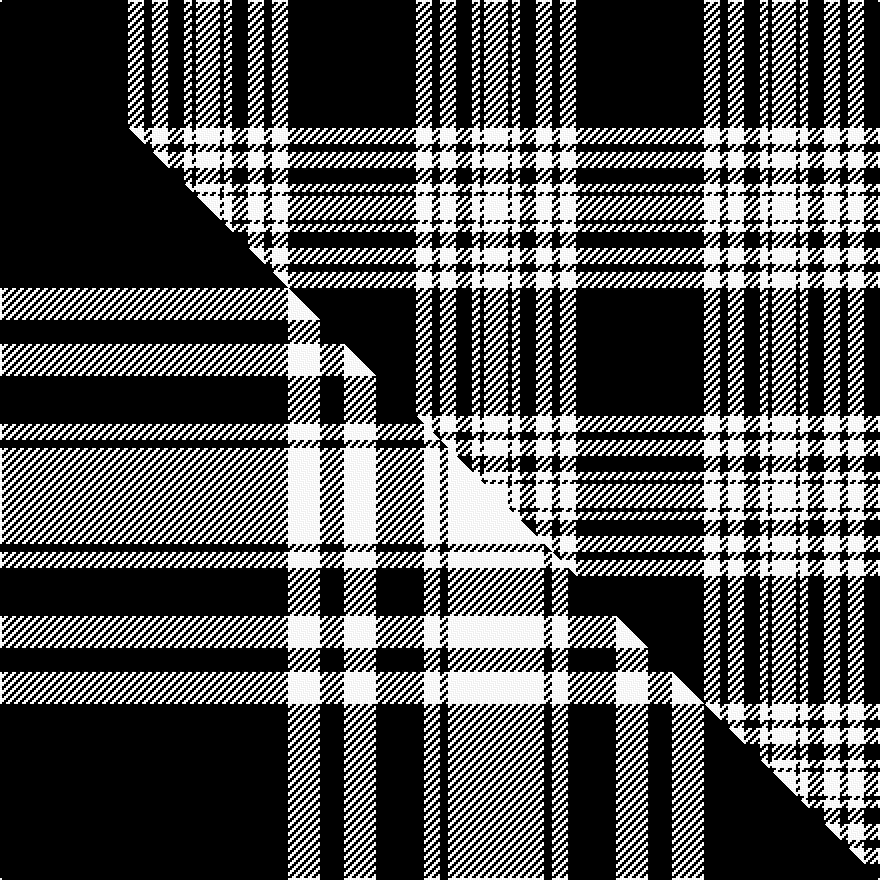

This page is one **sett** — a single exact thread-count. It belongs to the [tartan](/setts/k32w4k2w4k4w2k1w6/)
(the same proportion at any scale), whose colour order is pattern [KWKWKWKW](/stripes/kwkwkwkw/).

Part of the [Menzies](/tartans/menzies-2/) tartan — the named design grouping this sett with its other cloths.

Sourced from weddslist.  It is a [8 stripe tartan](/stripes/stripes8/).

Original link http://www.weddslist.com/cgi-bin/tartans/pg.pl?source=sts

## Provenance

Earliest known date: 1934 Not the tartan in Wilsons pattern books

2 attestations — the source records this cloth was collapsed from (oldest owns this page)

<ul>
<li>undated — Menzies (weddslist, <a href="http://www.weddslist.com/cgi-bin/tartans/pg.pl?source=sts">record</a>) </li>
<li>undated — Menzies B/W Clan Tartan (house-of-tartan, <a href="http://www.house-of-tartan.scotland.net/house/TartanViewjs.asp?colr=Def&tnam=1244">record</a>) </li>
</ul>

## Thread count
K/64 W8 K4 W8 K8 W4 K2 W/12

One full sett is **144 threads**.

## Palette
<table><thead><tr><th>Colour</th><th>Shade</th><th>OKLCh</th></tr></thead><tbody><tr><td>K</td><td><code style="background-color:#000000;">#000000</code> <small style="color:#888">#000000</small></td><td><small style="color:#888">oklch(0.0% 0.000 0.0)</small></td></tr><tr><td>W</td><td><code style="background-color:#F7F7F7;">#F7F7F7</code> <small style="color:#888">#F7F7F7</small></td><td><small style="color:#888">oklch(97.6% 0.000 89.9)</small></td></tr></tbody></table>

# Sample pattern

## Compared to the master

This cloth is one sett of its design; the master sett (the exemplar the design is anchored on) is below for comparison.

Its **ΔTartan distance** from the master is **0.32** — the same measure the nearest-tartans table ranks by (0 is identical; a re-scale of the same cloth is near 0, a recolour or a different proportion further).

<figure class="master-compare" style="margin:0">

this sett
master sett ★

<figcaption style="color:#888;font-size:smaller">One weave of this sett against the <a href="/setts/k36w4k3w4k6w2k1w12/">master sett ★</a>, split on the diagonal: a shared proportion runs seamlessly across it with only the shades shifting; a different proportion breaks on it.</figcaption>
</figure>

## Nearest tartan variants

The nearest existing variants by ΔTartan distance, with this cloth at the top so the swatches line up against it.

ΔTartan

Threads

Variant

Sett

—

144

<a href="/variants/s8/k32w4k2w4k4w2k1w6~x2/">Menzies</a>

<a href="/ttd/edit/#slug=k36w4k3w4k6w2k1w12~x4&amp;base=k32w4k2w4k4w2k1w6~x2" title="compare in the TTD">0.32</a>

352

<a href="/variants/s8/k36w4k3w4k6w2k1w12~x4/">Menzies (1938)</a>

<a href="/ttd/edit/#slug=k16w1k1w1k8w16k1w2~x2&amp;base=k32w4k2w4k4w2k1w6~x2" title="compare in the TTD">0.87</a>

148

<a href="/variants/s8/k16w1k1w1k8w16k1w2~x2/">Douglas VS</a>

<a href="/ttd/edit/#slug=k16n1k1n1k8n16k1n2~x2&amp;base=k32w4k2w4k4w2k1w6~x2" title="compare in the TTD">0.89</a>

148

<a href="/variants/s8/k16n1k1n1k8n16k1n2~x2/">Douglas VS</a>

<a href="/ttd/edit/#slug=dp120w10k4w11k3w5k3w19&amp;base=k32w4k2w4k4w2k1w6~x2" title="compare in the TTD">1.69</a>

211

<a href="/variants/s8/dp120w10k4w11k3w5k3w19/">Menzies Mauve and White</a>

<a href="/ttd/edit/#slug=k20w1k1w3k1r1k1w1~x4&amp;base=k32w4k2w4k4w2k1w6~x2" title="compare in the TTD">1.80</a>

148

<a href="/variants/s8/k20w1k1w3k1r1k1w1~x4/">Volkswagen Black Trim (Fashion)</a>

<a href="/ttd/edit/#slug=k22n17k2n4k2n2k37n4k2r3~x2&amp;base=k32w4k2w4k4w2k1w6~x2" title="compare in the TTD">1.88</a>

330

<a href="/variants/s10/k22n17k2n4k2n2k37n4k2r3~x2/">Witches' Blood, The</a>

<a href="/ttd/edit/#slug=w24k16w1k16w3k8w2~x2&amp;base=k32w4k2w4k4w2k1w6~x2" title="compare in the TTD">1.89</a>

228

<a href="/variants/s7/w24k16w1k16w3k8w2~x2/">Saks Fifth Avenue (Corp)</a>

<a href="/ttd/edit/#slug=k17n4k13n4k3n45k3~x2&amp;base=k32w4k2w4k4w2k1w6~x2" title="compare in the TTD">1.99</a>

316

<a href="/variants/s7/k17n4k13n4k3n45k3~x2/">Black Spirit Fashion Tartan</a>

<a href="/ttd/edit/#slug=k27w2k2w2k2w2k2w2k4r5~x4&amp;base=k32w4k2w4k4w2k1w6~x2" title="compare in the TTD">2.21</a>

272

<a href="/variants/s10/k27w2k2w2k2w2k2w2k4r5~x4/">Reiver Check</a>

<a href="/ttd/edit/#slug=k43w4k6w2k3w2k3w9k5w3k3w3~x2&amp;base=k32w4k2w4k4w2k1w6~x2" title="compare in the TTD">2.33</a>

252

<a href="/variants/s12/k43w4k6w2k3w2k3w9k5w3k3w3~x2/">Stuart/Stewart Mourning</a>

## Neighbour map

Every grey dot is one of 13620 variants placed by the first two principal components of the ΔTartan feature space (42% of its variance). Red is this tartan; blue dots are its nearest — click one to open its page.

<svg viewBox="0 0 640 380" role="img" style="max-width:100%;height:auto;border:1px solid #e0e0e0;border-radius:4px;display:block" xmlns="http://www.w3.org/2000/svg"><image href="/nn/cloud.v1.png" width="640" height="380"/><a href="/variants/s8/k36w4k3w4k6w2k1w12~x4/"><circle cx="416.3" cy="122.0" r="4" fill="#3465a4"><title>Menzies (1938)</title></circle></a><a href="/variants/s8/k16w1k1w1k8w16k1w2~x2/"><circle cx="329.7" cy="165.9" r="4" fill="#3465a4"><title>Douglas VS</title></circle></a><a href="/variants/s8/k16n1k1n1k8n16k1n2~x2/"><circle cx="357.7" cy="169.4" r="4" fill="#3465a4"><title>Douglas VS</title></circle></a><a href="/variants/s8/dp120w10k4w11k3w5k3w19/"><circle cx="433.6" cy="83.2" r="4" fill="#3465a4"><title>Menzies Mauve and White</title></circle></a><a href="/variants/s8/k20w1k1w3k1r1k1w1~x4/"><circle cx="459.8" cy="97.8" r="4" fill="#3465a4"><title>Volkswagen Black Trim (Fashion)</title></circle></a><a href="/variants/s10/k22n17k2n4k2n2k37n4k2r3~x2/"><circle cx="392.5" cy="128.3" r="4" fill="#3465a4"><title>Witches' Blood, The</title></circle></a><a href="/variants/s7/w24k16w1k16w3k8w2~x2/"><circle cx="330.7" cy="177.6" r="4" fill="#3465a4"><title>Saks Fifth Avenue (Corp)</title></circle></a><a href="/variants/s7/k17n4k13n4k3n45k3~x2/"><circle cx="363.8" cy="170.6" r="4" fill="#3465a4"><title>Black Spirit Fashion Tartan</title></circle></a><a href="/variants/s10/k27w2k2w2k2w2k2w2k4r5~x4/"><circle cx="392.5" cy="113.5" r="4" fill="#3465a4"><title>Reiver Check</title></circle></a><a href="/variants/s12/k43w4k6w2k3w2k3w9k5w3k3w3~x2/"><circle cx="435.0" cy="111.1" r="4" fill="#3465a4"><title>Stuart/Stewart Mourning</title></circle></a><circle cx="436.9" cy="119.1" r="5" fill="#c00000"/><text x="320" y="376" text-anchor="middle" font-size="11" fill="#999">ground</text><text x="11" y="190" text-anchor="middle" font-size="11" fill="#999" transform="rotate(-90 11 190)">complexity</text></svg>

ID: /variants/s8/k32w4k2w4k4w2k1w6~x2/
