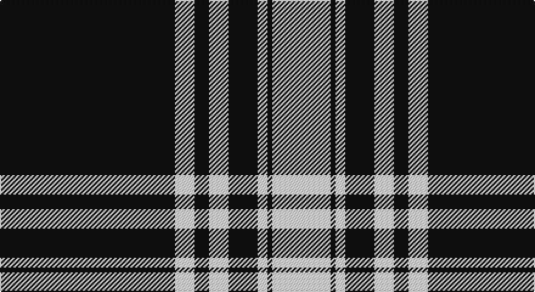

This page is one **sett** — a single exact thread-count. It belongs to the [tartan](/setts/k36w4k3w4k6w2k1w12/)
(the same proportion at any scale), whose colour order is pattern [KWKWKWKW](/stripes/kwkwkwkw/).

Part of the [Menzies](/tartans/menzies/) tartan — the named design grouping this sett with its other cloths.

Sourced from register-of-tartans.  It is a [8 stripe tartan](/stripes/stripes8/).

Original link https://www.tartanregister.gov.uk/tartanDetails.aspx?ref=2924

## Also known as

This cloth is also recorded under:

- Menzies #3
- Menzies 1938
- Menzies B/W
- Menzies Green
- Menzies, Green

2 attestations — the source records this cloth was collapsed from (oldest owns this page)

<ul>
<li>01/01/1934 — Menzies (1938) (register-of-tartans, <a href="https://www.tartanregister.gov.uk/tartanDetails.aspx?ref=2924">record</a>)</li>
<li>pre 1934 — Menzies 1938 - Mourning (Clan) (tartans-authority, <a href="http://www.tartansauthority.com/tartan-ferret/display/1244/">record</a>)</li>
</ul>

## Register references

External register numbers recorded for this tartan.

- Scottish Register of Tartans: [2924](https://www.tartanregister.gov.uk/tartanDetails.aspx?ref=2924)
- Scottish Tartans Authority (ITI): 1244
- Scottish Tartans World Register: 1244

## Thread count
K/144 W16 K12 W16 K24 W8 K4 W/48

One full sett is **352 threads**.

## Palette

Palette: <strong>Logan (The Scottish Gael, 1831)</strong>
<table><thead><tr><th>Colour</th><th>Threads</th><th>Shade</th><th>Base</th><th>OKLCh</th></tr></thead><tbody><tr><td>K/</td><td style="text-align:right;font-variant-numeric:tabular-nums">144</td><td><code style="background-color:#101010;">#101010</code> <small style="color:#888">#101010</small></td><td>K <code style="background-color:#000000;">#000000</code></td><td><small style="color:#888">oklch(17.3% 0.000 89.9)</small></td></tr><tr><td>W</td><td style="text-align:right;font-variant-numeric:tabular-nums">16</td><td><code style="background-color:#FCFCFC;">#FCFCFC</code> <small style="color:#888">#FCFCFC</small></td><td>W <code style="background-color:#F7F7F7;">#F7F7F7</code></td><td><small style="color:#888">oklch(99.1% 0.000 89.9)</small></td></tr><tr><td>K</td><td style="text-align:right;font-variant-numeric:tabular-nums">12</td><td><code style="background-color:#101010;">#101010</code> <small style="color:#888">#101010</small></td><td>K <code style="background-color:#000000;">#000000</code></td><td><small style="color:#888">oklch(17.3% 0.000 89.9)</small></td></tr><tr><td>W</td><td style="text-align:right;font-variant-numeric:tabular-nums">16</td><td><code style="background-color:#FCFCFC;">#FCFCFC</code> <small style="color:#888">#FCFCFC</small></td><td>W <code style="background-color:#F7F7F7;">#F7F7F7</code></td><td><small style="color:#888">oklch(99.1% 0.000 89.9)</small></td></tr><tr><td>K</td><td style="text-align:right;font-variant-numeric:tabular-nums">24</td><td><code style="background-color:#101010;">#101010</code> <small style="color:#888">#101010</small></td><td>K <code style="background-color:#000000;">#000000</code></td><td><small style="color:#888">oklch(17.3% 0.000 89.9)</small></td></tr><tr><td>W</td><td style="text-align:right;font-variant-numeric:tabular-nums">8</td><td><code style="background-color:#FCFCFC;">#FCFCFC</code> <small style="color:#888">#FCFCFC</small></td><td>W <code style="background-color:#F7F7F7;">#F7F7F7</code></td><td><small style="color:#888">oklch(99.1% 0.000 89.9)</small></td></tr><tr><td>K</td><td style="text-align:right;font-variant-numeric:tabular-nums">4</td><td><code style="background-color:#101010;">#101010</code> <small style="color:#888">#101010</small></td><td>K <code style="background-color:#000000;">#000000</code></td><td><small style="color:#888">oklch(17.3% 0.000 89.9)</small></td></tr><tr><td>W/</td><td style="text-align:right;font-variant-numeric:tabular-nums">48</td><td><code style="background-color:#FCFCFC;">#FCFCFC</code> <small style="color:#888">#FCFCFC</small></td><td>W <code style="background-color:#F7F7F7;">#F7F7F7</code></td><td><small style="color:#888">oklch(99.1% 0.000 89.9)</small></td></tr></tbody></table>

# Sample pattern

## Compared to the master

This cloth is one sett of its design; the master sett (the exemplar the design is anchored on) is below for comparison.

<figure style="margin:0"><figcaption style="color:#888;font-size:smaller">this sett</figcaption></figure>
<figure style="margin:0"><figcaption style="color:#888;font-size:smaller"><a href="/setts/k19dg10k6dg10k12dg6k4dg14/">master sett →</a></figcaption></figure>

## Nearest tartans

The nearest existing variants by ΔTartan distance, with this tartan at the top so the swatches line up against it.

ΔTartan

Tartan

Sett

—

<a href="/ttd/edit/#slug=k36w4k3w4k6w2k1w12~x4">Menzies (1938)</a> <a class="nn-out" href="/variants/s8/k36w4k3w4k6w2k1w12~x4/" title="open its dictionary page">↗</a>

1.08

<a href="/ttd/edit/#slug=w3lr1k3w10k10w6lr4k40lr3~x2&amp;base=k36w4k3w4k6w2k1w12~x4">Moonlight Glen (Fashion)</a> <a class="nn-out" href="/variants/s9/w3lr1k3w10k10w6lr4k40lr3~x2/" title="open its dictionary page">↗</a>

1.44

<a href="/ttd/edit/#slug=k66w1r8k14w14k6r11w8~x4&amp;base=k36w4k3w4k6w2k1w12~x4">University of Cincinnati</a> <a class="nn-out" href="/variants/s8/k66w1r8k14w14k6r11w8~x4/" title="open its dictionary page">↗</a>

1.44

<a href="/ttd/edit/#slug=k66w1r8k14w14k6r11w8~x2&amp;base=k36w4k3w4k6w2k1w12~x4">University of Cincinnati</a> <a class="nn-out" href="/variants/s8/k66w1r8k14w14k6r11w8~x2/" title="open its dictionary page">↗</a>

1.46

<a href="/ttd/edit/#slug=k22w3k3w11k1~x2&amp;base=k36w4k3w4k6w2k1w12~x4">MacPhee MacFee or MacIver</a> <a class="nn-out" href="/variants/s5/k22w3k3w11k1~x2/" title="open its dictionary page">↗</a>

1.48

<a href="/variants/s12/w36k8w36k95w4k4r6/">Gretna Football Club</a>

1.51

<a href="/ttd/edit/#slug=k43w4k6w2k3w2k3w9k5w3k3w3~x2&amp;base=k36w4k3w4k6w2k1w12~x4">Stuart/Stewart Mourning</a> <a class="nn-out" href="/variants/s12/k43w4k6w2k3w2k3w9k5w3k3w3~x2/" title="open its dictionary page">↗</a>

1.54

<a href="/ttd/edit/#slug=k32w4k2w4k4w2k1w6~x2&amp;base=k36w4k3w4k6w2k1w12~x4">Menzies</a> <a class="nn-out" href="/variants/s8/k32w4k2w4k4w2k1w6~x2/" title="open its dictionary page">↗</a>

1.55

<a href="/ttd/edit/#slug=r2lb3r1lb9k4lb13k33lb1k4r1~x2&amp;base=k36w4k3w4k6w2k1w12~x4">Myles, Lee (Name)</a> <a class="nn-out" href="/variants/s10/r2lb3r1lb9k4lb13k33lb1k4r1~x2/" title="open its dictionary page">↗</a>

1.64

<a href="/ttd/edit/#slug=k75lb6k5lb18k2lb2k3~x2&amp;base=k36w4k3w4k6w2k1w12~x4">Bargain Booze</a> <a class="nn-out" href="/variants/s7/k75lb6k5lb18k2lb2k3~x2/" title="open its dictionary page">↗</a>

1.65

<a href="/ttd/edit/#slug=dt32w4dt2w4dt4w2dt1w6~x2&amp;base=k36w4k3w4k6w2k1w12~x4">Menzies Navy design Tartan</a> <a class="nn-out" href="/variants/s8/dt32w4dt2w4dt4w2dt1w6~x2/" title="open its dictionary page">↗</a>

## Neighbour map

Every grey dot is one of 14360 variants placed by the first two principal components of the ΔTartan feature space (44% of its variance). Red is this tartan; blue dots are its nearest — click one to open its page.

<svg viewBox="0 0 640 380" role="img" style="max-width:100%;height:auto;border:1px solid #e0e0e0;border-radius:4px;display:block" xmlns="http://www.w3.org/2000/svg"><image href="/nn/cloud.v1.png" width="640" height="380"/><a href="/variants/s9/w3lr1k3w10k10w6lr4k40lr3~x2/"><circle cx="415.2" cy="117.7" r="4" fill="#3465a4"><title>Moonlight Glen (Fashion)</title></circle></a><a href="/variants/s8/k66w1r8k14w14k6r11w8~x4/"><circle cx="431.2" cy="117.3" r="4" fill="#3465a4"><title>University of Cincinnati</title></circle></a><a href="/variants/s8/k66w1r8k14w14k6r11w8~x2/"><circle cx="432.2" cy="118.6" r="4" fill="#3465a4"><title>University of Cincinnati</title></circle></a><a href="/variants/s5/k22w3k3w11k1~x2/"><circle cx="412.0" cy="197.7" r="4" fill="#3465a4"><title>MacPhee MacFee or MacIver</title></circle></a><a href="/variants/s12/w36k8w36k95w4k4r6/"><circle cx="376.7" cy="126.3" r="4" fill="#3465a4"><title>Gretna Football Club</title></circle></a><a href="/variants/s12/k43w4k6w2k3w2k3w9k5w3k3w3~x2/"><circle cx="479.8" cy="138.0" r="4" fill="#3465a4"><title>Stuart/Stewart Mourning</title></circle></a><a href="/variants/s8/k32w4k2w4k4w2k1w6~x2/"><circle cx="478.5" cy="150.1" r="4" fill="#3465a4"><title>Menzies</title></circle></a><a href="/variants/s10/r2lb3r1lb9k4lb13k33lb1k4r1~x2/"><circle cx="372.8" cy="116.5" r="4" fill="#3465a4"><title>Myles, Lee (Name)</title></circle></a><a href="/variants/s7/k75lb6k5lb18k2lb2k3~x2/"><circle cx="547.2" cy="148.4" r="4" fill="#3465a4"><title>Bargain Booze</title></circle></a><a href="/variants/s8/dt32w4dt2w4dt4w2dt1w6~x2/"><circle cx="482.8" cy="148.1" r="4" fill="#3465a4"><title>Menzies Navy design Tartan</title></circle></a><circle cx="450.9" cy="140.6" r="5" fill="#c00000"/></svg>

ID: /variants/s8/k36w4k3w4k6w2k1w12~x4/
