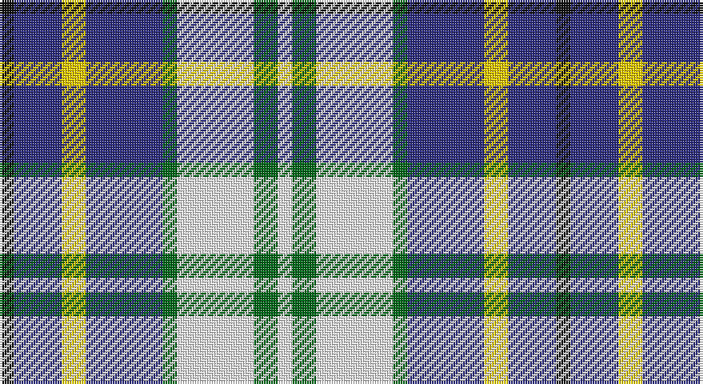

This page is one **sett** — a single exact thread-count. It belongs to the [tartan](/setts/k3db10ly5db16g3w16g5w3/)
(the same proportion at any scale), whose colour order is pattern [KBYBGWGW](/stripes/kbybgwgw/).

Part of the [Ship Hector, The](/tartans/ship-hector-the/) tartan — the named design grouping this sett with its other cloths.

Sourced from tartans-authority.  It is a [8 stripe tartan](/stripes/stripes8/).

Original link http://www.tartansauthority.com/tartan-ferret/display/2597/

## Register references

External register numbers recorded for this tartan.

- Scottish Tartans Authority (ITI): 2597

## Thread count
K/6 DB20 Y10 DB32 G6 W32 G10 W/6

One full sett is **232 threads**.

## Palette

Palette: <strong>Tartan Register</strong>
<table><thead><tr><th>Colour</th><th>Threads</th><th>Shade</th><th>Base</th><th>OKLCh</th></tr></thead><tbody><tr><td>K/</td><td style="text-align:right;font-variant-numeric:tabular-nums">6</td><td><code style="background-color:#101010;">#101010</code> <small style="color:#888">#101010</small></td><td>K <code style="background-color:#000000;">#000000</code></td><td><small style="color:#888">oklch(17.3% 0.000 89.9)</small></td></tr><tr><td>DB</td><td style="text-align:right;font-variant-numeric:tabular-nums">20</td><td><code style="background-color:#2C2C80;">#2C2C80</code> <small style="color:#888">#2C2C80</small></td><td>B <code style="background-color:#2A418A;">#2A418A</code></td><td><small style="color:#888">oklch(35.0% 0.138 276.6)</small></td></tr><tr><td>Y</td><td style="text-align:right;font-variant-numeric:tabular-nums">10</td><td><code style="background-color:#FCCC00;">#FCCC00</code> <small style="color:#888">#FCCC00</small></td><td>Y <code style="background-color:#F2BF00;">#F2BF00</code></td><td><small style="color:#888">oklch(86.2% 0.176 91.5)</small></td></tr><tr><td>DB</td><td style="text-align:right;font-variant-numeric:tabular-nums">32</td><td><code style="background-color:#2C2C80;">#2C2C80</code> <small style="color:#888">#2C2C80</small></td><td>B <code style="background-color:#2A418A;">#2A418A</code></td><td><small style="color:#888">oklch(35.0% 0.138 276.6)</small></td></tr><tr><td>G</td><td style="text-align:right;font-variant-numeric:tabular-nums">6</td><td><code style="background-color:#006818;">#006818</code> <small style="color:#888">#006818</small></td><td>G <code style="background-color:#006100;">#006100</code></td><td><small style="color:#888">oklch(45.0% 0.142 145.0)</small></td></tr><tr><td>W</td><td style="text-align:right;font-variant-numeric:tabular-nums">32</td><td><code style="background-color:#FCFCFC;">#FCFCFC</code> <small style="color:#888">#FCFCFC</small></td><td>W <code style="background-color:#F7F7F7;">#F7F7F7</code></td><td><small style="color:#888">oklch(99.1% 0.000 89.9)</small></td></tr><tr><td>G</td><td style="text-align:right;font-variant-numeric:tabular-nums">10</td><td><code style="background-color:#006818;">#006818</code> <small style="color:#888">#006818</small></td><td>G <code style="background-color:#006100;">#006100</code></td><td><small style="color:#888">oklch(45.0% 0.142 145.0)</small></td></tr><tr><td>W/</td><td style="text-align:right;font-variant-numeric:tabular-nums">6</td><td><code style="background-color:#FCFCFC;">#FCFCFC</code> <small style="color:#888">#FCFCFC</small></td><td>W <code style="background-color:#F7F7F7;">#F7F7F7</code></td><td><small style="color:#888">oklch(99.1% 0.000 89.9)</small></td></tr></tbody></table>

# Sample pattern

## Compared to the master

This cloth is one sett of its design; the master sett (the exemplar the design is anchored on) is below for comparison.

<figure style="margin:0"><figcaption style="color:#888;font-size:smaller">this sett</figcaption></figure>
<figure style="margin:0"><figcaption style="color:#888;font-size:smaller"><a href="/setts/db10k5db16g3w16g5w3g5w16g3db16k5db10ki3/">master sett →</a></figcaption></figure>

## Nearest tartans

The nearest existing variants by ΔTartan distance, with this tartan at the top so the swatches line up against it.

ΔTartan

Tartan

Sett

—

<a href="/ttd/edit/#slug=k3db10ly5db16g3w16g5w3~x2">Ship Hector, The (Commemorative)</a> <a class="nn-out" href="/variants/s8/k3db10ly5db16g3w16g5w3~x2/" title="open its dictionary page">↗</a>

0.50

<a href="/ttd/edit/#slug=k4db9ly6db22g4w20g6w4&amp;base=k3db10ly5db16g3w16g5w3~x2">Ship Hector</a> <a class="nn-out" href="/variants/s8/k4db9ly6db22g4w20g6w4/" title="open its dictionary page">↗</a>

0.89

<a href="/ttd/edit/#slug=db13w13db4ly2g8r3~x2&amp;base=k3db10ly5db16g3w16g5w3~x2">Unidentified (Winterbottom)</a> <a class="nn-out" href="/variants/s6/db13w13db4ly2g8r3~x2/" title="open its dictionary page">↗</a>

1.01

<a href="/ttd/edit/#slug=lb12k3lbi3k3lb13t6k17r3~x2&amp;base=k3db10ly5db16g3w16g5w3~x2">Mitsukoshi (Corporate)</a> <a class="nn-out" href="/variants/s8/lb12k3lbi3k3lb13t6k17r3~x2/" title="open its dictionary page">↗</a>

1.07

<a href="/ttd/edit/#slug=db18o5db18ly14k3w3k3ly14o3~x2&amp;base=k3db10ly5db16g3w16g5w3~x2">Strakan</a> <a class="nn-out" href="/variants/s9/db18o5db18ly14k3w3k3ly14o3~x2/" title="open its dictionary page">↗</a>

1.08

<a href="/ttd/edit/#slug=dg4db22dt6w10db3w6dp4dt3w4~x2&amp;base=k3db10ly5db16g3w16g5w3~x2">Sibbald Blue (2014)</a> <a class="nn-out" href="/variants/s9/dg4db22dt6w10db3w6dp4dt3w4~x2/" title="open its dictionary page">↗</a>

1.09

<a href="/ttd/edit/#slug=db18w3db3w3r3w3k5ly12~x2&amp;base=k3db10ly5db16g3w16g5w3~x2">Kile (Red line) (Personal)</a> <a class="nn-out" href="/variants/s8/db18w3db3w3r3w3k5ly12~x2/" title="open its dictionary page">↗</a>

1.11

<a href="/ttd/edit/#slug=lb7k2w2k2w2k2lb7t4k10w2~x4&amp;base=k3db10ly5db16g3w16g5w3~x2">Investors Group</a> <a class="nn-out" href="/variants/s10/lb7k2w2k2w2k2lb7t4k10w2~x4/" title="open its dictionary page">↗</a>

1.13

<a href="/ttd/edit/#slug=k2t10r5w2db2w2r2~x6&amp;base=k3db10ly5db16g3w16g5w3~x2">U.S. Postal Service (Corporate)</a> <a class="nn-out" href="/variants/s7/k2t10r5w2db2w2r2~x6/" title="open its dictionary page">↗</a>

1.18

<a href="/ttd/edit/#slug=w20db14dt14w4dbi2b2dt7~x2&amp;base=k3db10ly5db16g3w16g5w3~x2">Earl of St. Andrews Dress</a> <a class="nn-out" href="/variants/s7/w20db14dt14w4dbi2b2dt7~x2/" title="open its dictionary page">↗</a>

1.26

<a href="/ttd/edit/#slug=t10r5w2db2w2r2w2db2w2r5t10k2~x6&amp;base=k3db10ly5db16g3w16g5w3~x2">U.S. Postal Service</a> <a class="nn-out" href="/variants/s12/t10r5w2db2w2r2w2db2w2r5t10k2~x6/" title="open its dictionary page">↗</a>

## Neighbour map

Every grey dot is one of 14360 variants placed by the first two principal components of the ΔTartan feature space (44% of its variance). Red is this tartan; blue dots are its nearest — click one to open its page.

<svg viewBox="0 0 640 380" role="img" style="max-width:100%;height:auto;border:1px solid #e0e0e0;border-radius:4px;display:block" xmlns="http://www.w3.org/2000/svg"><image href="/nn/cloud.v1.png" width="640" height="380"/><a href="/variants/s8/k4db9ly6db22g4w20g6w4/"><circle cx="114.7" cy="189.3" r="4" fill="#3465a4"><title>Ship Hector</title></circle></a><a href="/variants/s6/db13w13db4ly2g8r3~x2/"><circle cx="113.0" cy="207.2" r="4" fill="#3465a4"><title>Unidentified (Winterbottom)</title></circle></a><a href="/variants/s8/lb12k3lbi3k3lb13t6k17r3~x2/"><circle cx="130.8" cy="191.1" r="4" fill="#3465a4"><title>Mitsukoshi (Corporate)</title></circle></a><a href="/variants/s9/db18o5db18ly14k3w3k3ly14o3~x2/"><circle cx="130.0" cy="183.6" r="4" fill="#3465a4"><title>Strakan</title></circle></a><a href="/variants/s9/dg4db22dt6w10db3w6dp4dt3w4~x2/"><circle cx="122.9" cy="166.1" r="4" fill="#3465a4"><title>Sibbald Blue (2014)</title></circle></a><a href="/variants/s8/db18w3db3w3r3w3k5ly12~x2/"><circle cx="120.9" cy="172.4" r="4" fill="#3465a4"><title>Kile (Red line) (Personal)</title></circle></a><a href="/variants/s10/lb7k2w2k2w2k2lb7t4k10w2~x4/"><circle cx="118.9" cy="201.5" r="4" fill="#3465a4"><title>Investors Group</title></circle></a><a href="/variants/s7/k2t10r5w2db2w2r2~x6/"><circle cx="118.4" cy="190.6" r="4" fill="#3465a4"><title>U.S. Postal Service (Corporate)</title></circle></a><a href="/variants/s7/w20db14dt14w4dbi2b2dt7~x2/"><circle cx="128.5" cy="172.8" r="4" fill="#3465a4"><title>Earl of St. Andrews Dress</title></circle></a><a href="/variants/s12/t10r5w2db2w2r2w2db2w2r5t10k2~x6/"><circle cx="124.8" cy="170.8" r="4" fill="#3465a4"><title>U.S. Postal Service</title></circle></a><circle cx="109.3" cy="190.4" r="5" fill="#c00000"/></svg>

ID: /variants/s8/k3db10ly5db16g3w16g5w3~x2/
