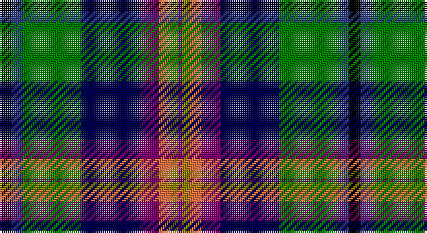

This page is one **sett** — a single exact thread-count. It belongs to the [tartan](/setts/k3db3g15dbi15dp5o3y2dp1/)
(the same proportion at any scale), whose colour order is pattern [BGRBBGBK](/stripes/bgrbbgbk/).

Part of the [Young](/tartans/young/) tartan — the named design grouping this sett with its other cloths.

Sourced from weddslist.  It is a [8 stripe tartan](/stripes/stripes8/).

Original link http://www.weddslist.com/cgi-bin/tartans/pg.pl?source=sts

## Thread count
K/6 B6 G30 DB30 P10 O6 LG4 P/2

One full sett is **180 threads**.

## Palette

Palette: <strong>Ingles Buchan</strong> <small style="color:#888">(1 of 7 colours)</small>
<table><thead><tr><th>Colour</th><th>Threads</th><th>Shade</th><th>Base</th><th>OKLCh</th></tr></thead><tbody><tr><td>K/</td><td style="text-align:right;font-variant-numeric:tabular-nums">6</td><td><code style="background-color:#000000;">#000000</code> <small style="color:#888">#000000</small></td><td>K <code style="background-color:#000000;">#000000</code></td><td><small style="color:#888">oklch(0.0% 0.000 0.0)</small></td></tr><tr><td>B</td><td style="text-align:right;font-variant-numeric:tabular-nums">6</td><td><code style="background-color:#304080;">#304080</code> <small style="color:#888">#304080</small></td><td>B <code style="background-color:#2A418A;">#2A418A</code></td><td><small style="color:#888">oklch(39.4% 0.109 270.2)</small></td></tr><tr><td>G</td><td style="text-align:right;font-variant-numeric:tabular-nums">30</td><td><code style="background-color:#008000;">#008000</code> <small style="color:#888">#008000</small></td><td>G <code style="background-color:#006100;">#006100</code></td><td><small style="color:#888">oklch(52.0% 0.177 142.5)</small></td></tr><tr><td>DB</td><td style="text-align:right;font-variant-numeric:tabular-nums">30</td><td><code style="background-color:#000050;">#000050</code> <small style="color:#888">#000050</small></td><td>B <code style="background-color:#2A418A;">#2A418A</code></td><td><small style="color:#888">oklch(19.5% 0.135 264.1)</small></td></tr><tr><td>P</td><td style="text-align:right;font-variant-numeric:tabular-nums">10</td><td><code style="background-color:#800070;">#800070</code> <small style="color:#888">#800070</small></td><td>B <code style="background-color:#2A418A;">#2A418A</code></td><td><small style="color:#888">oklch(41.1% 0.183 335.2)</small></td></tr><tr><td>O</td><td style="text-align:right;font-variant-numeric:tabular-nums">6</td><td><code style="background-color:#F07040;">#F07040</code> <small style="color:#888">#F07040</small></td><td>R <code style="background-color:#CC0000;">#CC0000</code></td><td><small style="color:#888">oklch(69.0% 0.170 40.2)</small></td></tr><tr><td>LG</td><td style="text-align:right;font-variant-numeric:tabular-nums">4</td><td><code style="background-color:#908000;">#908000</code> <small style="color:#888">#908000</small></td><td>G <code style="background-color:#006100;">#006100</code></td><td><small style="color:#888">oklch(59.6% 0.124 100.6)</small></td></tr><tr><td>P/</td><td style="text-align:right;font-variant-numeric:tabular-nums">2</td><td><code style="background-color:#800070;">#800070</code> <small style="color:#888">#800070</small></td><td>B <code style="background-color:#2A418A;">#2A418A</code></td><td><small style="color:#888">oklch(41.1% 0.183 335.2)</small></td></tr></tbody></table>

# Sample pattern

## Compared to the master

This cloth is one sett of its design; the master sett (the exemplar the design is anchored on) is below for comparison.

<figure style="margin:0"><figcaption style="color:#888;font-size:smaller">this sett</figcaption></figure>
<figure style="margin:0"><figcaption style="color:#888;font-size:smaller"><a href="/setts/db3t3g30db25dp4r3ly2dp1/">master sett →</a></figcaption></figure>

## Nearest tartans

The nearest existing variants by ΔTartan distance, with this tartan at the top so the swatches line up against it.

ΔTartan

Tartan

Sett

—

<a href="/ttd/edit/#slug=k3db3g15dbi15dp5o3y2dp1~x2">Young</a> <a class="nn-out" href="/variants/s8/k3db3g15dbi15dp5o3y2dp1~x2/" title="open its dictionary page">↗</a>

0.77

<a href="/ttd/edit/#slug=k3dbi3g15db15m5lo3ly2m1~x2&amp;base=k3db3g15dbi15dp5o3y2dp1~x2">Young Family Tartan</a> <a class="nn-out" href="/variants/s8/k3dbi3g15db15m5lo3ly2m1~x2/" title="open its dictionary page">↗</a>

0.81

<a href="/ttd/edit/#slug=k40n15o10ly3t5w5db10t20&amp;base=k3db3g15dbi15dp5o3y2dp1~x2">Julien Pigeut Tartan</a> <a class="nn-out" href="/variants/s8/k40n15o10ly3t5w5db10t20/" title="open its dictionary page">↗</a>

0.83

<a href="/ttd/edit/#slug=dg32lb3p3lb3dg2k20db17r3ly4~x2&amp;base=k3db3g15dbi15dp5o3y2dp1~x2">Colorado (District)</a> <a class="nn-out" href="/variants/s9/dg32lb3p3lb3dg2k20db17r3ly4~x2/" title="open its dictionary page">↗</a>

0.96

<a href="/ttd/edit/#slug=r4ly3g12k16dy5db20k4w2~x2&amp;base=k3db3g15dbi15dp5o3y2dp1~x2">Iowa (District)</a> <a class="nn-out" href="/variants/s8/r4ly3g12k16dy5db20k4w2~x2/" title="open its dictionary page">↗</a>

1.00

<a href="/variants/s10/dt24k24ki2w6ki2ly2ki16lb5r6w2~x2/">Scotland's International - Home (Fas</a>

1.06

<a href="/ttd/edit/#slug=g2ly1g13y2g1k12db10r1db1w2~x2&amp;base=k3db3g15dbi15dp5o3y2dp1~x2">Bullman (Name)</a> <a class="nn-out" href="/variants/s10/g2ly1g13y2g1k12db10r1db1w2~x2/" title="open its dictionary page">↗</a>

1.12

<a href="/ttd/edit/#slug=w3db5lt2db9dp10k2dp5k5dg9g31w2~x2&amp;base=k3db3g15dbi15dp5o3y2dp1~x2">Carnegie of Skibo Corporate Tartan</a> <a class="nn-out" href="/variants/s11/w3db5lt2db9dp10k2dp5k5dg9g31w2~x2/" title="open its dictionary page">↗</a>

1.13

<a href="/ttd/edit/#slug=t3k2r3g20k24db20r3k2ly3~x2&amp;base=k3db3g15dbi15dp5o3y2dp1~x2">Loch Awe</a> <a class="nn-out" href="/variants/s9/t3k2r3g20k24db20r3k2ly3~x2/" title="open its dictionary page">↗</a>

1.13

<a href="/ttd/edit/#slug=w10k52db52dg24ly10dg5r5&amp;base=k3db3g15dbi15dp5o3y2dp1~x2">Harvey of Cornwall (Personal)</a> <a class="nn-out" href="/variants/s7/w10k52db52dg24ly10dg5r5/" title="open its dictionary page">↗</a>

1.14

<a href="/ttd/edit/#slug=ly3k2r3db20k24g20r3k2lb3~x2&amp;base=k3db3g15dbi15dp5o3y2dp1~x2">Loch Awe</a> <a class="nn-out" href="/variants/s9/ly3k2r3db20k24g20r3k2lb3~x2/" title="open its dictionary page">↗</a>

## Neighbour map

Every grey dot is one of 14360 variants placed by the first two principal components of the ΔTartan feature space (44% of its variance). Red is this tartan; blue dots are its nearest — click one to open its page.

<svg viewBox="0 0 640 380" role="img" style="max-width:100%;height:auto;border:1px solid #e0e0e0;border-radius:4px;display:block" xmlns="http://www.w3.org/2000/svg"><image href="/nn/cloud.v1.png" width="640" height="380"/><a href="/variants/s8/k3dbi3g15db15m5lo3ly2m1~x2/"><circle cx="118.4" cy="132.8" r="4" fill="#3465a4"><title>Young Family Tartan</title></circle></a><a href="/variants/s8/k40n15o10ly3t5w5db10t20/"><circle cx="108.2" cy="136.6" r="4" fill="#3465a4"><title>Julien Pigeut Tartan</title></circle></a><a href="/variants/s9/dg32lb3p3lb3dg2k20db17r3ly4~x2/"><circle cx="135.0" cy="108.5" r="4" fill="#3465a4"><title>Colorado (District)</title></circle></a><a href="/variants/s8/r4ly3g12k16dy5db20k4w2~x2/"><circle cx="81.8" cy="157.7" r="4" fill="#3465a4"><title>Iowa (District)</title></circle></a><a href="/variants/s10/dt24k24ki2w6ki2ly2ki16lb5r6w2~x2/"><circle cx="65.2" cy="117.8" r="4" fill="#3465a4"><title>Scotland's International - Home (Fas</title></circle></a><a href="/variants/s10/g2ly1g13y2g1k12db10r1db1w2~x2/"><circle cx="137.5" cy="123.1" r="4" fill="#3465a4"><title>Bullman (Name)</title></circle></a><a href="/variants/s11/w3db5lt2db9dp10k2dp5k5dg9g31w2~x2/"><circle cx="134.0" cy="109.2" r="4" fill="#3465a4"><title>Carnegie of Skibo Corporate Tartan</title></circle></a><a href="/variants/s9/t3k2r3g20k24db20r3k2ly3~x2/"><circle cx="120.2" cy="135.3" r="4" fill="#3465a4"><title>Loch Awe</title></circle></a><a href="/variants/s7/w10k52db52dg24ly10dg5r5/"><circle cx="123.4" cy="168.4" r="4" fill="#3465a4"><title>Harvey of Cornwall (Personal)</title></circle></a><a href="/variants/s9/ly3k2r3db20k24g20r3k2lb3~x2/"><circle cx="145.0" cy="145.2" r="4" fill="#3465a4"><title>Loch Awe</title></circle></a><circle cx="102.3" cy="128.1" r="5" fill="#c00000"/></svg>

ID: /variants/s8/k3db3g15dbi15dp5o3y2dp1~x2/
