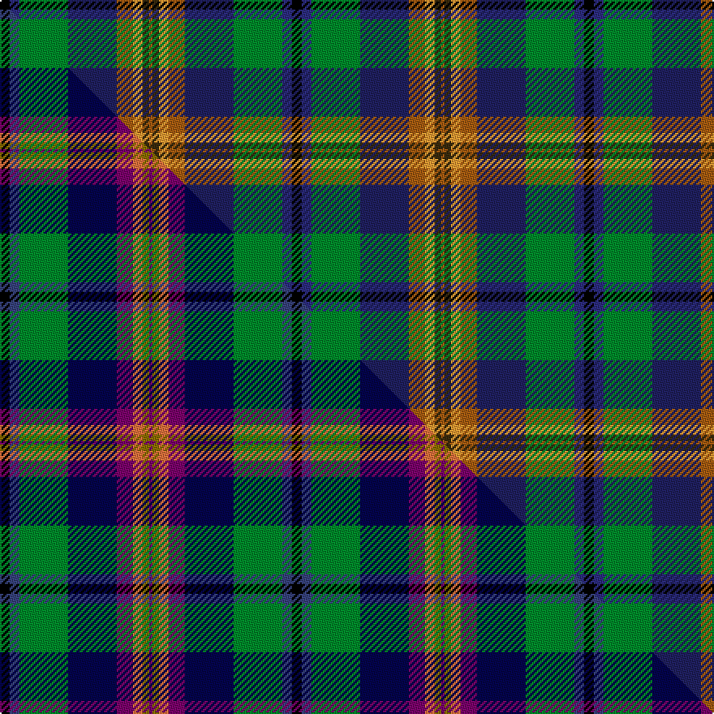

This is one **variant** — a specific cloth: this exact thread count and colourway, with its own
provenance below. It is one weaving of the [sett](/setts/k3dbi3g15db15o5lo3dy2o1/) (the scale-free proportion — the
same cloth at any scale or shade), whose colour order is pattern [KBGBRYGR](/stripes/kbgbrygr/).

Part of the [Young](/tartans/y/yo/young-2/) tartan — the named design grouping this sett with its other cloths.

Sourced from house-of-tartan.  It is a [8 stripe tartan](/stripes/stripes8/).

Original link [http://www.house-of-tartan.scotland.net/house/TartanViewjs.asp?colr=Def&tnam=2048](http://www.house-of-tartan.scotland.net/house/TartanViewjs.asp?colr=Def&tnam=2048)

## Provenance

Earliest known date: 1991 Based on the Christina Young blanket dating from 1726 and preserved at the Scottish Tartans Society museum in Keith, Banffshire. The design retains the unusual purple - yellow - orange box check of the original blanket and changes only the ground colour to the greens and blues of the Douglas tartan. There are 7 colours. Black is normally replaced by dark blue in commercial weaving.

Dataset <small>— provenance for this record, inherited from the source manifest</small>

<dl class="dataset-prov">
<dt>source</dt><dd><a href="/sources/house-of-tartan/">House of Tartan</a></dd>
<dt>data captured from</dt><dd><a href="https://github.com/thetartan/tartan-database/blob/master/data/house-of-tartan/data.csv">https://github.com/thetartan/tartan-database/blob/master/data/house-of-tartan/data.csv</a></dd>
<dt>data date</dt><dd>1991 <small>(this record)</small></dd>
<dt>licence</dt><dd><a href="https://creativecommons.org/licenses/by-nc-nd/4.0/">CC BY-NC-ND 4.0</a></dd>
</dl>

Capture chain <small>— the hands this data passed through, oldest first; each capture carries its own licence</small>

<ol class="capture-chain">
<li><a href="http://www.house-of-tartan.scotland.net/">House of Tartan</a> <small>the weaver/retailer's database — the site is now offline; the URL is kept as the ultimate source's identity</small></li>
<li><a href="https://github.com/thetartan/tartan-database">thetartan/tartan-database</a> <small>2016-2017</small> · <a href="https://creativecommons.org/licenses/by-nc-nd/4.0/">CC BY-NC-ND 4.0</a> <small>Levko Kravets's frozen compilation — the capture we vendored, and where its CC licence text came from</small></li>
<li>this dictionary <small>captured 2026-06-10 · commit 5bf86c7566</small> <small>each re-capture is a git commit to data/sources</small></li>
</ol>

## Thread count
K/6 DBi6 G30 DB30 O10 LO6 DY4 O/2

One full sett is **180 threads**.

## Palette
<table><thead><tr><th>Colour</th><th>Shade</th><th>OKLCh</th></tr></thead><tbody><tr><td>DB</td><td><code style="background-color:#2C2C80;">#2C2C80</code> <small style="color:#888">#2C2C80</small></td><td><small style="color:#888">oklch(35.0% 0.138 276.6)</small></td></tr><tr><td>DB</td><td><code style="background-color:#202060;">#202060</code> <small style="color:#888">#202060</small></td><td><small style="color:#888">oklch(28.9% 0.111 276.9)</small></td></tr><tr><td>G</td><td><code style="background-color:#008B2A;">#008B2A</code> <small style="color:#888">#008B2A</small></td><td><small style="color:#888">oklch(55.4% 0.170 145.9)</small></td></tr><tr><td>K</td><td><code style="background-color:#000000;">#000000</code> <small style="color:#888">#000000</small></td><td><small style="color:#888">oklch(0.0% 0.000 0.0)</small></td></tr><tr><td>LO</td><td><code style="background-color:#FF9C34;">#FF9C34</code> <small style="color:#888">#FF9C34</small></td><td><small style="color:#888">oklch(77.9% 0.161 61.8)</small></td></tr><tr><td>O</td><td><code style="background-color:#A65C11;">#A65C11</code> <small style="color:#888">#A65C11</small></td><td><small style="color:#888">oklch(55.0% 0.125 58.3)</small></td></tr><tr><td>DY</td><td><code style="background-color:#3A2B0D;">#3A2B0D</code> <small style="color:#888">#3A2B0D</small></td><td><small style="color:#888">oklch(30.0% 0.049 82.0)</small></td></tr></tbody></table>

# Sample pattern

## Compared to the master

This cloth is one sett of its design; the master sett (the exemplar the design is anchored on) is below for comparison.

Its **ΔTartan distance** from the master is **0.91** — the same measure the nearest-tartans table ranks by (0 is identical; a re-scale of the same cloth is near 0, a recolour or a different proportion further).

<figure class="master-compare" style="margin:0">

this sett
master sett ★

<figcaption style="color:#888;font-size:smaller">One weave of this sett against the <a href="/setts/k3dbi3g15db15dp5r3y2dp1/">master sett ★</a>, split on the diagonal: a shared proportion runs seamlessly across it with only the shades shifting; a different proportion breaks on it.</figcaption>
</figure>

## Nearest tartan variants

The nearest existing variants by ΔTartan distance, with this cloth at the top so the swatches line up against it.

ΔTartan

Threads

Variant

Sett

—

180

<a href="/variants/s8/k3dbi3g15db15o5lo3dy2o1~x2~dbi1406275-db1204274/">Young Family Tartan</a>

<a href="/ttd/edit/#slug=k3n3g15db15dp5r3y2dp1~x2~n1604274-db0805267-dp1607335-r2807041&amp;base=k3dbi3g15db15o5lo3dy2o1~x2~dbi1406275-db1204274" title="compare in the TTD">0.91</a>

180

<a href="/variants/s8/k3dbi3g15db15dp5r3y2dp1~x2~dbi1604274-db0805267-dp1607335-r2807041/">Young</a>

<a href="/ttd/edit/#slug=lo4k2dy15k2g15db15k2r1~x2&amp;base=k3dbi3g15db15o5lo3dy2o1~x2~dbi1406275-db1204274" title="compare in the TTD">2.04</a>

214

<a href="/variants/s8/lo4k2dy15k2g15db15k2r1~x2/">McCarter (2016)</a>

<a href="/ttd/edit/#slug=ly3r3lb4w2db11dg13k2~x2~r2109032-db1406275-dg1806142&amp;base=k3dbi3g15db15o5lo3dy2o1~x2~dbi1406275-db1204274" title="compare in the TTD">2.14</a>

142

<a href="/variants/s7/ly3r3lb4w2db11dg13k2~x2~r2109032-db1406275-dg1806142/">Kentucky State American District Tartan</a>

<a href="/ttd/edit/#slug=w3db5lb2db9dp10k2dp5k2dg8g29w2~x2&amp;base=k3dbi3g15db15o5lo3dy2o1~x2~dbi1406275-db1204274" title="compare in the TTD">2.37</a>

298

<a href="/variants/s11/w3db5lb2db9dp10k2dp5k2dg8g29w2~x2/">Carnegie of Skibo (Corporate)</a>

<a href="/ttd/edit/#slug=w3db5lt2db9dp10k2dp5k5dg9g31w2~x2&amp;base=k3dbi3g15db15o5lo3dy2o1~x2~dbi1406275-db1204274" title="compare in the TTD">2.39</a>

322

<a href="/variants/s11/w3db5lt2db9dp10k2dp5k5dg9g31w2~x2/">Carnegie of Skibo Corporate Tartan</a>

<a href="/ttd/edit/#slug=w3db4dg8k5dbi20g3y13g4w2~x2~db1004274-dbi1406275&amp;base=k3dbi3g15db15o5lo3dy2o1~x2~dbi1406275-db1204274" title="compare in the TTD">2.49</a>

238

<a href="/variants/s9/w3db4dg8k5dbi20g3y13g4w2~x2~db1004274-dbi1406275/">Armagh County Crest (Fashion)</a>

<a href="/ttd/edit/#slug=r2k6y1dg12y1db6lr2~x4~db1305279-lr3200000&amp;base=k3dbi3g15db15o5lo3dy2o1~x2~dbi1406275-db1204274" title="compare in the TTD">2.71</a>

224

<a href="/variants/s7/r2k6y1dg12y1db6lr2~x4~db1305279-lr3200000/">James (Personal)</a>

<a href="/ttd/edit/#slug=r2k6y1dg12y1db6lb2~x4&amp;base=k3dbi3g15db15o5lo3dy2o1~x2~dbi1406275-db1204274" title="compare in the TTD">2.72</a>

224

<a href="/variants/s7/r2k6y1dg12y1db6lb2~x4/">James (Personal)</a>

<a href="/ttd/edit/#slug=r5k12y2dg25y2db12lb5~x2&amp;base=k3dbi3g15db15o5lo3dy2o1~x2~dbi1406275-db1204274" title="compare in the TTD">2.73</a>

232

<a href="/variants/s7/r5k12y2dg25y2db12lb5~x2/">James</a>

<a href="/ttd/edit/#slug=db5w3r12g37k12dt21w2~x2~db1406275-dt1204274&amp;base=k3dbi3g15db15o5lo3dy2o1~x2~dbi1406275-db1204274" title="compare in the TTD">2.76</a>

354

<a href="/variants/s7/dbi5w3r12g37k12db21w2~x2~dbi1406275-db1204274/">Bergen Scottish</a>

## Neighbour map

Every grey dot is one of 13621 variants placed by the first two principal components of the ΔTartan feature space (42% of its variance). Red is this tartan; blue dots are its nearest — click one to open its page. The map is a flat projection of a many-dimensional space — [how to read it](/posts/neighbourhood-maps/).

<svg viewBox="0 0 640 380" role="img" style="max-width:100%;height:auto;border:1px solid #e0e0e0;border-radius:4px;display:block" xmlns="http://www.w3.org/2000/svg"><image href="/nn/cloud.v1.png" width="640" height="380"/><a href="/variants/s8/k3dbi3g15db15dp5r3y2dp1~x2~dbi1604274-db0805267-dp1607335-r2807041/"><circle cx="102.4" cy="131.4" r="4" fill="#3465a4"><title>Young</title></circle></a><a href="/variants/s8/lo4k2dy15k2g15db15k2r1~x2/"><circle cx="100.5" cy="146.8" r="4" fill="#3465a4"><title>McCarter (2016)</title></circle></a><a href="/variants/s7/ly3r3lb4w2db11dg13k2~x2~r2109032-db1406275-dg1806142/"><circle cx="66.1" cy="175.2" r="4" fill="#3465a4"><title>Kentucky State American District Tartan</title></circle></a><a href="/variants/s11/w3db5lb2db9dp10k2dp5k2dg8g29w2~x2/"><circle cx="110.7" cy="106.7" r="4" fill="#3465a4"><title>Carnegie of Skibo (Corporate)</title></circle></a><a href="/variants/s11/w3db5lt2db9dp10k2dp5k5dg9g31w2~x2/"><circle cx="104.8" cy="105.0" r="4" fill="#3465a4"><title>Carnegie of Skibo Corporate Tartan</title></circle></a><a href="/variants/s9/w3db4dg8k5dbi20g3y13g4w2~x2~db1004274-dbi1406275/"><circle cx="65.2" cy="148.7" r="4" fill="#3465a4"><title>Armagh County Crest (Fashion)</title></circle></a><a href="/variants/s7/r2k6y1dg12y1db6lr2~x4~db1305279-lr3200000/"><circle cx="148.1" cy="157.9" r="4" fill="#3465a4"><title>James (Personal)</title></circle></a><a href="/variants/s7/r2k6y1dg12y1db6lb2~x4/"><circle cx="145.6" cy="157.8" r="4" fill="#3465a4"><title>James (Personal)</title></circle></a><a href="/variants/s7/r5k12y2dg25y2db12lb5~x2/"><circle cx="138.3" cy="157.1" r="4" fill="#3465a4"><title>James</title></circle></a><a href="/variants/s7/dbi5w3r12g37k12db21w2~x2~dbi1406275-db1204274/"><circle cx="138.8" cy="137.2" r="4" fill="#3465a4"><title>Bergen Scottish</title></circle></a><circle cx="106.4" cy="131.9" r="5" fill="#c00000"/><text x="320" y="376" text-anchor="middle" font-size="11" fill="#999">ground</text><text x="11" y="190" text-anchor="middle" font-size="11" fill="#999" transform="rotate(-90 11 190)">complexity</text></svg>

ID: /variants/s8/k3dbi3g15db15o5lo3dy2o1~x2~dbi1406275-db1204274/
