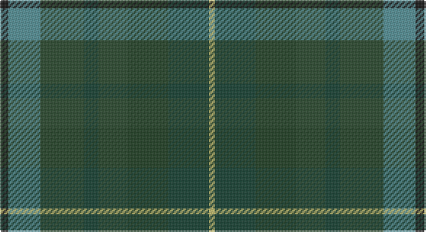

This page is one **sett** — a single exact thread-count. It belongs to the [tartan](/setts/k3g11dgii15dgi5dgii10dg14dgi14ly2/)
(the same proportion at any scale), whose colour order is pattern [KGGGGGGY](/stripes/kggggggy/).

Part of the [Brocéliande](/tartans/broc-liande/) tartan — the named design grouping this sett with its other cloths.

Sourced from register-of-tartans.  It is a [8 stripe tartan](/stripes/stripes8/).

Original link https://www.tartanregister.gov.uk/tartanDetails.aspx?ref=10812

## Also known as

This cloth is also recorded under:

- Brocliande )

## Register references

External register numbers recorded for this tartan.

- Scottish Register of Tartans: [10812](https://www.tartanregister.gov.uk/tartanDetails.aspx?ref=10812)

## Thread count
K/6 B22 DG30 DGa10 DG20 DGb28 DGa28 LG/4

One full sett is **286 threads**.

## Palette

Palette: <strong>Logan (The Scottish Gael, 1831)</strong> <small style="color:#888">(1 of 6 colours)</small>
<table><thead><tr><th>Colour</th><th>Threads</th><th>Shade</th><th>Base</th><th>OKLCh</th></tr></thead><tbody><tr><td>K/</td><td style="text-align:right;font-variant-numeric:tabular-nums">6</td><td><code style="background-color:#101010;">#101010</code> <small style="color:#888">#101010</small></td><td>K <code style="background-color:#000000;">#000000</code></td><td><small style="color:#888">oklch(17.3% 0.000 89.9)</small></td></tr><tr><td>B</td><td style="text-align:right;font-variant-numeric:tabular-nums">22</td><td><code style="background-color:#4F8E95;">#4F8E95</code> <small style="color:#888">#4F8E95</small></td><td>G <code style="background-color:#006100;">#006100</code></td><td><small style="color:#888">oklch(60.7% 0.066 204.9)</small></td></tr><tr><td>DG</td><td style="text-align:right;font-variant-numeric:tabular-nums">30</td><td><code style="background-color:#244528;">#244528</code> <small style="color:#888">#244528</small></td><td>G <code style="background-color:#006100;">#006100</code></td><td><small style="color:#888">oklch(35.6% 0.063 146.9)</small></td></tr><tr><td>DGa</td><td style="text-align:right;font-variant-numeric:tabular-nums">10</td><td><code style="background-color:#0F3C2D;">#0F3C2D</code> <small style="color:#888">#0F3C2D</small></td><td>G <code style="background-color:#006100;">#006100</code></td><td><small style="color:#888">oklch(32.1% 0.056 167.1)</small></td></tr><tr><td>DG</td><td style="text-align:right;font-variant-numeric:tabular-nums">20</td><td><code style="background-color:#244528;">#244528</code> <small style="color:#888">#244528</small></td><td>G <code style="background-color:#006100;">#006100</code></td><td><small style="color:#888">oklch(35.6% 0.063 146.9)</small></td></tr><tr><td>DGb</td><td style="text-align:right;font-variant-numeric:tabular-nums">28</td><td><code style="background-color:#193A1D;">#193A1D</code> <small style="color:#888">#193A1D</small></td><td>G <code style="background-color:#006100;">#006100</code></td><td><small style="color:#888">oklch(31.5% 0.064 146.4)</small></td></tr><tr><td>DGa</td><td style="text-align:right;font-variant-numeric:tabular-nums">28</td><td><code style="background-color:#0F3C2D;">#0F3C2D</code> <small style="color:#888">#0F3C2D</small></td><td>G <code style="background-color:#006100;">#006100</code></td><td><small style="color:#888">oklch(32.1% 0.056 167.1)</small></td></tr><tr><td>LG/</td><td style="text-align:right;font-variant-numeric:tabular-nums">4</td><td><code style="background-color:#C4BE6A;">#C4BE6A</code> <small style="color:#888">#C4BE6A</small></td><td>Y <code style="background-color:#F2BF00;">#F2BF00</code></td><td><small style="color:#888">oklch(78.8% 0.107 105.0)</small></td></tr></tbody></table>

# Sample pattern

## Nearest tartans

The nearest existing variants by ΔTartan distance, with this tartan at the top so the swatches line up against it.

ΔTartan

Tartan

Sett

—

<a href="/ttd/edit/#slug=k3g11dgii15dgi5dgii10dg14dgi14ly2~x2">Brocéliande (Restricted)</a> <a class="nn-out" href="/variants/s8/k3g11dgii15dgi5dgii10dg14dgi14ly2~x2/" title="open its dictionary page">↗</a>

1.66

<a href="/ttd/edit/#slug=dt4k9dgi20dp2dg20k5dt6lr2~x2&amp;base=k3g11dgii15dgi5dgii10dg14dgi14ly2~x2">Linden Family Tartan</a> <a class="nn-out" href="/variants/s8/dt4k9dgi20dp2dg20k5dt6lr2~x2/" title="open its dictionary page">↗</a>

1.76

<a href="/ttd/edit/#slug=b30o6dy16dp8dg10dp14dg24lo4dy10dp3dy28&amp;base=k3g11dgii15dgi5dgii10dg14dgi14ly2~x2">Greyfriars</a> <a class="nn-out" href="/variants/s11/b30o6dy16dp8dg10dp14dg24lo4dy10dp3dy28/" title="open its dictionary page">↗</a>

1.85

<a href="/ttd/edit/#slug=k3t11y15dgi5y10dg14dgi14lo2~x2&amp;base=k3g11dgii15dgi5dgii10dg14dgi14ly2~x2">Brocliande (Fashion))</a> <a class="nn-out" href="/variants/s8/k3t11y15dgi5y10dg14dgi14lo2~x2/" title="open its dictionary page">↗</a>

1.87

<a href="/ttd/edit/#slug=do26dt28g26dt8y3dt8g26dt28do26dr6~x2&amp;base=k3g11dgii15dgi5dgii10dg14dgi14ly2~x2">House of Bruar</a> <a class="nn-out" href="/variants/s10/do26dt28g26dt8y3dt8g26dt28do26dr6~x2/" title="open its dictionary page">↗</a>

1.89

<a href="/ttd/edit/#slug=dt8db10dt22dg7g10dg22dp3~x2&amp;base=k3g11dgii15dgi5dgii10dg14dgi14ly2~x2">Baron of Crawfordjohn (Personal)</a> <a class="nn-out" href="/variants/s7/dt8db10dt22dg7g10dg22dp3~x2/" title="open its dictionary page">↗</a>

1.93

<a href="/ttd/edit/#slug=dr6do26dt28g26dt8y3~x2&amp;base=k3g11dgii15dgi5dgii10dg14dgi14ly2~x2">House of Bruar (Corporate)</a> <a class="nn-out" href="/variants/s6/dr6do26dt28g26dt8y3~x2/" title="open its dictionary page">↗</a>

2.03

<a href="/ttd/edit/#slug=k15t4dt15dg24y4dg24dt15t4k15r4~x2&amp;base=k3g11dgii15dgi5dgii10dg14dgi14ly2~x2">Haughfoot</a> <a class="nn-out" href="/variants/s10/k15t4dt15dg24y4dg24dt15t4k15r4~x2/" title="open its dictionary page">↗</a>

2.06

<a href="/ttd/edit/#slug=r4n19g10o10y15ly2~x2&amp;base=k3g11dgii15dgi5dgii10dg14dgi14ly2~x2">Isle of Rona (District)</a> <a class="nn-out" href="/variants/s6/r4n19g10o10y15ly2~x2/" title="open its dictionary page">↗</a>

2.07

<a href="/ttd/edit/#slug=db10dt22dg7g10dg22dp3dg22g10dg7dt22db10dt8~x2&amp;base=k3g11dgii15dgi5dgii10dg14dgi14ly2~x2">Crawfordjohn Personal Tartan</a> <a class="nn-out" href="/variants/s12/db10dt22dg7g10dg22dp3dg22g10dg7dt22db10dt8~x2/" title="open its dictionary page">↗</a>

2.08

<a href="/ttd/edit/#slug=n5t4n22k15y22o4y4~x2&amp;base=k3g11dgii15dgi5dgii10dg14dgi14ly2~x2">Cairngorm #2</a> <a class="nn-out" href="/variants/s7/n5t4n22k15y22o4y4~x2/" title="open its dictionary page">↗</a>

## Neighbour map

Every grey dot is one of 14360 variants placed by the first two principal components of the ΔTartan feature space (44% of its variance). Red is this tartan; blue dots are its nearest — click one to open its page.

<svg viewBox="0 0 640 380" role="img" style="max-width:100%;height:auto;border:1px solid #e0e0e0;border-radius:4px;display:block" xmlns="http://www.w3.org/2000/svg"><image href="/nn/cloud.v1.png" width="640" height="380"/><a href="/variants/s8/dt4k9dgi20dp2dg20k5dt6lr2~x2/"><circle cx="200.9" cy="234.2" r="4" fill="#3465a4"><title>Linden Family Tartan</title></circle></a><a href="/variants/s11/b30o6dy16dp8dg10dp14dg24lo4dy10dp3dy28/"><circle cx="213.3" cy="231.6" r="4" fill="#3465a4"><title>Greyfriars</title></circle></a><a href="/variants/s8/k3t11y15dgi5y10dg14dgi14lo2~x2/"><circle cx="145.0" cy="250.0" r="4" fill="#3465a4"><title>Brocliande (Fashion))</title></circle></a><a href="/variants/s10/do26dt28g26dt8y3dt8g26dt28do26dr6~x2/"><circle cx="249.7" cy="268.8" r="4" fill="#3465a4"><title>House of Bruar</title></circle></a><a href="/variants/s7/dt8db10dt22dg7g10dg22dp3~x2/"><circle cx="242.7" cy="295.1" r="4" fill="#3465a4"><title>Baron of Crawfordjohn (Personal)</title></circle></a><a href="/variants/s6/dr6do26dt28g26dt8y3~x2/"><circle cx="252.0" cy="273.6" r="4" fill="#3465a4"><title>House of Bruar (Corporate)</title></circle></a><a href="/variants/s10/k15t4dt15dg24y4dg24dt15t4k15r4~x2/"><circle cx="179.1" cy="248.1" r="4" fill="#3465a4"><title>Haughfoot</title></circle></a><a href="/variants/s6/r4n19g10o10y15ly2~x2/"><circle cx="191.5" cy="253.5" r="4" fill="#3465a4"><title>Isle of Rona (District)</title></circle></a><a href="/variants/s12/db10dt22dg7g10dg22dp3dg22g10dg7dt22db10dt8~x2/"><circle cx="252.5" cy="292.2" r="4" fill="#3465a4"><title>Crawfordjohn Personal Tartan</title></circle></a><a href="/variants/s7/n5t4n22k15y22o4y4~x2/"><circle cx="218.8" cy="269.7" r="4" fill="#3465a4"><title>Cairngorm #2</title></circle></a><circle cx="177.3" cy="274.4" r="5" fill="#c00000"/></svg>

ID: /variants/s8/k3g11dgii15dgi5dgii10dg14dgi14ly2~x2/
