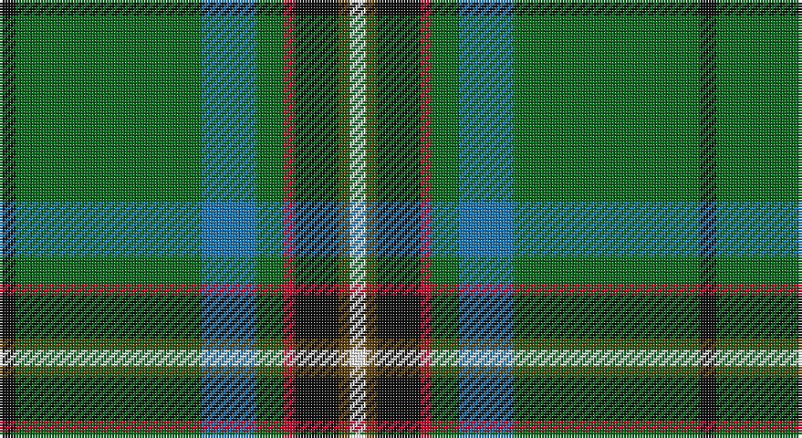

This page is one **sett** — a single exact thread-count. It belongs to the [tartan](/setts/k3g34b10g5r2k8dy2w3/)
(the same proportion at any scale), whose colour order is pattern [KGBGRKGW](/stripes/kgbgrkgw/).

Sourced from tartans-authority.  It is a [8 stripe tartan](/stripes/stripes8/).

Original link http://www.tartansauthority.com/tartan-ferret/display/10670/

## Register references

External register numbers recorded for this tartan.

- Scottish Register of Tartans: [10670](https://www.tartanregister.gov.uk/tartanDetails?ref=10670)
- Scottish Tartans Authority (ITI): 10670

## Thread count
K/6 G68 B20 G10 R4 K16 T4 W/6

One full sett is **256 threads**.

## Palette

Palette: <strong>Tartan Register</strong>
<table><thead><tr><th>Colour</th><th>Threads</th><th>Shade</th><th>Base</th><th>OKLCh</th></tr></thead><tbody><tr><td>K/</td><td style="text-align:right;font-variant-numeric:tabular-nums">6</td><td><code style="background-color:#101010;">#101010</code> <small style="color:#888">#101010</small></td><td>K <code style="background-color:#000000;">#000000</code></td><td><small style="color:#888">oklch(17.3% 0.000 89.9)</small></td></tr><tr><td>G</td><td style="text-align:right;font-variant-numeric:tabular-nums">68</td><td><code style="background-color:#006818;">#006818</code> <small style="color:#888">#006818</small></td><td>G <code style="background-color:#006100;">#006100</code></td><td><small style="color:#888">oklch(45.0% 0.142 145.0)</small></td></tr><tr><td>B</td><td style="text-align:right;font-variant-numeric:tabular-nums">20</td><td><code style="background-color:#1474B4;">#1474B4</code> <small style="color:#888">#1474B4</small></td><td>B <code style="background-color:#2A418A;">#2A418A</code></td><td><small style="color:#888">oklch(54.0% 0.129 245.1)</small></td></tr><tr><td>G</td><td style="text-align:right;font-variant-numeric:tabular-nums">10</td><td><code style="background-color:#006818;">#006818</code> <small style="color:#888">#006818</small></td><td>G <code style="background-color:#006100;">#006100</code></td><td><small style="color:#888">oklch(45.0% 0.142 145.0)</small></td></tr><tr><td>R</td><td style="text-align:right;font-variant-numeric:tabular-nums">4</td><td><code style="background-color:#C8002C;">#C8002C</code> <small style="color:#888">#C8002C</small></td><td>R <code style="background-color:#CC0000;">#CC0000</code></td><td><small style="color:#888">oklch(52.6% 0.212 22.0)</small></td></tr><tr><td>K</td><td style="text-align:right;font-variant-numeric:tabular-nums">16</td><td><code style="background-color:#101010;">#101010</code> <small style="color:#888">#101010</small></td><td>K <code style="background-color:#000000;">#000000</code></td><td><small style="color:#888">oklch(17.3% 0.000 89.9)</small></td></tr><tr><td>T</td><td style="text-align:right;font-variant-numeric:tabular-nums">4</td><td><code style="background-color:#604000;">#604000</code> <small style="color:#888">#604000</small></td><td>G <code style="background-color:#006100;">#006100</code></td><td><small style="color:#888">oklch(39.8% 0.083 76.8)</small></td></tr><tr><td>W/</td><td style="text-align:right;font-variant-numeric:tabular-nums">6</td><td><code style="background-color:#FCFCFC;">#FCFCFC</code> <small style="color:#888">#FCFCFC</small></td><td>W <code style="background-color:#F7F7F7;">#F7F7F7</code></td><td><small style="color:#888">oklch(99.1% 0.000 89.9)</small></td></tr></tbody></table>

# Sample pattern

## Nearest tartans

The nearest existing variants by ΔTartan distance, with this tartan at the top so the swatches line up against it.

ΔTartan

Tartan

Sett

—

<a href="/ttd/edit/#slug=k3g34b10g5r2k8dy2w3~x2">Lambert Kai (Personal)</a> <a class="nn-out" href="/variants/s8/k3g34b10g5r2k8dy2w3~x2/" title="open its dictionary page">↗</a>

1.00

<a href="/ttd/edit/#slug=db6k17y4gi51ly3g4~x2&amp;base=k3g34b10g5r2k8dy2w3~x2">U.S. Army (Military)</a> <a class="nn-out" href="/variants/s6/db6k17y4gi51ly3g4~x2/" title="open its dictionary page">↗</a>

1.01

<a href="/ttd/edit/#slug=w3r4db13g37t3k3ly2~x2&amp;base=k3g34b10g5r2k8dy2w3~x2">Washington District Tartan</a> <a class="nn-out" href="/variants/s7/w3r4db13g37t3k3ly2~x2/" title="open its dictionary page">↗</a>

1.09

<a href="/ttd/edit/#slug=g36dg5db17w2g14y3p2~x2&amp;base=k3g34b10g5r2k8dy2w3~x2">Mounth, The, (rejected)</a> <a class="nn-out" href="/variants/s7/g36dg5db17w2g14y3p2~x2/" title="open its dictionary page">↗</a>

1.12

<a href="/ttd/edit/#slug=k2b8k6g35k8lo2w2k2lo2~x2&amp;base=k3g34b10g5r2k8dy2w3~x2">160th SOAR(A) Night Stalkers (Mil.)</a> <a class="nn-out" href="/variants/s9/k2b8k6g35k8lo2w2k2lo2~x2/" title="open its dictionary page">↗</a>

1.12

<a href="/ttd/edit/#slug=w1db6g4db1g16k1g4k6ly1~x4&amp;base=k3g34b10g5r2k8dy2w3~x2">Henderson/MacKendrick</a> <a class="nn-out" href="/variants/s9/w1db6g4db1g16k1g4k6ly1~x4/" title="open its dictionary page">↗</a>

1.12

<a href="/ttd/edit/#slug=w1db6g4db1g16k1g4k6ly1~x2&amp;base=k3g34b10g5r2k8dy2w3~x2">MacKendrick</a> <a class="nn-out" href="/variants/s9/w1db6g4db1g16k1g4k6ly1~x2/" title="open its dictionary page">↗</a>

1.15

<a href="/ttd/edit/#slug=w3r4db13g37b3k3ly2~x2&amp;base=k3g34b10g5r2k8dy2w3~x2">Washington</a> <a class="nn-out" href="/variants/s7/w3r4db13g37b3k3ly2~x2/" title="open its dictionary page">↗</a>

1.17

<a href="/ttd/edit/#slug=g13dp1g1dp1g3db5k4ly2~x2&amp;base=k3g34b10g5r2k8dy2w3~x2">Carrick Hunting District Tartan</a> <a class="nn-out" href="/variants/s8/g13dp1g1dp1g3db5k4ly2~x2/" title="open its dictionary page">↗</a>

1.22

<a href="/ttd/edit/#slug=k17y4gi51ly3g4ly3gi51y4k17db6~x2&amp;base=k3g34b10g5r2k8dy2w3~x2">U.S. Army</a> <a class="nn-out" href="/variants/s10/k17y4gi51ly3g4ly3gi51y4k17db6~x2/" title="open its dictionary page">↗</a>

1.23

<a href="/ttd/edit/#slug=g30loi4k6lo2k2g4k2db5y4k2y3g2~x2&amp;base=k3g34b10g5r2k8dy2w3~x2">Bottle Green (Fashion)</a> <a class="nn-out" href="/variants/s12/g30loi4k6lo2k2g4k2db5y4k2y3g2~x2/" title="open its dictionary page">↗</a>

## Neighbour map

Every grey dot is one of 14360 variants placed by the first two principal components of the ΔTartan feature space (44% of its variance). Red is this tartan; blue dots are its nearest — click one to open its page.

<svg viewBox="0 0 640 380" role="img" style="max-width:100%;height:auto;border:1px solid #e0e0e0;border-radius:4px;display:block" xmlns="http://www.w3.org/2000/svg"><image href="/nn/cloud.v1.png" width="640" height="380"/><a href="/variants/s6/db6k17y4gi51ly3g4~x2/"><circle cx="339.3" cy="159.7" r="4" fill="#3465a4"><title>U.S. Army (Military)</title></circle></a><a href="/variants/s7/w3r4db13g37t3k3ly2~x2/"><circle cx="282.8" cy="115.5" r="4" fill="#3465a4"><title>Washington District Tartan</title></circle></a><a href="/variants/s7/g36dg5db17w2g14y3p2~x2/"><circle cx="321.7" cy="150.9" r="4" fill="#3465a4"><title>Mounth, The, (rejected)</title></circle></a><a href="/variants/s9/k2b8k6g35k8lo2w2k2lo2~x2/"><circle cx="290.7" cy="135.1" r="4" fill="#3465a4"><title>160th SOAR(A) Night Stalkers (Mil.)</title></circle></a><a href="/variants/s9/w1db6g4db1g16k1g4k6ly1~x4/"><circle cx="326.6" cy="166.2" r="4" fill="#3465a4"><title>Henderson/MacKendrick</title></circle></a><a href="/variants/s9/w1db6g4db1g16k1g4k6ly1~x2/"><circle cx="326.6" cy="166.2" r="4" fill="#3465a4"><title>MacKendrick</title></circle></a><a href="/variants/s7/w3r4db13g37b3k3ly2~x2/"><circle cx="269.5" cy="108.4" r="4" fill="#3465a4"><title>Washington</title></circle></a><a href="/variants/s8/g13dp1g1dp1g3db5k4ly2~x2/"><circle cx="288.9" cy="173.7" r="4" fill="#3465a4"><title>Carrick Hunting District Tartan</title></circle></a><a href="/variants/s10/k17y4gi51ly3g4ly3gi51y4k17db6~x2/"><circle cx="353.8" cy="143.8" r="4" fill="#3465a4"><title>U.S. Army</title></circle></a><a href="/variants/s12/g30loi4k6lo2k2g4k2db5y4k2y3g2~x2/"><circle cx="288.3" cy="122.0" r="4" fill="#3465a4"><title>Bottle Green (Fashion)</title></circle></a><circle cx="299.8" cy="136.0" r="5" fill="#c00000"/></svg>

ID: /variants/s8/k3g34b10g5r2k8dy2w3~x2/
