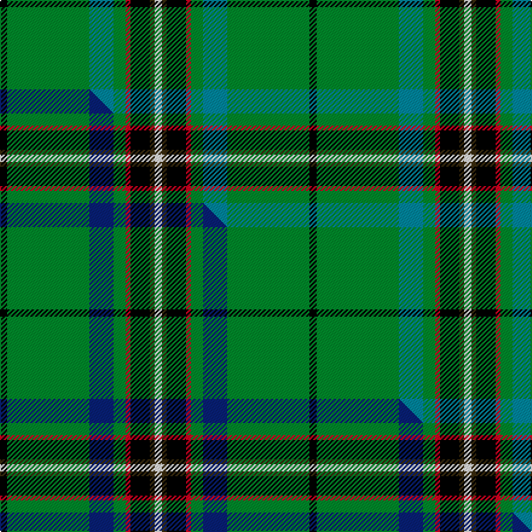

This page is one **sett** — a single exact thread-count. It belongs to the [tartan](/setts/k3g34t10g5r2k8dy2w3/)
(the same proportion at any scale), whose colour order is pattern [KGBGRKGW](/stripes/kgbgrkgw/).

Part of the [Lambert Kai](/tartans/lambert-kai/) tartan — the named design grouping this sett with its other cloths.

Sourced from tartans-authority.  It is a [8 stripe tartan](/stripes/stripes8/).

Original link http://www.tartansauthority.com/tartan-ferret/display/10670/

## Register references

External register numbers recorded for this tartan.

- Scottish Register of Tartans: [10670](https://www.tartanregister.gov.uk/tartanDetails?ref=10670)
- Scottish Tartans Authority (ITI): 10670

## Thread count
K/6 G68 T20 G10 R4 K16 DY4 W/6

One full sett is **256 threads**.

## Palette
<table><thead><tr><th>Colour</th><th>Shade</th><th>OKLCh</th></tr></thead><tbody><tr><td>T</td><td><code style="background-color:#00879F;">#00879F</code> <small style="color:#888">#00879F</small></td><td><small style="color:#888">oklch(57.4% 0.102 216.1)</small></td></tr><tr><td>G</td><td><code style="background-color:#008B2A;">#008B2A</code> <small style="color:#888">#008B2A</small></td><td><small style="color:#888">oklch(55.4% 0.170 145.9)</small></td></tr><tr><td>K</td><td><code style="background-color:#000000;">#000000</code> <small style="color:#888">#000000</small></td><td><small style="color:#888">oklch(0.0% 0.000 0.0)</small></td></tr><tr><td>R</td><td><code style="background-color:#D60020;">#D60020</code> <small style="color:#888">#D60020</small></td><td><small style="color:#888">oklch(55.2% 0.224 25.5)</small></td></tr><tr><td>DY</td><td><code style="background-color:#3A2B0D;">#3A2B0D</code> <small style="color:#888">#3A2B0D</small></td><td><small style="color:#888">oklch(30.0% 0.049 82.0)</small></td></tr><tr><td>W</td><td><code style="background-color:#F7F7F7;">#F7F7F7</code> <small style="color:#888">#F7F7F7</small></td><td><small style="color:#888">oklch(97.6% 0.000 89.9)</small></td></tr></tbody></table>

# Sample pattern

## Compared to the master

This cloth is one sett of its design; the master sett (the exemplar the design is anchored on) is below for comparison.

Its **ΔTartan distance** from the master is **0.09** — the same measure the nearest-tartans table ranks by (0 is identical; a re-scale of the same cloth is near 0, a recolour or a different proportion further).

<figure class="master-compare" style="margin:0">

this sett
master sett ★

<figcaption style="color:#888;font-size:smaller">One weave of this sett against the <a href="/setts/k3g34db10g5r2k8dy2w3/">master sett ★</a>, split on the diagonal: a shared proportion runs seamlessly across it with only the shades shifting; a different proportion breaks on it.</figcaption>
</figure>

## Nearest tartan variants

The nearest existing variants by ΔTartan distance, with this cloth at the top so the swatches line up against it.

ΔTartan

Threads

Variant

Sett

—

256

<a href="/variants/s8/k3g34t10g5r2k8dy2w3~x2/">Lambert Kai (Personal)</a>

<a href="/ttd/edit/#slug=k3g34db10g5r2k8dy2w3~x2&amp;base=k3g34t10g5r2k8dy2w3~x2" title="compare in the TTD">0.09</a>

256

<a href="/variants/s8/k3g34db10g5r2k8dy2w3~x2/">Lambert (Front Royal) Kai</a>

<a href="/ttd/edit/#slug=g41r6g12db8k2y5w8~x2&amp;base=k3g34t10g5r2k8dy2w3~x2" title="compare in the TTD">2.24</a>

230

<a href="/variants/s7/g41r6g12db8k2y5w8~x2/">Decatur Presbyterian Church</a>

<a href="/ttd/edit/#slug=k2w1g2dy6g2db4g2k2g15r2g2k1~x4&amp;base=k3g34t10g5r2k8dy2w3~x2" title="compare in the TTD">2.34</a>

316

<a href="/variants/s12/k2w1g2dy6g2db4g2k2g15r2g2k1~x4/">MacClure Htg (Name)</a>

<a href="/ttd/edit/#slug=db6g48k4y4k4w4g20r10k4r6w5&amp;base=k3g34t10g5r2k8dy2w3~x2" title="compare in the TTD">2.38</a>

219

<a href="/variants/s11/db6g48k4y4k4w4g20r10k4r6w5/">Steel (Personal)</a>

<a href="/ttd/edit/#slug=g30ly4k6lo2k2g4k2db5y4k2y3g2~x2&amp;base=k3g34t10g5r2k8dy2w3~x2" title="compare in the TTD">2.39</a>

200

<a href="/variants/s12/g30ly4k6lo2k2g4k2db5y4k2y3g2~x2/">Bottle Green (Fashion)</a>

<a href="/ttd/edit/#slug=y24k8r4k6g76k8w14g4k9g12dy10&amp;base=k3g34t10g5r2k8dy2w3~x2" title="compare in the TTD">2.40</a>

316

<a href="/variants/s11/y24k8r4k6g76k8w14g4k9g12dy10/">Offaly County, Crest Range</a>

<a href="/ttd/edit/#slug=dg4dr1dg12k1ly4k1dg3t5w2~x2&amp;base=k3g34t10g5r2k8dy2w3~x2" title="compare in the TTD">2.40</a>

120

<a href="/variants/s9/dg4dr1dg12k1ly4k1dg3t5w2~x2/">Lees-McRae College</a>

<a href="/ttd/edit/#slug=k2lr1g2dy6g2db4g2k2g15r2g2k1~x4&amp;base=k3g34t10g5r2k8dy2w3~x2" title="compare in the TTD">2.45</a>

316

<a href="/variants/s12/k2lr1g2dy6g2db4g2k2g15r2g2k1~x4/">MacClure Hunting Clan/Family Tartan</a>

<a href="/ttd/edit/#slug=db3k1g16lo1dr1lb1dr6g3dr1g3lb1~x4&amp;base=k3g34t10g5r2k8dy2w3~x2" title="compare in the TTD">2.49</a>

280

<a href="/variants/s11/db3k1g16lo1dr1lb1dr6g3dr1g3lb1~x4/">Canadian Caledonian Hunting</a>

<a href="/ttd/edit/#slug=g9lo1g2r3g28k16lb1g8lb1db8r1~x2&amp;base=k3g34t10g5r2k8dy2w3~x2" title="compare in the TTD">2.53</a>

292

<a href="/variants/s11/g9lo1g2r3g28k16lb1g8lb1db8r1~x2/">New York Caledonian Club Day</a>

## Neighbour map

Every grey dot is one of 13620 variants placed by the first two principal components of the ΔTartan feature space (42% of its variance). Red is this tartan; blue dots are its nearest — click one to open its page.

<svg viewBox="0 0 640 380" role="img" style="max-width:100%;height:auto;border:1px solid #e0e0e0;border-radius:4px;display:block" xmlns="http://www.w3.org/2000/svg"><image href="/nn/cloud.v1.png" width="640" height="380"/><a href="/variants/s8/k3g34db10g5r2k8dy2w3~x2/"><circle cx="244.9" cy="110.3" r="4" fill="#3465a4"><title>Lambert (Front Royal) Kai</title></circle></a><a href="/variants/s7/g41r6g12db8k2y5w8~x2/"><circle cx="312.6" cy="129.0" r="4" fill="#3465a4"><title>Decatur Presbyterian Church</title></circle></a><a href="/variants/s12/k2w1g2dy6g2db4g2k2g15r2g2k1~x4/"><circle cx="219.5" cy="107.5" r="4" fill="#3465a4"><title>MacClure Htg (Name)</title></circle></a><a href="/variants/s11/db6g48k4y4k4w4g20r10k4r6w5/"><circle cx="234.8" cy="109.5" r="4" fill="#3465a4"><title>Steel (Personal)</title></circle></a><a href="/variants/s12/g30ly4k6lo2k2g4k2db5y4k2y3g2~x2/"><circle cx="220.8" cy="94.1" r="4" fill="#3465a4"><title>Bottle Green (Fashion)</title></circle></a><a href="/variants/s11/y24k8r4k6g76k8w14g4k9g12dy10/"><circle cx="205.6" cy="91.6" r="4" fill="#3465a4"><title>Offaly County, Crest Range</title></circle></a><a href="/variants/s9/dg4dr1dg12k1ly4k1dg3t5w2~x2/"><circle cx="220.4" cy="142.5" r="4" fill="#3465a4"><title>Lees-McRae College</title></circle></a><a href="/variants/s12/k2lr1g2dy6g2db4g2k2g15r2g2k1~x4/"><circle cx="223.5" cy="108.5" r="4" fill="#3465a4"><title>MacClure Hunting Clan/Family Tartan</title></circle></a><a href="/variants/s11/db3k1g16lo1dr1lb1dr6g3dr1g3lb1~x4/"><circle cx="286.8" cy="108.5" r="4" fill="#3465a4"><title>Canadian Caledonian Hunting</title></circle></a><a href="/variants/s11/g9lo1g2r3g28k16lb1g8lb1db8r1~x2/"><circle cx="268.0" cy="84.7" r="4" fill="#3465a4"><title>New York Caledonian Club Day</title></circle></a><circle cx="250.3" cy="113.9" r="5" fill="#c00000"/><text x="320" y="376" text-anchor="middle" font-size="11" fill="#999">ground</text><text x="11" y="190" text-anchor="middle" font-size="11" fill="#999" transform="rotate(-90 11 190)">complexity</text></svg>

ID: /variants/s8/k3g34t10g5r2k8dy2w3~x2/
