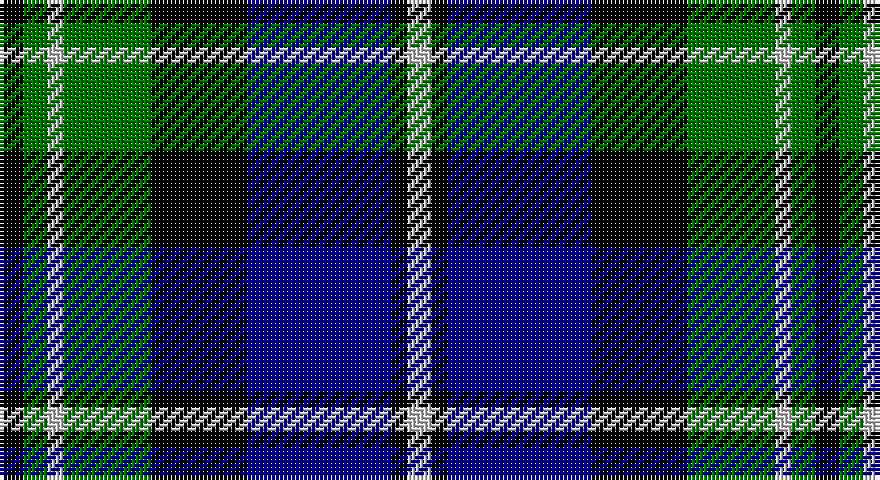

This page is one **sett** — a single exact thread-count. It belongs to the [tartan](/setts/k3g3lb2g11k12db18k2lb3/)
(the same proportion at any scale), whose colour order is pattern [KGWGKBKW](/stripes/kgwgkbkw/).

Sourced from register-of-tartans.  It is a [8 stripe tartan](/stripes/stripes8/).

Original link https://www.tartanregister.gov.uk/tartanDetails.aspx?ref=2233

## Also known as

This cloth is also recorded under:

- Louisiana (District

2 attestations — the source records this cloth was collapsed from (oldest owns this page)

<ul>
<li>01/01/2001 — Louisiana (register-of-tartans, <a href="https://www.tartanregister.gov.uk/tartanDetails.aspx?ref=2233">record</a>)</li>
<li>2001 — Louisiana (District (tartans-authority, <a href="http://www.tartansauthority.com/tartan-ferret/display/1945/">record</a>)</li>
</ul>

## Register references

External register numbers recorded for this tartan.

- Scottish Register of Tartans: [2233](https://www.tartanregister.gov.uk/tartanDetails.aspx?ref=2233)
- Scottish Tartans Authority (ITI): 1945
- Scottish Tartans World Register: 1945

## Thread count
K/6 G6 N4 G22 K24 DB36 K4 N/6

One full sett is **204 threads**.

## Palette

Palette: <strong>Tartan Register</strong>
<table><thead><tr><th>Colour</th><th>Threads</th><th>Shade</th><th>Base</th><th>OKLCh</th></tr></thead><tbody><tr><td>K/</td><td style="text-align:right;font-variant-numeric:tabular-nums">6</td><td><code style="background-color:#000000;">#000000</code> <small style="color:#888">#000000</small></td><td>K <code style="background-color:#000000;">#000000</code></td><td><small style="color:#888">oklch(0.0% 0.000 0.0)</small></td></tr><tr><td>G</td><td style="text-align:right;font-variant-numeric:tabular-nums">6</td><td><code style="background-color:#007800;">#007800</code> <small style="color:#888">#007800</small></td><td>G <code style="background-color:#006100;">#006100</code></td><td><small style="color:#888">oklch(49.6% 0.169 142.5)</small></td></tr><tr><td>N</td><td style="text-align:right;font-variant-numeric:tabular-nums">4</td><td><code style="background-color:#C8C8C8;">#C8C8C8</code> <small style="color:#888">#C8C8C8</small></td><td>W <code style="background-color:#F7F7F7;">#F7F7F7</code></td><td><small style="color:#888">oklch(83.3% 0.000 89.9)</small></td></tr><tr><td>G</td><td style="text-align:right;font-variant-numeric:tabular-nums">22</td><td><code style="background-color:#007800;">#007800</code> <small style="color:#888">#007800</small></td><td>G <code style="background-color:#006100;">#006100</code></td><td><small style="color:#888">oklch(49.6% 0.169 142.5)</small></td></tr><tr><td>K</td><td style="text-align:right;font-variant-numeric:tabular-nums">24</td><td><code style="background-color:#000000;">#000000</code> <small style="color:#888">#000000</small></td><td>K <code style="background-color:#000000;">#000000</code></td><td><small style="color:#888">oklch(0.0% 0.000 0.0)</small></td></tr><tr><td>DB</td><td style="text-align:right;font-variant-numeric:tabular-nums">36</td><td><code style="background-color:#00008C;">#00008C</code> <small style="color:#888">#00008C</small></td><td>B <code style="background-color:#2A418A;">#2A418A</code></td><td><small style="color:#888">oklch(28.9% 0.200 264.1)</small></td></tr><tr><td>K</td><td style="text-align:right;font-variant-numeric:tabular-nums">4</td><td><code style="background-color:#000000;">#000000</code> <small style="color:#888">#000000</small></td><td>K <code style="background-color:#000000;">#000000</code></td><td><small style="color:#888">oklch(0.0% 0.000 0.0)</small></td></tr><tr><td>N/</td><td style="text-align:right;font-variant-numeric:tabular-nums">6</td><td><code style="background-color:#C8C8C8;">#C8C8C8</code> <small style="color:#888">#C8C8C8</small></td><td>W <code style="background-color:#F7F7F7;">#F7F7F7</code></td><td><small style="color:#888">oklch(83.3% 0.000 89.9)</small></td></tr></tbody></table>

# Sample pattern

## Nearest tartans

The nearest existing variants by ΔTartan distance, with this tartan at the top so the swatches line up against it.

ΔTartan

Tartan

Sett

—

<a href="/ttd/edit/#slug=k3g3lb2g11k12db18k2lb3~x2">Louisiana</a> <a class="nn-out" href="/variants/s8/k3g3lb2g11k12db18k2lb3~x2/" title="open its dictionary page">↗</a>

0.93

<a href="/ttd/edit/#slug=db10k1db1k1db2k8g10w1~x2&amp;base=k3g3lb2g11k12db18k2lb3~x2">Lamont</a> <a class="nn-out" href="/variants/s8/db10k1db1k1db2k8g10w1~x2/" title="open its dictionary page">↗</a>

0.95

<a href="/ttd/edit/#slug=db8k2db2k2db2k8g7k1w1~x2&amp;base=k3g3lb2g11k12db18k2lb3~x2">Forbes</a> <a class="nn-out" href="/variants/s9/db8k2db2k2db2k8g7k1w1~x2/" title="open its dictionary page">↗</a>

0.99

<a href="/ttd/edit/#slug=db3k2db8k8g8p1g1p3~x2&amp;base=k3g3lb2g11k12db18k2lb3~x2">Baird</a> <a class="nn-out" href="/variants/s8/db3k2db8k8g8p1g1p3~x2/" title="open its dictionary page">↗</a>

1.05

<a href="/ttd/edit/#slug=db1k1db6k6g6k1w1~x2&amp;base=k3g3lb2g11k12db18k2lb3~x2">Forbes</a> <a class="nn-out" href="/variants/s7/db1k1db6k6g6k1w1~x2/" title="open its dictionary page">↗</a>

1.06

<a href="/ttd/edit/#slug=t1db11k11g11k2t1~x2&amp;base=k3g3lb2g11k12db18k2lb3~x2">Unnamed, No 59</a> <a class="nn-out" href="/variants/s6/t1db11k11g11k2t1~x2/" title="open its dictionary page">↗</a>

1.09

<a href="/ttd/edit/#slug=w1db9k9g9k2w1~x4&amp;base=k3g3lb2g11k12db18k2lb3~x2">MacNeil 1</a> <a class="nn-out" href="/variants/s6/w1db9k9g9k2w1~x4/" title="open its dictionary page">↗</a>

1.14

<a href="/variants/s8/db10k6t1g6k1~x2/">Unnamed, No 115</a>

1.17

<a href="/ttd/edit/#slug=r7db2g5k24db2g10db28g10lb3~x2&amp;base=k3g3lb2g11k12db18k2lb3~x2">Colgan (Personal)</a> <a class="nn-out" href="/variants/s9/r7db2g5k24db2g10db28g10lb3~x2/" title="open its dictionary page">↗</a>

1.19

<a href="/ttd/edit/#slug=db12r4db18r2k19g18r4g3lo2g8~x2&amp;base=k3g3lb2g11k12db18k2lb3~x2">Biskup (Personal)</a> <a class="nn-out" href="/variants/s10/db12r4db18r2k19g18r4g3lo2g8~x2/" title="open its dictionary page">↗</a>

1.23

<a href="/ttd/edit/#slug=db6k1db6k8r1g8k2~x2&amp;base=k3g3lb2g11k12db18k2lb3~x2">Fletcher</a> <a class="nn-out" href="/variants/s7/db6k1db6k8r1g8k2~x2/" title="open its dictionary page">↗</a>

## Neighbour map

Every grey dot is one of 14360 variants placed by the first two principal components of the ΔTartan feature space (44% of its variance). Red is this tartan; blue dots are its nearest — click one to open its page.

<svg viewBox="0 0 640 380" role="img" style="max-width:100%;height:auto;border:1px solid #e0e0e0;border-radius:4px;display:block" xmlns="http://www.w3.org/2000/svg"><image href="/nn/cloud.v1.png" width="640" height="380"/><a href="/variants/s8/db10k1db1k1db2k8g10w1~x2/"><circle cx="184.5" cy="190.6" r="4" fill="#3465a4"><title>Lamont</title></circle></a><a href="/variants/s9/db8k2db2k2db2k8g7k1w1~x2/"><circle cx="171.4" cy="207.8" r="4" fill="#3465a4"><title>Forbes</title></circle></a><a href="/variants/s8/db3k2db8k8g8p1g1p3~x2/"><circle cx="129.6" cy="218.2" r="4" fill="#3465a4"><title>Baird</title></circle></a><a href="/variants/s7/db1k1db6k6g6k1w1~x2/"><circle cx="142.7" cy="224.4" r="4" fill="#3465a4"><title>Forbes</title></circle></a><a href="/variants/s6/t1db11k11g11k2t1~x2/"><circle cx="167.5" cy="213.6" r="4" fill="#3465a4"><title>Unnamed, No 59</title></circle></a><a href="/variants/s6/w1db9k9g9k2w1~x4/"><circle cx="146.4" cy="218.0" r="4" fill="#3465a4"><title>MacNeil 1</title></circle></a><a href="/variants/s8/db10k6t1g6k1~x2/"><circle cx="146.4" cy="216.1" r="4" fill="#3465a4"><title>Unnamed, No 115</title></circle></a><a href="/variants/s9/r7db2g5k24db2g10db28g10lb3~x2/"><circle cx="149.4" cy="162.9" r="4" fill="#3465a4"><title>Colgan (Personal)</title></circle></a><a href="/variants/s10/db12r4db18r2k19g18r4g3lo2g8~x2/"><circle cx="117.7" cy="184.4" r="4" fill="#3465a4"><title>Biskup (Personal)</title></circle></a><a href="/variants/s7/db6k1db6k8r1g8k2~x2/"><circle cx="158.2" cy="233.5" r="4" fill="#3465a4"><title>Fletcher</title></circle></a><circle cx="137.5" cy="199.9" r="5" fill="#c00000"/></svg>

ID: /variants/s8/k3g3lb2g11k12db18k2lb3~x2/
