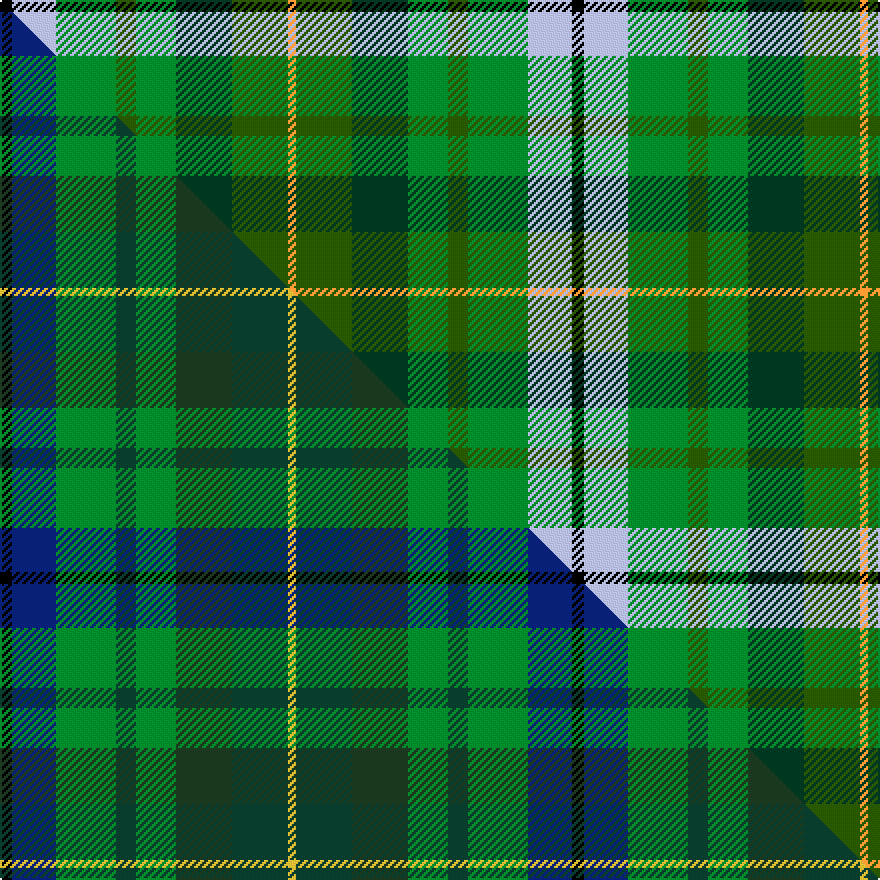

This is one **variant** — a specific cloth: this exact thread count and colourway, with its own
provenance below. It is one weaving of the [sett](/tartans/b/br/broc-liande/) (the scale-free proportion — the
same cloth at any scale or shade), whose colour order is pattern [KWGGGGGY](/stripes/kwgggggy/).

Part of the [Brocéliande](/tartans/b/br/broc-liande/) tartan — the named design grouping this sett with its other cloths.

Sourced from tartans-authority.  It is a [8 stripe tartan](/stripes/stripes8/).

Original link <code>http://www.tartansauthority.com/tartan-ferret/display/10812/</code> — retired · [Internet Archive copy](https://web.archive.org/web/*/http://www.tartansauthority.com/tartan-ferret/display/10812/*)

Dataset <small>— provenance for this record, inherited from the source manifest</small>

<dl class="dataset-prov">
<dt>source</dt><dd><a href="/sources/tartans-authority/">Scottish Tartans Authority</a></dd>
<dt>data captured from</dt><dd><a href="https://github.com/thetartan/tartan-database/blob/master/data/tartans-authority/data.csv">https://github.com/thetartan/tartan-database/blob/master/data/tartans-authority/data.csv</a></dd>
<dt>data date</dt><dd>14/04/2013 <small>(this record)</small></dd>
<dt>licence</dt><dd><a href="https://creativecommons.org/licenses/by-nc-nd/4.0/">CC BY-NC-ND 4.0</a></dd>
</dl>

Capture chain <small>— the hands this data passed through, oldest first; each capture carries its own licence</small>

<ol class="capture-chain">
<li><a href="https://www.tartansauthority.com/">Scottish Tartans Authority</a> <small>the heritage body’s archive — its tartan-ferret record browser is retired; dead record links are shown unlinked, with an Internet Archive copy (ITI numbers are not SRT references)</small></li>
<li><a href="https://github.com/thetartan/tartan-database">thetartan/tartan-database</a> <small>2016-2017</small> · <a href="https://creativecommons.org/licenses/by-nc-nd/4.0/">CC BY-NC-ND 4.0</a> <small>Levko Kravets's frozen compilation — the capture we vendored, and where its CC licence text came from</small></li>
<li>this dictionary <small>captured 2026-06-10 · commit 5bf86c7566</small> <small>each re-capture is a git commit to data/sources</small></li>
</ol>

## Register references

External register numbers recorded for this tartan.

- Scottish Register of Tartans: [10812](https://www.tartanregister.gov.uk/tartanDetails?ref=10812)
- Scottish Tartans Authority (ITI): 10812

## Thread count
K/6 LB22 G30 DGi10 G20 DG28 DGi28 LO/4

One full sett is **286 threads**.

## Palette
<table><thead><tr><th>Colour</th><th>Shade</th><th>OKLCh</th></tr></thead><tbody><tr><td>LB</td><td><code style="background-color:#B5BBDE;">#B5BBDE</code> <small style="color:#888">#B5BBDE</small></td><td><small style="color:#888">oklch(79.9% 0.050 277.6)</small></td></tr><tr><td>DG</td><td><code style="background-color:#003820;">#003820</code> <small style="color:#888">#003820</small></td><td><small style="color:#888">oklch(30.0% 0.070 158.3)</small></td></tr><tr><td>LO</td><td><code style="background-color:#FF9C34;">#FF9C34</code> <small style="color:#888">#FF9C34</small></td><td><small style="color:#888">oklch(77.9% 0.161 61.8)</small></td></tr><tr><td>G</td><td><code style="background-color:#008B2A;">#008B2A</code> <small style="color:#888">#008B2A</small></td><td><small style="color:#888">oklch(55.4% 0.170 145.9)</small></td></tr><tr><td>DG</td><td><code style="background-color:#285800;">#285800</code> <small style="color:#888">#285800</small></td><td><small style="color:#888">oklch(41.0% 0.122 135.8)</small></td></tr><tr><td>K</td><td><code style="background-color:#000000;">#000000</code> <small style="color:#888">#000000</small></td><td><small style="color:#888">oklch(0.0% 0.000 0.0)</small></td></tr></tbody></table>

# Sample pattern

## Compared to the master

This cloth is one sett of its design; the master sett (the exemplar the design is anchored on) is below for comparison.

Its **ΔTartan distance** from the master is **0.42** — the same measure the nearest-tartans table ranks by (0 is identical; a re-scale of the same cloth is near 0, a recolour or a different proportion further).

<figure class="master-compare" style="margin:0">

this sett
master sett ★

<figcaption style="color:#888;font-size:smaller">One weave of this sett against the <a href="/setts/k3db11g15dgi5g10dg14dgi14ly2/">master sett ★</a>, split on the diagonal: a shared proportion runs seamlessly across it with only the shades shifting; a different proportion breaks on it.</figcaption>
</figure>

## Nearest tartan variants

The nearest existing variants by ΔTartan distance, with this cloth at the top so the swatches line up against it.

ΔTartan

Threads

Variant

Sett

—

286

<a href="/variants/s8/k3lb11g15dgi5g10dg14dgi14lo2~x2~dgi4112135-dg3007159/">Brocliande (Fashion))</a>

<a href="/ttd/edit/#slug=k3db11g15dgi5g10dg14dgi14ly2~x2~dgi3206168-dg3106147&amp;base=k3lb11g15dgi5g10dg14dgi14lo2~x2~dgi4112135-dg3007159" title="compare in the TTD">0.42</a>

286

<a href="/variants/s8/k3db11g15dgi5g10dg14dgi14ly2~x2~dgi3206168-dg3106147/">Brocéliande (Restricted)</a>

<a href="/ttd/edit/#slug=dbi8g11k3g11dr12db10y2~x2~dbi3514276-db3409246&amp;base=k3lb11g15dgi5g10dg14dgi14lo2~x2~dgi4112135-dg3007159" title="compare in the TTD">3.18</a>

208

<a href="/variants/s7/dbi8g11k3g11dr12db10y2~x2~dbi3514276-db3409246/">Parliament Trade Tartan</a>

<a href="/ttd/edit/#slug=lyi5g23t21ly30k10ly4g4ly16w3~x2~lyi6614084-ly6307084&amp;base=k3lb11g15dgi5g10dg14dgi14lo2~x2~dgi4112135-dg3007159" title="compare in the TTD">3.41</a>

448

<a href="/variants/s9/lyi5g23t21ly30k10ly4g4ly16w3~x2~lyi6614084-ly6307084/">State Seal of Kansas (Fashion)</a>

<a href="/ttd/edit/#slug=dg12g6r1g10dp8y2w2~x4&amp;base=k3lb11g15dgi5g10dg14dgi14lo2~x2~dgi4112135-dg3007159" title="compare in the TTD">3.45</a>

272

<a href="/variants/s7/dg12g6r1g10dp8y2w2~x4/">Connelly, James (Personal)</a>

<a href="/ttd/edit/#slug=k1lr1g5dp1g2dy5lr1y3lr1~x4&amp;base=k3lb11g15dgi5g10dg14dgi14lo2~x2~dgi4112135-dg3007159" title="compare in the TTD">3.45</a>

152

<a href="/variants/s9/k1lr1g5dp1g2dy5lr1y3lr1~x4/">Corcoran of Sherbrooke (Personal)</a>

<a href="/ttd/edit/#slug=g1lr1g6db5dg6r1dg1lo1~x4~dg4112135&amp;base=k3lb11g15dgi5g10dg14dgi14lo2~x2~dgi4112135-dg3007159" title="compare in the TTD">3.51</a>

168

<a href="/variants/s8/g1lr1g6db5dg6r1dg1lo1~x4~dg4112135/">Vermont District USA Tartan</a>

<a href="/ttd/edit/#slug=g9lb2g9k2dy14ly4lb2r2~x4~dy3908078-ly8117093&amp;base=k3lb11g15dgi5g10dg14dgi14lo2~x2~dgi4112135-dg3007159" title="compare in the TTD">3.53</a>

308

<a href="/variants/s8/g9lb2g9k2dy14ly4lb2r2~x4~dy3908078-ly8117093/">McShane (Personal)</a>

<a href="/ttd/edit/#slug=g14dt11y3k5y3dt11g14ly2~x2&amp;base=k3lb11g15dgi5g10dg14dgi14lo2~x2~dgi4112135-dg3007159" title="compare in the TTD">3.54</a>

220

<a href="/variants/s8/g14dt11y3k5y3dt11g14ly2~x2/">Wilson's No.122</a>

<a href="/ttd/edit/#slug=dg29g16k8r4dg16g16y4r4k16t4g28dg16&amp;base=k3lb11g15dgi5g10dg14dgi14lo2~x2~dgi4112135-dg3007159" title="compare in the TTD">3.56</a>

277

<a href="/variants/s12/dg29g16k8r4dg16g16y4r4k16t4g28dg16/">MacCamley Clan Tartan</a>

<a href="/ttd/edit/#slug=dg29g16k8r4dg16g16y4r4k16gi4g28dg16~dg3007159-gi5007204&amp;base=k3lb11g15dgi5g10dg14dgi14lo2~x2~dgi4112135-dg3007159" title="compare in the TTD">3.56</a>

277

<a href="/variants/s12/dg29g16k8r4dg16g16y4r4k16gi4g28dg16~dg3007159-gi5007204/">McCamley (Personal)</a>

## Neighbour map

Every grey dot is one of 13662 variants placed by the first two principal components of the ΔTartan feature space (42% of its variance). Red is this tartan; blue dots are its nearest — click one to open its page. The map is a flat projection of a many-dimensional space — [how to read it](/posts/neighbourhood-maps/).

<svg viewBox="0 0 640 380" role="img" style="max-width:100%;height:auto;border:1px solid #e0e0e0;border-radius:4px;display:block" xmlns="http://www.w3.org/2000/svg"><image href="/nn/cloud.v1.png" width="640" height="380"/><a href="/variants/s8/k3db11g15dgi5g10dg14dgi14ly2~x2~dgi3206168-dg3106147/"><circle cx="126.5" cy="233.4" r="4" fill="#3465a4"><title>Brocéliande (Restricted)</title></circle></a><a href="/variants/s7/dbi8g11k3g11dr12db10y2~x2~dbi3514276-db3409246/"><circle cx="114.0" cy="241.9" r="4" fill="#3465a4"><title>Parliament Trade Tartan</title></circle></a><a href="/variants/s9/lyi5g23t21ly30k10ly4g4ly16w3~x2~lyi6614084-ly6307084/"><circle cx="176.3" cy="187.5" r="4" fill="#3465a4"><title>State Seal of Kansas (Fashion)</title></circle></a><a href="/variants/s7/dg12g6r1g10dp8y2w2~x4/"><circle cx="173.8" cy="199.4" r="4" fill="#3465a4"><title>Connelly, James (Personal)</title></circle></a><a href="/variants/s9/k1lr1g5dp1g2dy5lr1y3lr1~x4/"><circle cx="95.8" cy="204.4" r="4" fill="#3465a4"><title>Corcoran of Sherbrooke (Personal)</title></circle></a><a href="/variants/s8/g1lr1g6db5dg6r1dg1lo1~x4~dg4112135/"><circle cx="143.6" cy="213.7" r="4" fill="#3465a4"><title>Vermont District USA Tartan</title></circle></a><a href="/variants/s8/g9lb2g9k2dy14ly4lb2r2~x4~dy3908078-ly8117093/"><circle cx="149.3" cy="190.5" r="4" fill="#3465a4"><title>McShane (Personal)</title></circle></a><a href="/variants/s8/g14dt11y3k5y3dt11g14ly2~x2/"><circle cx="181.2" cy="224.8" r="4" fill="#3465a4"><title>Wilson's No.122</title></circle></a><a href="/variants/s12/dg29g16k8r4dg16g16y4r4k16t4g28dg16/"><circle cx="114.1" cy="184.9" r="4" fill="#3465a4"><title>MacCamley Clan Tartan</title></circle></a><a href="/variants/s12/dg29g16k8r4dg16g16y4r4k16gi4g28dg16~dg3007159-gi5007204/"><circle cx="115.2" cy="185.2" r="4" fill="#3465a4"><title>McCamley (Personal)</title></circle></a><circle cx="102.1" cy="226.9" r="5" fill="#c00000"/><text x="320" y="376" text-anchor="middle" font-size="11" fill="#999">ground</text><text x="11" y="190" text-anchor="middle" font-size="11" fill="#999" transform="rotate(-90 11 190)">complexity</text></svg>

ID: /variants/s8/k3lb11g15dgi5g10dg14dgi14lo2~x2~dgi4112135-dg3007159/
