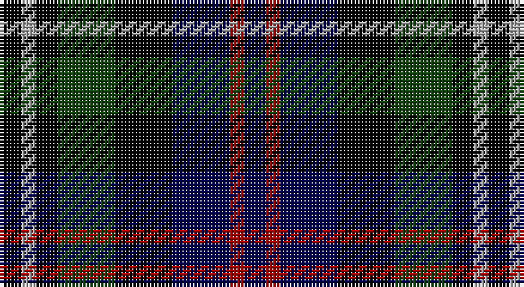

This page is one **sett** — a single exact thread-count. It belongs to the [tartan](/setts/k3lr2k3dg8k8db8r2db3/)
(the same proportion at any scale), whose colour order is pattern [BRBKGKYK](/stripes/brbkgkyk/).

Part of the [Davidson 'Double'](/tartans/davidson-double/) tartan — the named design grouping this sett with its other cloths.

Sourced from weddslist.  It is a [8 stripe tartan](/stripes/stripes8/).

Original link http://www.weddslist.com/cgi-bin/tartans/pg.pl?source=tinsel

## Also known as

This cloth is also recorded under:

- Davidson Double
- Davidson Double..
- Davidson, Double
- Davidson, Double..

## Thread count
K/6 N4 K6 DG16 K16 DB16 DR4 DB/6

One full sett is **136 threads**.

## Palette

Palette: <strong>Ingles Buchan</strong> <small style="color:#888">(1 of 5 colours)</small>
<table><thead><tr><th>Colour</th><th>Threads</th><th>Shade</th><th>Base</th><th>OKLCh</th></tr></thead><tbody><tr><td>K/</td><td style="text-align:right;font-variant-numeric:tabular-nums">6</td><td><code style="background-color:#000000;">#000000</code> <small style="color:#888">#000000</small></td><td>K <code style="background-color:#000000;">#000000</code></td><td><small style="color:#888">oklch(0.0% 0.000 0.0)</small></td></tr><tr><td>N</td><td style="text-align:right;font-variant-numeric:tabular-nums">4</td><td><code style="background-color:#AAAAAA;">#AAAAAA</code> <small style="color:#888">#AAAAAA</small></td><td>Y <code style="background-color:#F2BF00;">#F2BF00</code></td><td><small style="color:#888">oklch(73.8% 0.000 89.9)</small></td></tr><tr><td>K</td><td style="text-align:right;font-variant-numeric:tabular-nums">6</td><td><code style="background-color:#000000;">#000000</code> <small style="color:#888">#000000</small></td><td>K <code style="background-color:#000000;">#000000</code></td><td><small style="color:#888">oklch(0.0% 0.000 0.0)</small></td></tr><tr><td>DG</td><td style="text-align:right;font-variant-numeric:tabular-nums">16</td><td><code style="background-color:#11450D;">#11450D</code> <small style="color:#888">#11450D</small></td><td>G <code style="background-color:#006100;">#006100</code></td><td><small style="color:#888">oklch(34.4% 0.101 142.1)</small></td></tr><tr><td>K</td><td style="text-align:right;font-variant-numeric:tabular-nums">16</td><td><code style="background-color:#000000;">#000000</code> <small style="color:#888">#000000</small></td><td>K <code style="background-color:#000000;">#000000</code></td><td><small style="color:#888">oklch(0.0% 0.000 0.0)</small></td></tr><tr><td>DB</td><td style="text-align:right;font-variant-numeric:tabular-nums">16</td><td><code style="background-color:#000052;">#000052</code> <small style="color:#888">#000052</small></td><td>B <code style="background-color:#2A418A;">#2A418A</code></td><td><small style="color:#888">oklch(19.8% 0.137 264.1)</small></td></tr><tr><td>DR</td><td style="text-align:right;font-variant-numeric:tabular-nums">4</td><td><code style="background-color:#AA0000;">#AA0000</code> <small style="color:#888">#AA0000</small></td><td>R <code style="background-color:#CC0000;">#CC0000</code></td><td><small style="color:#888">oklch(46.3% 0.190 29.2)</small></td></tr><tr><td>DB/</td><td style="text-align:right;font-variant-numeric:tabular-nums">6</td><td><code style="background-color:#000052;">#000052</code> <small style="color:#888">#000052</small></td><td>B <code style="background-color:#2A418A;">#2A418A</code></td><td><small style="color:#888">oklch(19.8% 0.137 264.1)</small></td></tr></tbody></table>

# Sample pattern

## Compared to the master

This cloth is one sett of its design; the master sett (the exemplar the design is anchored on) is below for comparison.

<figure style="margin:0"><figcaption style="color:#888;font-size:smaller">this sett</figcaption></figure>
<figure style="margin:0"><figcaption style="color:#888;font-size:smaller"><a href="/setts/k3w2k3g8k8db8r2db3/">master sett →</a></figcaption></figure>

## Nearest tartans

The nearest existing variants by ΔTartan distance, with this tartan at the top so the swatches line up against it.

ΔTartan

Tartan

Sett

—

<a href="/ttd/edit/#slug=k3lr2k3dg8k8db8r2db3~x2">Davidson Double</a> <a class="nn-out" href="/variants/s8/k3lr2k3dg8k8db8r2db3~x2/" title="open its dictionary page">↗</a>

0.00

<a href="/ttd/edit/#slug=k3lr2k3dg8k8db8r2db3&amp;base=k3lr2k3dg8k8db8r2db3~x2">Davidson Double</a> <a class="nn-out" href="/variants/s8/k3lr2k3dg8k8db8r2db3/" title="open its dictionary page">↗</a>

0.90

<a href="/ttd/edit/#slug=dg3lb2k3dg8k8db8r2db3&amp;base=k3lr2k3dg8k8db8r2db3~x2">Davidson Double</a> <a class="nn-out" href="/variants/s8/dg3lb2k3dg8k8db8r2db3/" title="open its dictionary page">↗</a>

0.97

<a href="/ttd/edit/#slug=r1k2dg4k1dg1k2db3k1w1~x6&amp;base=k3lr2k3dg8k8db8r2db3~x2">MacKean dress</a> <a class="nn-out" href="/variants/s9/r1k2dg4k1dg1k2db3k1w1~x6/" title="open its dictionary page">↗</a>

1.25

<a href="/ttd/edit/#slug=r2k8ly1k8dg8db8r2~x2&amp;base=k3lr2k3dg8k8db8r2db3~x2">Brodie Hunting</a> <a class="nn-out" href="/variants/s7/r2k8ly1k8dg8db8r2~x2/" title="open its dictionary page">↗</a>

1.26

<a href="/ttd/edit/#slug=db8k4lo2k3r2k3lo2k4g8~x4&amp;base=k3lr2k3dg8k8db8r2db3~x2">Vosko</a> <a class="nn-out" href="/variants/s9/db8k4lo2k3r2k3lo2k4g8~x4/" title="open its dictionary page">↗</a>

1.28

<a href="/ttd/edit/#slug=k3w2k3g8k8db8r2db3~x2&amp;base=k3lr2k3dg8k8db8r2db3~x2">Davidson, Double</a> <a class="nn-out" href="/variants/s8/k3w2k3g8k8db8r2db3~x2/" title="open its dictionary page">↗</a>

1.30

<a href="/ttd/edit/#slug=o8g4db16g4k14o14db4b3~x2&amp;base=k3lr2k3dg8k8db8r2db3~x2">Hinnigan (Personal)</a> <a class="nn-out" href="/variants/s8/o8g4db16g4k14o14db4b3~x2/" title="open its dictionary page">↗</a>

1.33

<a href="/ttd/edit/#slug=k8r1db8lb1db8r1k8dg8k1dg8~x2&amp;base=k3lr2k3dg8k8db8r2db3~x2">Hunter</a> <a class="nn-out" href="/variants/s10/k8r1db8lb1db8r1k8dg8k1dg8~x2/" title="open its dictionary page">↗</a>

1.36

<a href="/ttd/edit/#slug=r1db6k3dg6lr1~x2&amp;base=k3lr2k3dg8k8db8r2db3~x2">Davidson of Tulloch</a> <a class="nn-out" href="/variants/s5/r1db6k3dg6lr1~x2/" title="open its dictionary page">↗</a>

1.38

<a href="/variants/s6/o7ki20o4k18y20dp5~x2/">Williamson (Personal)</a>

## Neighbour map

Every grey dot is one of 14360 variants placed by the first two principal components of the ΔTartan feature space (44% of its variance). Red is this tartan; blue dots are its nearest — click one to open its page.

<svg viewBox="0 0 640 380" role="img" style="max-width:100%;height:auto;border:1px solid #e0e0e0;border-radius:4px;display:block" xmlns="http://www.w3.org/2000/svg"><image href="/nn/cloud.v1.png" width="640" height="380"/><a href="/variants/s8/k3lr2k3dg8k8db8r2db3/"><circle cx="111.7" cy="254.6" r="4" fill="#3465a4"><title>Davidson Double</title></circle></a><a href="/variants/s8/dg3lb2k3dg8k8db8r2db3/"><circle cx="66.4" cy="246.5" r="4" fill="#3465a4"><title>Davidson Double</title></circle></a><a href="/variants/s9/r1k2dg4k1dg1k2db3k1w1~x6/"><circle cx="89.3" cy="235.4" r="4" fill="#3465a4"><title>MacKean dress</title></circle></a><a href="/variants/s7/r2k8ly1k8dg8db8r2~x2/"><circle cx="165.5" cy="232.4" r="4" fill="#3465a4"><title>Brodie Hunting</title></circle></a><a href="/variants/s9/db8k4lo2k3r2k3lo2k4g8~x4/"><circle cx="104.7" cy="242.7" r="4" fill="#3465a4"><title>Vosko</title></circle></a><a href="/variants/s8/k3w2k3g8k8db8r2db3~x2/"><circle cx="104.3" cy="244.0" r="4" fill="#3465a4"><title>Davidson, Double</title></circle></a><a href="/variants/s8/o8g4db16g4k14o14db4b3~x2/"><circle cx="84.4" cy="225.6" r="4" fill="#3465a4"><title>Hinnigan (Personal)</title></circle></a><a href="/variants/s10/k8r1db8lb1db8r1k8dg8k1dg8~x2/"><circle cx="133.4" cy="215.2" r="4" fill="#3465a4"><title>Hunter</title></circle></a><a href="/variants/s5/r1db6k3dg6lr1~x2/"><circle cx="140.3" cy="250.6" r="4" fill="#3465a4"><title>Davidson of Tulloch</title></circle></a><a href="/variants/s6/o7ki20o4k18y20dp5~x2/"><circle cx="76.8" cy="252.6" r="4" fill="#3465a4"><title>Williamson (Personal)</title></circle></a><circle cx="111.7" cy="254.6" r="5" fill="#c00000"/></svg>

ID: /variants/s8/k3lr2k3dg8k8db8r2db3~x2/
