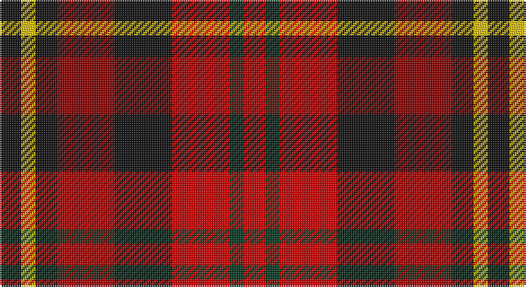

This page is one **sett** — a single exact thread-count. It belongs to the [tartan](/setts/k3ly2k3ri8k8r8dg2r3/)
(the same proportion at any scale), whose colour order is pattern [KYKRKRGR](/stripes/kykrkrgr/).

Sourced from register-of-tartans.  It is a [8 stripe tartan](/stripes/stripes8/).

Original link https://www.tartanregister.gov.uk/tartanDetails.aspx?ref=898

2 attestations — the source records this cloth was collapsed from (oldest owns this page)

<ul>
<li>01/01/2003 — Davis (register-of-tartans, <a href="https://www.tartanregister.gov.uk/tartanDetails.aspx?ref=898">record</a>)</li>
<li>2003 — Davis (Name) (tartans-authority, <a href="http://www.tartansauthority.com/tartan-ferret/display/5770/">record</a>)</li>
</ul>

## Register references

External register numbers recorded for this tartan.

- Scottish Register of Tartans: [898](https://www.tartanregister.gov.uk/tartanDetails.aspx?ref=898)
- Scottish Tartans Authority (ITI): 5770

## Thread count
K/12 Y8 K12 DR32 K32 R32 DG8 R/12

One full sett is **272 threads**.

## Palette

Palette: <strong>Tartan Register</strong>
<table><thead><tr><th>Colour</th><th>Threads</th><th>Shade</th><th>Base</th><th>OKLCh</th></tr></thead><tbody><tr><td>K/</td><td style="text-align:right;font-variant-numeric:tabular-nums">12</td><td><code style="background-color:#101010;">#101010</code> <small style="color:#888">#101010</small></td><td>K <code style="background-color:#000000;">#000000</code></td><td><small style="color:#888">oklch(17.3% 0.000 89.9)</small></td></tr><tr><td>Y</td><td style="text-align:right;font-variant-numeric:tabular-nums">8</td><td><code style="background-color:#E8C000;">#E8C000</code> <small style="color:#888">#E8C000</small></td><td>Y <code style="background-color:#F2BF00;">#F2BF00</code></td><td><small style="color:#888">oklch(81.9% 0.168 93.7)</small></td></tr><tr><td>K</td><td style="text-align:right;font-variant-numeric:tabular-nums">12</td><td><code style="background-color:#101010;">#101010</code> <small style="color:#888">#101010</small></td><td>K <code style="background-color:#000000;">#000000</code></td><td><small style="color:#888">oklch(17.3% 0.000 89.9)</small></td></tr><tr><td>DR</td><td style="text-align:right;font-variant-numeric:tabular-nums">32</td><td><code style="background-color:#880000;">#880000</code> <small style="color:#888">#880000</small></td><td>R <code style="background-color:#CC0000;">#CC0000</code></td><td><small style="color:#888">oklch(39.4% 0.162 29.2)</small></td></tr><tr><td>K</td><td style="text-align:right;font-variant-numeric:tabular-nums">32</td><td><code style="background-color:#101010;">#101010</code> <small style="color:#888">#101010</small></td><td>K <code style="background-color:#000000;">#000000</code></td><td><small style="color:#888">oklch(17.3% 0.000 89.9)</small></td></tr><tr><td>R</td><td style="text-align:right;font-variant-numeric:tabular-nums">32</td><td><code style="background-color:#C80000;">#C80000</code> <small style="color:#888">#C80000</small></td><td>R <code style="background-color:#CC0000;">#CC0000</code></td><td><small style="color:#888">oklch(52.3% 0.215 29.2)</small></td></tr><tr><td>DG</td><td style="text-align:right;font-variant-numeric:tabular-nums">8</td><td><code style="background-color:#003820;">#003820</code> <small style="color:#888">#003820</small></td><td>G <code style="background-color:#006100;">#006100</code></td><td><small style="color:#888">oklch(30.0% 0.070 158.3)</small></td></tr><tr><td>R/</td><td style="text-align:right;font-variant-numeric:tabular-nums">12</td><td><code style="background-color:#C80000;">#C80000</code> <small style="color:#888">#C80000</small></td><td>R <code style="background-color:#CC0000;">#CC0000</code></td><td><small style="color:#888">oklch(52.3% 0.215 29.2)</small></td></tr></tbody></table>

# Sample pattern

## Nearest tartans

The nearest existing variants by ΔTartan distance, with this tartan at the top so the swatches line up against it.

ΔTartan

Tartan

Sett

—

<a href="/ttd/edit/#slug=k3ly2k3ri8k8r8dg2r3~x4">Davis</a> <a class="nn-out" href="/variants/s8/k3ly2k3ri8k8r8dg2r3~x4/" title="open its dictionary page">↗</a>

1.17

<a href="/ttd/edit/#slug=g2lo9do6r3do2r3do2r10w2~x4&amp;base=k3ly2k3ri8k8r8dg2r3~x4">Tinkler (Corporate)</a> <a class="nn-out" href="/variants/s9/g2lo9do6r3do2r3do2r10w2~x4/" title="open its dictionary page">↗</a>

1.27

<a href="/ttd/edit/#slug=r3t4k11r11g11do3r3~x4&amp;base=k3ly2k3ri8k8r8dg2r3~x4">Stewart /Stuart- Fragment Cf 1452 &amp; 1445</a> <a class="nn-out" href="/variants/s7/r3t4k11r11g11do3r3~x4/" title="open its dictionary page">↗</a>

1.45

<a href="/ttd/edit/#slug=r9dg4r6db4dg2k2dg2r5db3ly2k2ly2~x2&amp;base=k3ly2k3ri8k8r8dg2r3~x4">Westgaard Htg (Personal)</a> <a class="nn-out" href="/variants/s12/r9dg4r6db4dg2k2dg2r5db3ly2k2ly2~x2/" title="open its dictionary page">↗</a>

1.46

<a href="/ttd/edit/#slug=db5r17dg16k10db10r17db5~x2&amp;base=k3ly2k3ri8k8r8dg2r3~x4">MacNaughton (Logan)</a> <a class="nn-out" href="/variants/s7/db5r17dg16k10db10r17db5~x2/" title="open its dictionary page">↗</a>

1.53

<a href="/ttd/edit/#slug=g6r4g5r13k13w5k13r13ly6~x2&amp;base=k3ly2k3ri8k8r8dg2r3~x4">Akins Red Dress</a> <a class="nn-out" href="/variants/s9/g6r4g5r13k13w5k13r13ly6~x2/" title="open its dictionary page">↗</a>

1.56

<a href="/ttd/edit/#slug=dp13r8lb5dg24lb5r10lb5r10~x2&amp;base=k3ly2k3ri8k8r8dg2r3~x4">Chaudhri (Name)</a> <a class="nn-out" href="/variants/s8/dp13r8lb5dg24lb5r10lb5r10~x2/" title="open its dictionary page">↗</a>

1.59

<a href="/ttd/edit/#slug=k1g3k3r1dp3r1dp1r3g1k1~x4&amp;base=k3ly2k3ri8k8r8dg2r3~x4">MacInroy Clan Tartan</a> <a class="nn-out" href="/variants/s10/k1g3k3r1dp3r1dp1r3g1k1~x4/" title="open its dictionary page">↗</a>

1.59

<a href="/variants/s8/dg6dp6y1r6dg6r6y1dp6~x4/">Wilson's No.223</a>

1.62

<a href="/ttd/edit/#slug=r2ly1r5k4g5w1~x4&amp;base=k3ly2k3ri8k8r8dg2r3~x4">Aboyne II (Fashion)</a> <a class="nn-out" href="/variants/s6/r2ly1r5k4g5w1~x4/" title="open its dictionary page">↗</a>

1.62

<a href="/ttd/edit/#slug=dt6lo2r6lb3k2lo6dt10r2dt3r2~x4&amp;base=k3ly2k3ri8k8r8dg2r3~x4">Commonwealth</a> <a class="nn-out" href="/variants/s10/dt6lo2r6lb3k2lo6dt10r2dt3r2~x4/" title="open its dictionary page">↗</a>

## Neighbour map

Every grey dot is one of 14360 variants placed by the first two principal components of the ΔTartan feature space (44% of its variance). Red is this tartan; blue dots are its nearest — click one to open its page.

<svg viewBox="0 0 640 380" role="img" style="max-width:100%;height:auto;border:1px solid #e0e0e0;border-radius:4px;display:block" xmlns="http://www.w3.org/2000/svg"><image href="/nn/cloud.v1.png" width="640" height="380"/><a href="/variants/s9/g2lo9do6r3do2r3do2r10w2~x4/"><circle cx="159.0" cy="206.4" r="4" fill="#3465a4"><title>Tinkler (Corporate)</title></circle></a><a href="/variants/s7/r3t4k11r11g11do3r3~x4/"><circle cx="97.2" cy="234.7" r="4" fill="#3465a4"><title>Stewart /Stuart- Fragment Cf 1452 &amp; 1445</title></circle></a><a href="/variants/s12/r9dg4r6db4dg2k2dg2r5db3ly2k2ly2~x2/"><circle cx="144.1" cy="212.4" r="4" fill="#3465a4"><title>Westgaard Htg (Personal)</title></circle></a><a href="/variants/s7/db5r17dg16k10db10r17db5~x2/"><circle cx="130.9" cy="274.8" r="4" fill="#3465a4"><title>MacNaughton (Logan)</title></circle></a><a href="/variants/s9/g6r4g5r13k13w5k13r13ly6~x2/"><circle cx="68.3" cy="232.1" r="4" fill="#3465a4"><title>Akins Red Dress</title></circle></a><a href="/variants/s8/dp13r8lb5dg24lb5r10lb5r10~x2/"><circle cx="119.8" cy="232.3" r="4" fill="#3465a4"><title>Chaudhri (Name)</title></circle></a><a href="/variants/s10/k1g3k3r1dp3r1dp1r3g1k1~x4/"><circle cx="80.5" cy="255.3" r="4" fill="#3465a4"><title>MacInroy Clan Tartan</title></circle></a><a href="/variants/s8/dg6dp6y1r6dg6r6y1dp6~x4/"><circle cx="142.4" cy="256.9" r="4" fill="#3465a4"><title>Wilson's No.223</title></circle></a><a href="/variants/s6/r2ly1r5k4g5w1~x4/"><circle cx="112.9" cy="222.9" r="4" fill="#3465a4"><title>Aboyne II (Fashion)</title></circle></a><a href="/variants/s10/dt6lo2r6lb3k2lo6dt10r2dt3r2~x4/"><circle cx="149.2" cy="210.9" r="4" fill="#3465a4"><title>Commonwealth</title></circle></a><circle cx="124.6" cy="232.2" r="5" fill="#c00000"/></svg>

ID: /variants/s8/k3ly2k3ri8k8r8dg2r3~x4/
