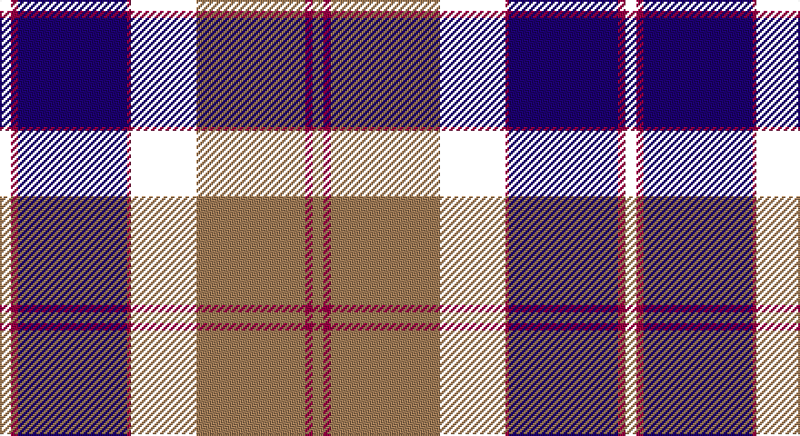

This page is one **sett** — a single exact thread-count. It belongs to the [tartan](/setts/k3m2db30m1k18o30m2o3/)
(the same proportion at any scale), whose colour order is pattern [KRBRKRRR](/stripes/krbrkrrr/).

Part of the [Bannockbane Navy](/tartans/bannockbane-navy/) tartan — the named design grouping this sett with its other cloths.

Sourced from house-of-tartan.  It is a [8 stripe tartan](/stripes/stripes8/).

Original link http://www.house-of-tartan.scotland.net/house/TartanViewjs.asp?colr=Def&tnam=3653

## Provenance

Earliest known date: Not Specified. This is a variation on a trade sett which originated in the early 1970s. Other variants of the design (in different colourways) are included in the Register.

## Thread count
B/6 R4 DB60 R2 W36 LT60 R4 LT/6

One full sett is **344 threads**.

## Palette

Palette: <strong>Tartan Register</strong> <small style="color:#888">(2 of 3 colours)</small>
<table><thead><tr><th>Colour</th><th>Threads</th><th>Shade</th><th>Base</th><th>OKLCh</th></tr></thead><tbody><tr><td>/</td><td style="text-align:right;font-variant-numeric:tabular-nums">6</td><td><code style="background-color:;"></code> <small style="color:#888"></small></td><td> <code style="background-color:;"></code></td><td><small style="color:#888"></small></td></tr><tr><td>R</td><td style="text-align:right;font-variant-numeric:tabular-nums">4</td><td><code style="background-color:#980044;">#980044</code> <small style="color:#888">#980044</small></td><td>R <code style="background-color:#CC0000;">#CC0000</code></td><td><small style="color:#888">oklch(43.7% 0.175 5.3)</small></td></tr><tr><td>DB</td><td style="text-align:right;font-variant-numeric:tabular-nums">60</td><td><code style="background-color:#1C0070;">#1C0070</code> <small style="color:#888">#1C0070</small></td><td>B <code style="background-color:#2A418A;">#2A418A</code></td><td><small style="color:#888">oklch(26.3% 0.162 277.1)</small></td></tr><tr><td>R</td><td style="text-align:right;font-variant-numeric:tabular-nums">2</td><td><code style="background-color:#980044;">#980044</code> <small style="color:#888">#980044</small></td><td>R <code style="background-color:#CC0000;">#CC0000</code></td><td><small style="color:#888">oklch(43.7% 0.175 5.3)</small></td></tr><tr><td></td><td style="text-align:right;font-variant-numeric:tabular-nums">36</td><td><code style="background-color:;"></code> <small style="color:#888"></small></td><td> <code style="background-color:;"></code></td><td><small style="color:#888"></small></td></tr><tr><td>LT</td><td style="text-align:right;font-variant-numeric:tabular-nums">60</td><td><code style="background-color:#A07C58;">#A07C58</code> <small style="color:#888">#A07C58</small></td><td>R <code style="background-color:#CC0000;">#CC0000</code></td><td><small style="color:#888">oklch(61.2% 0.067 66.0)</small></td></tr><tr><td>R</td><td style="text-align:right;font-variant-numeric:tabular-nums">4</td><td><code style="background-color:#980044;">#980044</code> <small style="color:#888">#980044</small></td><td>R <code style="background-color:#CC0000;">#CC0000</code></td><td><small style="color:#888">oklch(43.7% 0.175 5.3)</small></td></tr><tr><td>LT/</td><td style="text-align:right;font-variant-numeric:tabular-nums">6</td><td><code style="background-color:#A07C58;">#A07C58</code> <small style="color:#888">#A07C58</small></td><td>R <code style="background-color:#CC0000;">#CC0000</code></td><td><small style="color:#888">oklch(61.2% 0.067 66.0)</small></td></tr></tbody></table>

# Sample pattern

## Compared to the master

This cloth is one sett of its design; the master sett (the exemplar the design is anchored on) is below for comparison.

<figure style="margin:0"><figcaption style="color:#888;font-size:smaller">this sett</figcaption></figure>
<figure style="margin:0"><figcaption style="color:#888;font-size:smaller"><a href="/setts/db3m2db30m1w18o30m2o3/">master sett →</a></figcaption></figure>

## Nearest tartans

The nearest existing variants by ΔTartan distance, with this tartan at the top so the swatches line up against it.

ΔTartan

Tartan

Sett

—

<a href="/ttd/edit/#slug=k3m2db30m1k18o30m2o3~x2">Bannockbane Navy Fashion Tartan</a> <a class="nn-out" href="/variants/s8/k3m2db30m1k18o30m2o3~x2/" title="open its dictionary page">↗</a>

0.85

<a href="/ttd/edit/#slug=p72k40g23r4g23k2w4~x2&amp;base=k3m2db30m1k18o30m2o3~x2">Ferguson, Unidentified</a> <a class="nn-out" href="/variants/s7/p72k40g23r4g23k2w4~x2/" title="open its dictionary page">↗</a>

1.18

<a href="/ttd/edit/#slug=r24o4db6k6db60k40dr12k20o3dr8&amp;base=k3m2db30m1k18o30m2o3~x2">The KpgM</a> <a class="nn-out" href="/variants/s10/r24o4db6k6db60k40dr12k20o3dr8/" title="open its dictionary page">↗</a>

1.19

<a href="/ttd/edit/#slug=w6n8db4n2db31k16ri1k2ri4r3~x2&amp;base=k3m2db30m1k18o30m2o3~x2">Bell Rock Lighthouse 200th Anniversary, The</a> <a class="nn-out" href="/variants/s10/w6n8db4n2db31k16ri1k2ri4r3~x2/" title="open its dictionary page">↗</a>

1.26

<a href="/ttd/edit/#slug=k35m2k3dp13g8w4g8dp8~x2&amp;base=k3m2db30m1k18o30m2o3~x2">Sheboom</a> <a class="nn-out" href="/variants/s8/k35m2k3dp13g8w4g8dp8~x2/" title="open its dictionary page">↗</a>

1.29

<a href="/ttd/edit/#slug=k35p2k3dp13g8w4g8dp8~x2&amp;base=k3m2db30m1k18o30m2o3~x2">SheBoom</a> <a class="nn-out" href="/variants/s8/k35p2k3dp13g8w4g8dp8~x2/" title="open its dictionary page">↗</a>

1.32

<a href="/ttd/edit/#slug=w5lb7db4lb2db25k13ri1k2ri4r3~x2&amp;base=k3m2db30m1k18o30m2o3~x2">Bell Rock Lighthouse 200th Aniversar</a> <a class="nn-out" href="/variants/s10/w5lb7db4lb2db25k13ri1k2ri4r3~x2/" title="open its dictionary page">↗</a>

1.36

<a href="/ttd/edit/#slug=db4w1k2db25k12dbi1k2r16k2lo1~x2&amp;base=k3m2db30m1k18o30m2o3~x2">Sidey (Dundee) Dress (Personal)</a> <a class="nn-out" href="/variants/s10/db4w1k2db25k12dbi1k2r16k2lo1~x2/" title="open its dictionary page">↗</a>

1.38

<a href="/ttd/edit/#slug=t4w1k36db2r4w1db14r8w1~x2&amp;base=k3m2db30m1k18o30m2o3~x2">Midnight Balmoral (Personal)</a> <a class="nn-out" href="/variants/s9/t4w1k36db2r4w1db14r8w1~x2/" title="open its dictionary page">↗</a>

1.38

<a href="/ttd/edit/#slug=o28k4db6k2lo4k2db6k28db4db2k1k1lb2&amp;base=k3m2db30m1k18o30m2o3~x2">McFly School</a> <a class="nn-out" href="/variants/s13/o28k4db6k2lo4k2db6k28db4db2k1k1lb2/" title="open its dictionary page">↗</a>

1.39

<a href="/ttd/edit/#slug=lg2dg9k16r2t30lg3dg6w1~x2&amp;base=k3m2db30m1k18o30m2o3~x2">Climb, The</a> <a class="nn-out" href="/variants/s8/lg2dg9k16r2t30lg3dg6w1~x2/" title="open its dictionary page">↗</a>

## Neighbour map

Every grey dot is one of 14360 variants placed by the first two principal components of the ΔTartan feature space (44% of its variance). Red is this tartan; blue dots are its nearest — click one to open its page.

<svg viewBox="0 0 640 380" role="img" style="max-width:100%;height:auto;border:1px solid #e0e0e0;border-radius:4px;display:block" xmlns="http://www.w3.org/2000/svg"><image href="/nn/cloud.v1.png" width="640" height="380"/><a href="/variants/s7/p72k40g23r4g23k2w4~x2/"><circle cx="240.3" cy="119.9" r="4" fill="#3465a4"><title>Ferguson, Unidentified</title></circle></a><a href="/variants/s10/r24o4db6k6db60k40dr12k20o3dr8/"><circle cx="197.3" cy="139.4" r="4" fill="#3465a4"><title>The KpgM</title></circle></a><a href="/variants/s10/w6n8db4n2db31k16ri1k2ri4r3~x2/"><circle cx="217.3" cy="88.8" r="4" fill="#3465a4"><title>Bell Rock Lighthouse 200th Anniversary, The</title></circle></a><a href="/variants/s8/k35m2k3dp13g8w4g8dp8~x2/"><circle cx="239.1" cy="147.6" r="4" fill="#3465a4"><title>Sheboom</title></circle></a><a href="/variants/s8/k35p2k3dp13g8w4g8dp8~x2/"><circle cx="243.3" cy="149.9" r="4" fill="#3465a4"><title>SheBoom</title></circle></a><a href="/variants/s10/w5lb7db4lb2db25k13ri1k2ri4r3~x2/"><circle cx="193.7" cy="97.2" r="4" fill="#3465a4"><title>Bell Rock Lighthouse 200th Aniversar</title></circle></a><a href="/variants/s10/db4w1k2db25k12dbi1k2r16k2lo1~x2/"><circle cx="226.0" cy="91.4" r="4" fill="#3465a4"><title>Sidey (Dundee) Dress (Personal)</title></circle></a><a href="/variants/s9/t4w1k36db2r4w1db14r8w1~x2/"><circle cx="296.5" cy="93.8" r="4" fill="#3465a4"><title>Midnight Balmoral (Personal)</title></circle></a><a href="/variants/s13/o28k4db6k2lo4k2db6k28db4db2k1k1lb2/"><circle cx="243.6" cy="92.0" r="4" fill="#3465a4"><title>McFly School</title></circle></a><a href="/variants/s8/lg2dg9k16r2t30lg3dg6w1~x2/"><circle cx="206.1" cy="101.1" r="4" fill="#3465a4"><title>Climb, The</title></circle></a><circle cx="212.2" cy="117.3" r="5" fill="#c00000"/></svg>

ID: /variants/s8/k3m2db30m1k18o30m2o3~x2/
