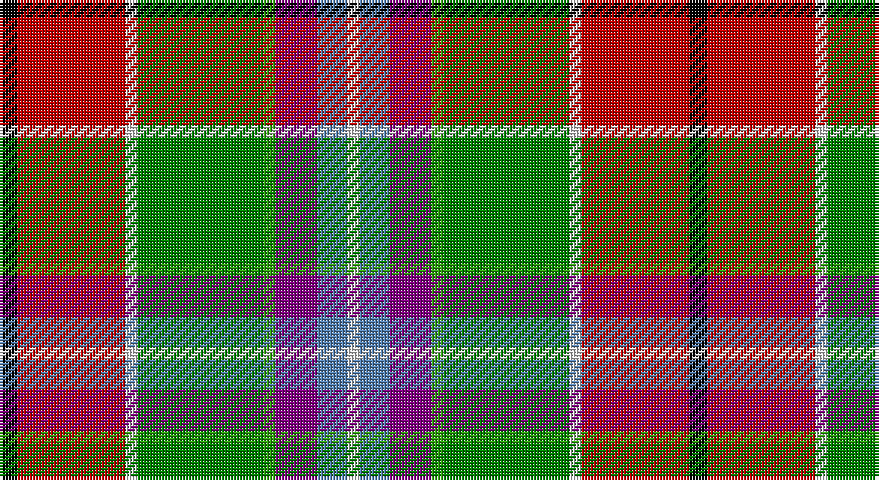

This page is one **sett** — a single exact thread-count. It belongs to the [tartan](/setts/k3r18w2g21gi2p7t5w2/)
(the same proportion at any scale), whose colour order is pattern [KRWGGBBW](/stripes/krwggbbw/).

Sourced from weddslist.  It is a [8 stripe tartan](/stripes/stripes8/).

Original link http://www.weddslist.com/cgi-bin/tartans/pg.pl?source=sts

## Thread count
K/6 R36 LN4 Ga42 G4 P14 B10 LN/4

One full sett is **230 threads**.

## Palette

Palette: <strong>Tartan Register</strong> <small style="color:#888">(2 of 7 colours)</small>
<table><thead><tr><th>Colour</th><th>Threads</th><th>Shade</th><th>Base</th><th>OKLCh</th></tr></thead><tbody><tr><td>K/</td><td style="text-align:right;font-variant-numeric:tabular-nums">6</td><td><code style="background-color:#000000;">#000000</code> <small style="color:#888">#000000</small></td><td>K <code style="background-color:#000000;">#000000</code></td><td><small style="color:#888">oklch(0.0% 0.000 0.0)</small></td></tr><tr><td>R</td><td style="text-align:right;font-variant-numeric:tabular-nums">36</td><td><code style="background-color:#C00000;">#C00000</code> <small style="color:#888">#C00000</small></td><td>R <code style="background-color:#CC0000;">#CC0000</code></td><td><small style="color:#888">oklch(50.7% 0.208 29.2)</small></td></tr><tr><td>LN</td><td style="text-align:right;font-variant-numeric:tabular-nums">4</td><td><code style="background-color:#E0E0E0;">#E0E0E0</code> <small style="color:#888">#E0E0E0</small></td><td>W <code style="background-color:#F7F7F7;">#F7F7F7</code></td><td><small style="color:#888">oklch(90.7% 0.000 89.9)</small></td></tr><tr><td>Ga</td><td style="text-align:right;font-variant-numeric:tabular-nums">42</td><td><code style="background-color:#008000;">#008000</code> <small style="color:#888">#008000</small></td><td>G <code style="background-color:#006100;">#006100</code></td><td><small style="color:#888">oklch(52.0% 0.177 142.5)</small></td></tr><tr><td>G</td><td style="text-align:right;font-variant-numeric:tabular-nums">4</td><td><code style="background-color:#30A010;">#30A010</code> <small style="color:#888">#30A010</small></td><td>G <code style="background-color:#006100;">#006100</code></td><td><small style="color:#888">oklch(61.9% 0.195 140.5)</small></td></tr><tr><td>P</td><td style="text-align:right;font-variant-numeric:tabular-nums">14</td><td><code style="background-color:#800080;">#800080</code> <small style="color:#888">#800080</small></td><td>B <code style="background-color:#2A418A;">#2A418A</code></td><td><small style="color:#888">oklch(42.1% 0.193 328.4)</small></td></tr><tr><td>B</td><td style="text-align:right;font-variant-numeric:tabular-nums">10</td><td><code style="background-color:#5480B0;">#5480B0</code> <small style="color:#888">#5480B0</small></td><td>B <code style="background-color:#2A418A;">#2A418A</code></td><td><small style="color:#888">oklch(58.8% 0.089 251.5)</small></td></tr><tr><td>LN/</td><td style="text-align:right;font-variant-numeric:tabular-nums">4</td><td><code style="background-color:#E0E0E0;">#E0E0E0</code> <small style="color:#888">#E0E0E0</small></td><td>W <code style="background-color:#F7F7F7;">#F7F7F7</code></td><td><small style="color:#888">oklch(90.7% 0.000 89.9)</small></td></tr></tbody></table>

# Sample pattern

## Nearest tartans

The nearest existing variants by ΔTartan distance, with this tartan at the top so the swatches line up against it.

ΔTartan

Tartan

Sett

—

<a href="/ttd/edit/#slug=k3r18w2g21gi2p7t5w2~x2">Wilson's, No 132</a> <a class="nn-out" href="/variants/s8/k3r18w2g21gi2p7t5w2~x2/" title="open its dictionary page">↗</a>

0.68

<a href="/ttd/edit/#slug=t4p3gi1g9w1r8k1~x4&amp;base=k3r18w2g21gi2p7t5w2~x2">Wilson's, No 121</a> <a class="nn-out" href="/variants/s7/t4p3gi1g9w1r8k1~x4/" title="open its dictionary page">↗</a>

0.71

<a href="/ttd/edit/#slug=t3p10w3k3g19r14t3k2ly3~x2&amp;base=k3r18w2g21gi2p7t5w2~x2">Wilson's, No 110</a> <a class="nn-out" href="/variants/s9/t3p10w3k3g19r14t3k2ly3~x2/" title="open its dictionary page">↗</a>

0.90

<a href="/ttd/edit/#slug=w3r10dy6ly8t8dg32ri8r10ri6w3~x4&amp;base=k3r18w2g21gi2p7t5w2~x2">Unidentified Silk scarf</a> <a class="nn-out" href="/variants/s10/w3r10dy6ly8t8dg32ri8r10ri6w3~x4/" title="open its dictionary page">↗</a>

0.94

<a href="/ttd/edit/#slug=r24g22k2w6k2ly2k15t6ri6w2~x2&amp;base=k3r18w2g21gi2p7t5w2~x2">Bruce of Kinnaird Clan Tartan</a> <a class="nn-out" href="/variants/s10/r24g22k2w6k2ly2k15t6ri6w2~x2/" title="open its dictionary page">↗</a>

1.01

<a href="/ttd/edit/#slug=r24g22k2w6k2ly2k15y6ri6w2~x2&amp;base=k3r18w2g21gi2p7t5w2~x2">Bruce of Kinnaird</a> <a class="nn-out" href="/variants/s10/r24g22k2w6k2ly2k15y6ri6w2~x2/" title="open its dictionary page">↗</a>

1.08

<a href="/ttd/edit/#slug=t4dy27lr8k4lr8k4lr8r11ly3~x2&amp;base=k3r18w2g21gi2p7t5w2~x2">Brittany Hunting French Fancy Tartan</a> <a class="nn-out" href="/variants/s9/t4dy27lr8k4lr8k4lr8r11ly3~x2/" title="open its dictionary page">↗</a>

1.12

<a href="/ttd/edit/#slug=o40ly10w6lo10dy6lo4dy6lo4dy60k34t11&amp;base=k3r18w2g21gi2p7t5w2~x2">Angels' Share, The</a> <a class="nn-out" href="/variants/s11/o40ly10w6lo10dy6lo4dy6lo4dy60k34t11/" title="open its dictionary page">↗</a>

1.14

<a href="/ttd/edit/#slug=k20lo4r4lo20y20lb5y2g2~x2&amp;base=k3r18w2g21gi2p7t5w2~x2">Hackett Hunting (Personal)</a> <a class="nn-out" href="/variants/s8/k20lo4r4lo20y20lb5y2g2~x2/" title="open its dictionary page">↗</a>

1.15

<a href="/ttd/edit/#slug=r4dy12k12dy1o12ly1k3w2k1b4~x2&amp;base=k3r18w2g21gi2p7t5w2~x2">Campbell Hunting</a> <a class="nn-out" href="/variants/s10/r4dy12k12dy1o12ly1k3w2k1b4~x2/" title="open its dictionary page">↗</a>

1.19

<a href="/ttd/edit/#slug=r12w1k1g12ly2db5t6r2t2r4g2r2k2g2~x2&amp;base=k3r18w2g21gi2p7t5w2~x2">Unnamed 11</a> <a class="nn-out" href="/variants/s14/r12w1k1g12ly2db5t6r2t2r4g2r2k2g2~x2/" title="open its dictionary page">↗</a>

## Neighbour map

Every grey dot is one of 14360 variants placed by the first two principal components of the ΔTartan feature space (44% of its variance). Red is this tartan; blue dots are its nearest — click one to open its page.

<svg viewBox="0 0 640 380" role="img" style="max-width:100%;height:auto;border:1px solid #e0e0e0;border-radius:4px;display:block" xmlns="http://www.w3.org/2000/svg"><image href="/nn/cloud.v1.png" width="640" height="380"/><a href="/variants/s7/t4p3gi1g9w1r8k1~x4/"><circle cx="96.9" cy="150.9" r="4" fill="#3465a4"><title>Wilson's, No 121</title></circle></a><a href="/variants/s9/t3p10w3k3g19r14t3k2ly3~x2/"><circle cx="66.0" cy="124.1" r="4" fill="#3465a4"><title>Wilson's, No 110</title></circle></a><a href="/variants/s10/w3r10dy6ly8t8dg32ri8r10ri6w3~x4/"><circle cx="92.4" cy="124.0" r="4" fill="#3465a4"><title>Unidentified Silk scarf</title></circle></a><a href="/variants/s10/r24g22k2w6k2ly2k15t6ri6w2~x2/"><circle cx="68.6" cy="108.3" r="4" fill="#3465a4"><title>Bruce of Kinnaird Clan Tartan</title></circle></a><a href="/variants/s10/r24g22k2w6k2ly2k15y6ri6w2~x2/"><circle cx="64.5" cy="103.5" r="4" fill="#3465a4"><title>Bruce of Kinnaird</title></circle></a><a href="/variants/s9/t4dy27lr8k4lr8k4lr8r11ly3~x2/"><circle cx="118.8" cy="151.3" r="4" fill="#3465a4"><title>Brittany Hunting French Fancy Tartan</title></circle></a><a href="/variants/s11/o40ly10w6lo10dy6lo4dy6lo4dy60k34t11/"><circle cx="132.9" cy="91.3" r="4" fill="#3465a4"><title>Angels' Share, The</title></circle></a><a href="/variants/s8/k20lo4r4lo20y20lb5y2g2~x2/"><circle cx="117.2" cy="159.9" r="4" fill="#3465a4"><title>Hackett Hunting (Personal)</title></circle></a><a href="/variants/s10/r4dy12k12dy1o12ly1k3w2k1b4~x2/"><circle cx="88.9" cy="123.0" r="4" fill="#3465a4"><title>Campbell Hunting</title></circle></a><a href="/variants/s14/r12w1k1g12ly2db5t6r2t2r4g2r2k2g2~x2/"><circle cx="113.6" cy="102.2" r="4" fill="#3465a4"><title>Unnamed 11</title></circle></a><circle cx="109.7" cy="124.0" r="5" fill="#c00000"/></svg>

ID: /variants/s8/k3r18w2g21gi2p7t5w2~x2/
