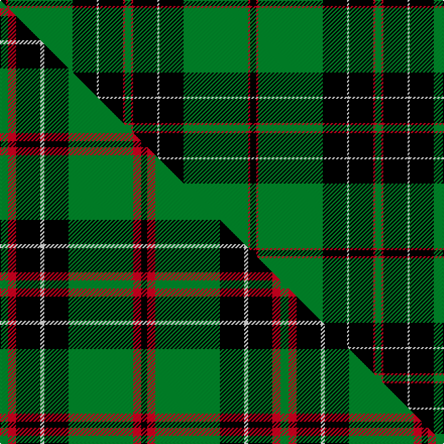

This page is one **sett** — a single exact thread-count. It belongs to the [tartan](/setts/k3r1g32k12w1k12r1g3/)
(the same proportion at any scale), whose colour order is pattern [GRKWKGRK](/stripes/grkwkgrk/).

Part of the [MacHardy](/tartans/machardy-2/) tartan — the named design grouping this sett with its other cloths.

Sourced from weddslist.  It is a [8 stripe tartan](/stripes/stripes8/).

Original link http://www.weddslist.com/cgi-bin/tartans/pg.pl?source=sts

## Thread count
K/6 R2 G64 K24 W2 K24 R2 G/6

One full sett is **248 threads**.

## Palette
<table><thead><tr><th>Colour</th><th>Shade</th><th>OKLCh</th></tr></thead><tbody><tr><td>G</td><td><code style="background-color:#008B2A;">#008B2A</code> <small style="color:#888">#008B2A</small></td><td><small style="color:#888">oklch(55.4% 0.170 145.9)</small></td></tr><tr><td>K</td><td><code style="background-color:#000000;">#000000</code> <small style="color:#888">#000000</small></td><td><small style="color:#888">oklch(0.0% 0.000 0.0)</small></td></tr><tr><td>W</td><td><code style="background-color:#F7F7F7;">#F7F7F7</code> <small style="color:#888">#F7F7F7</small></td><td><small style="color:#888">oklch(97.6% 0.000 89.9)</small></td></tr><tr><td>R</td><td><code style="background-color:#D60020;">#D60020</code> <small style="color:#888">#D60020</small></td><td><small style="color:#888">oklch(55.2% 0.224 25.5)</small></td></tr></tbody></table>

# Sample pattern

## Compared to the master

This cloth is one sett of its design; the master sett (the exemplar the design is anchored on) is below for comparison.

Its **ΔTartan distance** from the master is **0.50** — the same measure the nearest-tartans table ranks by (0 is identical; a re-scale of the same cloth is near 0, a recolour or a different proportion further).

<figure class="master-compare" style="margin:0">

this sett
master sett ★

<figcaption style="color:#888;font-size:smaller">One weave of this sett against the <a href="/setts/g4r4k12w2k12g32r4k3/">master sett ★</a>, split on the diagonal: a shared proportion runs seamlessly across it with only the shades shifting; a different proportion breaks on it.</figcaption>
</figure>

## Nearest tartan variants

The nearest existing variants by ΔTartan distance, with this cloth at the top so the swatches line up against it.

ΔTartan

Threads

Variant

Sett

—

248

<a href="/variants/s8/k3r1g32k12w1k12r1g3~x2/">MacHardy</a>

<a href="/ttd/edit/#slug=g4r4k12w2k12g32r4k3~x2&amp;base=k3r1g32k12w1k12r1g3~x2" title="compare in the TTD">0.50</a>

278

<a href="/variants/s8/g4r4k12w2k12g32r4k3~x2/">MacHardy (Clans Originaux)</a>

<a href="/ttd/edit/#slug=k83r16g56k2w5k2g56r5~x2&amp;base=k3r1g32k12w1k12r1g3~x2" title="compare in the TTD">1.19</a>

724

<a href="/variants/s8/k83r16g56k2w5k2g56r5~x2/">MacDiarmid #2</a>

<a href="/ttd/edit/#slug=k6db1k6g4k10g20r2~x2&amp;base=k3r1g32k12w1k12r1g3~x2" title="compare in the TTD">1.27</a>

180

<a href="/variants/s7/k6db1k6g4k10g20r2~x2/">MacKinross</a>

<a href="/ttd/edit/#slug=dr4g4k1w2k1g18k32r4~x2&amp;base=k3r1g32k12w1k12r1g3~x2" title="compare in the TTD">1.54</a>

248

<a href="/variants/s8/dr4g4k1w2k1g18k32r4~x2/">Hot Boontjie</a>

<a href="/ttd/edit/#slug=g70k26g12k14db3k16~x2&amp;base=k3r1g32k12w1k12r1g3~x2" title="compare in the TTD">1.55</a>

392

<a href="/variants/s6/g70k26g12k14db3k16~x2/">Duchess of Fife #2</a>

<a href="/ttd/edit/#slug=g70k26g12k14t3k16~x2&amp;base=k3r1g32k12w1k12r1g3~x2" title="compare in the TTD">1.55</a>

392

<a href="/variants/s6/g70k26g12k14t3k16~x2/">Duchess of Fife</a>

<a href="/ttd/edit/#slug=g46k18g6k13r4k4w4~x2&amp;base=k3r1g32k12w1k12r1g3~x2" title="compare in the TTD">1.56</a>

280

<a href="/variants/s7/g46k18g6k13r4k4w4~x2/">Page</a>

<a href="/ttd/edit/#slug=g30k12g6k6db2k5~x2&amp;base=k3r1g32k12w1k12r1g3~x2" title="compare in the TTD">1.58</a>

174

<a href="/variants/s6/g30k12g6k6db2k5~x2/">Fife, Duchess of..</a>

<a href="/ttd/edit/#slug=k6g4lb3g44k32g3k3lo3k2g3~x2&amp;base=k3r1g32k12w1k12r1g3~x2" title="compare in the TTD">1.74</a>

394

<a href="/variants/s10/k6g4lb3g44k32g3k3lo3k2g3~x2/">Smeaton Hunting (Name)</a>

<a href="/ttd/edit/#slug=g28r3k28db8lb1g8r2k3~x2&amp;base=k3r1g32k12w1k12r1g3~x2" title="compare in the TTD">1.93</a>

262

<a href="/variants/s8/g28r3k28db8lb1g8r2k3~x2/">Stansbury (2014)</a>

## Neighbour map

Every grey dot is one of 13620 variants placed by the first two principal components of the ΔTartan feature space (42% of its variance). Red is this tartan; blue dots are its nearest — click one to open its page.

<svg viewBox="0 0 640 380" role="img" style="max-width:100%;height:auto;border:1px solid #e0e0e0;border-radius:4px;display:block" xmlns="http://www.w3.org/2000/svg"><image href="/nn/cloud.v1.png" width="640" height="380"/><a href="/variants/s8/g4r4k12w2k12g32r4k3~x2/"><circle cx="230.9" cy="144.8" r="4" fill="#3465a4"><title>MacHardy (Clans Originaux)</title></circle></a><a href="/variants/s8/k83r16g56k2w5k2g56r5~x2/"><circle cx="268.3" cy="108.0" r="4" fill="#3465a4"><title>MacDiarmid #2</title></circle></a><a href="/variants/s7/k6db1k6g4k10g20r2~x2/"><circle cx="249.7" cy="157.5" r="4" fill="#3465a4"><title>MacKinross</title></circle></a><a href="/variants/s8/dr4g4k1w2k1g18k32r4~x2/"><circle cx="253.7" cy="89.3" r="4" fill="#3465a4"><title>Hot Boontjie</title></circle></a><a href="/variants/s6/g70k26g12k14db3k16~x2/"><circle cx="327.1" cy="167.2" r="4" fill="#3465a4"><title>Duchess of Fife #2</title></circle></a><a href="/variants/s6/g70k26g12k14t3k16~x2/"><circle cx="326.8" cy="167.3" r="4" fill="#3465a4"><title>Duchess of Fife</title></circle></a><a href="/variants/s7/g46k18g6k13r4k4w4~x2/"><circle cx="253.4" cy="161.1" r="4" fill="#3465a4"><title>Page</title></circle></a><a href="/variants/s6/g30k12g6k6db2k5~x2/"><circle cx="314.3" cy="184.4" r="4" fill="#3465a4"><title>Fife, Duchess of..</title></circle></a><a href="/variants/s10/k6g4lb3g44k32g3k3lo3k2g3~x2/"><circle cx="282.5" cy="107.2" r="4" fill="#3465a4"><title>Smeaton Hunting (Name)</title></circle></a><a href="/variants/s8/g28r3k28db8lb1g8r2k3~x2/"><circle cx="210.9" cy="112.6" r="4" fill="#3465a4"><title>Stansbury (2014)</title></circle></a><circle cx="300.5" cy="107.8" r="5" fill="#c00000"/><text x="320" y="376" text-anchor="middle" font-size="11" fill="#999">ground</text><text x="11" y="190" text-anchor="middle" font-size="11" fill="#999" transform="rotate(-90 11 190)">complexity</text></svg>

ID: /variants/s8/k3r1g32k12w1k12r1g3~x2/
