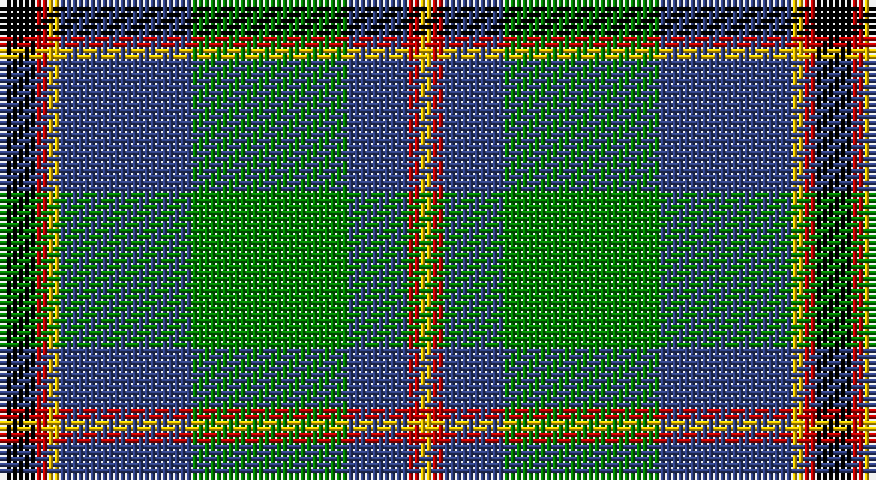

This page is one **sett** — a single exact thread-count. It belongs to the [tartan](/setts/k3r1ly1db11g13db5r1ly1/)
(the same proportion at any scale), whose colour order is pattern [KRYBGBRY](/stripes/krybgbry/).

Part of the [Snodgrass](/tartans/snodgrass/) tartan — the named design grouping this sett with its other cloths.

Sourced from weddslist.  It is a [8 stripe tartan](/stripes/stripes8/).

Original link http://www.weddslist.com/cgi-bin/tartans/pg.pl?source=sts

## Provenance

Earliest known date: 1978 Designed for the Snodgrass Clan Association. It is based on the Cunningham tartan, and the colours chosen were, Black, Green and Gold - of the Snodgrass Coat of Arms, Green - for the 'grasy place' (sic) alluded to in the name, and Blue - representing the traditional Highland 'Blue Bonnet'.

2 attestations — the source records this cloth was collapsed from (oldest owns this page)

<ul>
<li>undated — Snodgrass (weddslist, <a href="http://www.weddslist.com/cgi-bin/tartans/pg.pl?source=sts">record</a>)</li>
<li>undated — Snodgrass Family Tartan (house-of-tartan, <a href="http://www.house-of-tartan.scotland.net/house/TartanViewjs.asp?colr=Def&tnam=1216">record</a>)</li>
</ul>

## Thread count
K/6 R2 Y2 B22 G26 B10 R2 Y/2

One full sett is **136 threads**.

## Palette

Palette: <strong>Ingles Buchan</strong> <small style="color:#888">(1 of 5 colours)</small>
<table><thead><tr><th>Colour</th><th>Threads</th><th>Shade</th><th>Base</th><th>OKLCh</th></tr></thead><tbody><tr><td>K/</td><td style="text-align:right;font-variant-numeric:tabular-nums">6</td><td><code style="background-color:#000000;">#000000</code> <small style="color:#888">#000000</small></td><td>K <code style="background-color:#000000;">#000000</code></td><td><small style="color:#888">oklch(0.0% 0.000 0.0)</small></td></tr><tr><td>R</td><td style="text-align:right;font-variant-numeric:tabular-nums">2</td><td><code style="background-color:#C00000;">#C00000</code> <small style="color:#888">#C00000</small></td><td>R <code style="background-color:#CC0000;">#CC0000</code></td><td><small style="color:#888">oklch(50.7% 0.208 29.2)</small></td></tr><tr><td>Y</td><td style="text-align:right;font-variant-numeric:tabular-nums">2</td><td><code style="background-color:#F0C000;">#F0C000</code> <small style="color:#888">#F0C000</small></td><td>Y <code style="background-color:#F2BF00;">#F2BF00</code></td><td><small style="color:#888">oklch(82.7% 0.169 90.5)</small></td></tr><tr><td>B</td><td style="text-align:right;font-variant-numeric:tabular-nums">22</td><td><code style="background-color:#304080;">#304080</code> <small style="color:#888">#304080</small></td><td>B <code style="background-color:#2A418A;">#2A418A</code></td><td><small style="color:#888">oklch(39.4% 0.109 270.2)</small></td></tr><tr><td>G</td><td style="text-align:right;font-variant-numeric:tabular-nums">26</td><td><code style="background-color:#008000;">#008000</code> <small style="color:#888">#008000</small></td><td>G <code style="background-color:#006100;">#006100</code></td><td><small style="color:#888">oklch(52.0% 0.177 142.5)</small></td></tr><tr><td>B</td><td style="text-align:right;font-variant-numeric:tabular-nums">10</td><td><code style="background-color:#304080;">#304080</code> <small style="color:#888">#304080</small></td><td>B <code style="background-color:#2A418A;">#2A418A</code></td><td><small style="color:#888">oklch(39.4% 0.109 270.2)</small></td></tr><tr><td>R</td><td style="text-align:right;font-variant-numeric:tabular-nums">2</td><td><code style="background-color:#C00000;">#C00000</code> <small style="color:#888">#C00000</small></td><td>R <code style="background-color:#CC0000;">#CC0000</code></td><td><small style="color:#888">oklch(50.7% 0.208 29.2)</small></td></tr><tr><td>Y/</td><td style="text-align:right;font-variant-numeric:tabular-nums">2</td><td><code style="background-color:#F0C000;">#F0C000</code> <small style="color:#888">#F0C000</small></td><td>Y <code style="background-color:#F2BF00;">#F2BF00</code></td><td><small style="color:#888">oklch(82.7% 0.169 90.5)</small></td></tr></tbody></table>

# Sample pattern

## Compared to the master

This cloth is one sett of its design; the master sett (the exemplar the design is anchored on) is below for comparison.

<figure style="margin:0"><figcaption style="color:#888;font-size:smaller">this sett</figcaption></figure>
<figure style="margin:0"><figcaption style="color:#888;font-size:smaller"><a href="/setts/k3r1ly1t11g13t5r1ly1/">master sett →</a></figcaption></figure>

## Nearest tartans

The nearest existing variants by ΔTartan distance, with this tartan at the top so the swatches line up against it.

ΔTartan

Tartan

Sett

—

<a href="/ttd/edit/#slug=k3r1ly1db11g13db5r1ly1~x2">Snodgrass</a> <a class="nn-out" href="/variants/s8/k3r1ly1db11g13db5r1ly1~x2/" title="open its dictionary page">↗</a>

0.67

<a href="/ttd/edit/#slug=r4b11k3b3k3b4k15g36w3~x2&amp;base=k3r1ly1db11g13db5r1ly1~x2">Semple (Name)</a> <a class="nn-out" href="/variants/s9/r4b11k3b3k3b4k15g36w3~x2/" title="open its dictionary page">↗</a>

0.68

<a href="/ttd/edit/#slug=db3r2db22k11g24lp2g3~x2&amp;base=k3r1ly1db11g13db5r1ly1~x2">MacThomas</a> <a class="nn-out" href="/variants/s7/db3r2db22k11g24lp2g3~x2/" title="open its dictionary page">↗</a>

0.69

<a href="/ttd/edit/#slug=r6db27t2g2t2g30w4~x2&amp;base=k3r1ly1db11g13db5r1ly1~x2">MX-5 Owners' Club</a> <a class="nn-out" href="/variants/s7/r6db27t2g2t2g30w4~x2/" title="open its dictionary page">↗</a>

0.78

<a href="/ttd/edit/#slug=g3n5k4n33g12k4w2k18lo3~x2&amp;base=k3r1ly1db11g13db5r1ly1~x2">Smoke Showing (UFES)</a> <a class="nn-out" href="/variants/s9/g3n5k4n33g12k4w2k18lo3~x2/" title="open its dictionary page">↗</a>

0.79

<a href="/ttd/edit/#slug=g5db24g7k10g24ly2db2ly2r2~x2&amp;base=k3r1ly1db11g13db5r1ly1~x2">Maitland Chief</a> <a class="nn-out" href="/variants/s9/g5db24g7k10g24ly2db2ly2r2~x2/" title="open its dictionary page">↗</a>

0.80

<a href="/ttd/edit/#slug=db10ly3db30ly5k8g16r4g16r2~x2&amp;base=k3r1ly1db11g13db5r1ly1~x2">MacMillan, hunting</a> <a class="nn-out" href="/variants/s9/db10ly3db30ly5k8g16r4g16r2~x2/" title="open its dictionary page">↗</a>

0.83

<a href="/ttd/edit/#slug=db2r1db10w1y4g8g1g2~x4&amp;base=k3r1ly1db11g13db5r1ly1~x2">Ayrshire</a> <a class="nn-out" href="/variants/s8/db2r1db10w1y4g8g1g2~x4/" title="open its dictionary page">↗</a>

0.86

<a href="/ttd/edit/#slug=g28k4g5dr4g5k19db19y2~x2&amp;base=k3r1ly1db11g13db5r1ly1~x2">City of Guelph</a> <a class="nn-out" href="/variants/s8/g28k4g5dr4g5k19db19y2~x2/" title="open its dictionary page">↗</a>

0.96

<a href="/variants/s8/dp19w2g12t3k4~x2/">Wilson's No.111</a>

0.97

<a href="/ttd/edit/#slug=r1g9db9k1db1w1~x6&amp;base=k3r1ly1db11g13db5r1ly1~x2">Irving of Glentulchan</a> <a class="nn-out" href="/variants/s6/r1g9db9k1db1w1~x6/" title="open its dictionary page">↗</a>

## Neighbour map

Every grey dot is one of 14360 variants placed by the first two principal components of the ΔTartan feature space (44% of its variance). Red is this tartan; blue dots are its nearest — click one to open its page.

<svg viewBox="0 0 640 380" role="img" style="max-width:100%;height:auto;border:1px solid #e0e0e0;border-radius:4px;display:block" xmlns="http://www.w3.org/2000/svg"><image href="/nn/cloud.v1.png" width="640" height="380"/><a href="/variants/s9/r4b11k3b3k3b4k15g36w3~x2/"><circle cx="215.6" cy="155.8" r="4" fill="#3465a4"><title>Semple (Name)</title></circle></a><a href="/variants/s7/db3r2db22k11g24lp2g3~x2/"><circle cx="195.0" cy="177.1" r="4" fill="#3465a4"><title>MacThomas</title></circle></a><a href="/variants/s7/r6db27t2g2t2g30w4~x2/"><circle cx="242.4" cy="159.2" r="4" fill="#3465a4"><title>MX-5 Owners' Club</title></circle></a><a href="/variants/s9/g3n5k4n33g12k4w2k18lo3~x2/"><circle cx="239.8" cy="148.9" r="4" fill="#3465a4"><title>Smoke Showing (UFES)</title></circle></a><a href="/variants/s9/g5db24g7k10g24ly2db2ly2r2~x2/"><circle cx="241.5" cy="173.8" r="4" fill="#3465a4"><title>Maitland Chief</title></circle></a><a href="/variants/s9/db10ly3db30ly5k8g16r4g16r2~x2/"><circle cx="188.5" cy="162.4" r="4" fill="#3465a4"><title>MacMillan, hunting</title></circle></a><a href="/variants/s8/db2r1db10w1y4g8g1g2~x4/"><circle cx="177.2" cy="170.8" r="4" fill="#3465a4"><title>Ayrshire</title></circle></a><a href="/variants/s8/g28k4g5dr4g5k19db19y2~x2/"><circle cx="209.2" cy="180.2" r="4" fill="#3465a4"><title>City of Guelph</title></circle></a><a href="/variants/s8/dp19w2g12t3k4~x2/"><circle cx="183.0" cy="184.3" r="4" fill="#3465a4"><title>Wilson's No.111</title></circle></a><a href="/variants/s6/r1g9db9k1db1w1~x6/"><circle cx="239.0" cy="191.0" r="4" fill="#3465a4"><title>Irving of Glentulchan</title></circle></a><circle cx="221.6" cy="161.9" r="5" fill="#c00000"/></svg>

ID: /variants/s8/k3r1ly1db11g13db5r1ly1~x2/
