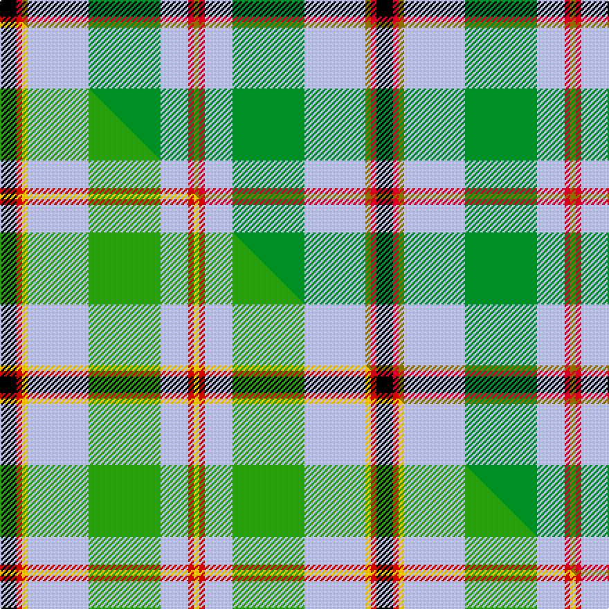

This page is one **sett** — a single exact thread-count. It belongs to the [tartan](/setts/k3r1y1lb11g13lb5r1y1/)
(the same proportion at any scale), whose colour order is pattern [GRWGWGRK](/stripes/grwgwgrk/).

Part of the [Snodgrass](/tartans/snodgrass/) tartan — the named design grouping this sett with its other cloths.

Sourced from tartans-authority.  It is a [8 stripe tartan](/stripes/stripes8/).

Original link https://www.tartanregister.gov.uk/tartanDetails.aspx?ref=1216

Dataset <small>— provenance for this record, inherited from the source manifest</small>

<dl class="dataset-prov">
<dt>source</dt><dd><a href="/sources/tartans-authority/">Scottish Tartans Authority</a></dd>
<dt>data captured from</dt><dd><a href="https://github.com/thetartan/tartan-database/blob/master/data/tartans-authority/data.csv">https://github.com/thetartan/tartan-database/blob/master/data/tartans-authority/data.csv</a></dd>
<dt>data date</dt><dd>1977 Novemeber <small>(this record)</small></dd>
<dt>licence</dt><dd><a href="https://creativecommons.org/licenses/by-nc-nd/4.0/">CC BY-NC-ND 4.0</a></dd>
</dl>

Capture chain <small>— the hands this data passed through, oldest first; each capture carries its own licence</small>

<ol class="capture-chain">
<li><a href="https://www.tartansauthority.com/">Scottish Tartans Authority</a> <small>the heritage body's archive — its tartan-ferret record browser is retired (links repaired to the SRT, above)</small></li>
<li><a href="https://github.com/thetartan/tartan-database">thetartan/tartan-database</a> <small>2016-2017</small> · <a href="https://creativecommons.org/licenses/by-nc-nd/4.0/">CC BY-NC-ND 4.0</a> <small>Levko Kravets's frozen compilation — the capture we vendored, and where its CC licence text came from</small></li>
<li>this dictionary <small>captured 2026-06-10 · commit 5bf86c7566</small> <small>each re-capture is a git commit to data/sources</small></li>
</ol>

## Register references

External register numbers recorded for this tartan.

- Scottish Tartans Authority (ITI): 1216

## Thread count
K/12 R4 Y4 LB44 G52 LB20 R4 Y/4

One full sett is **272 threads**.

## Palette
<table><thead><tr><th>Colour</th><th>Shade</th><th>OKLCh</th></tr></thead><tbody><tr><td>LB</td><td><code style="background-color:#B5BBDE;">#B5BBDE</code> <small style="color:#888">#B5BBDE</small></td><td><small style="color:#888">oklch(79.9% 0.050 277.6)</small></td></tr><tr><td>G</td><td><code style="background-color:#008B2A;">#008B2A</code> <small style="color:#888">#008B2A</small></td><td><small style="color:#888">oklch(55.4% 0.170 145.9)</small></td></tr><tr><td>K</td><td><code style="background-color:#000000;">#000000</code> <small style="color:#888">#000000</small></td><td><small style="color:#888">oklch(0.0% 0.000 0.0)</small></td></tr><tr><td>R</td><td><code style="background-color:#D60020;">#D60020</code> <small style="color:#888">#D60020</small></td><td><small style="color:#888">oklch(55.2% 0.224 25.5)</small></td></tr><tr><td>Y</td><td><code style="background-color:#8B6E00;">#8B6E00</code> <small style="color:#888">#8B6E00</small></td><td><small style="color:#888">oklch(55.1% 0.113 90.4)</small></td></tr></tbody></table>

# Sample pattern

## Compared to the master

This cloth is one sett of its design; the master sett (the exemplar the design is anchored on) is below for comparison.

Its **ΔTartan distance** from the master is **0.08** — the same measure the nearest-tartans table ranks by (0 is identical; a re-scale of the same cloth is near 0, a recolour or a different proportion further).

<figure class="master-compare" style="margin:0">

this sett
master sett ★

<figcaption style="color:#888;font-size:smaller">One weave of this sett against the <a href="/setts/k3r1ly1lb11g13lb5r1ly1/">master sett ★</a>, split on the diagonal: a shared proportion runs seamlessly across it with only the shades shifting; a different proportion breaks on it.</figcaption>
</figure>

## Nearest tartan variants

The nearest existing variants by ΔTartan distance, with this cloth at the top so the swatches line up against it.

ΔTartan

Threads

Variant

Sett

—

272

<a href="/variants/s8/k3r1y1lb11g13lb5r1y1~x4/">Snodgrass (Clan)</a>

<a href="/ttd/edit/#slug=k3r1ly1lb11g13lb5r1ly1~x4~r2109032-ly3307090-g2408144&amp;base=k3r1y1lb11g13lb5r1y1~x4" title="compare in the TTD">0.08</a>

272

<a href="/variants/s8/k3r1ly1lb11g13lb5r1ly1~x4~r2109032-ly3307090-g2408144/">Snodgrass</a>

<a href="/ttd/edit/#slug=lb24k2r2lb2db12g28r4g5lb3g3~x2&amp;base=k3r1y1lb11g13lb5r1y1~x4" title="compare in the TTD">1.56</a>

286

<a href="/variants/s10/lb24k2r2lb2db12g28r4g5lb3g3~x2/">Downie (Name)</a>

<a href="/ttd/edit/#slug=lb16k1r7k1r7k1lb7g24ly4~x2&amp;base=k3r1y1lb11g13lb5r1y1~x4" title="compare in the TTD">1.86</a>

232

<a href="/variants/s9/lb16k1r7k1r7k1lb7g24ly4~x2/">Knockando Woolmill (Corporate)</a>

<a href="/ttd/edit/#slug=k2lb25k2t8k2g28y2~x2&amp;base=k3r1y1lb11g13lb5r1y1~x4" title="compare in the TTD">1.93</a>

268

<a href="/variants/s7/k2lb25k2t8k2g28y2~x2/">Presley of Lonmay</a>

<a href="/ttd/edit/#slug=k3lb2g13w2lb24dr3~x4&amp;base=k3r1y1lb11g13lb5r1y1~x4" title="compare in the TTD">1.99</a>

352

<a href="/variants/s6/k3lb2g13w2lb24dr3~x4/">Vance (Name?)</a>

<a href="/ttd/edit/#slug=dy2lb14k1dg11k2r2g2k1~x4~dg1806142-g2203152&amp;base=k3r1y1lb11g13lb5r1y1~x4" title="compare in the TTD">2.26</a>

268

<a href="/variants/s8/dy2lb14k1dg11k2r2g2k1~x4~dg1806142-g2203152/">Mission</a>

<a href="/ttd/edit/#slug=r1g9lb9k1lb1w1~x6&amp;base=k3r1y1lb11g13lb5r1y1~x4" title="compare in the TTD">2.40</a>

252

<a href="/variants/s6/r1g9lb9k1lb1w1~x6/">Irving of Glentulchan (Personal)</a>

<a href="/ttd/edit/#slug=lo2lb14k1g11k2r2gi2k1~x4~g2508144-gi2604158&amp;base=k3r1y1lb11g13lb5r1y1~x4" title="compare in the TTD">2.51</a>

268

<a href="/variants/s8/lo2lb14k1g11k2r2gi2k1~x4~g2508144-gi2604158/">Mission (District)</a>

<a href="/ttd/edit/#slug=o2lb14k1g11k2lr2b2k1~x4~o1604043-lr3103019&amp;base=k3r1y1lb11g13lb5r1y1~x4" title="compare in the TTD">2.53</a>

268

<a href="/variants/s8/o2lb14k1g11k2lr2b2k1~x4~o1604043-lr3103019/">Mission</a>

<a href="/ttd/edit/#slug=k4lb4k2lb4k2lb22ly27y2r3~x2&amp;base=k3r1y1lb11g13lb5r1y1~x4" title="compare in the TTD">2.66</a>

266

<a href="/variants/s9/k4lb4k2lb4k2lb22ly27y2r3~x2/">Falkirk</a>

## Neighbour map

Every grey dot is one of 13620 variants placed by the first two principal components of the ΔTartan feature space (42% of its variance). Red is this tartan; blue dots are its nearest — click one to open its page.

<svg viewBox="0 0 640 380" role="img" style="max-width:100%;height:auto;border:1px solid #e0e0e0;border-radius:4px;display:block" xmlns="http://www.w3.org/2000/svg"><image href="/nn/cloud.v1.png" width="640" height="380"/><a href="/variants/s8/k3r1ly1lb11g13lb5r1ly1~x4~r2109032-ly3307090-g2408144/"><circle cx="219.6" cy="138.8" r="4" fill="#3465a4"><title>Snodgrass</title></circle></a><a href="/variants/s10/lb24k2r2lb2db12g28r4g5lb3g3~x2/"><circle cx="194.8" cy="139.0" r="4" fill="#3465a4"><title>Downie (Name)</title></circle></a><a href="/variants/s9/lb16k1r7k1r7k1lb7g24ly4~x2/"><circle cx="177.5" cy="129.0" r="4" fill="#3465a4"><title>Knockando Woolmill (Corporate)</title></circle></a><a href="/variants/s7/k2lb25k2t8k2g28y2~x2/"><circle cx="196.7" cy="156.2" r="4" fill="#3465a4"><title>Presley of Lonmay</title></circle></a><a href="/variants/s6/k3lb2g13w2lb24dr3~x4/"><circle cx="260.7" cy="164.5" r="4" fill="#3465a4"><title>Vance (Name?)</title></circle></a><a href="/variants/s8/dy2lb14k1dg11k2r2g2k1~x4~dg1806142-g2203152/"><circle cx="144.4" cy="125.0" r="4" fill="#3465a4"><title>Mission</title></circle></a><a href="/variants/s6/r1g9lb9k1lb1w1~x6/"><circle cx="234.5" cy="187.8" r="4" fill="#3465a4"><title>Irving of Glentulchan (Personal)</title></circle></a><a href="/variants/s8/lo2lb14k1g11k2r2gi2k1~x4~g2508144-gi2604158/"><circle cx="145.5" cy="127.9" r="4" fill="#3465a4"><title>Mission (District)</title></circle></a><a href="/variants/s8/o2lb14k1g11k2lr2b2k1~x4~o1604043-lr3103019/"><circle cx="148.3" cy="128.5" r="4" fill="#3465a4"><title>Mission</title></circle></a><a href="/variants/s9/k4lb4k2lb4k2lb22ly27y2r3~x2/"><circle cx="197.2" cy="129.6" r="4" fill="#3465a4"><title>Falkirk</title></circle></a><circle cx="198.5" cy="151.2" r="5" fill="#c00000"/><text x="320" y="376" text-anchor="middle" font-size="11" fill="#999">ground</text><text x="11" y="190" text-anchor="middle" font-size="11" fill="#999" transform="rotate(-90 11 190)">complexity</text></svg>

ID: /variants/s8/k3r1y1lb11g13lb5r1y1~x4/
