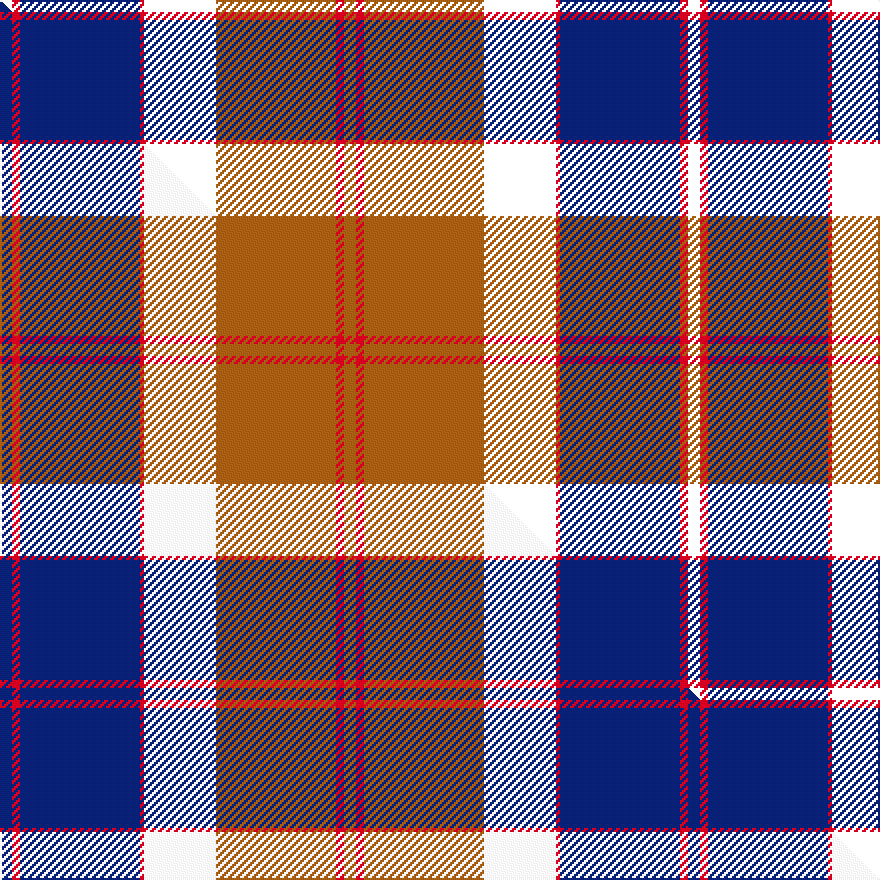

This is one **variant** — a specific cloth: this exact thread count and colourway, with its own
provenance below. It is one weaving of the [sett](/setts/k3r2db30r1k18o30r2o3/) (the scale-free proportion — the
same cloth at any scale or shade), whose colour order is pattern [KRBRKRRR](/stripes/krbrkrrr/).

Part of the [Bannockbane Navy](/tartans/b/ba/bannockbane-navy/) tartan — the named design grouping this sett with its other cloths.

Sourced from house-of-tartan.  It is a [8 stripe tartan](/stripes/stripes8/).

Original link [http://www.house-of-tartan.scotland.net/house/TartanViewjs.asp?colr=Def&tnam=3653](http://www.house-of-tartan.scotland.net/house/TartanViewjs.asp?colr=Def&tnam=3653)

## Provenance

Earliest known date: Not Specified. This is a variation on a trade sett which originated in the early 1970s. Other variants of the design (in different colourways) are included in the Register.

Dataset <small>— provenance for this record, inherited from the source manifest</small>

<dl class="dataset-prov">
<dt>source</dt><dd><a href="/sources/house-of-tartan/">House of Tartan</a></dd>
<dt>data captured from</dt><dd><a href="https://github.com/thetartan/tartan-database/blob/master/data/house-of-tartan/data.csv">https://github.com/thetartan/tartan-database/blob/master/data/house-of-tartan/data.csv</a></dd>
<dt>data date</dt><dd>2017-01-10 <small>(dataset default)</small></dd>
<dt>licence</dt><dd><a href="https://creativecommons.org/licenses/by-nc-nd/4.0/">CC BY-NC-ND 4.0</a></dd>
</dl>

Capture chain <small>— the hands this data passed through, oldest first; each capture carries its own licence</small>

<ol class="capture-chain">
<li><a href="http://www.house-of-tartan.scotland.net/">House of Tartan</a> <small>the weaver/retailer's database — the site is now offline; the URL is kept as the ultimate source's identity</small></li>
<li><a href="https://github.com/thetartan/tartan-database">thetartan/tartan-database</a> <small>2016-2017</small> · <a href="https://creativecommons.org/licenses/by-nc-nd/4.0/">CC BY-NC-ND 4.0</a> <small>Levko Kravets's frozen compilation — the capture we vendored, and where its CC licence text came from</small></li>
<li>this dictionary <small>captured 2026-06-10 · commit 5bf86c7566</small> <small>each re-capture is a git commit to data/sources</small></li>
</ol>

## Thread count
K/6 R4 DB60 R2 K36 O60 R4 O/6

One full sett is **344 threads**.

## Palette
<table><thead><tr><th>Colour</th><th>Shade</th><th>OKLCh</th></tr></thead><tbody><tr><td>DB</td><td><code style="background-color:#082077;">#082077</code> <small style="color:#888">#082077</small></td><td><small style="color:#888">oklch(30.0% 0.149 265.1)</small></td></tr><tr><td>O</td><td><code style="background-color:#A65C11;">#A65C11</code> <small style="color:#888">#A65C11</small></td><td><small style="color:#888">oklch(55.0% 0.125 58.3)</small></td></tr><tr><td>R</td><td><code style="background-color:#D60020;">#D60020</code> <small style="color:#888">#D60020</small></td><td><small style="color:#888">oklch(55.2% 0.224 25.5)</small></td></tr></tbody></table>

# Sample pattern

## Compared to the master

This cloth is one sett of its design; the master sett (the exemplar the design is anchored on) is below for comparison.

Its **ΔTartan distance** from the master is **1.05** — the same measure the nearest-tartans table ranks by (0 is identical; a re-scale of the same cloth is near 0, a recolour or a different proportion further).

<figure class="master-compare" style="margin:0">

this sett
master sett ★

<figcaption style="color:#888;font-size:smaller">One weave of this sett against the <a href="/setts/db3r2db30r1w18o30r2o3/">master sett ★</a>, split on the diagonal: a shared proportion runs seamlessly across it with only the shades shifting; a different proportion breaks on it.</figcaption>
</figure>

## Nearest tartan variants

The nearest existing variants by ΔTartan distance, with this cloth at the top so the swatches line up against it.

ΔTartan

Threads

Variant

Sett

—

344

<a href="/variants/s8/k3r2db30r1k18o30r2o3~x2/">Bannockbane Navy Fashion Tartan</a>

<a href="/ttd/edit/#slug=dg1r24dg8k8dg8r1k4db16w1~x2&amp;base=k3r2db30r1k18o30r2o3~x2" title="compare in the TTD">1.87</a>

280

<a href="/variants/s9/dg1r24dg8k8dg8r1k4db16w1~x2/">Manson</a>

<a href="/ttd/edit/#slug=dp72k40g23r4g23k2w4~x2&amp;base=k3r2db30r1k18o30r2o3~x2" title="compare in the TTD">1.88</a>

520

<a href="/variants/s7/dp72k40g23r4g23k2w4~x2/">Ferguson Unidentified</a>

<a href="/ttd/edit/#slug=db1r20g6k6g6r1k6db20w1~x2&amp;base=k3r2db30r1k18o30r2o3~x2" title="compare in the TTD">2.22</a>

264

<a href="/variants/s9/db1r20g6k6g6r1k6db20w1~x2/">Bush Pilot</a>

<a href="/ttd/edit/#slug=dbi4y1r28db25k10dbi5k3~x2~dbi1605267-db1003265&amp;base=k3r2db30r1k18o30r2o3~x2" title="compare in the TTD">2.31</a>

290

<a href="/variants/s7/dbi4y1r28db25k10dbi5k3~x2~dbi1605267-db1003265/">McKnight (Personal)</a>

<a href="/ttd/edit/#slug=dr4db12k18db4y22lb1y2lb2y3lb2~x4&amp;base=k3r2db30r1k18o30r2o3~x2" title="compare in the TTD">2.35</a>

536

<a href="/variants/s10/dr4db12k18db4y22lb1y2lb2y3lb2~x4/">Windsor</a>

<a href="/ttd/edit/#slug=w2db4r16k14dg32y1db8k2w2~x2&amp;base=k3r2db30r1k18o30r2o3~x2" title="compare in the TTD">2.40</a>

316

<a href="/variants/s9/w2db4r16k14dg32y1db8k2w2~x2/">National Millennium</a>

<a href="/ttd/edit/#slug=db26dg11r8k2r2w2r4w1r15~x2&amp;base=k3r2db30r1k18o30r2o3~x2" title="compare in the TTD">2.43</a>

202

<a href="/variants/s9/db26dg11r8k2r2w2r4w1r15~x2/">Royal Scottish Assurance</a>

<a href="/ttd/edit/#slug=dp3n3dp3n27w1t15k22r3~x2&amp;base=k3r2db30r1k18o30r2o3~x2" title="compare in the TTD">2.47</a>

296

<a href="/variants/s8/dp3n3dp3n27w1t15k22r3~x2/">Beauly Firth and Glens</a>

<a href="/ttd/edit/#slug=dr4k4dr28dp4g4k10g4dp4g4dp8k1w3~x2&amp;base=k3r2db30r1k18o30r2o3~x2" title="compare in the TTD">2.52</a>

298

<a href="/variants/s12/dr4k4dr28dp4g4k10g4dp4g4dp8k1w3~x2/">Kelly of Sleat (Name)</a>

<a href="/ttd/edit/#slug=db26g11r8k2r2w2r4w1r15~x2&amp;base=k3r2db30r1k18o30r2o3~x2" title="compare in the TTD">2.57</a>

202

<a href="/variants/s9/db26g11r8k2r2w2r4w1r15~x2/">Royal Scottish Assurance (Corporate)</a>

## Neighbour map

Every grey dot is one of 13621 variants placed by the first two principal components of the ΔTartan feature space (42% of its variance). Red is this tartan; blue dots are its nearest — click one to open its page.

<svg viewBox="0 0 640 380" role="img" style="max-width:100%;height:auto;border:1px solid #e0e0e0;border-radius:4px;display:block" xmlns="http://www.w3.org/2000/svg"><image href="/nn/cloud.v1.png" width="640" height="380"/><a href="/variants/s9/dg1r24dg8k8dg8r1k4db16w1~x2/"><circle cx="161.9" cy="121.4" r="4" fill="#3465a4"><title>Manson</title></circle></a><a href="/variants/s7/dp72k40g23r4g23k2w4~x2/"><circle cx="220.5" cy="114.2" r="4" fill="#3465a4"><title>Ferguson Unidentified</title></circle></a><a href="/variants/s9/db1r20g6k6g6r1k6db20w1~x2/"><circle cx="134.2" cy="126.2" r="4" fill="#3465a4"><title>Bush Pilot</title></circle></a><a href="/variants/s7/dbi4y1r28db25k10dbi5k3~x2~dbi1605267-db1003265/"><circle cx="202.1" cy="128.1" r="4" fill="#3465a4"><title>McKnight (Personal)</title></circle></a><a href="/variants/s10/dr4db12k18db4y22lb1y2lb2y3lb2~x4/"><circle cx="171.4" cy="118.9" r="4" fill="#3465a4"><title>Windsor</title></circle></a><a href="/variants/s9/w2db4r16k14dg32y1db8k2w2~x2/"><circle cx="168.1" cy="88.7" r="4" fill="#3465a4"><title>National Millennium</title></circle></a><a href="/variants/s9/db26dg11r8k2r2w2r4w1r15~x2/"><circle cx="213.8" cy="113.1" r="4" fill="#3465a4"><title>Royal Scottish Assurance</title></circle></a><a href="/variants/s8/dp3n3dp3n27w1t15k22r3~x2/"><circle cx="168.7" cy="107.9" r="4" fill="#3465a4"><title>Beauly Firth and Glens</title></circle></a><a href="/variants/s12/dr4k4dr28dp4g4k10g4dp4g4dp8k1w3~x2/"><circle cx="202.9" cy="102.2" r="4" fill="#3465a4"><title>Kelly of Sleat (Name)</title></circle></a><a href="/variants/s9/db26g11r8k2r2w2r4w1r15~x2/"><circle cx="207.6" cy="112.7" r="4" fill="#3465a4"><title>Royal Scottish Assurance (Corporate)</title></circle></a><circle cx="196.2" cy="107.8" r="5" fill="#c00000"/><text x="320" y="376" text-anchor="middle" font-size="11" fill="#999">ground</text><text x="11" y="190" text-anchor="middle" font-size="11" fill="#999" transform="rotate(-90 11 190)">complexity</text></svg>

ID: /variants/s8/k3r2db30r1k18o30r2o3~x2/
