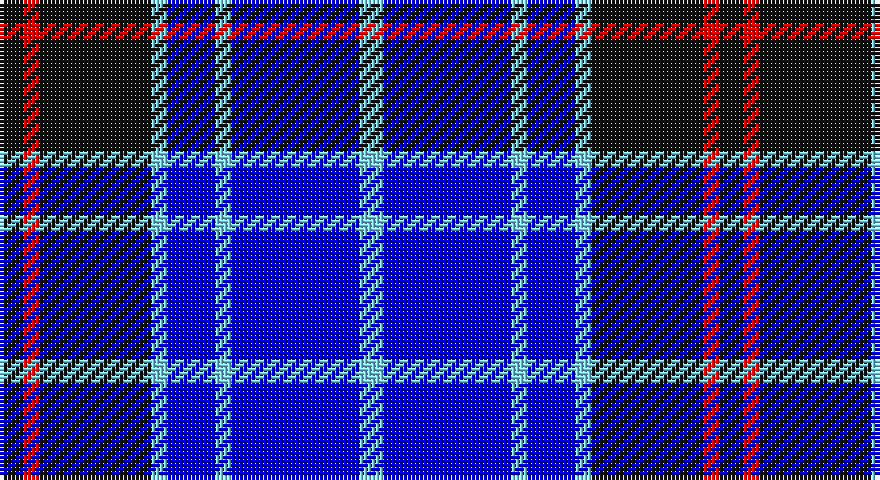

This page is one **sett** — a single exact thread-count. It belongs to the [tartan](/setts/k3r2k14lt2db6lt2db16lt3/)
(the same proportion at any scale), whose colour order is pattern [KRKWBWBW](/stripes/krkwbwbw/).

Part of the [Immanuel Presbyterian Church](/tartans/immanuel-presbyterian-church/) tartan — the named design grouping this sett with its other cloths.

Sourced from register-of-tartans.  It is a [8 stripe tartan](/stripes/stripes8/).

Original link https://www.tartanregister.gov.uk/tartanDetails.aspx?ref=10297

## Register references

External register numbers recorded for this tartan.

- Scottish Register of Tartans: [10297](https://www.tartanregister.gov.uk/tartanDetails.aspx?ref=10297)

## Thread count
K/6 R4 K28 LB4 B12 LB4 B32 LB/6

One full sett is **180 threads**.

## Palette

Palette: <strong>Tartan Register</strong>
<table><thead><tr><th>Colour</th><th>Threads</th><th>Shade</th><th>Base</th><th>OKLCh</th></tr></thead><tbody><tr><td>K/</td><td style="text-align:right;font-variant-numeric:tabular-nums">6</td><td><code style="background-color:#101010;">#101010</code> <small style="color:#888">#101010</small></td><td>K <code style="background-color:#000000;">#000000</code></td><td><small style="color:#888">oklch(17.3% 0.000 89.9)</small></td></tr><tr><td>R</td><td style="text-align:right;font-variant-numeric:tabular-nums">4</td><td><code style="background-color:#FF0000;">#FF0000</code> <small style="color:#888">#FF0000</small></td><td>R <code style="background-color:#CC0000;">#CC0000</code></td><td><small style="color:#888">oklch(62.8% 0.258 29.2)</small></td></tr><tr><td>K</td><td style="text-align:right;font-variant-numeric:tabular-nums">28</td><td><code style="background-color:#101010;">#101010</code> <small style="color:#888">#101010</small></td><td>K <code style="background-color:#000000;">#000000</code></td><td><small style="color:#888">oklch(17.3% 0.000 89.9)</small></td></tr><tr><td>LB</td><td style="text-align:right;font-variant-numeric:tabular-nums">4</td><td><code style="background-color:#82CFFD;">#82CFFD</code> <small style="color:#888">#82CFFD</small></td><td>W <code style="background-color:#F7F7F7;">#F7F7F7</code></td><td><small style="color:#888">oklch(82.2% 0.100 236.0)</small></td></tr><tr><td>B</td><td style="text-align:right;font-variant-numeric:tabular-nums">12</td><td><code style="background-color:#0000CD;">#0000CD</code> <small style="color:#888">#0000CD</small></td><td>B <code style="background-color:#2A418A;">#2A418A</code></td><td><small style="color:#888">oklch(38.3% 0.266 264.1)</small></td></tr><tr><td>LB</td><td style="text-align:right;font-variant-numeric:tabular-nums">4</td><td><code style="background-color:#82CFFD;">#82CFFD</code> <small style="color:#888">#82CFFD</small></td><td>W <code style="background-color:#F7F7F7;">#F7F7F7</code></td><td><small style="color:#888">oklch(82.2% 0.100 236.0)</small></td></tr><tr><td>B</td><td style="text-align:right;font-variant-numeric:tabular-nums">32</td><td><code style="background-color:#0000CD;">#0000CD</code> <small style="color:#888">#0000CD</small></td><td>B <code style="background-color:#2A418A;">#2A418A</code></td><td><small style="color:#888">oklch(38.3% 0.266 264.1)</small></td></tr><tr><td>LB/</td><td style="text-align:right;font-variant-numeric:tabular-nums">6</td><td><code style="background-color:#82CFFD;">#82CFFD</code> <small style="color:#888">#82CFFD</small></td><td>W <code style="background-color:#F7F7F7;">#F7F7F7</code></td><td><small style="color:#888">oklch(82.2% 0.100 236.0)</small></td></tr></tbody></table>

# Sample pattern

## Nearest tartans

The nearest existing variants by ΔTartan distance, with this tartan at the top so the swatches line up against it.

ΔTartan

Tartan

Sett

—

<a href="/ttd/edit/#slug=k3r2k14lt2db6lt2db16lt3~x2">Immanuel Presbyterian Church (Milwaukee)</a> <a class="nn-out" href="/variants/s8/k3r2k14lt2db6lt2db16lt3~x2/" title="open its dictionary page">↗</a>

1.14

<a href="/ttd/edit/#slug=k3lo2b14k14lb2k14lb2b6lb2b16lb3~x2&amp;base=k3r2k14lt2db6lt2db16lt3~x2">Immanuel Presbyterian Church (Corp)</a> <a class="nn-out" href="/variants/s11/k3lo2b14k14lb2k14lb2b6lb2b16lb3~x2/" title="open its dictionary page">↗</a>

1.28

<a href="/ttd/edit/#slug=b6k8b6g12db29w3db4~x2&amp;base=k3r2k14lt2db6lt2db16lt3~x2">Dickson (Kirkcudbrightshire)</a> <a class="nn-out" href="/variants/s7/b6k8b6g12db29w3db4~x2/" title="open its dictionary page">↗</a>

1.35

<a href="/ttd/edit/#slug=r1k1db10k1p4k9ly1~x4&amp;base=k3r2k14lt2db6lt2db16lt3~x2">Graeme High School Homecoming 2009</a> <a class="nn-out" href="/variants/s7/r1k1db10k1p4k9ly1~x4/" title="open its dictionary page">↗</a>

1.37

<a href="/ttd/edit/#slug=r3db2w2db26k22w3db3w3~x2&amp;base=k3r2k14lt2db6lt2db16lt3~x2">DeCloud-McMasters (Personal)</a> <a class="nn-out" href="/variants/s8/r3db2w2db26k22w3db3w3~x2/" title="open its dictionary page">↗</a>

1.39

<a href="/ttd/edit/#slug=ly2b9r2db6ly1r1~x4&amp;base=k3r2k14lt2db6lt2db16lt3~x2">Lauder Primary School</a> <a class="nn-out" href="/variants/s6/ly2b9r2db6ly1r1~x4/" title="open its dictionary page">↗</a>

1.51

<a href="/ttd/edit/#slug=db30dbi2k9w3db6w4k3dbi6~x2&amp;base=k3r2k14lt2db6lt2db16lt3~x2">Auto Docs</a> <a class="nn-out" href="/variants/s8/db30dbi2k9w3db6w4k3dbi6~x2/" title="open its dictionary page">↗</a>

1.54

<a href="/ttd/edit/#slug=w9db3ly3db24dt24ly2dt2ly2~x2&amp;base=k3r2k14lt2db6lt2db16lt3~x2">Halesowen #2</a> <a class="nn-out" href="/variants/s8/w9db3ly3db24dt24ly2dt2ly2~x2/" title="open its dictionary page">↗</a>

1.55

<a href="/ttd/edit/#slug=db7r3db26t2db2t26ly4~x2&amp;base=k3r2k14lt2db6lt2db16lt3~x2">Int. Police Association (Official)</a> <a class="nn-out" href="/variants/s7/db7r3db26t2db2t26ly4~x2/" title="open its dictionary page">↗</a>

1.60

<a href="/ttd/edit/#slug=db7ly1db7b11r2~x6&amp;base=k3r2k14lt2db6lt2db16lt3~x2">Brazell (Personal)</a> <a class="nn-out" href="/variants/s5/db7ly1db7b11r2~x6/" title="open its dictionary page">↗</a>

1.60

<a href="/ttd/edit/#slug=db4t20k3t2k3t20db24k3db2k3db24r4&amp;base=k3r2k14lt2db6lt2db16lt3~x2">Roberts (Welsh Name)</a> <a class="nn-out" href="/variants/s12/db4t20k3t2k3t20db24k3db2k3db24r4/" title="open its dictionary page">↗</a>

## Neighbour map

Every grey dot is one of 14360 variants placed by the first two principal components of the ΔTartan feature space (44% of its variance). Red is this tartan; blue dots are its nearest — click one to open its page.

<svg viewBox="0 0 640 380" role="img" style="max-width:100%;height:auto;border:1px solid #e0e0e0;border-radius:4px;display:block" xmlns="http://www.w3.org/2000/svg"><image href="/nn/cloud.v1.png" width="640" height="380"/><a href="/variants/s11/k3lo2b14k14lb2k14lb2b6lb2b16lb3~x2/"><circle cx="215.7" cy="194.6" r="4" fill="#3465a4"><title>Immanuel Presbyterian Church (Corp)</title></circle></a><a href="/variants/s7/b6k8b6g12db29w3db4~x2/"><circle cx="191.7" cy="191.9" r="4" fill="#3465a4"><title>Dickson (Kirkcudbrightshire)</title></circle></a><a href="/variants/s7/r1k1db10k1p4k9ly1~x4/"><circle cx="189.0" cy="174.7" r="4" fill="#3465a4"><title>Graeme High School Homecoming 2009</title></circle></a><a href="/variants/s8/r3db2w2db26k22w3db3w3~x2/"><circle cx="256.3" cy="162.2" r="4" fill="#3465a4"><title>DeCloud-McMasters (Personal)</title></circle></a><a href="/variants/s6/ly2b9r2db6ly1r1~x4/"><circle cx="177.9" cy="195.9" r="4" fill="#3465a4"><title>Lauder Primary School</title></circle></a><a href="/variants/s8/db30dbi2k9w3db6w4k3dbi6~x2/"><circle cx="301.0" cy="170.0" r="4" fill="#3465a4"><title>Auto Docs</title></circle></a><a href="/variants/s8/w9db3ly3db24dt24ly2dt2ly2~x2/"><circle cx="202.3" cy="168.4" r="4" fill="#3465a4"><title>Halesowen #2</title></circle></a><a href="/variants/s7/db7r3db26t2db2t26ly4~x2/"><circle cx="288.1" cy="180.6" r="4" fill="#3465a4"><title>Int. Police Association (Official)</title></circle></a><a href="/variants/s5/db7ly1db7b11r2~x6/"><circle cx="241.6" cy="230.6" r="4" fill="#3465a4"><title>Brazell (Personal)</title></circle></a><a href="/variants/s12/db4t20k3t2k3t20db24k3db2k3db24r4/"><circle cx="254.7" cy="170.8" r="4" fill="#3465a4"><title>Roberts (Welsh Name)</title></circle></a><circle cx="209.3" cy="200.2" r="5" fill="#c00000"/></svg>

ID: /variants/s8/k3r2k14lt2db6lt2db16lt3~x2/
