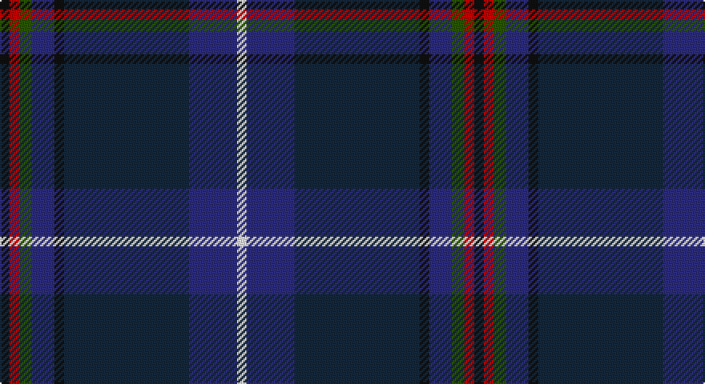

This page is one **sett** — a single exact thread-count. It belongs to the [tartan](/setts/k3r3dg4db7k3dt39db15w3/)
(the same proportion at any scale), whose colour order is pattern [KRGBKBBW](/stripes/krgbkbbw/).

Sourced from register-of-tartans.  It is a [8 stripe tartan](/stripes/stripes8/).

Original link https://www.tartanregister.gov.uk/tartanDetails.aspx?ref=70

2 attestations — the source records this cloth was collapsed from (oldest owns this page)

<ul>
<li>01/01/2006 — American National (register-of-tartans, <a href="https://www.tartanregister.gov.uk/tartanDetails.aspx?ref=70">record</a>)</li>
<li>pre 2006 — American National (Fashion) (tartans-authority, <a href="http://www.tartansauthority.com/tartan-ferret/display/6882/">record</a>)</li>
</ul>

## Register references

External register numbers recorded for this tartan.

- Scottish Register of Tartans: [70](https://www.tartanregister.gov.uk/tartanDetails.aspx?ref=70)
- Scottish Tartans Authority (ITI): 6882
- Scottish Tartans World Register: 6882

## Thread count
K/6 R6 G8 DB14 K6 DN78 DB30 W/6

One full sett is **296 threads**.

## Palette

Palette: <strong>Tartan Register</strong>
<table><thead><tr><th>Colour</th><th>Threads</th><th>Shade</th><th>Base</th><th>OKLCh</th></tr></thead><tbody><tr><td>K/</td><td style="text-align:right;font-variant-numeric:tabular-nums">6</td><td><code style="background-color:#101010;">#101010</code> <small style="color:#888">#101010</small></td><td>K <code style="background-color:#000000;">#000000</code></td><td><small style="color:#888">oklch(17.3% 0.000 89.9)</small></td></tr><tr><td>R</td><td style="text-align:right;font-variant-numeric:tabular-nums">6</td><td><code style="background-color:#C80000;">#C80000</code> <small style="color:#888">#C80000</small></td><td>R <code style="background-color:#CC0000;">#CC0000</code></td><td><small style="color:#888">oklch(52.3% 0.215 29.2)</small></td></tr><tr><td>G</td><td style="text-align:right;font-variant-numeric:tabular-nums">8</td><td><code style="background-color:#285800;">#285800</code> <small style="color:#888">#285800</small></td><td>G <code style="background-color:#006100;">#006100</code></td><td><small style="color:#888">oklch(41.0% 0.122 135.8)</small></td></tr><tr><td>DB</td><td style="text-align:right;font-variant-numeric:tabular-nums">14</td><td><code style="background-color:#2C2C80;">#2C2C80</code> <small style="color:#888">#2C2C80</small></td><td>B <code style="background-color:#2A418A;">#2A418A</code></td><td><small style="color:#888">oklch(35.0% 0.138 276.6)</small></td></tr><tr><td>K</td><td style="text-align:right;font-variant-numeric:tabular-nums">6</td><td><code style="background-color:#101010;">#101010</code> <small style="color:#888">#101010</small></td><td>K <code style="background-color:#000000;">#000000</code></td><td><small style="color:#888">oklch(17.3% 0.000 89.9)</small></td></tr><tr><td>DN</td><td style="text-align:right;font-variant-numeric:tabular-nums">78</td><td><code style="background-color:#14283C;">#14283C</code> <small style="color:#888">#14283C</small></td><td>B <code style="background-color:#2A418A;">#2A418A</code></td><td><small style="color:#888">oklch(27.1% 0.046 249.9)</small></td></tr><tr><td>DB</td><td style="text-align:right;font-variant-numeric:tabular-nums">30</td><td><code style="background-color:#2C2C80;">#2C2C80</code> <small style="color:#888">#2C2C80</small></td><td>B <code style="background-color:#2A418A;">#2A418A</code></td><td><small style="color:#888">oklch(35.0% 0.138 276.6)</small></td></tr><tr><td>W/</td><td style="text-align:right;font-variant-numeric:tabular-nums">6</td><td><code style="background-color:#F8F8F8;">#F8F8F8</code> <small style="color:#888">#F8F8F8</small></td><td>W <code style="background-color:#F7F7F7;">#F7F7F7</code></td><td><small style="color:#888">oklch(97.9% 0.000 89.9)</small></td></tr></tbody></table>

# Sample pattern

## Nearest tartans

The nearest existing variants by ΔTartan distance, with this tartan at the top so the swatches line up against it.

ΔTartan

Tartan

Sett

—

<a href="/ttd/edit/#slug=k3r3dg4db7k3dt39db15w3~x2">American National</a> <a class="nn-out" href="/variants/s8/k3r3dg4db7k3dt39db15w3~x2/" title="open its dictionary page">↗</a>

0.97

<a href="/variants/s8/ki4w1dg12k3db16r1db1r1~x2/">Purves (2014)</a>

0.98

<a href="/variants/s10/k10n4k34db3g3db3g3db26ni2lb3~x2/">Dugan (Personal)</a>

1.08

<a href="/ttd/edit/#slug=t3k1lo2k1db10k17db2t1dy1r1~x2&amp;base=k3r3dg4db7k3dt39db15w3~x2">Six Frigates (US)</a> <a class="nn-out" href="/variants/s10/t3k1lo2k1db10k17db2t1dy1r1~x2/" title="open its dictionary page">↗</a>

1.11

<a href="/variants/s8/dt30lb2k6db3r3~x4/">Edinburgh Crystal Corporate Tartan</a>

1.13

<a href="/ttd/edit/#slug=dbi4db3r2db26k3dbi3g3dbi3g17lo3~x2&amp;base=k3r3dg4db7k3dt39db15w3~x2">Boyle (Personal)</a> <a class="nn-out" href="/variants/s10/dbi4db3r2db26k3dbi3g3dbi3g17lo3~x2/" title="open its dictionary page">↗</a>

1.14

<a href="/variants/s8/ki3r3dg4db7ki3k39db15w3~x2/">American National Fashion Tartan</a>

1.17

<a href="/ttd/edit/#slug=dy2db4ly3dg28db28w2db4n2~x2&amp;base=k3r3dg4db7k3dt39db15w3~x2">Laurentian University</a> <a class="nn-out" href="/variants/s8/dy2db4ly3dg28db28w2db4n2~x2/" title="open its dictionary page">↗</a>

1.17

<a href="/ttd/edit/#slug=dg24t4dg3db11dp8db37k3db2r4~x2&amp;base=k3r3dg4db7k3dt39db15w3~x2">Stewmann (Personal)</a> <a class="nn-out" href="/variants/s9/dg24t4dg3db11dp8db37k3db2r4~x2/" title="open its dictionary page">↗</a>

1.21

<a href="/ttd/edit/#slug=db4dy5g19dp5dy5k5dy5db36ly3~x2&amp;base=k3r3dg4db7k3dt39db15w3~x2">Suzugamine (Corporate)</a> <a class="nn-out" href="/variants/s9/db4dy5g19dp5dy5k5dy5db36ly3~x2/" title="open its dictionary page">↗</a>

1.23

<a href="/ttd/edit/#slug=dg10w2dt3g2m14dti26dg2dti6~x2&amp;base=k3r3dg4db7k3dt39db15w3~x2">Spirit of Fife (Corporate)</a> <a class="nn-out" href="/variants/s8/dg10w2dt3g2m14dti26dg2dti6~x2/" title="open its dictionary page">↗</a>

## Neighbour map

Every grey dot is one of 14360 variants placed by the first two principal components of the ΔTartan feature space (44% of its variance). Red is this tartan; blue dots are its nearest — click one to open its page.

<svg viewBox="0 0 640 380" role="img" style="max-width:100%;height:auto;border:1px solid #e0e0e0;border-radius:4px;display:block" xmlns="http://www.w3.org/2000/svg"><image href="/nn/cloud.v1.png" width="640" height="380"/><a href="/variants/s8/ki4w1dg12k3db16r1db1r1~x2/"><circle cx="263.4" cy="164.1" r="4" fill="#3465a4"><title>Purves (2014)</title></circle></a><a href="/variants/s10/k10n4k34db3g3db3g3db26ni2lb3~x2/"><circle cx="301.0" cy="151.3" r="4" fill="#3465a4"><title>Dugan (Personal)</title></circle></a><a href="/variants/s10/t3k1lo2k1db10k17db2t1dy1r1~x2/"><circle cx="296.9" cy="137.6" r="4" fill="#3465a4"><title>Six Frigates (US)</title></circle></a><a href="/variants/s8/dt30lb2k6db3r3~x4/"><circle cx="330.7" cy="165.2" r="4" fill="#3465a4"><title>Edinburgh Crystal Corporate Tartan</title></circle></a><a href="/variants/s10/dbi4db3r2db26k3dbi3g3dbi3g17lo3~x2/"><circle cx="243.8" cy="157.4" r="4" fill="#3465a4"><title>Boyle (Personal)</title></circle></a><a href="/variants/s8/ki3r3dg4db7ki3k39db15w3~x2/"><circle cx="292.7" cy="170.5" r="4" fill="#3465a4"><title>American National Fashion Tartan</title></circle></a><a href="/variants/s8/dy2db4ly3dg28db28w2db4n2~x2/"><circle cx="300.5" cy="161.4" r="4" fill="#3465a4"><title>Laurentian University</title></circle></a><a href="/variants/s9/dg24t4dg3db11dp8db37k3db2r4~x2/"><circle cx="325.7" cy="165.7" r="4" fill="#3465a4"><title>Stewmann (Personal)</title></circle></a><a href="/variants/s9/db4dy5g19dp5dy5k5dy5db36ly3~x2/"><circle cx="224.2" cy="156.7" r="4" fill="#3465a4"><title>Suzugamine (Corporate)</title></circle></a><a href="/variants/s8/dg10w2dt3g2m14dti26dg2dti6~x2/"><circle cx="252.2" cy="168.3" r="4" fill="#3465a4"><title>Spirit of Fife (Corporate)</title></circle></a><circle cx="292.9" cy="163.2" r="5" fill="#c00000"/></svg>

ID: /variants/s8/k3r3dg4db7k3dt39db15w3~x2/
