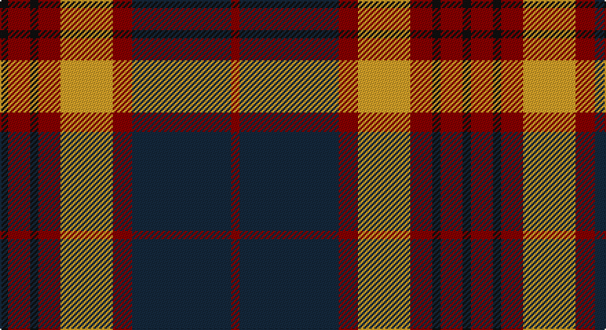

This page is one **sett** — a single exact thread-count. It belongs to the [tartan](/setts/k3r8k3r8lo19r7dt36r3/)
(the same proportion at any scale), whose colour order is pattern [KRKRYRBR](/stripes/krkryrbr/).

Sourced from register-of-tartans.  It is a [8 stripe tartan](/stripes/stripes8/).

Original link https://www.tartanregister.gov.uk/tartanDetails.aspx?ref=3415

2 attestations — the source records this cloth was collapsed from (oldest owns this page)

<ul>
<li>01/06/2004 — Private SA Club (register-of-tartans, <a href="https://www.tartanregister.gov.uk/tartanDetails.aspx?ref=3415">record</a>)</li>
<li>2004 June — Private SA Club (Corporate) (tartans-authority, <a href="http://www.tartansauthority.com/tartan-ferret/display/6853/">record</a>)</li>
</ul>

## Register references

External register numbers recorded for this tartan.

- Scottish Register of Tartans: [3415](https://www.tartanregister.gov.uk/tartanDetails.aspx?ref=3415)
- Scottish Tartans Authority (ITI): 6853

## Thread count
K/6 DR16 K6 DR16 Y38 DR14 DN72 DR/6

One full sett is **336 threads**.

## Palette

Palette: <strong>Tartan Register</strong> <small style="color:#888">(3 of 4 colours)</small>
<table><thead><tr><th>Colour</th><th>Threads</th><th>Shade</th><th>Base</th><th>OKLCh</th></tr></thead><tbody><tr><td>K/</td><td style="text-align:right;font-variant-numeric:tabular-nums">6</td><td><code style="background-color:#101010;">#101010</code> <small style="color:#888">#101010</small></td><td>K <code style="background-color:#000000;">#000000</code></td><td><small style="color:#888">oklch(17.3% 0.000 89.9)</small></td></tr><tr><td>DR</td><td style="text-align:right;font-variant-numeric:tabular-nums">16</td><td><code style="background-color:#880000;">#880000</code> <small style="color:#888">#880000</small></td><td>R <code style="background-color:#CC0000;">#CC0000</code></td><td><small style="color:#888">oklch(39.4% 0.162 29.2)</small></td></tr><tr><td>K</td><td style="text-align:right;font-variant-numeric:tabular-nums">6</td><td><code style="background-color:#101010;">#101010</code> <small style="color:#888">#101010</small></td><td>K <code style="background-color:#000000;">#000000</code></td><td><small style="color:#888">oklch(17.3% 0.000 89.9)</small></td></tr><tr><td>DR</td><td style="text-align:right;font-variant-numeric:tabular-nums">16</td><td><code style="background-color:#880000;">#880000</code> <small style="color:#888">#880000</small></td><td>R <code style="background-color:#CC0000;">#CC0000</code></td><td><small style="color:#888">oklch(39.4% 0.162 29.2)</small></td></tr><tr><td>Y</td><td style="text-align:right;font-variant-numeric:tabular-nums">38</td><td><code style="background-color:#D8A028;">#D8A028</code> <small style="color:#888">#D8A028</small></td><td>Y <code style="background-color:#F2BF00;">#F2BF00</code></td><td><small style="color:#888">oklch(74.0% 0.142 81.1)</small></td></tr><tr><td>DR</td><td style="text-align:right;font-variant-numeric:tabular-nums">14</td><td><code style="background-color:#880000;">#880000</code> <small style="color:#888">#880000</small></td><td>R <code style="background-color:#CC0000;">#CC0000</code></td><td><small style="color:#888">oklch(39.4% 0.162 29.2)</small></td></tr><tr><td>DN</td><td style="text-align:right;font-variant-numeric:tabular-nums">72</td><td><code style="background-color:#14283C;">#14283C</code> <small style="color:#888">#14283C</small></td><td>B <code style="background-color:#2A418A;">#2A418A</code></td><td><small style="color:#888">oklch(27.1% 0.046 249.9)</small></td></tr><tr><td>DR/</td><td style="text-align:right;font-variant-numeric:tabular-nums">6</td><td><code style="background-color:#880000;">#880000</code> <small style="color:#888">#880000</small></td><td>R <code style="background-color:#CC0000;">#CC0000</code></td><td><small style="color:#888">oklch(39.4% 0.162 29.2)</small></td></tr></tbody></table>

# Sample pattern

## Nearest tartans

The nearest existing variants by ΔTartan distance, with this tartan at the top so the swatches line up against it.

ΔTartan

Tartan

Sett

—

<a href="/ttd/edit/#slug=k3r8k3r8lo19r7dt36r3~x2">Private SA Club</a> <a class="nn-out" href="/variants/s8/k3r8k3r8lo19r7dt36r3~x2/" title="open its dictionary page">↗</a>

0.76

<a href="/ttd/edit/#slug=dp8r3ly1r3dg14r3ly1~x4&amp;base=k3r8k3r8lo19r7dt36r3~x2">Logan - 1819 (with yellow)</a> <a class="nn-out" href="/variants/s7/dp8r3ly1r3dg14r3ly1~x4/" title="open its dictionary page">↗</a>

0.77

<a href="/ttd/edit/#slug=dgi12dg1dgi1dg1dgi1k5r10k1r2~x2&amp;base=k3r8k3r8lo19r7dt36r3~x2">Lindsay #2</a> <a class="nn-out" href="/variants/s9/dgi12dg1dgi1dg1dgi1k5r10k1r2~x2/" title="open its dictionary page">↗</a>

0.82

<a href="/ttd/edit/#slug=g1r9g3k3g3r1k9w1~x2&amp;base=k3r8k3r8lo19r7dt36r3~x2">Manson Family Tartan</a> <a class="nn-out" href="/variants/s8/g1r9g3k3g3r1k9w1~x2/" title="open its dictionary page">↗</a>

0.83

<a href="/ttd/edit/#slug=r3dr14g8r2g2w2g2r1~x2&amp;base=k3r8k3r8lo19r7dt36r3~x2">Scott Hunting Clan Tartan</a> <a class="nn-out" href="/variants/s8/r3dr14g8r2g2w2g2r1~x2/" title="open its dictionary page">↗</a>

0.85

<a href="/ttd/edit/#slug=k15dg1k3r9dg1r3lo11k1~x4&amp;base=k3r8k3r8lo19r7dt36r3~x2">Island of Innis, The</a> <a class="nn-out" href="/variants/s8/k15dg1k3r9dg1r3lo11k1~x4/" title="open its dictionary page">↗</a>

0.87

<a href="/ttd/edit/#slug=k9lr4k1lr4dg15r4k1~x4&amp;base=k3r8k3r8lo19r7dt36r3~x2">Logan - 1797 (Dark)</a> <a class="nn-out" href="/variants/s7/k9lr4k1lr4dg15r4k1~x4/" title="open its dictionary page">↗</a>

0.88

<a href="/ttd/edit/#slug=g8r2g12k6g3db6r24k4~x2&amp;base=k3r8k3r8lo19r7dt36r3~x2">Dickie</a> <a class="nn-out" href="/variants/s8/g8r2g12k6g3db6r24k4~x2/" title="open its dictionary page">↗</a>

0.90

<a href="/ttd/edit/#slug=do2lr2k6do3k2o14k1o1~x4&amp;base=k3r8k3r8lo19r7dt36r3~x2">Blair Atholl (Fashion)</a> <a class="nn-out" href="/variants/s8/do2lr2k6do3k2o14k1o1~x4/" title="open its dictionary page">↗</a>

0.90

<a href="/ttd/edit/#slug=k1b1r16dg16k12b8r16b1k1~x2&amp;base=k3r8k3r8lo19r7dt36r3~x2">MacNaughten</a> <a class="nn-out" href="/variants/s9/k1b1r16dg16k12b8r16b1k1~x2/" title="open its dictionary page">↗</a>

0.91

<a href="/ttd/edit/#slug=dg12g6dg6r15k1r1k2~x2&amp;base=k3r8k3r8lo19r7dt36r3~x2">Cook (Name)</a> <a class="nn-out" href="/variants/s7/dg12g6dg6r15k1r1k2~x2/" title="open its dictionary page">↗</a>

## Neighbour map

Every grey dot is one of 14360 variants placed by the first two principal components of the ΔTartan feature space (44% of its variance). Red is this tartan; blue dots are its nearest — click one to open its page.

<svg viewBox="0 0 640 380" role="img" style="max-width:100%;height:auto;border:1px solid #e0e0e0;border-radius:4px;display:block" xmlns="http://www.w3.org/2000/svg"><image href="/nn/cloud.v1.png" width="640" height="380"/><a href="/variants/s7/dp8r3ly1r3dg14r3ly1~x4/"><circle cx="248.0" cy="181.0" r="4" fill="#3465a4"><title>Logan - 1819 (with yellow)</title></circle></a><a href="/variants/s9/dgi12dg1dgi1dg1dgi1k5r10k1r2~x2/"><circle cx="246.9" cy="167.8" r="4" fill="#3465a4"><title>Lindsay #2</title></circle></a><a href="/variants/s8/g1r9g3k3g3r1k9w1~x2/"><circle cx="202.7" cy="193.3" r="4" fill="#3465a4"><title>Manson Family Tartan</title></circle></a><a href="/variants/s8/r3dr14g8r2g2w2g2r1~x2/"><circle cx="245.5" cy="171.8" r="4" fill="#3465a4"><title>Scott Hunting Clan Tartan</title></circle></a><a href="/variants/s8/k15dg1k3r9dg1r3lo11k1~x4/"><circle cx="232.9" cy="163.7" r="4" fill="#3465a4"><title>Island of Innis, The</title></circle></a><a href="/variants/s7/k9lr4k1lr4dg15r4k1~x4/"><circle cx="214.9" cy="186.2" r="4" fill="#3465a4"><title>Logan - 1797 (Dark)</title></circle></a><a href="/variants/s8/g8r2g12k6g3db6r24k4~x2/"><circle cx="200.1" cy="181.3" r="4" fill="#3465a4"><title>Dickie</title></circle></a><a href="/variants/s8/do2lr2k6do3k2o14k1o1~x4/"><circle cx="267.3" cy="161.8" r="4" fill="#3465a4"><title>Blair Atholl (Fashion)</title></circle></a><a href="/variants/s9/k1b1r16dg16k12b8r16b1k1~x2/"><circle cx="231.1" cy="168.3" r="4" fill="#3465a4"><title>MacNaughten</title></circle></a><a href="/variants/s7/dg12g6dg6r15k1r1k2~x2/"><circle cx="252.7" cy="191.8" r="4" fill="#3465a4"><title>Cook (Name)</title></circle></a><circle cx="229.0" cy="173.9" r="5" fill="#c00000"/></svg>

ID: /variants/s8/k3r8k3r8lo19r7dt36r3~x2/
