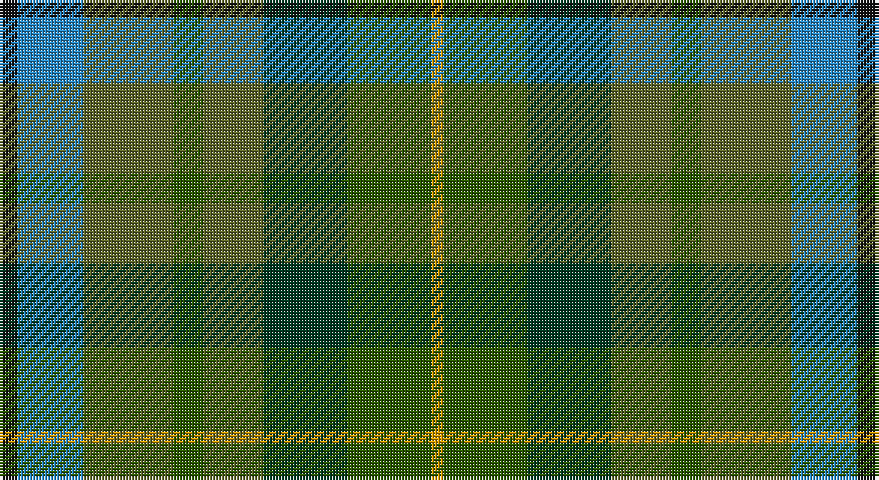

This page is one **sett** — a single exact thread-count. It belongs to the [tartan](/setts/k3t11y15dgi5y10dg14dgi14lo2/)
(the same proportion at any scale), whose colour order is pattern [KBGGGGGY](/stripes/kbgggggy/).

Part of the [Brocéliande](/tartans/broc-liande/) tartan — the named design grouping this sett with its other cloths.

Sourced from tartans-authority.  It is a [8 stripe tartan](/stripes/stripes8/).

Original link http://www.tartansauthority.com/tartan-ferret/display/10812/

## Also known as

This cloth is also recorded under:

- Brocliande )

## Register references

External register numbers recorded for this tartan.

- Scottish Register of Tartans: [10812](https://www.tartanregister.gov.uk/tartanDetails?ref=10812)
- Scottish Tartans Authority (ITI): 10812

## Thread count
K/6 B22 G30 Ga10 G20 DG28 Ga28 DY/4

One full sett is **286 threads**.

## Palette

Palette: <strong>Tartan Register</strong> <small style="color:#888">(5 of 6 colours)</small>
<table><thead><tr><th>Colour</th><th>Threads</th><th>Shade</th><th>Base</th><th>OKLCh</th></tr></thead><tbody><tr><td>K/</td><td style="text-align:right;font-variant-numeric:tabular-nums">6</td><td><code style="background-color:#101010;">#101010</code> <small style="color:#888">#101010</small></td><td>K <code style="background-color:#000000;">#000000</code></td><td><small style="color:#888">oklch(17.3% 0.000 89.9)</small></td></tr><tr><td>B</td><td style="text-align:right;font-variant-numeric:tabular-nums">22</td><td><code style="background-color:#2888C4;">#2888C4</code> <small style="color:#888">#2888C4</small></td><td>B <code style="background-color:#2A418A;">#2A418A</code></td><td><small style="color:#888">oklch(60.1% 0.125 241.5)</small></td></tr><tr><td>G</td><td style="text-align:right;font-variant-numeric:tabular-nums">30</td><td><code style="background-color:#5C6428;">#5C6428</code> <small style="color:#888">#5C6428</small></td><td>G <code style="background-color:#006100;">#006100</code></td><td><small style="color:#888">oklch(48.3% 0.084 116.0)</small></td></tr><tr><td>Ga</td><td style="text-align:right;font-variant-numeric:tabular-nums">10</td><td><code style="background-color:#285800;">#285800</code> <small style="color:#888">#285800</small></td><td>G <code style="background-color:#006100;">#006100</code></td><td><small style="color:#888">oklch(41.0% 0.122 135.8)</small></td></tr><tr><td>G</td><td style="text-align:right;font-variant-numeric:tabular-nums">20</td><td><code style="background-color:#5C6428;">#5C6428</code> <small style="color:#888">#5C6428</small></td><td>G <code style="background-color:#006100;">#006100</code></td><td><small style="color:#888">oklch(48.3% 0.084 116.0)</small></td></tr><tr><td>DG</td><td style="text-align:right;font-variant-numeric:tabular-nums">28</td><td><code style="background-color:#003820;">#003820</code> <small style="color:#888">#003820</small></td><td>G <code style="background-color:#006100;">#006100</code></td><td><small style="color:#888">oklch(30.0% 0.070 158.3)</small></td></tr><tr><td>Ga</td><td style="text-align:right;font-variant-numeric:tabular-nums">28</td><td><code style="background-color:#285800;">#285800</code> <small style="color:#888">#285800</small></td><td>G <code style="background-color:#006100;">#006100</code></td><td><small style="color:#888">oklch(41.0% 0.122 135.8)</small></td></tr><tr><td>DY/</td><td style="text-align:right;font-variant-numeric:tabular-nums">4</td><td><code style="background-color:#D09800;">#D09800</code> <small style="color:#888">#D09800</small></td><td>Y <code style="background-color:#F2BF00;">#F2BF00</code></td><td><small style="color:#888">oklch(71.4% 0.147 82.1)</small></td></tr></tbody></table>

# Sample pattern

## Compared to the master

This cloth is one sett of its design; the master sett (the exemplar the design is anchored on) is below for comparison.

<figure style="margin:0"><figcaption style="color:#888;font-size:smaller">this sett</figcaption></figure>
<figure style="margin:0"><figcaption style="color:#888;font-size:smaller"><a href="/setts/k3g11dgii15dgi5dgii10dg14dgi14ly2/">master sett →</a></figcaption></figure>

## Nearest tartans

The nearest existing variants by ΔTartan distance, with this tartan at the top so the swatches line up against it.

ΔTartan

Tartan

Sett

—

<a href="/ttd/edit/#slug=k3t11y15dgi5y10dg14dgi14lo2~x2">Brocliande (Fashion))</a> <a class="nn-out" href="/variants/s8/k3t11y15dgi5y10dg14dgi14lo2~x2/" title="open its dictionary page">↗</a>

1.35

<a href="/ttd/edit/#slug=o5y4lr1y4dy4dg4ly1~x4&amp;base=k3t11y15dgi5y10dg14dgi14lo2~x2">Devon, Green (District)</a> <a class="nn-out" href="/variants/s7/o5y4lr1y4dy4dg4ly1~x4/" title="open its dictionary page">↗</a>

1.41

<a href="/ttd/edit/#slug=g20gi6dg15dt5dg2dt15o4dt10r2~x2&amp;base=k3t11y15dgi5y10dg14dgi14lo2~x2">Copar a'Beannichte (Personal)</a> <a class="nn-out" href="/variants/s9/g20gi6dg15dt5dg2dt15o4dt10r2~x2/" title="open its dictionary page">↗</a>

1.47

<a href="/ttd/edit/#slug=w3dt16do15dg18do3r3do3dg18do15dt16ly3~x2&amp;base=k3t11y15dgi5y10dg14dgi14lo2~x2">Carinthian National</a> <a class="nn-out" href="/variants/s11/w3dt16do15dg18do3r3do3dg18do15dt16ly3~x2/" title="open its dictionary page">↗</a>

1.48

<a href="/ttd/edit/#slug=r3o23gi8g6gi8t6gi10t12gi3~x2&amp;base=k3t11y15dgi5y10dg14dgi14lo2~x2">Lawrence's Seven Pillars of Khaki</a> <a class="nn-out" href="/variants/s9/r3o23gi8g6gi8t6gi10t12gi3~x2/" title="open its dictionary page">↗</a>

1.53

<a href="/ttd/edit/#slug=o16dg29n19g8n19dg29o16r4~x2&amp;base=k3t11y15dgi5y10dg14dgi14lo2~x2">Styrian</a> <a class="nn-out" href="/variants/s8/o16dg29n19g8n19dg29o16r4~x2/" title="open its dictionary page">↗</a>

1.58

<a href="/ttd/edit/#slug=g8n19dg29o16r4~x2&amp;base=k3t11y15dgi5y10dg14dgi14lo2~x2">Styrian (Fashion)</a> <a class="nn-out" href="/variants/s5/g8n19dg29o16r4~x2/" title="open its dictionary page">↗</a>

1.66

<a href="/ttd/edit/#slug=dg29g16k8r4dg16g16ly4r4k16t4g28dg16&amp;base=k3t11y15dgi5y10dg14dgi14lo2~x2">MacCamley Clan Tartan</a> <a class="nn-out" href="/variants/s12/dg29g16k8r4dg16g16ly4r4k16t4g28dg16/" title="open its dictionary page">↗</a>

1.67

<a href="/ttd/edit/#slug=dg29g16k8r4dg16g16ly4r4k16gi4g28dg16&amp;base=k3t11y15dgi5y10dg14dgi14lo2~x2">McCamley (Personal)</a> <a class="nn-out" href="/variants/s12/dg29g16k8r4dg16g16ly4r4k16gi4g28dg16/" title="open its dictionary page">↗</a>

1.74

<a href="/ttd/edit/#slug=dt4k9g20dp2dg20k5dt6lb2~x2&amp;base=k3t11y15dgi5y10dg14dgi14lo2~x2">Linden</a> <a class="nn-out" href="/variants/s8/dt4k9g20dp2dg20k5dt6lb2~x2/" title="open its dictionary page">↗</a>

1.76

<a href="/ttd/edit/#slug=dg24lo2y16db7do16r5~x2&amp;base=k3t11y15dgi5y10dg14dgi14lo2~x2">Waterford, County (District)</a> <a class="nn-out" href="/variants/s6/dg24lo2y16db7do16r5~x2/" title="open its dictionary page">↗</a>

## Neighbour map

Every grey dot is one of 14360 variants placed by the first two principal components of the ΔTartan feature space (44% of its variance). Red is this tartan; blue dots are its nearest — click one to open its page.

<svg viewBox="0 0 640 380" role="img" style="max-width:100%;height:auto;border:1px solid #e0e0e0;border-radius:4px;display:block" xmlns="http://www.w3.org/2000/svg"><image href="/nn/cloud.v1.png" width="640" height="380"/><a href="/variants/s7/o5y4lr1y4dy4dg4ly1~x4/"><circle cx="113.2" cy="263.4" r="4" fill="#3465a4"><title>Devon, Green (District)</title></circle></a><a href="/variants/s9/g20gi6dg15dt5dg2dt15o4dt10r2~x2/"><circle cx="192.3" cy="220.2" r="4" fill="#3465a4"><title>Copar a'Beannichte (Personal)</title></circle></a><a href="/variants/s11/w3dt16do15dg18do3r3do3dg18do15dt16ly3~x2/"><circle cx="149.8" cy="226.8" r="4" fill="#3465a4"><title>Carinthian National</title></circle></a><a href="/variants/s9/r3o23gi8g6gi8t6gi10t12gi3~x2/"><circle cx="198.4" cy="237.3" r="4" fill="#3465a4"><title>Lawrence's Seven Pillars of Khaki</title></circle></a><a href="/variants/s8/o16dg29n19g8n19dg29o16r4~x2/"><circle cx="195.1" cy="267.6" r="4" fill="#3465a4"><title>Styrian</title></circle></a><a href="/variants/s5/g8n19dg29o16r4~x2/"><circle cx="194.9" cy="274.2" r="4" fill="#3465a4"><title>Styrian (Fashion)</title></circle></a><a href="/variants/s12/dg29g16k8r4dg16g16ly4r4k16t4g28dg16/"><circle cx="166.2" cy="216.9" r="4" fill="#3465a4"><title>MacCamley Clan Tartan</title></circle></a><a href="/variants/s12/dg29g16k8r4dg16g16ly4r4k16gi4g28dg16/"><circle cx="166.4" cy="216.6" r="4" fill="#3465a4"><title>McCamley (Personal)</title></circle></a><a href="/variants/s8/dt4k9g20dp2dg20k5dt6lb2~x2/"><circle cx="159.6" cy="209.4" r="4" fill="#3465a4"><title>Linden</title></circle></a><a href="/variants/s6/dg24lo2y16db7do16r5~x2/"><circle cx="181.7" cy="223.6" r="4" fill="#3465a4"><title>Waterford, County (District)</title></circle></a><circle cx="145.0" cy="250.0" r="5" fill="#c00000"/></svg>

ID: /variants/s8/k3t11y15dgi5y10dg14dgi14lo2~x2/
