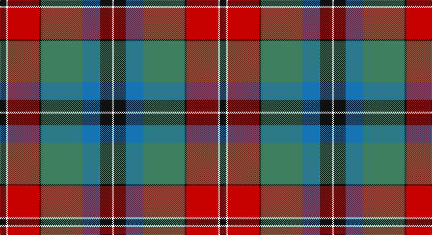

This page is one **sett** — a single exact thread-count. It belongs to the [tartan](/setts/k3w1r16k1g21b9k6w1/)
(the same proportion at any scale), whose colour order is pattern [KWRKGBKW](/stripes/kwrkgbkw/).

Sourced from register-of-tartans.  It is a [8 stripe tartan](/stripes/stripes8/).

Original link https://www.tartanregister.gov.uk/tartanDetails.aspx?ref=1227

2 attestations — the source records this cloth was collapsed from (oldest owns this page)

<ul>
<li>01/01/2002 — Ford & Etal (register-of-tartans, <a href="https://www.tartanregister.gov.uk/tartanDetails.aspx?ref=1227">record</a>)</li>
<li>pre 2004 — Ford & Etal (Corporate) (tartans-authority, <a href="http://www.tartansauthority.com/tartan-ferret/display/6193/">record</a>)</li>
</ul>

## Register references

External register numbers recorded for this tartan.

- Scottish Register of Tartans: [1227](https://www.tartanregister.gov.uk/tartanDetails.aspx?ref=1227)
- Scottish Tartans Authority (ITI): 6193
- Scottish Tartans World Register: 2903

## Thread count
K/12 W4 R64 K4 G84 B36 K24 W/4

One full sett is **448 threads**.

## Palette

Palette: <strong>Tartan Register</strong>
<table><thead><tr><th>Colour</th><th>Threads</th><th>Shade</th><th>Base</th><th>OKLCh</th></tr></thead><tbody><tr><td>K/</td><td style="text-align:right;font-variant-numeric:tabular-nums">12</td><td><code style="background-color:#101010;">#101010</code> <small style="color:#888">#101010</small></td><td>K <code style="background-color:#000000;">#000000</code></td><td><small style="color:#888">oklch(17.3% 0.000 89.9)</small></td></tr><tr><td>W</td><td style="text-align:right;font-variant-numeric:tabular-nums">4</td><td><code style="background-color:#FCFCFC;">#FCFCFC</code> <small style="color:#888">#FCFCFC</small></td><td>W <code style="background-color:#F7F7F7;">#F7F7F7</code></td><td><small style="color:#888">oklch(99.1% 0.000 89.9)</small></td></tr><tr><td>R</td><td style="text-align:right;font-variant-numeric:tabular-nums">64</td><td><code style="background-color:#C80000;">#C80000</code> <small style="color:#888">#C80000</small></td><td>R <code style="background-color:#CC0000;">#CC0000</code></td><td><small style="color:#888">oklch(52.3% 0.215 29.2)</small></td></tr><tr><td>K</td><td style="text-align:right;font-variant-numeric:tabular-nums">4</td><td><code style="background-color:#101010;">#101010</code> <small style="color:#888">#101010</small></td><td>K <code style="background-color:#000000;">#000000</code></td><td><small style="color:#888">oklch(17.3% 0.000 89.9)</small></td></tr><tr><td>G</td><td style="text-align:right;font-variant-numeric:tabular-nums">84</td><td><code style="background-color:#408060;">#408060</code> <small style="color:#888">#408060</small></td><td>G <code style="background-color:#006100;">#006100</code></td><td><small style="color:#888">oklch(54.8% 0.084 160.1)</small></td></tr><tr><td>B</td><td style="text-align:right;font-variant-numeric:tabular-nums">36</td><td><code style="background-color:#1474B4;">#1474B4</code> <small style="color:#888">#1474B4</small></td><td>B <code style="background-color:#2A418A;">#2A418A</code></td><td><small style="color:#888">oklch(54.0% 0.129 245.1)</small></td></tr><tr><td>K</td><td style="text-align:right;font-variant-numeric:tabular-nums">24</td><td><code style="background-color:#101010;">#101010</code> <small style="color:#888">#101010</small></td><td>K <code style="background-color:#000000;">#000000</code></td><td><small style="color:#888">oklch(17.3% 0.000 89.9)</small></td></tr><tr><td>W/</td><td style="text-align:right;font-variant-numeric:tabular-nums">4</td><td><code style="background-color:#FCFCFC;">#FCFCFC</code> <small style="color:#888">#FCFCFC</small></td><td>W <code style="background-color:#F7F7F7;">#F7F7F7</code></td><td><small style="color:#888">oklch(99.1% 0.000 89.9)</small></td></tr></tbody></table>

# Sample pattern

## Nearest tartans

The nearest existing variants by ΔTartan distance, with this tartan at the top so the swatches line up against it.

ΔTartan

Tartan

Sett

—

<a href="/ttd/edit/#slug=k3w1r16k1g21b9k6w1~x4">Ford &amp; Etal</a> <a class="nn-out" href="/variants/s8/k3w1r16k1g21b9k6w1~x4/" title="open its dictionary page">↗</a>

0.76

<a href="/ttd/edit/#slug=r8lo44k32w2o52k7o7w3&amp;base=k3w1r16k1g21b9k6w1~x4">Golden Wedding (Fashion)</a> <a class="nn-out" href="/variants/s8/r8lo44k32w2o52k7o7w3/" title="open its dictionary page">↗</a>

0.84

<a href="/ttd/edit/#slug=w4db6w1db15r23g15ly1g6ly4~x2&amp;base=k3w1r16k1g21b9k6w1~x4">Forrester / Foster</a> <a class="nn-out" href="/variants/s9/w4db6w1db15r23g15ly1g6ly4~x2/" title="open its dictionary page">↗</a>

0.90

<a href="/ttd/edit/#slug=r4n12k18n4y22lb1y2lb2y3lb2~x4&amp;base=k3w1r16k1g21b9k6w1~x4">Windsor</a> <a class="nn-out" href="/variants/s10/r4n12k18n4y22lb1y2lb2y3lb2~x4/" title="open its dictionary page">↗</a>

0.93

<a href="/ttd/edit/#slug=w3dt4w1dt15r24dg15ly1dg4ly3~x4&amp;base=k3w1r16k1g21b9k6w1~x4">Forrester (Clan)</a> <a class="nn-out" href="/variants/s9/w3dt4w1dt15r24dg15ly1dg4ly3~x4/" title="open its dictionary page">↗</a>

0.97

<a href="/ttd/edit/#slug=db5t2db11g2db2g6r17lo9db1r1~x2&amp;base=k3w1r16k1g21b9k6w1~x4">Clarks No. 1 (Fashion)</a> <a class="nn-out" href="/variants/s10/db5t2db11g2db2g6r17lo9db1r1~x2/" title="open its dictionary page">↗</a>

0.97

<a href="/ttd/edit/#slug=dg2dr13dg11ly5dr1oi21dg2o1~x2&amp;base=k3w1r16k1g21b9k6w1~x4">St Lawrence Trade</a> <a class="nn-out" href="/variants/s8/dg2dr13dg11ly5dr1oi21dg2o1~x2/" title="open its dictionary page">↗</a>

0.99

<a href="/ttd/edit/#slug=w1db4dy8r4w1r4w1r4dg16db2w1~x2&amp;base=k3w1r16k1g21b9k6w1~x4">Stuart/Stewart Riding Cloak</a> <a class="nn-out" href="/variants/s11/w1db4dy8r4w1r4w1r4dg16db2w1~x2/" title="open its dictionary page">↗</a>

1.02

<a href="/ttd/edit/#slug=g30db2o7r14o7r7w1db14~x2&amp;base=k3w1r16k1g21b9k6w1~x4">Harding Personal Tartan</a> <a class="nn-out" href="/variants/s8/g30db2o7r14o7r7w1db14~x2/" title="open its dictionary page">↗</a>

1.05

<a href="/ttd/edit/#slug=k10y26k2y4k2y26k3r36k3g30k3r2&amp;base=k3w1r16k1g21b9k6w1~x4">Pope (Welsh Name)</a> <a class="nn-out" href="/variants/s12/k10y26k2y4k2y26k3r36k3g30k3r2/" title="open its dictionary page">↗</a>

1.11

<a href="/ttd/edit/#slug=dy12o2k2o42k13g25o6k2r4k10~x2&amp;base=k3w1r16k1g21b9k6w1~x4">Dinwoodie (Name)</a> <a class="nn-out" href="/variants/s10/dy12o2k2o42k13g25o6k2r4k10~x2/" title="open its dictionary page">↗</a>

## Neighbour map

Every grey dot is one of 14360 variants placed by the first two principal components of the ΔTartan feature space (44% of its variance). Red is this tartan; blue dots are its nearest — click one to open its page.

<svg viewBox="0 0 640 380" role="img" style="max-width:100%;height:auto;border:1px solid #e0e0e0;border-radius:4px;display:block" xmlns="http://www.w3.org/2000/svg"><image href="/nn/cloud.v1.png" width="640" height="380"/><a href="/variants/s8/r8lo44k32w2o52k7o7w3/"><circle cx="207.6" cy="124.2" r="4" fill="#3465a4"><title>Golden Wedding (Fashion)</title></circle></a><a href="/variants/s9/w4db6w1db15r23g15ly1g6ly4~x2/"><circle cx="160.9" cy="132.8" r="4" fill="#3465a4"><title>Forrester / Foster</title></circle></a><a href="/variants/s10/r4n12k18n4y22lb1y2lb2y3lb2~x4/"><circle cx="214.6" cy="133.4" r="4" fill="#3465a4"><title>Windsor</title></circle></a><a href="/variants/s9/w3dt4w1dt15r24dg15ly1dg4ly3~x4/"><circle cx="199.4" cy="124.8" r="4" fill="#3465a4"><title>Forrester (Clan)</title></circle></a><a href="/variants/s10/db5t2db11g2db2g6r17lo9db1r1~x2/"><circle cx="183.1" cy="144.8" r="4" fill="#3465a4"><title>Clarks No. 1 (Fashion)</title></circle></a><a href="/variants/s8/dg2dr13dg11ly5dr1oi21dg2o1~x2/"><circle cx="207.7" cy="141.1" r="4" fill="#3465a4"><title>St Lawrence Trade</title></circle></a><a href="/variants/s11/w1db4dy8r4w1r4w1r4dg16db2w1~x2/"><circle cx="173.9" cy="132.2" r="4" fill="#3465a4"><title>Stuart/Stewart Riding Cloak</title></circle></a><a href="/variants/s8/g30db2o7r14o7r7w1db14~x2/"><circle cx="217.3" cy="145.6" r="4" fill="#3465a4"><title>Harding Personal Tartan</title></circle></a><a href="/variants/s12/k10y26k2y4k2y26k3r36k3g30k3r2/"><circle cx="202.7" cy="129.4" r="4" fill="#3465a4"><title>Pope (Welsh Name)</title></circle></a><a href="/variants/s10/dy12o2k2o42k13g25o6k2r4k10~x2/"><circle cx="228.7" cy="136.3" r="4" fill="#3465a4"><title>Dinwoodie (Name)</title></circle></a><circle cx="190.7" cy="136.1" r="5" fill="#c00000"/></svg>

ID: /variants/s8/k3w1r16k1g21b9k6w1~x4/
