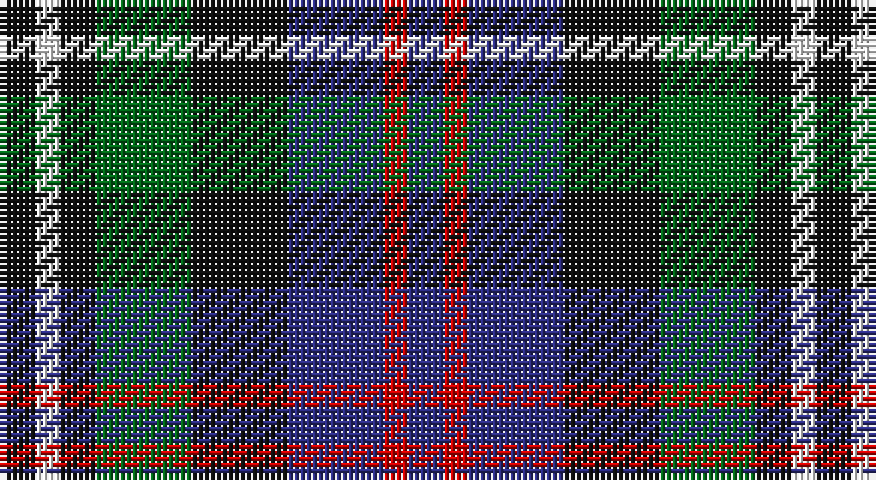

This page is one **sett** — a single exact thread-count. It belongs to the [tartan](/setts/k3w2k3g8k8db8r2db3/)
(the same proportion at any scale), whose colour order is pattern [BRBKGKWK](/stripes/brbkgkwk/).

Part of the [Davidson 'Double'](/tartans/davidson-double/) tartan — the named design grouping this sett with its other cloths.

Sourced from register-of-tartans.  It is a [8 stripe tartan](/stripes/stripes8/).

Original link https://www.tartanregister.gov.uk/tartanDetails.aspx?ref=896

## Provenance

Earliest known date: 1847 Wilson's of Bannockburn produced this sett in 1847, calling it 'Double Davidson'.

## Also known as

This cloth is also recorded under:

- Davidson Double
- Davidson Double..
- Davidson, Double
- Davidson, Double..

4 attestations — the source records this cloth was collapsed from (oldest owns this page)

<ul>
<li>01/01/1847 — Davidson, Double (register-of-tartans, <a href="https://www.tartanregister.gov.uk/tartanDetails.aspx?ref=896">record</a>)</li>
<li>1847 — Davidson 'Double' - 1847 (Clan) (tartans-authority, <a href="http://www.tartansauthority.com/tartan-ferret/display/444/">record</a>)</li>
<li>undated — Davidson, Double.. (weddslist, <a href="http://www.weddslist.com/cgi-bin/tartans/pg.pl?source=sts">record</a>)</li>
<li>undated — Davidson Double.. Clan Tartan (house-of-tartan, <a href="http://www.house-of-tartan.scotland.net/house/TartanViewjs.asp?colr=Def&tnam=444">record</a>)</li>
</ul>

## Register references

External register numbers recorded for this tartan.

- Scottish Register of Tartans: [896](https://www.tartanregister.gov.uk/tartanDetails.aspx?ref=896)
- Scottish Tartans Authority (ITI): 444
- Scottish Tartans World Register: 444

## Thread count
K/6 W4 K6 G16 K16 DB16 R4 DB/6

One full sett is **136 threads**.

## Palette

Palette: <strong>Tartan Register</strong>
<table><thead><tr><th>Colour</th><th>Threads</th><th>Shade</th><th>Base</th><th>OKLCh</th></tr></thead><tbody><tr><td>K/</td><td style="text-align:right;font-variant-numeric:tabular-nums">6</td><td><code style="background-color:#101010;">#101010</code> <small style="color:#888">#101010</small></td><td>K <code style="background-color:#000000;">#000000</code></td><td><small style="color:#888">oklch(17.3% 0.000 89.9)</small></td></tr><tr><td>W</td><td style="text-align:right;font-variant-numeric:tabular-nums">4</td><td><code style="background-color:#FCFCFC;">#FCFCFC</code> <small style="color:#888">#FCFCFC</small></td><td>W <code style="background-color:#F7F7F7;">#F7F7F7</code></td><td><small style="color:#888">oklch(99.1% 0.000 89.9)</small></td></tr><tr><td>K</td><td style="text-align:right;font-variant-numeric:tabular-nums">6</td><td><code style="background-color:#101010;">#101010</code> <small style="color:#888">#101010</small></td><td>K <code style="background-color:#000000;">#000000</code></td><td><small style="color:#888">oklch(17.3% 0.000 89.9)</small></td></tr><tr><td>G</td><td style="text-align:right;font-variant-numeric:tabular-nums">16</td><td><code style="background-color:#006818;">#006818</code> <small style="color:#888">#006818</small></td><td>G <code style="background-color:#006100;">#006100</code></td><td><small style="color:#888">oklch(45.0% 0.142 145.0)</small></td></tr><tr><td>K</td><td style="text-align:right;font-variant-numeric:tabular-nums">16</td><td><code style="background-color:#101010;">#101010</code> <small style="color:#888">#101010</small></td><td>K <code style="background-color:#000000;">#000000</code></td><td><small style="color:#888">oklch(17.3% 0.000 89.9)</small></td></tr><tr><td>DB</td><td style="text-align:right;font-variant-numeric:tabular-nums">16</td><td><code style="background-color:#2C2C80;">#2C2C80</code> <small style="color:#888">#2C2C80</small></td><td>B <code style="background-color:#2A418A;">#2A418A</code></td><td><small style="color:#888">oklch(35.0% 0.138 276.6)</small></td></tr><tr><td>R</td><td style="text-align:right;font-variant-numeric:tabular-nums">4</td><td><code style="background-color:#C80000;">#C80000</code> <small style="color:#888">#C80000</small></td><td>R <code style="background-color:#CC0000;">#CC0000</code></td><td><small style="color:#888">oklch(52.3% 0.215 29.2)</small></td></tr><tr><td>DB/</td><td style="text-align:right;font-variant-numeric:tabular-nums">6</td><td><code style="background-color:#2C2C80;">#2C2C80</code> <small style="color:#888">#2C2C80</small></td><td>B <code style="background-color:#2A418A;">#2A418A</code></td><td><small style="color:#888">oklch(35.0% 0.138 276.6)</small></td></tr></tbody></table>

# Sample pattern

## Nearest tartans

The nearest existing variants by ΔTartan distance, with this tartan at the top so the swatches line up against it.

ΔTartan

Tartan

Sett

—

<a href="/ttd/edit/#slug=k3w2k3g8k8db8r2db3~x2">Davidson, Double</a> <a class="nn-out" href="/variants/s8/k3w2k3g8k8db8r2db3~x2/" title="open its dictionary page">↗</a>

0.59

<a href="/ttd/edit/#slug=db8k4lo2k3r2k3lo2k4g8~x4&amp;base=k3w2k3g8k8db8r2db3~x2">Vosko</a> <a class="nn-out" href="/variants/s9/db8k4lo2k3r2k3lo2k4g8~x4/" title="open its dictionary page">↗</a>

0.61

<a href="/ttd/edit/#slug=r1k2g4k1g1k2db3k1w1~x6&amp;base=k3w2k3g8k8db8r2db3~x2">MacKean Dress (Personal)</a> <a class="nn-out" href="/variants/s9/r1k2g4k1g1k2db3k1w1~x6/" title="open its dictionary page">↗</a>

0.68

<a href="/ttd/edit/#slug=k3g8k8r2db8w2~x2&amp;base=k3w2k3g8k8db8r2db3~x2">Mitchell Family Tartan</a> <a class="nn-out" href="/variants/s6/k3g8k8r2db8w2~x2/" title="open its dictionary page">↗</a>

0.77

<a href="/ttd/edit/#slug=o8g4db16g4k14o14db4b3~x2&amp;base=k3w2k3g8k8db8r2db3~x2">Hinnigan (Personal)</a> <a class="nn-out" href="/variants/s8/o8g4db16g4k14o14db4b3~x2/" title="open its dictionary page">↗</a>

0.96

<a href="/ttd/edit/#slug=k3g10k10r3db8w3~x2&amp;base=k3w2k3g8k8db8r2db3~x2">Russell (Clan)</a> <a class="nn-out" href="/variants/s6/k3g10k10r3db8w3~x2/" title="open its dictionary page">↗</a>

0.96

<a href="/variants/s8/dp11y2k10g10lo2~x2/">Selkirk (Personal) Original</a>

1.00

<a href="/variants/s8/dp11t2k10g10ly3~x2/">Wilson's No.217</a>

1.02

<a href="/ttd/edit/#slug=r1k2dg4k1dg1k2db3k1w1~x6&amp;base=k3w2k3g8k8db8r2db3~x2">MacKean dress</a> <a class="nn-out" href="/variants/s9/r1k2dg4k1dg1k2db3k1w1~x6/" title="open its dictionary page">↗</a>

1.04

<a href="/ttd/edit/#slug=k2ly1dg6k6db6w1~x4&amp;base=k3w2k3g8k8db8r2db3~x2">Dyce #3</a> <a class="nn-out" href="/variants/s6/k2ly1dg6k6db6w1~x4/" title="open its dictionary page">↗</a>

1.04

<a href="/ttd/edit/#slug=dg3db8dg3k4dg9ly2db2ly2r2~x2&amp;base=k3w2k3g8k8db8r2db3~x2">Maitland</a> <a class="nn-out" href="/variants/s9/dg3db8dg3k4dg9ly2db2ly2r2~x2/" title="open its dictionary page">↗</a>

## Neighbour map

Every grey dot is one of 14360 variants placed by the first two principal components of the ΔTartan feature space (44% of its variance). Red is this tartan; blue dots are its nearest — click one to open its page.

<svg viewBox="0 0 640 380" role="img" style="max-width:100%;height:auto;border:1px solid #e0e0e0;border-radius:4px;display:block" xmlns="http://www.w3.org/2000/svg"><image href="/nn/cloud.v1.png" width="640" height="380"/><a href="/variants/s9/db8k4lo2k3r2k3lo2k4g8~x4/"><circle cx="104.7" cy="242.7" r="4" fill="#3465a4"><title>Vosko</title></circle></a><a href="/variants/s9/r1k2g4k1g1k2db3k1w1~x6/"><circle cx="100.2" cy="238.0" r="4" fill="#3465a4"><title>MacKean Dress (Personal)</title></circle></a><a href="/variants/s6/k3g8k8r2db8w2~x2/"><circle cx="94.7" cy="257.5" r="4" fill="#3465a4"><title>Mitchell Family Tartan</title></circle></a><a href="/variants/s8/o8g4db16g4k14o14db4b3~x2/"><circle cx="84.4" cy="225.6" r="4" fill="#3465a4"><title>Hinnigan (Personal)</title></circle></a><a href="/variants/s6/k3g10k10r3db8w3~x2/"><circle cx="67.3" cy="259.1" r="4" fill="#3465a4"><title>Russell (Clan)</title></circle></a><a href="/variants/s8/dp11y2k10g10lo2~x2/"><circle cx="118.9" cy="237.5" r="4" fill="#3465a4"><title>Selkirk (Personal) Original</title></circle></a><a href="/variants/s8/dp11t2k10g10ly3~x2/"><circle cx="106.4" cy="242.2" r="4" fill="#3465a4"><title>Wilson's No.217</title></circle></a><a href="/variants/s9/r1k2dg4k1dg1k2db3k1w1~x6/"><circle cx="89.3" cy="235.4" r="4" fill="#3465a4"><title>MacKean dress</title></circle></a><a href="/variants/s6/k2ly1dg6k6db6w1~x4/"><circle cx="135.4" cy="240.4" r="4" fill="#3465a4"><title>Dyce #3</title></circle></a><a href="/variants/s9/dg3db8dg3k4dg9ly2db2ly2r2~x2/"><circle cx="134.5" cy="230.0" r="4" fill="#3465a4"><title>Maitland</title></circle></a><circle cx="104.3" cy="244.0" r="5" fill="#c00000"/></svg>

ID: /variants/s8/k3w2k3g8k8db8r2db3~x2/
