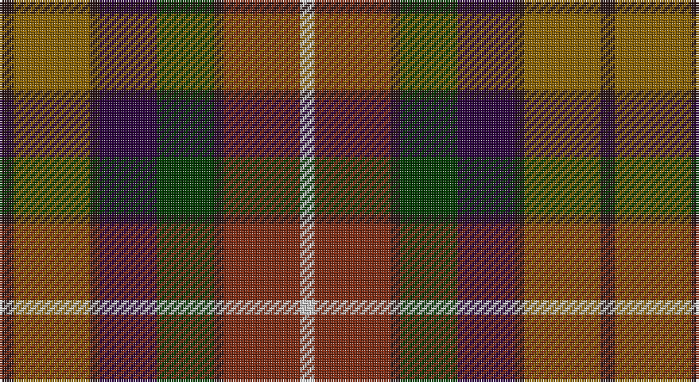

This page is one **sett** — a single exact thread-count. It belongs to the [tartan](/setts/k3y16k2dp12dg12k2o16lb3/)
(the same proportion at any scale), whose colour order is pattern [KGKBGKRW](/stripes/kgkbgkrw/).

Sourced from register-of-tartans.  It is a [8 stripe tartan](/stripes/stripes8/).

Original link https://www.tartanregister.gov.uk/tartanDetails.aspx?ref=4801

## Also known as

This cloth is also recorded under:

- Young Presidents Org. Dress

2 attestations — the source records this cloth was collapsed from (oldest owns this page)

<ul>
<li>01/01/2002 — YPO Dress (register-of-tartans, <a href="https://www.tartanregister.gov.uk/tartanDetails.aspx?ref=4801">record</a>)</li>
<li>pre 2002 — Young Presidents Org. Dress (Corp.) (tartans-authority, <a href="http://www.tartansauthority.com/tartan-ferret/display/4134/">record</a>)</li>
</ul>

## Register references

External register numbers recorded for this tartan.

- Scottish Register of Tartans: [4801](https://www.tartanregister.gov.uk/tartanDetails.aspx?ref=4801)
- Scottish Tartans Authority (ITI): 4134

## Thread count
K/6 T32 K4 DP24 G24 K4 Ta32 N/6

One full sett is **252 threads**.

## Palette

Palette: <strong>Tartan Register</strong> <small style="color:#888">(1 of 6 colours)</small>
<table><thead><tr><th>Colour</th><th>Threads</th><th>Shade</th><th>Base</th><th>OKLCh</th></tr></thead><tbody><tr><td>K/</td><td style="text-align:right;font-variant-numeric:tabular-nums">6</td><td><code style="background-color:#281414;">#281414</code> <small style="color:#888">#281414</small></td><td>K <code style="background-color:#000000;">#000000</code></td><td><small style="color:#888">oklch(22.0% 0.033 20.1)</small></td></tr><tr><td>T</td><td style="text-align:right;font-variant-numeric:tabular-nums">32</td><td><code style="background-color:#886000;">#886000</code> <small style="color:#888">#886000</small></td><td>G <code style="background-color:#006100;">#006100</code></td><td><small style="color:#888">oklch(51.8% 0.107 80.2)</small></td></tr><tr><td>K</td><td style="text-align:right;font-variant-numeric:tabular-nums">4</td><td><code style="background-color:#281414;">#281414</code> <small style="color:#888">#281414</small></td><td>K <code style="background-color:#000000;">#000000</code></td><td><small style="color:#888">oklch(22.0% 0.033 20.1)</small></td></tr><tr><td>DP</td><td style="text-align:right;font-variant-numeric:tabular-nums">24</td><td><code style="background-color:#28003C;">#28003C</code> <small style="color:#888">#28003C</small></td><td>B <code style="background-color:#2A418A;">#2A418A</code></td><td><small style="color:#888">oklch(21.3% 0.107 310.6)</small></td></tr><tr><td>G</td><td style="text-align:right;font-variant-numeric:tabular-nums">24</td><td><code style="background-color:#003800;">#003800</code> <small style="color:#888">#003800</small></td><td>G <code style="background-color:#006100;">#006100</code></td><td><small style="color:#888">oklch(29.5% 0.100 142.5)</small></td></tr><tr><td>K</td><td style="text-align:right;font-variant-numeric:tabular-nums">4</td><td><code style="background-color:#281414;">#281414</code> <small style="color:#888">#281414</small></td><td>K <code style="background-color:#000000;">#000000</code></td><td><small style="color:#888">oklch(22.0% 0.033 20.1)</small></td></tr><tr><td>Ta</td><td style="text-align:right;font-variant-numeric:tabular-nums">32</td><td><code style="background-color:#7C2810;">#7C2810</code> <small style="color:#888">#7C2810</small></td><td>R <code style="background-color:#CC0000;">#CC0000</code></td><td><small style="color:#888">oklch(40.1% 0.122 36.0)</small></td></tr><tr><td>N/</td><td style="text-align:right;font-variant-numeric:tabular-nums">6</td><td><code style="background-color:#C8C8C8;">#C8C8C8</code> <small style="color:#888">#C8C8C8</small></td><td>W <code style="background-color:#F7F7F7;">#F7F7F7</code></td><td><small style="color:#888">oklch(83.3% 0.000 89.9)</small></td></tr></tbody></table>

# Sample pattern

## Nearest tartans

The nearest existing variants by ΔTartan distance, with this tartan at the top so the swatches line up against it.

ΔTartan

Tartan

Sett

—

<a href="/ttd/edit/#slug=k3y16k2dp12dg12k2o16lb3~x2">YPO Dress</a> <a class="nn-out" href="/variants/s8/k3y16k2dp12dg12k2o16lb3~x2/" title="open its dictionary page">↗</a>

1.17

<a href="/ttd/edit/#slug=dg21t21ly3r21dt3dp5dt3~x2&amp;base=k3y16k2dp12dg12k2o16lb3~x2">Falardeau-Murphy (Canada) (Personal)</a> <a class="nn-out" href="/variants/s7/dg21t21ly3r21dt3dp5dt3~x2/" title="open its dictionary page">↗</a>

1.25

<a href="/ttd/edit/#slug=k3dy14o4dy9o14k14y14yi14k1n3~x2&amp;base=k3y16k2dp12dg12k2o16lb3~x2">Dutch Friendship (Fashion)</a> <a class="nn-out" href="/variants/s10/k3dy14o4dy9o14k14y14yi14k1n3~x2/" title="open its dictionary page">↗</a>

1.32

<a href="/ttd/edit/#slug=dy30k6dy6r6lo6o14k4o3n14k6n16~x2&amp;base=k3y16k2dp12dg12k2o16lb3~x2">Bracken (WCWM)</a> <a class="nn-out" href="/variants/s11/dy30k6dy6r6lo6o14k4o3n14k6n16~x2/" title="open its dictionary page">↗</a>

1.32

<a href="/ttd/edit/#slug=g13w2g10k5r13k3r5dt15o5~x2&amp;base=k3y16k2dp12dg12k2o16lb3~x2">Glen Chalmadale</a> <a class="nn-out" href="/variants/s9/g13w2g10k5r13k3r5dt15o5~x2/" title="open its dictionary page">↗</a>

1.33

<a href="/ttd/edit/#slug=lo5db2r14do9dg8db3r3db3r3db3dg18ly3~x2&amp;base=k3y16k2dp12dg12k2o16lb3~x2">Meath, County</a> <a class="nn-out" href="/variants/s12/lo5db2r14do9dg8db3r3db3r3db3dg18ly3~x2/" title="open its dictionary page">↗</a>

1.36

<a href="/ttd/edit/#slug=g21t21ly3r21n3dp5n3~x2&amp;base=k3y16k2dp12dg12k2o16lb3~x2">Falardeau-Murphy (Canada) (Personal)</a> <a class="nn-out" href="/variants/s7/g21t21ly3r21n3dp5n3~x2/" title="open its dictionary page">↗</a>

1.40

<a href="/ttd/edit/#slug=do19dg23lo3db15r11w5~x2&amp;base=k3y16k2dp12dg12k2o16lb3~x2">Mekos, The</a> <a class="nn-out" href="/variants/s6/do19dg23lo3db15r11w5~x2/" title="open its dictionary page">↗</a>

1.42

<a href="/ttd/edit/#slug=r4lb2r6k2r6do16lo2k12o10k2o1~x2&amp;base=k3y16k2dp12dg12k2o16lb3~x2">Caledonian (WCWM)</a> <a class="nn-out" href="/variants/s11/r4lb2r6k2r6do16lo2k12o10k2o1~x2/" title="open its dictionary page">↗</a>

1.44

<a href="/ttd/edit/#slug=db3g4r2g3r3g16dt16ri16db3ri3db2ri4ly3~x2&amp;base=k3y16k2dp12dg12k2o16lb3~x2">Cuthill (Personal)</a> <a class="nn-out" href="/variants/s13/db3g4r2g3r3g16dt16ri16db3ri3db2ri4ly3~x2/" title="open its dictionary page">↗</a>

1.44

<a href="/ttd/edit/#slug=r6db3y3ri26db20dg26o3dg4o3dg4o6&amp;base=k3y16k2dp12dg12k2o16lb3~x2">Bonnie Brae</a> <a class="nn-out" href="/variants/s11/r6db3y3ri26db20dg26o3dg4o3dg4o6/" title="open its dictionary page">↗</a>

## Neighbour map

Every grey dot is one of 14360 variants placed by the first two principal components of the ΔTartan feature space (44% of its variance). Red is this tartan; blue dots are its nearest — click one to open its page.

<svg viewBox="0 0 640 380" role="img" style="max-width:100%;height:auto;border:1px solid #e0e0e0;border-radius:4px;display:block" xmlns="http://www.w3.org/2000/svg"><image href="/nn/cloud.v1.png" width="640" height="380"/><a href="/variants/s7/dg21t21ly3r21dt3dp5dt3~x2/"><circle cx="104.8" cy="192.6" r="4" fill="#3465a4"><title>Falardeau-Murphy (Canada) (Personal)</title></circle></a><a href="/variants/s10/k3dy14o4dy9o14k14y14yi14k1n3~x2/"><circle cx="92.6" cy="179.0" r="4" fill="#3465a4"><title>Dutch Friendship (Fashion)</title></circle></a><a href="/variants/s11/dy30k6dy6r6lo6o14k4o3n14k6n16~x2/"><circle cx="149.4" cy="178.3" r="4" fill="#3465a4"><title>Bracken (WCWM)</title></circle></a><a href="/variants/s9/g13w2g10k5r13k3r5dt15o5~x2/"><circle cx="91.0" cy="198.2" r="4" fill="#3465a4"><title>Glen Chalmadale</title></circle></a><a href="/variants/s12/lo5db2r14do9dg8db3r3db3r3db3dg18ly3~x2/"><circle cx="150.6" cy="171.3" r="4" fill="#3465a4"><title>Meath, County</title></circle></a><a href="/variants/s7/g21t21ly3r21n3dp5n3~x2/"><circle cx="112.0" cy="194.5" r="4" fill="#3465a4"><title>Falardeau-Murphy (Canada) (Personal)</title></circle></a><a href="/variants/s6/do19dg23lo3db15r11w5~x2/"><circle cx="86.5" cy="218.2" r="4" fill="#3465a4"><title>Mekos, The</title></circle></a><a href="/variants/s11/r4lb2r6k2r6do16lo2k12o10k2o1~x2/"><circle cx="125.1" cy="141.9" r="4" fill="#3465a4"><title>Caledonian (WCWM)</title></circle></a><a href="/variants/s13/db3g4r2g3r3g16dt16ri16db3ri3db2ri4ly3~x2/"><circle cx="125.5" cy="159.5" r="4" fill="#3465a4"><title>Cuthill (Personal)</title></circle></a><a href="/variants/s11/r6db3y3ri26db20dg26o3dg4o3dg4o6/"><circle cx="154.3" cy="167.3" r="4" fill="#3465a4"><title>Bonnie Brae</title></circle></a><circle cx="91.5" cy="195.7" r="5" fill="#c00000"/></svg>

ID: /variants/s8/k3y16k2dp12dg12k2o16lb3~x2/
