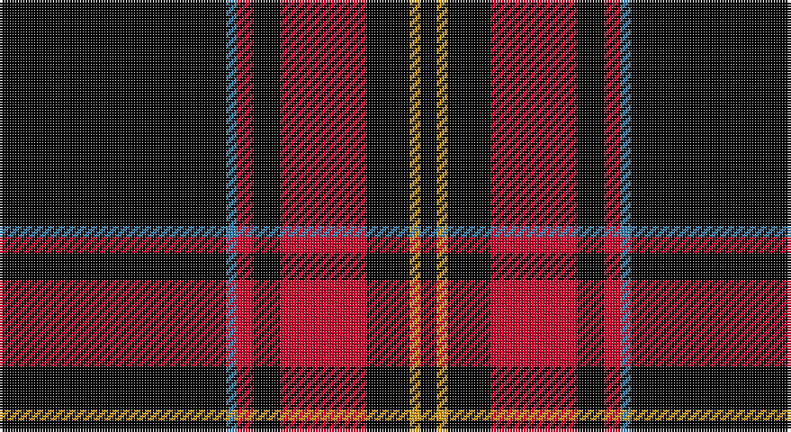

This page is one **sett** — a single exact thread-count. It belongs to the [tartan](/setts/k42t2r3k5r16k8lo2k3/)
(the same proportion at any scale), whose colour order is pattern [KBRKRKYK](/stripes/kbrkrkyk/).

Part of the [Highland Brewing Company](/tartans/highland-brewing-company/) tartan — the named design grouping this sett with its other cloths.

Sourced from register-of-tartans.  It is a [8 stripe tartan](/stripes/stripes8/).

Original link https://www.tartanregister.gov.uk/tartanDetails.aspx?ref=10939

## Register references

External register numbers recorded for this tartan.

- Scottish Register of Tartans: [10939](https://www.tartanregister.gov.uk/tartanDetails.aspx?ref=10939)

## Thread count
K/84 B4 R6 K10 R32 K16 Y4 K/6

One full sett is **234 threads**.

## Palette

Palette: <strong>Tartan Register</strong>
<table><thead><tr><th>Colour</th><th>Threads</th><th>Shade</th><th>Base</th><th>OKLCh</th></tr></thead><tbody><tr><td>K/</td><td style="text-align:right;font-variant-numeric:tabular-nums">84</td><td><code style="background-color:#000000;">#000000</code> <small style="color:#888">#000000</small></td><td>K <code style="background-color:#000000;">#000000</code></td><td><small style="color:#888">oklch(0.0% 0.000 0.0)</small></td></tr><tr><td>B</td><td style="text-align:right;font-variant-numeric:tabular-nums">4</td><td><code style="background-color:#3C82AF;">#3C82AF</code> <small style="color:#888">#3C82AF</small></td><td>B <code style="background-color:#2A418A;">#2A418A</code></td><td><small style="color:#888">oklch(58.1% 0.099 239.8)</small></td></tr><tr><td>R</td><td style="text-align:right;font-variant-numeric:tabular-nums">6</td><td><code style="background-color:#C8002C;">#C8002C</code> <small style="color:#888">#C8002C</small></td><td>R <code style="background-color:#CC0000;">#CC0000</code></td><td><small style="color:#888">oklch(52.6% 0.212 22.0)</small></td></tr><tr><td>K</td><td style="text-align:right;font-variant-numeric:tabular-nums">10</td><td><code style="background-color:#000000;">#000000</code> <small style="color:#888">#000000</small></td><td>K <code style="background-color:#000000;">#000000</code></td><td><small style="color:#888">oklch(0.0% 0.000 0.0)</small></td></tr><tr><td>R</td><td style="text-align:right;font-variant-numeric:tabular-nums">32</td><td><code style="background-color:#C8002C;">#C8002C</code> <small style="color:#888">#C8002C</small></td><td>R <code style="background-color:#CC0000;">#CC0000</code></td><td><small style="color:#888">oklch(52.6% 0.212 22.0)</small></td></tr><tr><td>K</td><td style="text-align:right;font-variant-numeric:tabular-nums">16</td><td><code style="background-color:#000000;">#000000</code> <small style="color:#888">#000000</small></td><td>K <code style="background-color:#000000;">#000000</code></td><td><small style="color:#888">oklch(0.0% 0.000 0.0)</small></td></tr><tr><td>Y</td><td style="text-align:right;font-variant-numeric:tabular-nums">4</td><td><code style="background-color:#E0A126;">#E0A126</code> <small style="color:#888">#E0A126</small></td><td>Y <code style="background-color:#F2BF00;">#F2BF00</code></td><td><small style="color:#888">oklch(75.1% 0.146 78.3)</small></td></tr><tr><td>K/</td><td style="text-align:right;font-variant-numeric:tabular-nums">6</td><td><code style="background-color:#000000;">#000000</code> <small style="color:#888">#000000</small></td><td>K <code style="background-color:#000000;">#000000</code></td><td><small style="color:#888">oklch(0.0% 0.000 0.0)</small></td></tr></tbody></table>

# Sample pattern

## Nearest tartans

The nearest existing variants by ΔTartan distance, with this tartan at the top so the swatches line up against it.

ΔTartan

Tartan

Sett

—

<a href="/ttd/edit/#slug=k42t2r3k5r16k8lo2k3~x2">Highland Brewing Company (USA)</a> <a class="nn-out" href="/variants/s8/k42t2r3k5r16k8lo2k3~x2/" title="open its dictionary page">↗</a>

0.84

<a href="/ttd/edit/#slug=k4w1r4k2g2r3k2k20r2k2r2&amp;base=k42t2r3k5r16k8lo2k3~x2">Valdres, Kvam and Vang</a> <a class="nn-out" href="/variants/s11/k4w1r4k2g2r3k2k20r2k2r2/" title="open its dictionary page">↗</a>

1.54

<a href="/ttd/edit/#slug=lo8k7r3k7r3k38w2k3lo6~x2&amp;base=k42t2r3k5r16k8lo2k3~x2">Bunnahabhain</a> <a class="nn-out" href="/variants/s9/lo8k7r3k7r3k38w2k3lo6~x2/" title="open its dictionary page">↗</a>

1.54

<a href="/ttd/edit/#slug=k70r5k3lb4dp4lb4k3r12&amp;base=k42t2r3k5r16k8lo2k3~x2">State University of New York College at Buffalo</a> <a class="nn-out" href="/variants/s8/k70r5k3lb4dp4lb4k3r12/" title="open its dictionary page">↗</a>

1.60

<a href="/ttd/edit/#slug=k68y11k16y4k4y4k4y19k14w4k14&amp;base=k42t2r3k5r16k8lo2k3~x2">Stewart Mourning</a> <a class="nn-out" href="/variants/s11/k68y11k16y4k4y4k4y19k14w4k14/" title="open its dictionary page">↗</a>

1.63

<a href="/ttd/edit/#slug=k2w1k2r6k6r3k28w2~x2&amp;base=k42t2r3k5r16k8lo2k3~x2">Brockton</a> <a class="nn-out" href="/variants/s8/k2w1k2r6k6r3k28w2~x2/" title="open its dictionary page">↗</a>

1.65

<a href="/ttd/edit/#slug=k42t2r3k5r16k8ly2k3~x2&amp;base=k42t2r3k5r16k8lo2k3~x2">Highland Brewing Company</a> <a class="nn-out" href="/variants/s8/k42t2r3k5r16k8ly2k3~x2/" title="open its dictionary page">↗</a>

1.70

<a href="/ttd/edit/#slug=k4w1r4k2g2r3g2k20r2k2~x2&amp;base=k42t2r3k5r16k8lo2k3~x2">Valdres, Kvam &amp; Vang #3</a> <a class="nn-out" href="/variants/s10/k4w1r4k2g2r3g2k20r2k2~x2/" title="open its dictionary page">↗</a>

1.74

<a href="/ttd/edit/#slug=r2k1r2k14w1k1w1~x8&amp;base=k42t2r3k5r16k8lo2k3~x2">White Stripes Hunting</a> <a class="nn-out" href="/variants/s7/r2k1r2k14w1k1w1~x8/" title="open its dictionary page">↗</a>

1.76

<a href="/ttd/edit/#slug=k88dg17k8y28k8r6&amp;base=k42t2r3k5r16k8lo2k3~x2">Childers (Gurkha Rifles) (Military)</a> <a class="nn-out" href="/variants/s6/k88dg17k8y28k8r6/" title="open its dictionary page">↗</a>

1.79

<a href="/ttd/edit/#slug=k59r3k6r3k8r15k2ly3~x2&amp;base=k42t2r3k5r16k8lo2k3~x2">Royal Army PTC Assoc. (Military)</a> <a class="nn-out" href="/variants/s8/k59r3k6r3k8r15k2ly3~x2/" title="open its dictionary page">↗</a>

## Neighbour map

Every grey dot is one of 14360 variants placed by the first two principal components of the ΔTartan feature space (44% of its variance). Red is this tartan; blue dots are its nearest — click one to open its page.

<svg viewBox="0 0 640 380" role="img" style="max-width:100%;height:auto;border:1px solid #e0e0e0;border-radius:4px;display:block" xmlns="http://www.w3.org/2000/svg"><image href="/nn/cloud.v1.png" width="640" height="380"/><a href="/variants/s11/k4w1r4k2g2r3k2k20r2k2r2/"><circle cx="411.0" cy="133.8" r="4" fill="#3465a4"><title>Valdres, Kvam and Vang</title></circle></a><a href="/variants/s9/lo8k7r3k7r3k38w2k3lo6~x2/"><circle cx="429.4" cy="144.9" r="4" fill="#3465a4"><title>Bunnahabhain</title></circle></a><a href="/variants/s8/k70r5k3lb4dp4lb4k3r12/"><circle cx="462.9" cy="120.6" r="4" fill="#3465a4"><title>State University of New York College at Buffalo</title></circle></a><a href="/variants/s11/k68y11k16y4k4y4k4y19k14w4k14/"><circle cx="457.7" cy="168.0" r="4" fill="#3465a4"><title>Stewart Mourning</title></circle></a><a href="/variants/s8/k2w1k2r6k6r3k28w2~x2/"><circle cx="520.9" cy="156.5" r="4" fill="#3465a4"><title>Brockton</title></circle></a><a href="/variants/s8/k42t2r3k5r16k8ly2k3~x2/"><circle cx="480.6" cy="162.1" r="4" fill="#3465a4"><title>Highland Brewing Company</title></circle></a><a href="/variants/s10/k4w1r4k2g2r3g2k20r2k2~x2/"><circle cx="414.4" cy="142.4" r="4" fill="#3465a4"><title>Valdres, Kvam &amp; Vang #3</title></circle></a><a href="/variants/s7/r2k1r2k14w1k1w1~x8/"><circle cx="455.3" cy="167.9" r="4" fill="#3465a4"><title>White Stripes Hunting</title></circle></a><a href="/variants/s6/k88dg17k8y28k8r6/"><circle cx="397.8" cy="194.5" r="4" fill="#3465a4"><title>Childers (Gurkha Rifles) (Military)</title></circle></a><a href="/variants/s8/k59r3k6r3k8r15k2ly3~x2/"><circle cx="538.9" cy="149.5" r="4" fill="#3465a4"><title>Royal Army PTC Assoc. (Military)</title></circle></a><circle cx="446.9" cy="149.0" r="5" fill="#c00000"/></svg>

ID: /variants/s8/k42t2r3k5r16k8lo2k3~x2/
