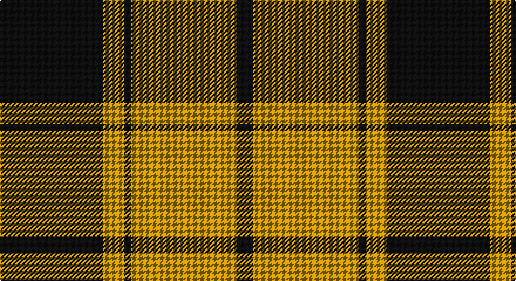

This page is one **sett** — a single exact thread-count. It belongs to the [tartan](/setts/k44lo9k3lo8lo16lo15lo6k7/)
(the same proportion at any scale), whose colour order is pattern [KYKYYYYK](/stripes/kykyyyyk/).

Sourced from tartans-authority.  It is a [8 stripe tartan](/stripes/stripes8/).

Original link http://www.tartansauthority.com/tartan-ferret/display/7408/

## Register references

External register numbers recorded for this tartan.

- Scottish Tartans Authority (ITI): 7408

## Thread count
K/88 DYa18 Ka6 DYa16 DYa32 DY30 DYa12 Ka/14

One full sett is **330 threads**.

## Palette

Palette: <strong>Tartan Register</strong>
<table><thead><tr><th>Colour</th><th>Threads</th><th>Shade</th><th>Base</th><th>OKLCh</th></tr></thead><tbody><tr><td>K/</td><td style="text-align:right;font-variant-numeric:tabular-nums">88</td><td><code style="background-color:#101010;">#101010</code> <small style="color:#888">#101010</small></td><td>K <code style="background-color:#000000;">#000000</code></td><td><small style="color:#888">oklch(17.3% 0.000 89.9)</small></td></tr><tr><td>DYa</td><td style="text-align:right;font-variant-numeric:tabular-nums">18</td><td><code style="background-color:#BC8C00;">#BC8C00</code> <small style="color:#888">#BC8C00</small></td><td>Y <code style="background-color:#F2BF00;">#F2BF00</code></td><td><small style="color:#888">oklch(66.8% 0.137 84.1)</small></td></tr><tr><td>Ka</td><td style="text-align:right;font-variant-numeric:tabular-nums">6</td><td><code style="background-color:#101010;">#101010</code> <small style="color:#888">#101010</small></td><td>K <code style="background-color:#000000;">#000000</code></td><td><small style="color:#888">oklch(17.3% 0.000 89.9)</small></td></tr><tr><td>DYa</td><td style="text-align:right;font-variant-numeric:tabular-nums">16</td><td><code style="background-color:#BC8C00;">#BC8C00</code> <small style="color:#888">#BC8C00</small></td><td>Y <code style="background-color:#F2BF00;">#F2BF00</code></td><td><small style="color:#888">oklch(66.8% 0.137 84.1)</small></td></tr><tr><td>DYa</td><td style="text-align:right;font-variant-numeric:tabular-nums">32</td><td><code style="background-color:#BC8C00;">#BC8C00</code> <small style="color:#888">#BC8C00</small></td><td>Y <code style="background-color:#F2BF00;">#F2BF00</code></td><td><small style="color:#888">oklch(66.8% 0.137 84.1)</small></td></tr><tr><td>DY</td><td style="text-align:right;font-variant-numeric:tabular-nums">30</td><td><code style="background-color:#BC8C00;">#BC8C00</code> <small style="color:#888">#BC8C00</small></td><td>Y <code style="background-color:#F2BF00;">#F2BF00</code></td><td><small style="color:#888">oklch(66.8% 0.137 84.1)</small></td></tr><tr><td>DYa</td><td style="text-align:right;font-variant-numeric:tabular-nums">12</td><td><code style="background-color:#BC8C00;">#BC8C00</code> <small style="color:#888">#BC8C00</small></td><td>Y <code style="background-color:#F2BF00;">#F2BF00</code></td><td><small style="color:#888">oklch(66.8% 0.137 84.1)</small></td></tr><tr><td>Ka/</td><td style="text-align:right;font-variant-numeric:tabular-nums">14</td><td><code style="background-color:#101010;">#101010</code> <small style="color:#888">#101010</small></td><td>K <code style="background-color:#000000;">#000000</code></td><td><small style="color:#888">oklch(17.3% 0.000 89.9)</small></td></tr></tbody></table>

# Sample pattern

## Nearest tartans

The nearest existing variants by ΔTartan distance, with this tartan at the top so the swatches line up against it.

ΔTartan

Tartan

Sett

—

<a href="/ttd/edit/#slug=k44lo9k3lo8lo16lo15lo6k7~x2">Longford County Crest (Fashion)</a> <a class="nn-out" href="/variants/s8/k44lo9k3lo8lo16lo15lo6k7~x2/" title="open its dictionary page">↗</a>

0.67

<a href="/ttd/edit/#slug=k9r4k1r4g15ri4k1~x2&amp;base=k44lo9k3lo8lo16lo15lo6k7~x2">Logan, Dark</a> <a class="nn-out" href="/variants/s7/k9r4k1r4g15ri4k1~x2/" title="open its dictionary page">↗</a>

0.68

<a href="/ttd/edit/#slug=g8r2g12k6g3db6r24k4~x2&amp;base=k44lo9k3lo8lo16lo15lo6k7~x2">Dickie</a> <a class="nn-out" href="/variants/s8/g8r2g12k6g3db6r24k4~x2/" title="open its dictionary page">↗</a>

0.74

<a href="/ttd/edit/#slug=g12dg1g1dg1g1k5r10k1r2~x2&amp;base=k44lo9k3lo8lo16lo15lo6k7~x2">Lindsay</a> <a class="nn-out" href="/variants/s9/g12dg1g1dg1g1k5r10k1r2~x2/" title="open its dictionary page">↗</a>

0.77

<a href="/ttd/edit/#slug=k6r2g17r16k1t2~x2&amp;base=k44lo9k3lo8lo16lo15lo6k7~x2">Unidentified 12</a> <a class="nn-out" href="/variants/s6/k6r2g17r16k1t2~x2/" title="open its dictionary page">↗</a>

0.84

<a href="/ttd/edit/#slug=w2k1dg16k12r12k1w2~x2&amp;base=k44lo9k3lo8lo16lo15lo6k7~x2">Prince Edward Island #2</a> <a class="nn-out" href="/variants/s7/w2k1dg16k12r12k1w2~x2/" title="open its dictionary page">↗</a>

0.89

<a href="/ttd/edit/#slug=w2k1g16k12r12k1w2~x2&amp;base=k44lo9k3lo8lo16lo15lo6k7~x2">Prince Edward Island</a> <a class="nn-out" href="/variants/s7/w2k1g16k12r12k1w2~x2/" title="open its dictionary page">↗</a>

0.89

<a href="/ttd/edit/#slug=k15dg1k3r9dg1r3lo11k1~x4&amp;base=k44lo9k3lo8lo16lo15lo6k7~x2">Island of Innis, The</a> <a class="nn-out" href="/variants/s8/k15dg1k3r9dg1r3lo11k1~x4/" title="open its dictionary page">↗</a>

0.90

<a href="/ttd/edit/#slug=k2r7k6g12ly1g1k2~x4&amp;base=k44lo9k3lo8lo16lo15lo6k7~x2">Blackstock Hunting</a> <a class="nn-out" href="/variants/s7/k2r7k6g12ly1g1k2~x4/" title="open its dictionary page">↗</a>

0.92

<a href="/ttd/edit/#slug=r3dr14g8r2g2w2g2r1~x2&amp;base=k44lo9k3lo8lo16lo15lo6k7~x2">Scott Hunting Clan Tartan</a> <a class="nn-out" href="/variants/s8/r3dr14g8r2g2w2g2r1~x2/" title="open its dictionary page">↗</a>

0.95

<a href="/ttd/edit/#slug=r2w8k14dy25w2k2w2~x2&amp;base=k44lo9k3lo8lo16lo15lo6k7~x2">Merric Dark Camel.. Trade Tartan</a> <a class="nn-out" href="/variants/s7/r2w8k14dy25w2k2w2~x2/" title="open its dictionary page">↗</a>

## Neighbour map

Every grey dot is one of 14360 variants placed by the first two principal components of the ΔTartan feature space (44% of its variance). Red is this tartan; blue dots are its nearest — click one to open its page.

<svg viewBox="0 0 640 380" role="img" style="max-width:100%;height:auto;border:1px solid #e0e0e0;border-radius:4px;display:block" xmlns="http://www.w3.org/2000/svg"><image href="/nn/cloud.v1.png" width="640" height="380"/><a href="/variants/s7/k9r4k1r4g15ri4k1~x2/"><circle cx="189.1" cy="173.6" r="4" fill="#3465a4"><title>Logan, Dark</title></circle></a><a href="/variants/s8/g8r2g12k6g3db6r24k4~x2/"><circle cx="200.1" cy="181.3" r="4" fill="#3465a4"><title>Dickie</title></circle></a><a href="/variants/s9/g12dg1g1dg1g1k5r10k1r2~x2/"><circle cx="218.6" cy="157.2" r="4" fill="#3465a4"><title>Lindsay</title></circle></a><a href="/variants/s6/k6r2g17r16k1t2~x2/"><circle cx="234.6" cy="171.3" r="4" fill="#3465a4"><title>Unidentified 12</title></circle></a><a href="/variants/s7/w2k1dg16k12r12k1w2~x2/"><circle cx="191.0" cy="168.3" r="4" fill="#3465a4"><title>Prince Edward Island #2</title></circle></a><a href="/variants/s7/w2k1g16k12r12k1w2~x2/"><circle cx="171.3" cy="162.6" r="4" fill="#3465a4"><title>Prince Edward Island</title></circle></a><a href="/variants/s8/k15dg1k3r9dg1r3lo11k1~x4/"><circle cx="232.9" cy="163.7" r="4" fill="#3465a4"><title>Island of Innis, The</title></circle></a><a href="/variants/s7/k2r7k6g12ly1g1k2~x4/"><circle cx="229.0" cy="196.0" r="4" fill="#3465a4"><title>Blackstock Hunting</title></circle></a><a href="/variants/s8/r3dr14g8r2g2w2g2r1~x2/"><circle cx="245.5" cy="171.8" r="4" fill="#3465a4"><title>Scott Hunting Clan Tartan</title></circle></a><a href="/variants/s7/r2w8k14dy25w2k2w2~x2/"><circle cx="233.4" cy="163.7" r="4" fill="#3465a4"><title>Merric Dark Camel.. Trade Tartan</title></circle></a><circle cx="212.1" cy="166.7" r="5" fill="#c00000"/></svg>

ID: /variants/s8/k44lo9k3lo8lo16lo15lo6k7~x2/
