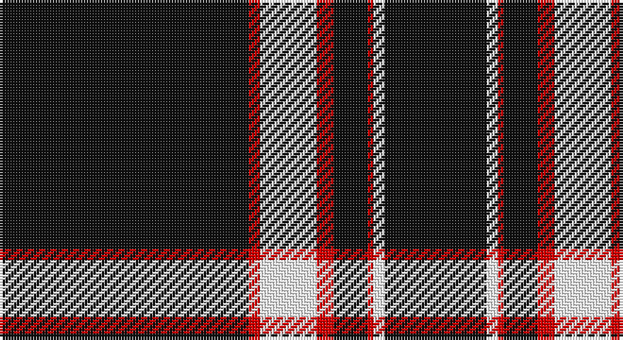

This page is one **sett** — a single exact thread-count. It belongs to the [tartan](/setts/k44r2w10r3k6r1w2k18/)
(the same proportion at any scale), whose colour order is pattern [KRWRKRWK](/stripes/krwrkrwk/).

Part of the [Mull Rugby Club](/tartans/mull-rugby-club/) tartan — the named design grouping this sett with its other cloths.

Sourced from register-of-tartans.  It is a [8 stripe tartan](/stripes/stripes8/).

Original link https://www.tartanregister.gov.uk/tartanDetails.aspx?ref=11377

## Also known as

This cloth is also recorded under:

- Mull Rugby Club Corporate Sport

## Register references

External register numbers recorded for this tartan.

- Scottish Register of Tartans: [11377](https://www.tartanregister.gov.uk/tartanDetails.aspx?ref=11377)

## Thread count
K/88 R4 W20 R6 K12 R2 W4 K/36

One full sett is **220 threads**.

## Palette

Palette: <strong>Tartan Register</strong>
<table><thead><tr><th>Colour</th><th>Threads</th><th>Shade</th><th>Base</th><th>OKLCh</th></tr></thead><tbody><tr><td>K/</td><td style="text-align:right;font-variant-numeric:tabular-nums">88</td><td><code style="background-color:#101010;">#101010</code> <small style="color:#888">#101010</small></td><td>K <code style="background-color:#000000;">#000000</code></td><td><small style="color:#888">oklch(17.3% 0.000 89.9)</small></td></tr><tr><td>R</td><td style="text-align:right;font-variant-numeric:tabular-nums">4</td><td><code style="background-color:#DC0000;">#DC0000</code> <small style="color:#888">#DC0000</small></td><td>R <code style="background-color:#CC0000;">#CC0000</code></td><td><small style="color:#888">oklch(56.2% 0.230 29.2)</small></td></tr><tr><td>W</td><td style="text-align:right;font-variant-numeric:tabular-nums">20</td><td><code style="background-color:#FFFFFF;">#FFFFFF</code> <small style="color:#888">#FFFFFF</small></td><td>W <code style="background-color:#F7F7F7;">#F7F7F7</code></td><td><small style="color:#888">oklch(100.0% 0.000 89.9)</small></td></tr><tr><td>R</td><td style="text-align:right;font-variant-numeric:tabular-nums">6</td><td><code style="background-color:#DC0000;">#DC0000</code> <small style="color:#888">#DC0000</small></td><td>R <code style="background-color:#CC0000;">#CC0000</code></td><td><small style="color:#888">oklch(56.2% 0.230 29.2)</small></td></tr><tr><td>K</td><td style="text-align:right;font-variant-numeric:tabular-nums">12</td><td><code style="background-color:#101010;">#101010</code> <small style="color:#888">#101010</small></td><td>K <code style="background-color:#000000;">#000000</code></td><td><small style="color:#888">oklch(17.3% 0.000 89.9)</small></td></tr><tr><td>R</td><td style="text-align:right;font-variant-numeric:tabular-nums">2</td><td><code style="background-color:#DC0000;">#DC0000</code> <small style="color:#888">#DC0000</small></td><td>R <code style="background-color:#CC0000;">#CC0000</code></td><td><small style="color:#888">oklch(56.2% 0.230 29.2)</small></td></tr><tr><td>W</td><td style="text-align:right;font-variant-numeric:tabular-nums">4</td><td><code style="background-color:#FFFFFF;">#FFFFFF</code> <small style="color:#888">#FFFFFF</small></td><td>W <code style="background-color:#F7F7F7;">#F7F7F7</code></td><td><small style="color:#888">oklch(100.0% 0.000 89.9)</small></td></tr><tr><td>K/</td><td style="text-align:right;font-variant-numeric:tabular-nums">36</td><td><code style="background-color:#101010;">#101010</code> <small style="color:#888">#101010</small></td><td>K <code style="background-color:#000000;">#000000</code></td><td><small style="color:#888">oklch(17.3% 0.000 89.9)</small></td></tr></tbody></table>

# Sample pattern

## Compared to the master

This cloth is one sett of its design; the master sett (the exemplar the design is anchored on) is below for comparison.

<figure style="margin:0"><figcaption style="color:#888;font-size:smaller">this sett</figcaption></figure>
<figure style="margin:0"><figcaption style="color:#888;font-size:smaller"><a href="/setts/g44lb2g10t3k6lb1r2k18/">master sett →</a></figcaption></figure>

## Nearest tartans

The nearest existing variants by ΔTartan distance, with this tartan at the top so the swatches line up against it.

ΔTartan

Tartan

Sett

—

<a href="/ttd/edit/#slug=k44r2w10r3k6r1w2k18~x2">Mull Rugby Club</a> <a class="nn-out" href="/variants/s8/k44r2w10r3k6r1w2k18~x2/" title="open its dictionary page">↗</a>

0.91

<a href="/ttd/edit/#slug=k38lo1w7lo1k4lo2k3lo2~x2&amp;base=k44r2w10r3k6r1w2k18~x2">Erck, Georges van (Personal),</a> <a class="nn-out" href="/variants/s8/k38lo1w7lo1k4lo2k3lo2~x2/" title="open its dictionary page">↗</a>

0.95

<a href="/ttd/edit/#slug=k36ly5k1ly1lr5k12~x2&amp;base=k44r2w10r3k6r1w2k18~x2">Merola (2016)</a> <a class="nn-out" href="/variants/s6/k36ly5k1ly1lr5k12~x2/" title="open its dictionary page">↗</a>

1.17

<a href="/ttd/edit/#slug=k75lb6k5lb18k2lb2k3~x2&amp;base=k44r2w10r3k6r1w2k18~x2">Bargain Booze</a> <a class="nn-out" href="/variants/s7/k75lb6k5lb18k2lb2k3~x2/" title="open its dictionary page">↗</a>

1.21

<a href="/ttd/edit/#slug=r4k16w4k16r4k42r20k83r2&amp;base=k44r2w10r3k6r1w2k18~x2">Brand Ambassador</a> <a class="nn-out" href="/variants/s9/r4k16w4k16r4k42r20k83r2/" title="open its dictionary page">↗</a>

1.31

<a href="/ttd/edit/#slug=k2w1k2r6k6r3k28w2~x2&amp;base=k44r2w10r3k6r1w2k18~x2">Brockton</a> <a class="nn-out" href="/variants/s8/k2w1k2r6k6r3k28w2~x2/" title="open its dictionary page">↗</a>

1.34

<a href="/ttd/edit/#slug=k36w4k6w1k1w1k1w8k4w1k6~x2&amp;base=k44r2w10r3k6r1w2k18~x2">Royal Stewart B &amp; W (Universal?)</a> <a class="nn-out" href="/variants/s11/k36w4k6w1k1w1k1w8k4w1k6~x2/" title="open its dictionary page">↗</a>

1.39

<a href="/ttd/edit/#slug=k83w6k3w9r2w5k2lo2~x2&amp;base=k44r2w10r3k6r1w2k18~x2">Crane of Cluny Mourning</a> <a class="nn-out" href="/variants/s8/k83w6k3w9r2w5k2lo2~x2/" title="open its dictionary page">↗</a>

1.41

<a href="/ttd/edit/#slug=w6r13dt80w4dt2w4&amp;base=k44r2w10r3k6r1w2k18~x2">Montrose Football Club</a> <a class="nn-out" href="/variants/s6/w6r13dt80w4dt2w4/" title="open its dictionary page">↗</a>

1.47

<a href="/ttd/edit/#slug=k20w1k1w3k1r1k1w1~x4&amp;base=k44r2w10r3k6r1w2k18~x2">Volkswagen Black Trim (Fashion)</a> <a class="nn-out" href="/variants/s8/k20w1k1w3k1r1k1w1~x4/" title="open its dictionary page">↗</a>

1.49

<a href="/ttd/edit/#slug=k94r3k6r3k8r15k2ly3~x2&amp;base=k44r2w10r3k6r1w2k18~x2">Royal Army Physical Training Corps Association (Scotland)</a> <a class="nn-out" href="/variants/s8/k94r3k6r3k8r15k2ly3~x2/" title="open its dictionary page">↗</a>

## Neighbour map

Every grey dot is one of 14360 variants placed by the first two principal components of the ΔTartan feature space (44% of its variance). Red is this tartan; blue dots are its nearest — click one to open its page.

<svg viewBox="0 0 640 380" role="img" style="max-width:100%;height:auto;border:1px solid #e0e0e0;border-radius:4px;display:block" xmlns="http://www.w3.org/2000/svg"><image href="/nn/cloud.v1.png" width="640" height="380"/><a href="/variants/s8/k38lo1w7lo1k4lo2k3lo2~x2/"><circle cx="529.6" cy="120.4" r="4" fill="#3465a4"><title>Erck, Georges van (Personal),</title></circle></a><a href="/variants/s6/k36ly5k1ly1lr5k12~x2/"><circle cx="550.9" cy="162.0" r="4" fill="#3465a4"><title>Merola (2016)</title></circle></a><a href="/variants/s7/k75lb6k5lb18k2lb2k3~x2/"><circle cx="547.2" cy="148.4" r="4" fill="#3465a4"><title>Bargain Booze</title></circle></a><a href="/variants/s9/r4k16w4k16r4k42r20k83r2/"><circle cx="573.0" cy="146.4" r="4" fill="#3465a4"><title>Brand Ambassador</title></circle></a><a href="/variants/s8/k2w1k2r6k6r3k28w2~x2/"><circle cx="520.9" cy="156.5" r="4" fill="#3465a4"><title>Brockton</title></circle></a><a href="/variants/s11/k36w4k6w1k1w1k1w8k4w1k6~x2/"><circle cx="536.0" cy="125.4" r="4" fill="#3465a4"><title>Royal Stewart B &amp; W (Universal?)</title></circle></a><a href="/variants/s8/k83w6k3w9r2w5k2lo2~x2/"><circle cx="526.6" cy="91.5" r="4" fill="#3465a4"><title>Crane of Cluny Mourning</title></circle></a><a href="/variants/s6/w6r13dt80w4dt2w4/"><circle cx="523.0" cy="137.3" r="4" fill="#3465a4"><title>Montrose Football Club</title></circle></a><a href="/variants/s8/k20w1k1w3k1r1k1w1~x4/"><circle cx="525.2" cy="142.3" r="4" fill="#3465a4"><title>Volkswagen Black Trim (Fashion)</title></circle></a><a href="/variants/s8/k94r3k6r3k8r15k2ly3~x2/"><circle cx="607.0" cy="119.5" r="4" fill="#3465a4"><title>Royal Army Physical Training Corps Association (Scotland)</title></circle></a><circle cx="527.3" cy="132.2" r="5" fill="#c00000"/></svg>

ID: /variants/s8/k44r2w10r3k6r1w2k18~x2/
