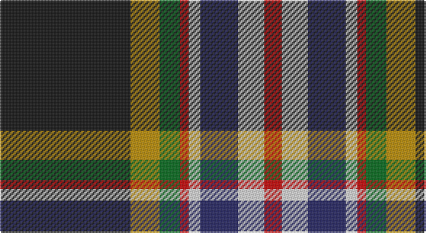

This page is one **sett** — a single exact thread-count. It belongs to the [tartan](/setts/k45lo10g7r3w4db13w9r6/)
(the same proportion at any scale), whose colour order is pattern [KYGRWBWR](/stripes/kygrwbwr/).

Part of the [Legion of Frontiersmen](/tartans/legion-of-frontiersmen/) tartan — the named design grouping this sett with its other cloths.

Sourced from tartans-authority.  It is a [8 stripe tartan](/stripes/stripes8/).

Original link http://www.tartansauthority.com/tartan-ferret/display/8829/

## Register references

External register numbers recorded for this tartan.

- Scottish Register of Tartans: [8829](https://www.tartanregister.gov.uk/tartanDetails?ref=8829)
- Scottish Tartans Authority (ITI): 8829

## Thread count
K/90 DY20 G14 R6 LN8 DB26 LN18 R/12

One full sett is **286 threads**.

## Palette

Palette: <strong>Tartan Register</strong>
<table><thead><tr><th>Colour</th><th>Threads</th><th>Shade</th><th>Base</th><th>OKLCh</th></tr></thead><tbody><tr><td>K/</td><td style="text-align:right;font-variant-numeric:tabular-nums">90</td><td><code style="background-color:#101010;">#101010</code> <small style="color:#888">#101010</small></td><td>K <code style="background-color:#000000;">#000000</code></td><td><small style="color:#888">oklch(17.3% 0.000 89.9)</small></td></tr><tr><td>DY</td><td style="text-align:right;font-variant-numeric:tabular-nums">20</td><td><code style="background-color:#BC8C00;">#BC8C00</code> <small style="color:#888">#BC8C00</small></td><td>Y <code style="background-color:#F2BF00;">#F2BF00</code></td><td><small style="color:#888">oklch(66.8% 0.137 84.1)</small></td></tr><tr><td>G</td><td style="text-align:right;font-variant-numeric:tabular-nums">14</td><td><code style="background-color:#006818;">#006818</code> <small style="color:#888">#006818</small></td><td>G <code style="background-color:#006100;">#006100</code></td><td><small style="color:#888">oklch(45.0% 0.142 145.0)</small></td></tr><tr><td>R</td><td style="text-align:right;font-variant-numeric:tabular-nums">6</td><td><code style="background-color:#C80000;">#C80000</code> <small style="color:#888">#C80000</small></td><td>R <code style="background-color:#CC0000;">#CC0000</code></td><td><small style="color:#888">oklch(52.3% 0.215 29.2)</small></td></tr><tr><td>LN</td><td style="text-align:right;font-variant-numeric:tabular-nums">8</td><td><code style="background-color:#E0E0E0;">#E0E0E0</code> <small style="color:#888">#E0E0E0</small></td><td>W <code style="background-color:#F7F7F7;">#F7F7F7</code></td><td><small style="color:#888">oklch(90.7% 0.000 89.9)</small></td></tr><tr><td>DB</td><td style="text-align:right;font-variant-numeric:tabular-nums">26</td><td><code style="background-color:#202060;">#202060</code> <small style="color:#888">#202060</small></td><td>B <code style="background-color:#2A418A;">#2A418A</code></td><td><small style="color:#888">oklch(28.9% 0.111 276.9)</small></td></tr><tr><td>LN</td><td style="text-align:right;font-variant-numeric:tabular-nums">18</td><td><code style="background-color:#E0E0E0;">#E0E0E0</code> <small style="color:#888">#E0E0E0</small></td><td>W <code style="background-color:#F7F7F7;">#F7F7F7</code></td><td><small style="color:#888">oklch(90.7% 0.000 89.9)</small></td></tr><tr><td>R/</td><td style="text-align:right;font-variant-numeric:tabular-nums">12</td><td><code style="background-color:#C80000;">#C80000</code> <small style="color:#888">#C80000</small></td><td>R <code style="background-color:#CC0000;">#CC0000</code></td><td><small style="color:#888">oklch(52.3% 0.215 29.2)</small></td></tr></tbody></table>

# Sample pattern

## Compared to the master

This cloth is one sett of its design; the master sett (the exemplar the design is anchored on) is below for comparison.

<figure style="margin:0"><figcaption style="color:#888;font-size:smaller">this sett</figcaption></figure>
<figure style="margin:0"><figcaption style="color:#888;font-size:smaller"><a href="/setts/do62ly7g7r3w3db13w3r5/">master sett →</a></figcaption></figure>

## Nearest tartans

The nearest existing variants by ΔTartan distance, with this tartan at the top so the swatches line up against it.

ΔTartan

Tartan

Sett

—

<a href="/ttd/edit/#slug=k45lo10g7r3w4db13w9r6~x2">Legion of Frontiersmen (Corporate)</a> <a class="nn-out" href="/variants/s8/k45lo10g7r3w4db13w9r6~x2/" title="open its dictionary page">↗</a>

0.69

<a href="/ttd/edit/#slug=ly4k28ly2db7w3r9g2w4g2k2~x2&amp;base=k45lo10g7r3w4db13w9r6~x2">Bird Family (Personal)</a> <a class="nn-out" href="/variants/s10/ly4k28ly2db7w3r9g2w4g2k2~x2/" title="open its dictionary page">↗</a>

0.70

<a href="/ttd/edit/#slug=lo11k66o32dg11o10db6o10loi4&amp;base=k45lo10g7r3w4db13w9r6~x2">Royal College of General Practitioners</a> <a class="nn-out" href="/variants/s8/lo11k66o32dg11o10db6o10loi4/" title="open its dictionary page">↗</a>

0.73

<a href="/variants/s10/lo4ki28lo2dp7w3k9g2w4g2ki2~x2/">Bird Family (Wales) (Personal)</a>

0.82

<a href="/ttd/edit/#slug=lo9k8lo30k4lb8k4db24k54r14k4lr8&amp;base=k45lo10g7r3w4db13w9r6~x2">Dublin County Crest (Fashion)</a> <a class="nn-out" href="/variants/s11/lo9k8lo30k4lb8k4db24k54r14k4lr8/" title="open its dictionary page">↗</a>

0.94

<a href="/ttd/edit/#slug=o11k66y32dg11y10db6y10r4&amp;base=k45lo10g7r3w4db13w9r6~x2">Turnbull, Dress Bruce (Personal)</a> <a class="nn-out" href="/variants/s8/o11k66y32dg11y10db6y10r4/" title="open its dictionary page">↗</a>

0.95

<a href="/ttd/edit/#slug=w3db22k2ri3k2ri5g7r2k2~x2&amp;base=k45lo10g7r3w4db13w9r6~x2">Edinburgh</a> <a class="nn-out" href="/variants/s9/w3db22k2ri3k2ri5g7r2k2~x2/" title="open its dictionary page">↗</a>

0.99

<a href="/ttd/edit/#slug=w8db50k4r8k6r12g17p7k4&amp;base=k45lo10g7r3w4db13w9r6~x2">Edinburgh</a> <a class="nn-out" href="/variants/s9/w8db50k4r8k6r12g17p7k4/" title="open its dictionary page">↗</a>

1.07

<a href="/ttd/edit/#slug=lo8k16lr8k52lr6k5w27r20y14k5lr6&amp;base=k45lo10g7r3w4db13w9r6~x2">Sligo County Crest (Fashion)</a> <a class="nn-out" href="/variants/s11/lo8k16lr8k52lr6k5w27r20y14k5lr6/" title="open its dictionary page">↗</a>

1.08

<a href="/ttd/edit/#slug=do8w8k16dg32dp3lo5w5~x2&amp;base=k45lo10g7r3w4db13w9r6~x2">Mellor, Phillip (Oldham)</a> <a class="nn-out" href="/variants/s7/do8w8k16dg32dp3lo5w5~x2/" title="open its dictionary page">↗</a>

1.11

<a href="/ttd/edit/#slug=y16k2y6k2r2k2db15g1db1w2~x2&amp;base=k45lo10g7r3w4db13w9r6~x2">Otago</a> <a class="nn-out" href="/variants/s10/y16k2y6k2r2k2db15g1db1w2~x2/" title="open its dictionary page">↗</a>

## Neighbour map

Every grey dot is one of 14360 variants placed by the first two principal components of the ΔTartan feature space (44% of its variance). Red is this tartan; blue dots are its nearest — click one to open its page.

<svg viewBox="0 0 640 380" role="img" style="max-width:100%;height:auto;border:1px solid #e0e0e0;border-radius:4px;display:block" xmlns="http://www.w3.org/2000/svg"><image href="/nn/cloud.v1.png" width="640" height="380"/><a href="/variants/s10/ly4k28ly2db7w3r9g2w4g2k2~x2/"><circle cx="183.4" cy="101.2" r="4" fill="#3465a4"><title>Bird Family (Personal)</title></circle></a><a href="/variants/s8/lo11k66o32dg11o10db6o10loi4/"><circle cx="205.6" cy="127.1" r="4" fill="#3465a4"><title>Royal College of General Practitioners</title></circle></a><a href="/variants/s10/lo4ki28lo2dp7w3k9g2w4g2ki2~x2/"><circle cx="189.6" cy="108.6" r="4" fill="#3465a4"><title>Bird Family (Wales) (Personal)</title></circle></a><a href="/variants/s11/lo9k8lo30k4lb8k4db24k54r14k4lr8/"><circle cx="173.4" cy="123.5" r="4" fill="#3465a4"><title>Dublin County Crest (Fashion)</title></circle></a><a href="/variants/s8/o11k66y32dg11y10db6y10r4/"><circle cx="218.5" cy="134.3" r="4" fill="#3465a4"><title>Turnbull, Dress Bruce (Personal)</title></circle></a><a href="/variants/s9/w3db22k2ri3k2ri5g7r2k2~x2/"><circle cx="183.4" cy="126.1" r="4" fill="#3465a4"><title>Edinburgh</title></circle></a><a href="/variants/s9/w8db50k4r8k6r12g17p7k4/"><circle cx="167.0" cy="126.3" r="4" fill="#3465a4"><title>Edinburgh</title></circle></a><a href="/variants/s11/lo8k16lr8k52lr6k5w27r20y14k5lr6/"><circle cx="149.5" cy="128.8" r="4" fill="#3465a4"><title>Sligo County Crest (Fashion)</title></circle></a><a href="/variants/s7/do8w8k16dg32dp3lo5w5~x2/"><circle cx="127.2" cy="152.9" r="4" fill="#3465a4"><title>Mellor, Phillip (Oldham)</title></circle></a><a href="/variants/s10/y16k2y6k2r2k2db15g1db1w2~x2/"><circle cx="205.7" cy="111.4" r="4" fill="#3465a4"><title>Otago</title></circle></a><circle cx="182.2" cy="122.1" r="5" fill="#c00000"/></svg>

ID: /variants/s8/k45lo10g7r3w4db13w9r6~x2/
