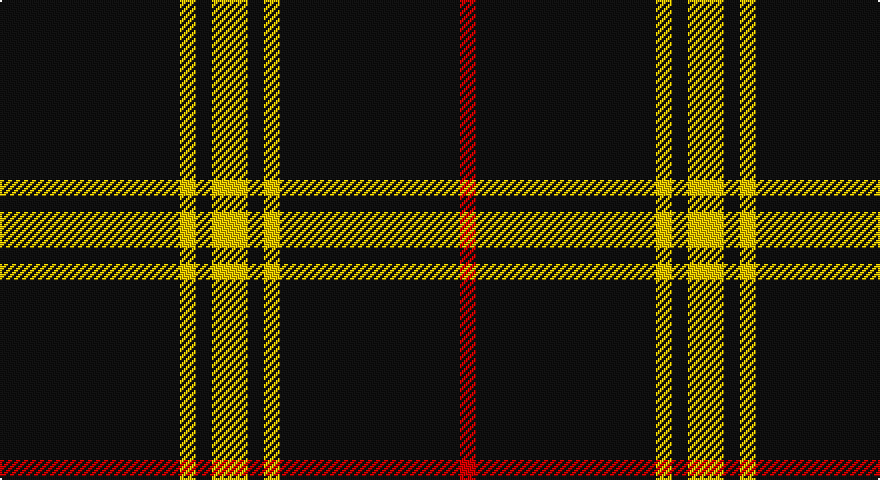

This page is one **sett** — a single exact thread-count. It belongs to the [tartan](/setts/k45ly4k4ly9k4ly4k45r4/)
(the same proportion at any scale), whose colour order is pattern [KYKYKYKR](/stripes/kykykykr/).

Part of the [Gwynn](/tartans/gwynn/) tartan — the named design grouping this sett with its other cloths.

Sourced from register-of-tartans.  It is a [8 stripe tartan](/stripes/stripes8/).

Original link https://www.tartanregister.gov.uk/tartanDetails.aspx?ref=1564

## Register references

External register numbers recorded for this tartan.

- Scottish Register of Tartans: [1564](https://www.tartanregister.gov.uk/tartanDetails.aspx?ref=1564)
- Scottish Tartans Authority (ITI): 5745
- Scottish Tartans World Register: 2987

## Thread count
K/90 Y8 K8 Y18 K8 Y8 K90 R/8

One full sett is **378 threads**.

## Palette

Palette: <strong>Tartan Register</strong>
<table><thead><tr><th>Colour</th><th>Threads</th><th>Shade</th><th>Base</th><th>OKLCh</th></tr></thead><tbody><tr><td>K/</td><td style="text-align:right;font-variant-numeric:tabular-nums">90</td><td><code style="background-color:#101010;">#101010</code> <small style="color:#888">#101010</small></td><td>K <code style="background-color:#000000;">#000000</code></td><td><small style="color:#888">oklch(17.3% 0.000 89.9)</small></td></tr><tr><td>Y</td><td style="text-align:right;font-variant-numeric:tabular-nums">8</td><td><code style="background-color:#E8C000;">#E8C000</code> <small style="color:#888">#E8C000</small></td><td>Y <code style="background-color:#F2BF00;">#F2BF00</code></td><td><small style="color:#888">oklch(81.9% 0.168 93.7)</small></td></tr><tr><td>K</td><td style="text-align:right;font-variant-numeric:tabular-nums">8</td><td><code style="background-color:#101010;">#101010</code> <small style="color:#888">#101010</small></td><td>K <code style="background-color:#000000;">#000000</code></td><td><small style="color:#888">oklch(17.3% 0.000 89.9)</small></td></tr><tr><td>Y</td><td style="text-align:right;font-variant-numeric:tabular-nums">18</td><td><code style="background-color:#E8C000;">#E8C000</code> <small style="color:#888">#E8C000</small></td><td>Y <code style="background-color:#F2BF00;">#F2BF00</code></td><td><small style="color:#888">oklch(81.9% 0.168 93.7)</small></td></tr><tr><td>K</td><td style="text-align:right;font-variant-numeric:tabular-nums">8</td><td><code style="background-color:#101010;">#101010</code> <small style="color:#888">#101010</small></td><td>K <code style="background-color:#000000;">#000000</code></td><td><small style="color:#888">oklch(17.3% 0.000 89.9)</small></td></tr><tr><td>Y</td><td style="text-align:right;font-variant-numeric:tabular-nums">8</td><td><code style="background-color:#E8C000;">#E8C000</code> <small style="color:#888">#E8C000</small></td><td>Y <code style="background-color:#F2BF00;">#F2BF00</code></td><td><small style="color:#888">oklch(81.9% 0.168 93.7)</small></td></tr><tr><td>K</td><td style="text-align:right;font-variant-numeric:tabular-nums">90</td><td><code style="background-color:#101010;">#101010</code> <small style="color:#888">#101010</small></td><td>K <code style="background-color:#000000;">#000000</code></td><td><small style="color:#888">oklch(17.3% 0.000 89.9)</small></td></tr><tr><td>R/</td><td style="text-align:right;font-variant-numeric:tabular-nums">8</td><td><code style="background-color:#C80000;">#C80000</code> <small style="color:#888">#C80000</small></td><td>R <code style="background-color:#CC0000;">#CC0000</code></td><td><small style="color:#888">oklch(52.3% 0.215 29.2)</small></td></tr></tbody></table>

# Sample pattern

## Nearest tartans

The nearest existing variants by ΔTartan distance, with this tartan at the top so the swatches line up against it.

ΔTartan

Tartan

Sett

—

<a href="/ttd/edit/#slug=k45ly4k4ly9k4ly4k45r4~x2">Gwynn</a> <a class="nn-out" href="/variants/s8/k45ly4k4ly9k4ly4k45r4~x2/" title="open its dictionary page">↗</a>

1.12

<a href="/ttd/edit/#slug=k7w2k21r2k34w5k3w2k7~x2&amp;base=k45ly4k4ly9k4ly4k45r4~x2">St. Mirren Football Club (Sports)</a> <a class="nn-out" href="/variants/s9/k7w2k21r2k34w5k3w2k7~x2/" title="open its dictionary page">↗</a>

1.16

<a href="/ttd/edit/#slug=n3k31w6k8n3k12w2~x2&amp;base=k45ly4k4ly9k4ly4k45r4~x2">Believe - Colette</a> <a class="nn-out" href="/variants/s7/n3k31w6k8n3k12w2~x2/" title="open its dictionary page">↗</a>

1.20

<a href="/ttd/edit/#slug=n3k31w6k7n3k12w2~x2&amp;base=k45ly4k4ly9k4ly4k45r4~x2">Believe - Colette</a> <a class="nn-out" href="/variants/s7/n3k31w6k7n3k12w2~x2/" title="open its dictionary page">↗</a>

1.40

<a href="/ttd/edit/#slug=k4r4k20r1k20w4~x6&amp;base=k45ly4k4ly9k4ly4k45r4~x2">Lanoir</a> <a class="nn-out" href="/variants/s6/k4r4k20r1k20w4~x6/" title="open its dictionary page">↗</a>

1.50

<a href="/ttd/edit/#slug=r7k3r3k22r3k3r3k37ly2k4~x2&amp;base=k45ly4k4ly9k4ly4k45r4~x2">Maier (Personal)</a> <a class="nn-out" href="/variants/s10/r7k3r3k22r3k3r3k37ly2k4~x2/" title="open its dictionary page">↗</a>

1.59

<a href="/ttd/edit/#slug=k20w1k1w3k1r1k1w1~x4&amp;base=k45ly4k4ly9k4ly4k45r4~x2">Volkswagen Black Trim (Fashion)</a> <a class="nn-out" href="/variants/s8/k20w1k1w3k1r1k1w1~x4/" title="open its dictionary page">↗</a>

1.61

<a href="/ttd/edit/#slug=k21r1k1ly1k1r1k3w3~x6&amp;base=k45ly4k4ly9k4ly4k45r4~x2">Black Country (District)</a> <a class="nn-out" href="/variants/s8/k21r1k1ly1k1r1k3w3~x6/" title="open its dictionary page">↗</a>

1.61

<a href="/ttd/edit/#slug=ly9k4ly4k45r4~x2&amp;base=k45ly4k4ly9k4ly4k45r4~x2">Gwynn (Name)</a> <a class="nn-out" href="/variants/s5/ly9k4ly4k45r4~x2/" title="open its dictionary page">↗</a>

1.65

<a href="/ttd/edit/#slug=ly7k4ly4k39r4~x2&amp;base=k45ly4k4ly9k4ly4k45r4~x2">Welsh National #3</a> <a class="nn-out" href="/variants/s5/ly7k4ly4k39r4~x2/" title="open its dictionary page">↗</a>

1.68

<a href="/ttd/edit/#slug=k27w2k2w2k2w2k2w2k4r5~x4&amp;base=k45ly4k4ly9k4ly4k45r4~x2">Reiver Check</a> <a class="nn-out" href="/variants/s10/k27w2k2w2k2w2k2w2k4r5~x4/" title="open its dictionary page">↗</a>

## Neighbour map

Every grey dot is one of 14360 variants placed by the first two principal components of the ΔTartan feature space (44% of its variance). Red is this tartan; blue dots are its nearest — click one to open its page.

<svg viewBox="0 0 640 380" role="img" style="max-width:100%;height:auto;border:1px solid #e0e0e0;border-radius:4px;display:block" xmlns="http://www.w3.org/2000/svg"><image href="/nn/cloud.v1.png" width="640" height="380"/><a href="/variants/s9/k7w2k21r2k34w5k3w2k7~x2/"><circle cx="558.8" cy="181.0" r="4" fill="#3465a4"><title>St. Mirren Football Club (Sports)</title></circle></a><a href="/variants/s7/n3k31w6k8n3k12w2~x2/"><circle cx="474.5" cy="195.0" r="4" fill="#3465a4"><title>Believe - Colette</title></circle></a><a href="/variants/s7/n3k31w6k7n3k12w2~x2/"><circle cx="471.4" cy="192.5" r="4" fill="#3465a4"><title>Believe - Colette</title></circle></a><a href="/variants/s6/k4r4k20r1k20w4~x6/"><circle cx="537.3" cy="210.0" r="4" fill="#3465a4"><title>Lanoir</title></circle></a><a href="/variants/s10/r7k3r3k22r3k3r3k37ly2k4~x2/"><circle cx="541.7" cy="172.7" r="4" fill="#3465a4"><title>Maier (Personal)</title></circle></a><a href="/variants/s8/k20w1k1w3k1r1k1w1~x4/"><circle cx="525.2" cy="142.3" r="4" fill="#3465a4"><title>Volkswagen Black Trim (Fashion)</title></circle></a><a href="/variants/s8/k21r1k1ly1k1r1k3w3~x6/"><circle cx="527.5" cy="134.0" r="4" fill="#3465a4"><title>Black Country (District)</title></circle></a><a href="/variants/s5/ly9k4ly4k45r4~x2/"><circle cx="452.2" cy="202.0" r="4" fill="#3465a4"><title>Gwynn (Name)</title></circle></a><a href="/variants/s5/ly7k4ly4k39r4~x2/"><circle cx="444.0" cy="208.1" r="4" fill="#3465a4"><title>Welsh National #3</title></circle></a><a href="/variants/s10/k27w2k2w2k2w2k2w2k4r5~x4/"><circle cx="452.0" cy="151.3" r="4" fill="#3465a4"><title>Reiver Check</title></circle></a><circle cx="515.7" cy="196.1" r="5" fill="#c00000"/></svg>

ID: /variants/s8/k45ly4k4ly9k4ly4k45r4~x2/
