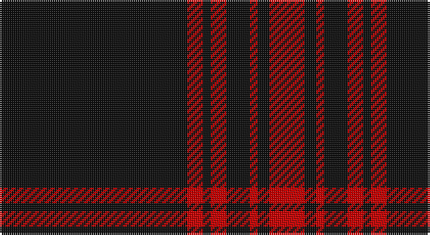

This page is one **sett** — a single exact thread-count. It belongs to the [tartan](/setts/k48r4k2r4k6r2k3r9/)
(the same proportion at any scale), whose colour order is pattern [KRKRKRKR](/stripes/krkrkrkr/).

Part of the [Menzies Hunting](/tartans/menzies-hunting/) tartan — the named design grouping this sett with its other cloths.

Sourced from register-of-tartans.  It is a [8 stripe tartan](/stripes/stripes8/).

Original link https://www.tartanregister.gov.uk/tartanDetails.aspx?ref=2929

## Provenance

Earliest known date: 1906 The red and white Menzies tartan appears in the Cockburn Collection (c.1815) under the name, MacFarlane, but this is taken to be an error on the part of General Cockburn at a time when the establishment of clan names for tartan was in its infancy. The same sett was certified as Menzies, by the clan chief, in the collection of the Highland Society of London (c.1816). The tartan is woven in various colours, green, black, red and white to the same design.

## Also known as

This cloth is also recorded under:

- Menzies
- Menzies Black & Red
- Menzies Htg
- Menzies, Black & Red
- Menzies, hunting

4 attestations — the source records this cloth was collapsed from (oldest owns this page)

<ul>
<li>01/01/1906 — Menzies Hunting (register-of-tartans, <a href="https://www.tartanregister.gov.uk/tartanDetails.aspx?ref=2929">record</a>)</li>
<li>pre 1906 — Menzies Htg (Clan) (tartans-authority, <a href="http://www.tartansauthority.com/tartan-ferret/display/1184/">record</a>)</li>
<li>undated — Menzies, Black & Red (weddslist, <a href="http://www.weddslist.com/cgi-bin/tartans/pg.pl?source=sts">record</a>)</li>
<li>undated — Menzies Black & Red Clan Tartan (house-of-tartan, <a href="http://www.house-of-tartan.scotland.net/house/TartanViewjs.asp?colr=Def&tnam=1184">record</a>)</li>
</ul>

## Register references

External register numbers recorded for this tartan.

- Scottish Register of Tartans: [2929](https://www.tartanregister.gov.uk/tartanDetails.aspx?ref=2929)
- Scottish Tartans Authority (ITI): 1184
- Scottish Tartans World Register: 1184

## Thread count
K/96 R8 K4 R8 K12 R4 K6 R/18

One full sett is **198 threads**.

## Palette

Palette: <strong>Tartan Register</strong>
<table><thead><tr><th>Colour</th><th>Threads</th><th>Shade</th><th>Base</th><th>OKLCh</th></tr></thead><tbody><tr><td>K/</td><td style="text-align:right;font-variant-numeric:tabular-nums">96</td><td><code style="background-color:#101010;">#101010</code> <small style="color:#888">#101010</small></td><td>K <code style="background-color:#000000;">#000000</code></td><td><small style="color:#888">oklch(17.3% 0.000 89.9)</small></td></tr><tr><td>R</td><td style="text-align:right;font-variant-numeric:tabular-nums">8</td><td><code style="background-color:#C80000;">#C80000</code> <small style="color:#888">#C80000</small></td><td>R <code style="background-color:#CC0000;">#CC0000</code></td><td><small style="color:#888">oklch(52.3% 0.215 29.2)</small></td></tr><tr><td>K</td><td style="text-align:right;font-variant-numeric:tabular-nums">4</td><td><code style="background-color:#101010;">#101010</code> <small style="color:#888">#101010</small></td><td>K <code style="background-color:#000000;">#000000</code></td><td><small style="color:#888">oklch(17.3% 0.000 89.9)</small></td></tr><tr><td>R</td><td style="text-align:right;font-variant-numeric:tabular-nums">8</td><td><code style="background-color:#C80000;">#C80000</code> <small style="color:#888">#C80000</small></td><td>R <code style="background-color:#CC0000;">#CC0000</code></td><td><small style="color:#888">oklch(52.3% 0.215 29.2)</small></td></tr><tr><td>K</td><td style="text-align:right;font-variant-numeric:tabular-nums">12</td><td><code style="background-color:#101010;">#101010</code> <small style="color:#888">#101010</small></td><td>K <code style="background-color:#000000;">#000000</code></td><td><small style="color:#888">oklch(17.3% 0.000 89.9)</small></td></tr><tr><td>R</td><td style="text-align:right;font-variant-numeric:tabular-nums">4</td><td><code style="background-color:#C80000;">#C80000</code> <small style="color:#888">#C80000</small></td><td>R <code style="background-color:#CC0000;">#CC0000</code></td><td><small style="color:#888">oklch(52.3% 0.215 29.2)</small></td></tr><tr><td>K</td><td style="text-align:right;font-variant-numeric:tabular-nums">6</td><td><code style="background-color:#101010;">#101010</code> <small style="color:#888">#101010</small></td><td>K <code style="background-color:#000000;">#000000</code></td><td><small style="color:#888">oklch(17.3% 0.000 89.9)</small></td></tr><tr><td>R/</td><td style="text-align:right;font-variant-numeric:tabular-nums">18</td><td><code style="background-color:#C80000;">#C80000</code> <small style="color:#888">#C80000</small></td><td>R <code style="background-color:#CC0000;">#CC0000</code></td><td><small style="color:#888">oklch(52.3% 0.215 29.2)</small></td></tr></tbody></table>

# Sample pattern

## Compared to the master

This cloth is one sett of its design; the master sett (the exemplar the design is anchored on) is below for comparison.

<figure style="margin:0"><figcaption style="color:#888;font-size:smaller">this sett</figcaption></figure>
<figure style="margin:0"><figcaption style="color:#888;font-size:smaller"><a href="/setts/dg48r4dg2r4dg6r2dg3r9/">master sett →</a></figcaption></figure>

## Nearest tartans

The nearest existing variants by ΔTartan distance, with this tartan at the top so the swatches line up against it.

ΔTartan

Tartan

Sett

—

<a href="/ttd/edit/#slug=k48r4k2r4k6r2k3r9~x2">Menzies Hunting</a> <a class="nn-out" href="/variants/s8/k48r4k2r4k6r2k3r9~x2/" title="open its dictionary page">↗</a>

1.00

<a href="/ttd/edit/#slug=k59r3k6r3k8r15k2ly3~x2&amp;base=k48r4k2r4k6r2k3r9~x2">Royal Army PTC Assoc. (Military)</a> <a class="nn-out" href="/variants/s8/k59r3k6r3k8r15k2ly3~x2/" title="open its dictionary page">↗</a>

1.25

<a href="/ttd/edit/#slug=r7k3r3k22r3k3r3k37ly2k4~x2&amp;base=k48r4k2r4k6r2k3r9~x2">Maier (Personal)</a> <a class="nn-out" href="/variants/s10/r7k3r3k22r3k3r3k37ly2k4~x2/" title="open its dictionary page">↗</a>

1.25

<a href="/ttd/edit/#slug=k2w1k2r6k6r3k28w2~x2&amp;base=k48r4k2r4k6r2k3r9~x2">Brockton</a> <a class="nn-out" href="/variants/s8/k2w1k2r6k6r3k28w2~x2/" title="open its dictionary page">↗</a>

1.64

<a href="/ttd/edit/#slug=k40n3k5n2k2n2k2n6k4w2k4~x2&amp;base=k48r4k2r4k6r2k3r9~x2">Stewart Mourning (Clan)</a> <a class="nn-out" href="/variants/s11/k40n3k5n2k2n2k2n6k4w2k4~x2/" title="open its dictionary page">↗</a>

1.68

<a href="/ttd/edit/#slug=r2k8w2k8r2k21r10k42r1~x2&amp;base=k48r4k2r4k6r2k3r9~x2">Brand Ambassador (Corporate)</a> <a class="nn-out" href="/variants/s9/r2k8w2k8r2k21r10k42r1~x2/" title="open its dictionary page">↗</a>

1.70

<a href="/ttd/edit/#slug=k4r11k32ly1k4~x2&amp;base=k48r4k2r4k6r2k3r9~x2">Harvie</a> <a class="nn-out" href="/variants/s5/k4r11k32ly1k4~x2/" title="open its dictionary page">↗</a>

1.74

<a href="/ttd/edit/#slug=k50w4k10r2k2w2r2k14r11k2r4w2~x2&amp;base=k48r4k2r4k6r2k3r9~x2">Knights Templar Dress (Corporate)</a> <a class="nn-out" href="/variants/s12/k50w4k10r2k2w2r2k14r11k2r4w2~x2/" title="open its dictionary page">↗</a>

1.74

<a href="/ttd/edit/#slug=m18g1k5g1k1g1m9~x2&amp;base=k48r4k2r4k6r2k3r9~x2">Inverness, Augustus</a> <a class="nn-out" href="/variants/s7/m18g1k5g1k1g1m9~x2/" title="open its dictionary page">↗</a>

1.78

<a href="/ttd/edit/#slug=k94r3k6r3k8r15k2ly3~x2&amp;base=k48r4k2r4k6r2k3r9~x2">Royal Army Physical Training Corps Association (Scotland)</a> <a class="nn-out" href="/variants/s8/k94r3k6r3k8r15k2ly3~x2/" title="open its dictionary page">↗</a>

1.81

<a href="/ttd/edit/#slug=r4k16w4k16r4k42r20k83r2&amp;base=k48r4k2r4k6r2k3r9~x2">Brand Ambassador</a> <a class="nn-out" href="/variants/s9/r4k16w4k16r4k42r20k83r2/" title="open its dictionary page">↗</a>

## Neighbour map

Every grey dot is one of 14360 variants placed by the first two principal components of the ΔTartan feature space (44% of its variance). Red is this tartan; blue dots are its nearest — click one to open its page.

<svg viewBox="0 0 640 380" role="img" style="max-width:100%;height:auto;border:1px solid #e0e0e0;border-radius:4px;display:block" xmlns="http://www.w3.org/2000/svg"><image href="/nn/cloud.v1.png" width="640" height="380"/><a href="/variants/s8/k59r3k6r3k8r15k2ly3~x2/"><circle cx="538.9" cy="149.5" r="4" fill="#3465a4"><title>Royal Army PTC Assoc. (Military)</title></circle></a><a href="/variants/s10/r7k3r3k22r3k3r3k37ly2k4~x2/"><circle cx="541.7" cy="172.7" r="4" fill="#3465a4"><title>Maier (Personal)</title></circle></a><a href="/variants/s8/k2w1k2r6k6r3k28w2~x2/"><circle cx="520.9" cy="156.5" r="4" fill="#3465a4"><title>Brockton</title></circle></a><a href="/variants/s11/k40n3k5n2k2n2k2n6k4w2k4~x2/"><circle cx="562.6" cy="158.9" r="4" fill="#3465a4"><title>Stewart Mourning (Clan)</title></circle></a><a href="/variants/s9/r2k8w2k8r2k21r10k42r1~x2/"><circle cx="595.1" cy="157.1" r="4" fill="#3465a4"><title>Brand Ambassador (Corporate)</title></circle></a><a href="/variants/s5/k4r11k32ly1k4~x2/"><circle cx="538.5" cy="185.6" r="4" fill="#3465a4"><title>Harvie</title></circle></a><a href="/variants/s12/k50w4k10r2k2w2r2k14r11k2r4w2~x2/"><circle cx="486.4" cy="124.8" r="4" fill="#3465a4"><title>Knights Templar Dress (Corporate)</title></circle></a><a href="/variants/s7/m18g1k5g1k1g1m9~x2/"><circle cx="507.3" cy="180.7" r="4" fill="#3465a4"><title>Inverness, Augustus</title></circle></a><a href="/variants/s8/k94r3k6r3k8r15k2ly3~x2/"><circle cx="607.0" cy="119.5" r="4" fill="#3465a4"><title>Royal Army Physical Training Corps Association (Scotland)</title></circle></a><a href="/variants/s9/r4k16w4k16r4k42r20k83r2/"><circle cx="573.0" cy="146.4" r="4" fill="#3465a4"><title>Brand Ambassador</title></circle></a><circle cx="566.0" cy="175.5" r="5" fill="#c00000"/></svg>

ID: /variants/s8/k48r4k2r4k6r2k3r9~x2/
